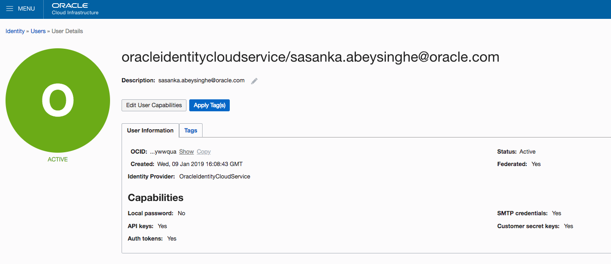

  
Updated: Date

## Introduction

In this lab, we describe the steps to run a WebLogic cluster using the Oracle Cloud Infrastructure (OCI) Container Engine for Kubernetes. The Kubernetes managed service is fully integrated with the underlying Oracle Cloud Infrastructure (OCI), making it easy to provision a Kubernetes cluster and to provide the required services, such as a load balancer, volumes, and network fabric.

**_To log issues_**, click here to go to the [github oracle](https://github.com/oracle/learning-library/issues/new) repository issue submission form.

## Objectives

- Test accessibility and set up the RBAC policy for the OCI Container Engine for the Kubernetes cluster
- Set up the NFS server
- Modify the configuration YAML files to reflect the Docker images’ names in the OCIR

## Required Artifacts

- Docker images:
    - WebLogic Server (weblogic-12.2.1.3:latest).
    - WebLogic Kubernetes Operator (weblogic-operator:latest)
    - Traefik Load Balancer (traefik:1.4.5)
- A workstation with Docker and kubectl, installed and configured.
- The Oracle Container Engine for Kubernetes on OCI.
- OCI Container Engine for Kubernetes nodes are accessible using ssh.
- The Oracle Cloud Infrastructure Registry to push the WebLogic Server, Operator, and Load Balancer images.

# Prepare the WebLogic Kubernetes Operator environment

### **STEP 1**: Test accessibility and set up the RBAC policy for the OKE cluster

- To check the accessibility to the OCI Container Engine for Kubernetes nodes, enter the command:
      ```
      kubectl get nodes
      ```


- In order to have permission to access the Kubernetes cluster, you need to authorize your OCI account as a cluster-admin on the OCI Container Engine for Kubernetes cluster.  This will require your OCID, which is available on the OCI console page, under your user settings.
  


      ```
      kubectl create clusterrolebinding my-cluster-admin-binding --clusterrole=cluster-admin --user==<Paste your User OCID Here>
      ```

### **STEP 2**: Set up the NFS server

- Instructions for Step 2
