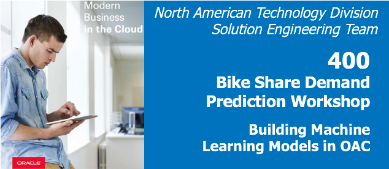  
Updated: April 19, 2017

Please direct comments to: Cam Crockett (cam.crockett@oracle.com

## Introduction

Welcome to lab 400. In this lab we will be completing our application architecture by deploying a Golang microservice on Docker. The service will be responsible to translating currencies on our UI. Our target Architecture for the end of the lab will look like this:
 

## Objectives

- Setup your docker host on Container Cloud Service
- Deploy the microservices from it's Docker Hub build location

## Required Artifacts
- The following lab requires an Oracle Public Cloud account that will be supplied by your instructor.
- You will need an ssh key: [labkey](labkey.pub)

## Optional Artifacts

- The Code Base for Docker Hub Build is located here: [https://github.com/c-rocket/TTC-CurrencyMicroservice](https://github.com/c-rocket/TTC-CurrencyMicroservice)
- Google's Go Programming Language is described here: [https://golang.org/](https://golang.org/)
- Docker information can be found here: [https://www.docker.com/](https://www.docker.com/)
- Oracle's Container Cloud Service is detailed here: [https://cloud.oracle.com/en_US/container](https://cloud.oracle.com/en_US/container)

## Prerequisites

- Expected that labs 100, 200 and 300 have been completed already
- Expected that your storage policy has been set as described in the [prerequisite guide](PreReqGuide.md)

# Setup and Deploy a Golang Microservice on Docker

## Setup your Docker Host

### **STEP 1**: Login with your Oracle Cloud Account

- From any browser, go to the URL:
    `https://cloud.oracle.com`
- click **Sign In** in the upper right hand corner of the browser

    
    - **IMPORTANT** - Under my services, select from the drop down list the correct data center and click on **My Services**. If you are unsure of the data center you should select, and this is an in-person training event, ***ask your instructor*** which **Region** to select from the drop down list. If you received your account through an Oracle Trial, your Trial confirmation email should provide a URL that will pre-select the region for you.

    
- Enter your identity domain and click **Go**.

    **NOTE:** The **Identity Domain, User Name** and **Password** values will be given to you by the instructor or Trial confirmation email.

    
- Once your Identity Domain is set, enter your User Name and Password and click **Sign In**

    
- You will be presented with a Dashboard displaying the various cloud services available to this account.

    
- If all your services are not visible, **click** on the **Customize Dashboard**, you can add services to the dashboard by clicking **Show.** For this workshop, you will want to ensure that you are showing at least the **Application Container, Developer and Storage** cloud services. If you do not want to see a specific service, click **Hide**

    


### **STEP 2**: Create a Container Cloud Service Instance

- From the Cloud UI dashboard click on the **Container** Cloud Service menu (not to be confused with Application Container) and select Open Service Console


- You will now be on the landing page for Oracle's Container Cloud Service


- Click Create a service to start the wizard process of setting up your Docker host

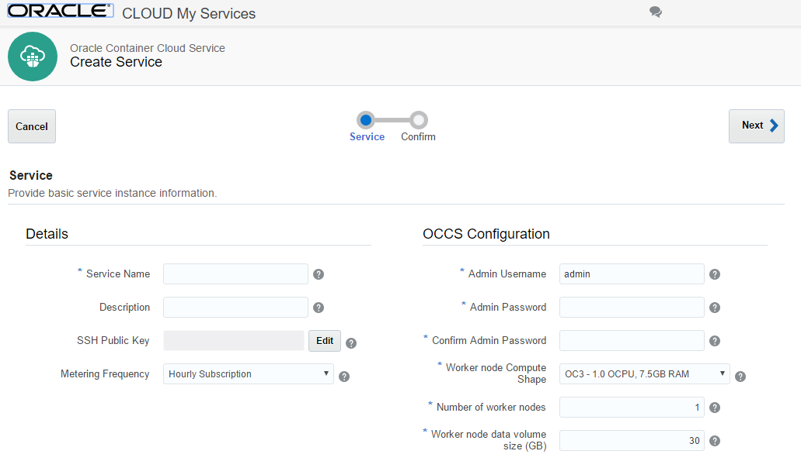

- Fill in the form and click Next

```

Service Name: TouchTheCloudDemo
SSH Public Key:<use labkey.pub found in required artifacts>
Admin Username: admin
Admin Password: Oracle123!
```

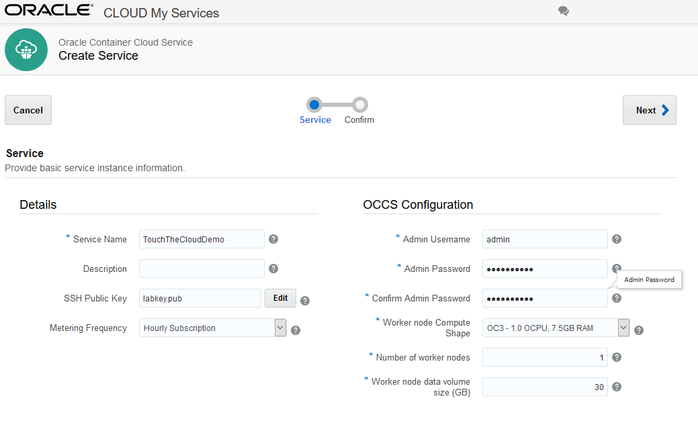

- Confirm your setup


- Wait for a few minutes while your host provisions (approx 10 minutes to setup your host)

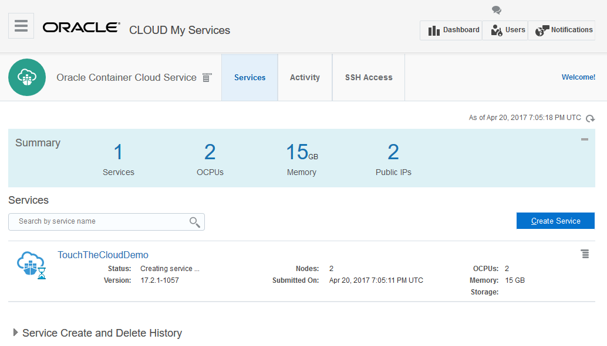

### **STEP 3**: Create a new container service

- Once your Container Service instance is provisioned, click on the menu to open the Container Console (you may have to add a browser security exception)

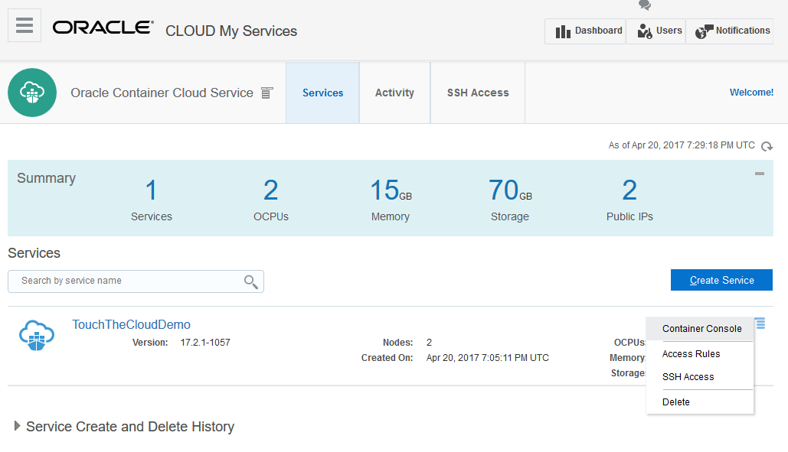

- Use the admin username and password you setup in the instance configuration to login

```

Username: admin
Password: Oracle123!
```


- Once logged in, you will be presented with the main dashboard

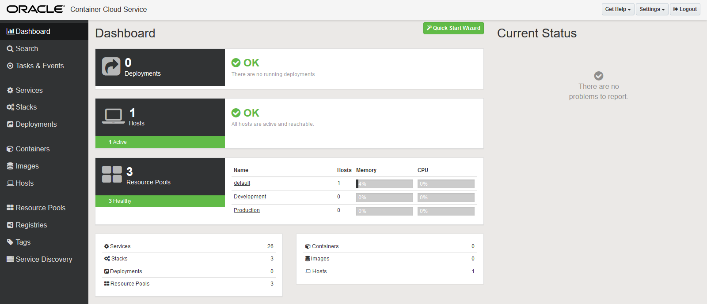

- Select Services from the left hand menu, here you will find a listing of out-of-the-box containers available to be deployed
    - A new deployment is as easy as hitting deploy.

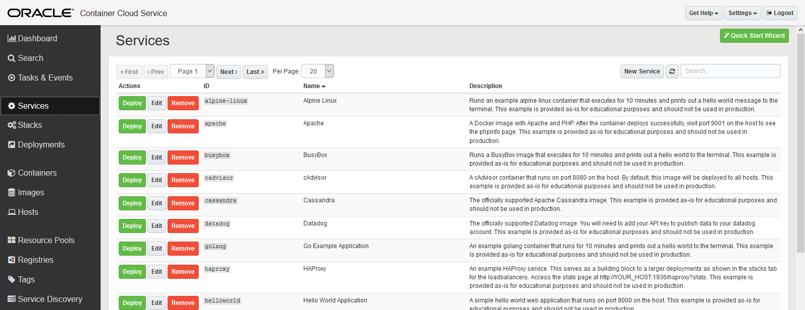

- We are now going to create a new service based off a Docker image built on Docker Hub (by default, Docker hub is linked to Oracle's Container Cloud service via the Registries Menu). Select New Service


- Fill out the New Service Form


```

Service Name: Currency Microservice
Image: camcrockett/ttc-currencymicroservice

```

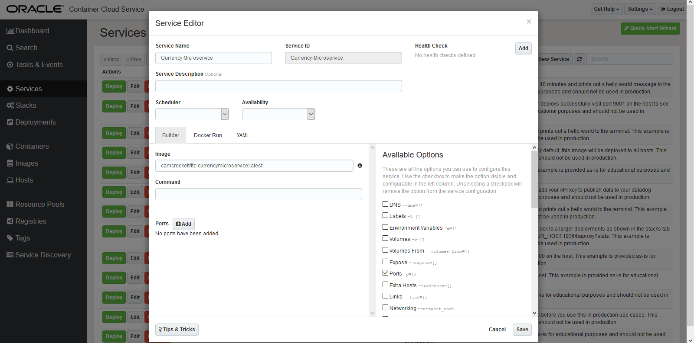

- Select Ports from the Available Options and Add a new port mapping

```

Host Port: 80
Container Port: 8089
Protocol: TCP
```


- Now Save your new service

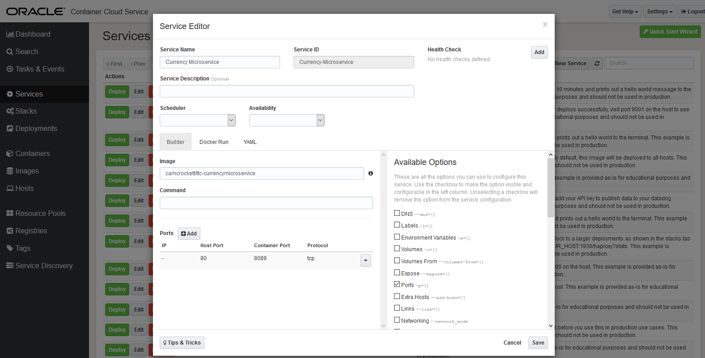

- verify your new service is in the list by filtering for Currency


### **STEP 4**: Deploy the container

- find the Currency Microservice in the list of services and select Deploy


- Use the default values for the deployment and hit Deploy

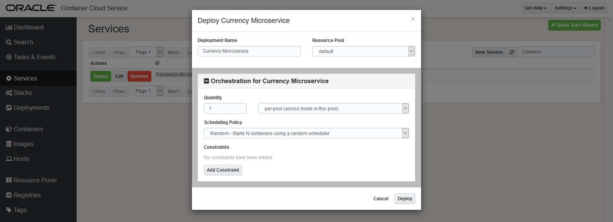

- Your container should start deploying


- Once successfully deployed the status should update


### **STEP 5**: Verify your Microservice

- Select Containers on the left menu to see a listing of your containers


- Click on hostname to view host details. **Make a note of the public IP**

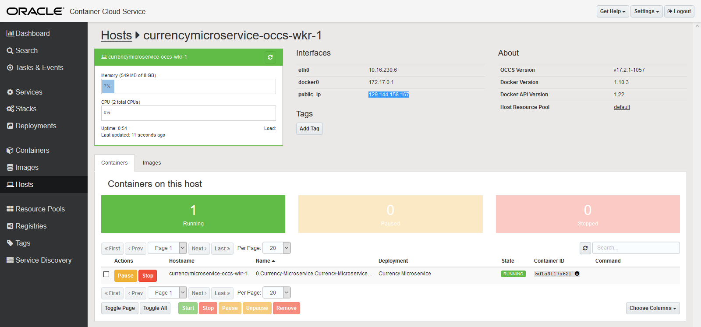

- To Verify the microservice, open a new web browser tab and use the public IP to hit the following URL:

```

http://<Public_IP>/currencies/v1/usd
ex: http://129.144.154.28/currencies/v1/usd
```


### **STEP 6**: Bind your Microservice

- Return to your main service dashboard


- Select Application Container Cloud Service to view your previously deployed Applications from Labs 100 and 200


- From the application dashboard step into your UI application


- Select the Deployments tab on the left

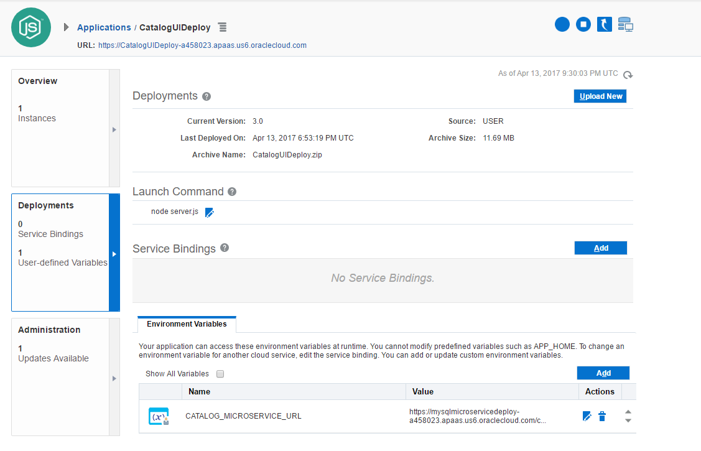

- Add a new environment variable

```

Name: CURRENCY_MICROSERVICE_URL
Value: <Currency Microservice URL>
ex: http://129.144.154.28/currencies/v1/usd
```

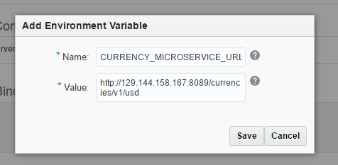

- Save and apply your biding


- Once the Application is recreated, open the URL to see the new binding in action.


**Lab 400 is now complete**

