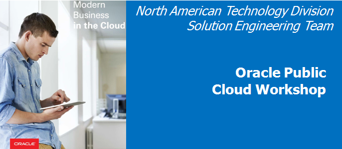
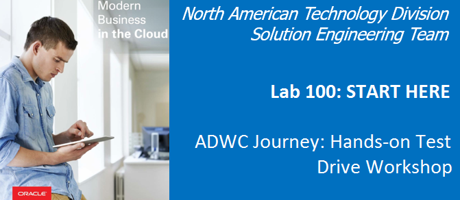
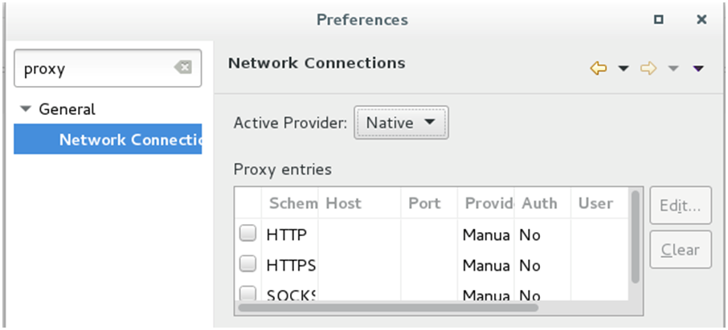
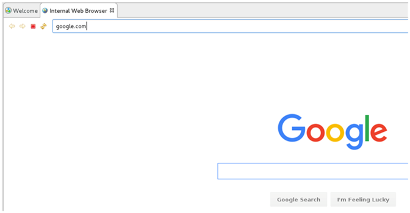

  
Update: April 10, 2017

# Prerequisites Guide

This Guide will provide you with the instructions nessesary to ensure you have the proper tools and configuration done to execute ont he workshop. This Workshop will allow you to gain exposure to Oracle Developer Cloud Service, Oracle Application Container Cloud Service, Oracle Container Cloud Service, Oracle MySQL Cloud Service and Oracle's open source front end framework Oracle JET.

## Client Enviroment Options

Your client enviroment **must be configured prior** to attempting the Hands on Workshop, or you will not be able to complete the Workshop labs.

### Check/Set Storage Replication Policy
Depending on the state of your Cloud Account, you may need to set the replication policy, if it has not been previously set. In this step you will got to the Storage Cloud Service to check on the status of the Replicaton Policy

- From any browser, go to the URL:
    `https://cloud.oracle.com`

- click **Sign In** in the upper right hand corner of the browser

    

- **IMPORTANT** - Under my services, select from the drop down list the correct data center and click on **My Services**. If you are unsure of the data center you should select, and this is an in-person training event, ***ask your instructor*** which **Region** to select from the drop down list. If you received your account through an Oracle Trial, your Trial confirmation email should provide a URL that will pre-select the region for you.

    

- Enter your identity domain and click **Go**.

    **NOTE:** The **Identity Domain, User Name** and **Password** values will be given to you by the instructor or Trial confirmation email.

    

- Once your Identity Domain is set, enter your User Name and Password and click **Sign In**


    

- You will be presented with a Dashboard displaying the various cloud services available to this account.

    . 

- Click on the **Storage** Cloud Service

    

- If you see a message requesting that you **Set Replication Policy** as is shown below, click on the message. If the message is not displayed, your replication policy has already been set and you can continue to the next step by clicking on the **Dashboard** icon in the top right corner of the page.

    

- Care must be taking when setting your replication policy, because it cannot be changed. With Trial accounts, the first option available will generatlly set the replication policy sufficient for this workshop, so we will take the Default, and click on the **Set** button. 

    

- Click on the **Dashboard** button

    

You have two options for configuring your workshop client environment. 

- ***Option 1***: You can install Virtual Box and download and run a pre-configured **Virtual Box Image**. 
    - Refer to the ***Virtual Box Client Installation*** section of this document to use this option
    - **This option is best**, if you don't want to worry about installing and configuring multiple Open Source Software tools on your laptop. 
- ***Option 2***: You can **install and configure** Eclipse, Brackets and Git on your laptop.
    - Refer to the ***Configure Client Tools Locally*** section of this document to use this option.
    - **This option is best** if you want to install and configure the opensource software on your laptop, or your corporate standards will not let you install a hypervisor, or your laptop's resorces are not adequate to run virtual images. 

### Hardware Requirements

- You will need a machine capable of connecting to the internet and downloading files

## Optional: Configure Client Tools Locally

Connecting via a local IDE to Oracle Developer Cloud Service will be covered in a supplimenal guide

### Verify your version of the Java JDK

Eclipse requires that you have the **JDK 8** installed.

#### JDK Verification on a MAC

**Note**: Eclipse requires that you have the a Java JDK 8 installed. Even if you have a JRE version 8, you still need to verify that you have a JDK 8 installed. 

- Open Terminal window and execute the following command: 

```
ls /Library/java/JavaVirtualMachines/
```

- If you do not have a JDK 1.8 folder, you will need to download the [JDK 8](http://www.oracle.com/technetwork/java/javase/downloads/jdk8-downloads-2133151.html) from the Oracle Technology Network website, and install.

#### JDK Verification on Windows

- On Windows, open a **cmd** window and enter `java -version` 

```
C:\Users\usr>java -version
java version "1.8.0_121"
Java(TM) SE Runtime Environment (build 1.8.0_121-b13)
Java HotSpot(TM) Client VM (build 25.121-b13, mixed mode, sharing)
```

- If JDK/**Java version 1.8** is not installed,  you will need to download a [JDK](http://www.oracle.com/technetwork/java/javase/downloads/jdk8-downloads-2133151.html) from the Oracle Technology Network website, and install.

### Download and Install Eclipse

#### Download Eclipse

***Note***: If you already have Eclipse installed, you will still want to install and use the version documented below, for this version of Eclipse contains the **Oracle Enterprise Pack for Eclipse**, which will be used during the workshop.

- Got to the [Eclipse](http://www.oracle.com/technetwork/developer-tools/eclipse/downloads/index.html) installation website

- Accept the **licensing agreement**, and then select the **Neon** version of Eclipse required for your operating system.

    

- Once you’ve downloaded eclipse, extract the zip file and install.


#### Optionally Configure Proxies (if behind a firewall)

If you are running Eclipse behind a firewall and need to configure the proxy setting, there are several updates to be made. First, you need to ensure that Eclipse’s proxy is set, next you need to update the maven proxy setting, and then finally, you need to ensure that the Oracle Plugin will work with your proxy settings.

- To set configure Eclipse’s proxy, open Eclipse and navigate to the Properties menu. Depending on the operating system, this drop down is found either from the **Eclipse > Preferences, or Window > Preferences**

    

- From the preferences panel, enter “**proxy**” into the search window, and click on **Network Connections**. Select **Native** for the Active Provider. This setting works well, but it requires that you have the proxy setting configured correctly on the system running Eclipse – e.g. Windows, MAC OS or Linux. Selecting Manual should also work, but some of the plugins require the underlying operating system’s proxy to be configured.

    

- To test that your connection works, select the menu option **Window > Show View > Other**

    

- Type “**web**” in the search field, select **Internal Web Browser** and click on **OK**

    

- Enter a **URL** into the browser and press **enter** to test your proxy settings.

    

#### Optionally Update the Eclipse / Maven proxy (if behind a firewall)

- From the **Eclipse > Preference or Window > Preferences** panel, enter **Maven** into the search box. Click on the Maven User Settings. Make note of the directory where the settings.xml file is to be located. In the example below, the Maven User Settings are to be located in the **/home/oracle/.m2** directory

    

- Close Eclipse    

- If the directory does not exist where the settings.xml file is to be located, **create the directory**. In this example, we will create the **.m2** directory. 

- Also, create the **settings.xml** file, if it does not exist. Add the following to the settings.xml file (NOTE: you will need to use your correct **Host, Port, nonProxyHosts, username and Password settings**):

```
<?xml version="1.0" encoding="UTF-8"?>
<settings xmlns="http://maven.apache.org/SETTINGS/1.1.0" xmlns:xsi="http://www.w3.org/2001/XMLSchema-instance"
          xsi:schemaLocation="http://maven.apache.org/SETTINGS/1.1.0 http://maven.apache.org/xsd/settings-1.1.0.xsd">
  <proxies>
    <proxy>
      <active>true</active>
      <protocol>http</protocol>
      <username>proxyuser</username>
      <password>proxypass</password>
      <host>www-proxy.us.oracle.com</host>
      <port>80</port>
      <nonProxyHosts>local.net|some.host.com</nonProxyHosts>
    </proxy>
    <proxy>
      <active>true</active>
      <protocol>https</protocol>
      <username>proxyuser</username>
      <password>proxypass</password>
      <host>www-proxy.us.oracle.com</host>
      <port>80</port>
      <nonProxyHosts>local.net|some.host.com</nonProxyHosts>
    </proxy>
    </proxies>
</settings>
```

- Reload Eclipse to use the new maven settings

### Download Installing Brackets and Git

#### Download Git

- Go to the following URL: https://git-scm.com/downloads

    

- Select your OS. In our example, we will show how to install on Windows. Click **Windows** Download and click **Save File**

    

- Select your download location and click **Save**. We will use D:\Software    

    

- Open Windows Explorer and navigate you where you downloaded the Git executable. Double click on the Git executable to start the install process.

    

- Run through the installation process

    

#### Download Brackets Text Editor

- Go to the following URL: http://brackets.io    

    

- Click **Download Brackets 1.X** then click **Save File**

    

- Select you download location and click **Save**. We will use D:\Software

    

- Open Windows Explorer and navigate you where you downloaded Brackets. Double click on the Brackets executable to start the install process.

    

- Run through the installation process

#### Start Brackets and Configure Git

- Create a directory called **TwitterMarketingUI**. From Windows Explorer navigate to the directory **TwitterMarketingUI**, right click and select **Open as Brackets Project**

    

- Select **File -> Extension Manager…**

- In the search field, type **GIT**. Click **Install** for Brackets Git

    

- After the install completes, leave the defaults for Git Settings and click **Save**

    

- Click **OK** to restart Brackets

    

- You will now see the Git icon on the right-hand panel

    

