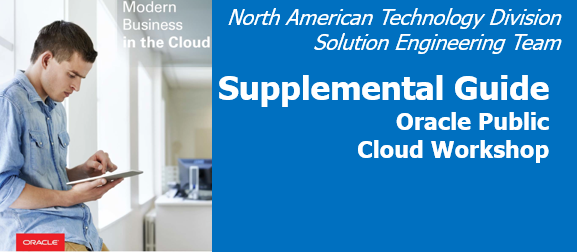

  
Updated: April 19, 2017

## Introduction

In this supplemental guide we will cover extra features that can be applied to this workshop.

Please direct comments to: Cam Crockett (cam.crockett@oracle.com)

## Objectives

- Connect Eclipse to Developer Cloud Service
- Build Automation for adding Bindings in Applciaiton Cotnainer Cloud Service
- Add Build automation for Container Cloud Service

## Required Artifacts

- Eclipse with Oracle's OEPE plugin: [Download Here](google.ca)

# Supplimental Guide

## Connect Eclipse to Developer Cloud Serivce

### **STEP 1**: Title of Step 1

- Open Eclipse OEPE
- Open the Oracle Cloud view
- Add a new connection
- Enter your cloud service details and credentials
- Traverse the Developer serivces

### **STEP 2**: Import Project from Developer Cloud Service

- Open Developer Cloud Service
- Open Code
- Right click on the git repository your want to edit and select Activate
- Right click on activated code and import project

> Note: Only the MySQLMicroservice is an Eclipse project, the rest should be loaded as general projects

## Create an Automated build for Adding serivce bindings

## Create an Automated docker build for your CurrencyMicroservice from Developer CloudService

## Automate MySQL Provisioning

## Automate MySQL Schema Migrations using FlywayDB
