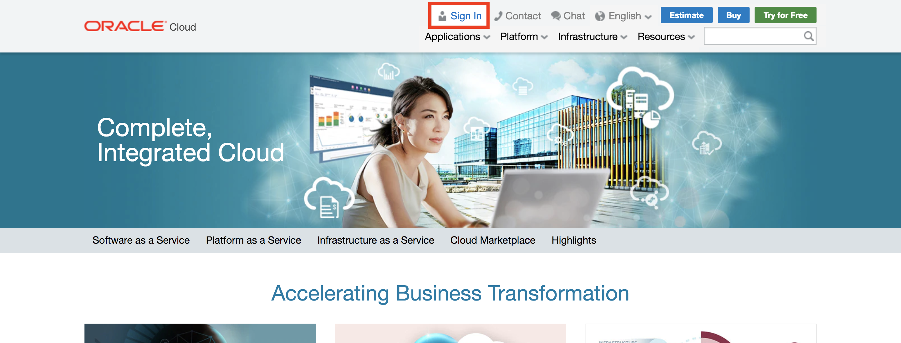
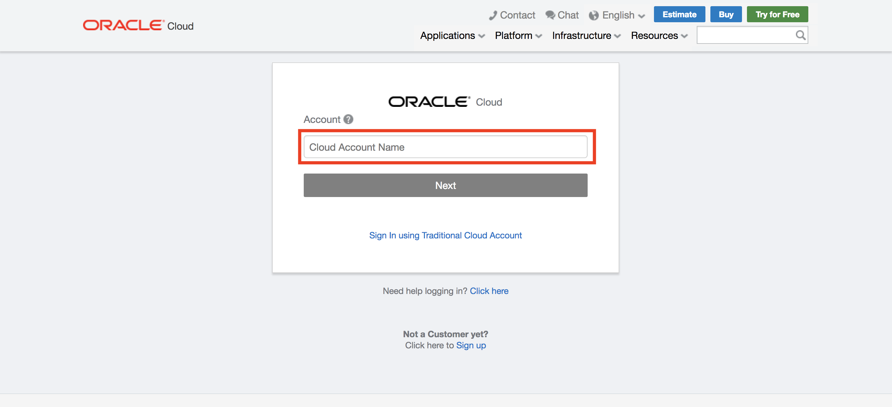
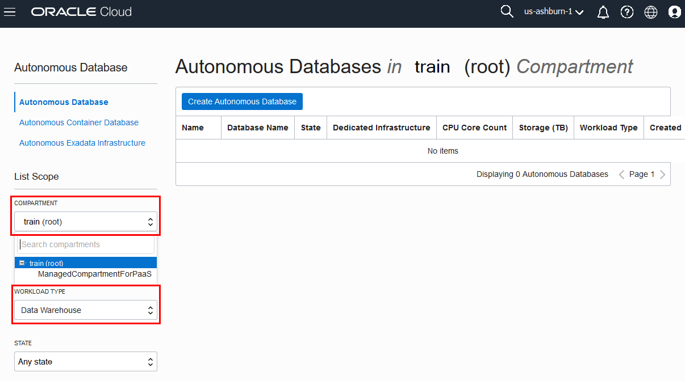
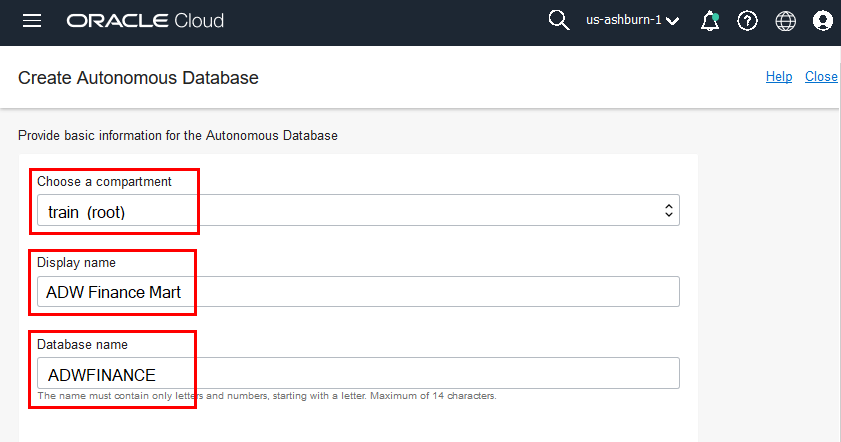
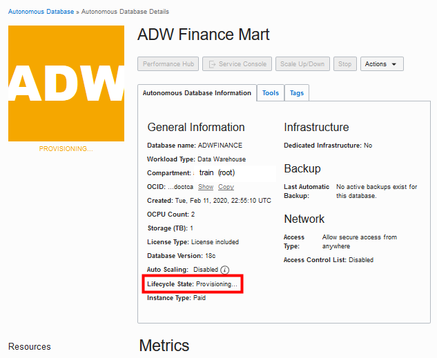
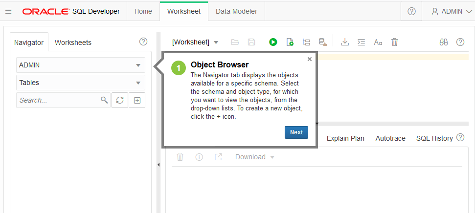

<!-- August 26, 2019 -->

# Getting Started with Autonomous Data Warehouse (ADW)

## Introduction

This lab walks you through the steps to get started using the Oracle Autonomous Data Warehouse (ADW) on Oracle Infrastructure Cloud (OCI). You will provision a new ADW instance and connect to the database using Oracle SQL Developer Web.

<!--
<a href="https://www.youtube.com/watch?v=Q6hxMaAPghI&autoplay=0&html5=1" target="_blank">-->Watch a video demonstration of provisioning a new autonomous data warehouse:

<!--
<a href="https://www.youtube.com/watch?v=PHQqbUX4T50&autoplay=0&html5=1" target="_blank">Click here to watch a video demonstration</a> of connecting to your new Autonomous Data Warehouse using SQL Developer.
-->

Click [here](https://www.youtube.com/watch?v=PHQqbUX4T50&autoplay=0&html5=1) to watch a video demonstration of connecting to your new Autonomous Data Warehouse using SQL Developer.

To **log issues**, click [here](https://github.com/millerhoo/journey4-adwc/issues/new)  to go to the GitHub Oracle repository issue submission form.

### Objectives

-   Learn how to provision a new Autonomous Data Warehouse

-   Learn how to connect to your new Autonomous Data Warehouse

### Required Artifacts

-   The following lab requires an Oracle Public Cloud account. You may use your own cloud account, a cloud account that you obtained through a trial, or a training account whose details were given to you by an Oracle instructor.

## Part 1. Provisioning an ADW Instance

In this section you will be provisioning an ADW instance using the cloud console.

#### **STEP 1: Sign in to Oracle Cloud**

-   Go to [cloud.oracle.com](https://cloud.oracle.com), click **Sign In** to sign in with your Oracle Cloud account.

-   Enter your **Cloud Account Name** and click **Next**.

-   Enter your Oracle Cloud **username** and **password**, and click **Sign In**.

#### **STEP 2: Create an ADW Instance**

-   Once you are logged in, you are taken to the cloud services dashboard where you can see all the services available to you. Click the navigation menu in the upper left to show top level navigation choices.

__Note:__ You can also directly access your Autonomous Data Warehouse service in the __Quick Actions__ section of the dashboard.

- Click **Autonomous Data Warehouse**.

- Make sure your workload type is __Data Warehouse__ or __All__ to see your Autonomous Data Warehouse instances. You can use the __List Scope__ drop-down menu to select a compartment. Select your __root compartment__, or __another compartment of your choice__ where you will create your new ADW instance. If you want to create a new compartment or learn more about them, click <a href="https://docs.cloud.oracle.com/iaas/Content/Identity/Tasks/managingcompartments.htm#three" target="_blank">here</a>.

 __Note__ - Avoid the use of the ManagedCompartmentforPaaS compartment as this is an Oracle default used for Oracle Platform Services.
- This console shows that no databases yet exist. If there were a long list of databases, you could filter the list by the state of the databases (available, stopped, terminated, and so on). You can also sort by __Workload Type__. Here, the __Data Warehouse__ workload type is selected.

- You can see your current default **region** in the top, right hand corner of the page. Go ahead and select a different available region such as **Phoenix** or **Toronto**.

 

-  Click **Create Autonomous Database** to start the instance creation process.

-  This brings up the __Create Autonomous Database__ screen where you will specify the configuration of the instance.
- Provide basic information for the autonomous database:

    - __Choose a compartment__ - Select a compartment for the database from the drop-down list.
    - __Display Name__ - Enter a memorable name for the database for display purposes. For this lab, use __ADW Finance Mart__.
    - __Database Name__ - Use letters and numbers only, starting with a letter. Maximum length is 14 characters. (Underscores not initially supported.) For this lab, use __ADWFINANCE__.

 

- Choose a workload type. Select the workload type for your database from the choices:

    - __Data Warehouse__ - For this lab, choose __Data Warehouse__ as the workload type.
    - __Transaction Processing__ - Alternately, you could have chosen Transaction Processing as the workload type.

 

- Choose a deployment type. Select the deployment type for your database from the choices:

    - __Shared Infrastructure__ - For this lab, choose __Shared Infrastructure__ as the deployment type.
    - __Dedicated Infrastructure__ - Alternately, you could have chosen Dedicated Infrastructure as the workload type.

 

- Configure the database:

    - __Always Free__ - For this lab, do not select this option.
    - __Choose database version__ - Select a database version from the available versions.
    - __OCPU count__ - Number of CPUs for your service. For this lab, specify __2 CPUs__.
    - __Storage (TB)__ - Select your storage capacity in terabytes. For this lab, specify __1 TB__ of storage.
    - __Auto Scaling__ - For this lab, __deselect__ auto scaling.
    - __New Database Preview__ - If a checkbox is available to preview a new database version, do __not__ select it.

  

- Create administrator credentials:

    - __Password and Confirm Password__ - Specify the password for ADMIN user of the service instance. The password must meet the following requirements:
    - The password must be between 12 and 30 characters long and must include at least one uppercase letter, one lowercase letter, and one numeric character.
    - The password cannot contain the username.
    - The password cannot contain the double quote (") character.
    - The password must be different from the last 4 passwords used.
    - The password must not be the same password that is set less than 24 hours ago.
    - Re-enter the password to confirm it. Make a note of this password.

   
- Choose network access:
    - For this lab, accept the default, "Allow secure access from everywhere".
    - If you want a private endpoint, to allow traffic only from the VCN you specify - where access to the database from all public IPs or VCNs is blocked, then select "Virtual cloud network" in the Choose network access area.
    - You can control and restrict access to your Autonomous Database by setting network access control lists (ACLs). You can select from 4 IP notation types: IP Address, CIDR Block, Virtual Cloud Network, Virtual Cloud Network OCID).

   

- Choose a license type. For this lab, choose __License Included__. The two license types are:

    - __Bring Your Own License (BYOL)__ - Select this type when your organization has existing database licenses.
    - __License Included__ - Select this type when you want to subscribe to new database software licenses and the database cloud service.

- Click __Create Autonomous Database__.

-  Your instance will begin provisioning. In a few minutes the state will turn from Provisioning to Available. At this point, your Autonomous Data Warehouse database is ready to use! Have a look at your instance's details here including its name, database version, CPU count and storage size.

## Part 2. Connecting to your ADW Database with SQL Developer Web

### Accessing SQL Developer Web

Although you can connect to your ADW autonomous database from local PC desktop tools like Oracle SQL Developer, you can conveniently access the browser-based SQL Developer Web directly from your ADW console.

#### **STEP 4: Open SQL Developer Web**

-   In your database's details page, click the **Tools** tab.

-  The Tools page provides you access to SQL Developer Web, Oracle Application Express, and Oracle ML User Administration. In the SQL Developer Web box, click **Open SQL Developer Web**.

-   A sign in page opens for SQL Developer Web. For this lab, simply use your database instance's default administrator account, ADMIN, with the admin password you specified when creating the database. Click **Sign in**.

-   SQL Developer Web opens on a worksheet tab. The first time you open SQL Developer Web, a series of pop-up informational boxes introduce the main features.

<table>
<tr><td class="td-logo"></td>
<td class="td-banner">
## Great Work - All Done!
**You are ready to move on to the next lab. You may now close this tab.**
</td>
</tr>
<table>
