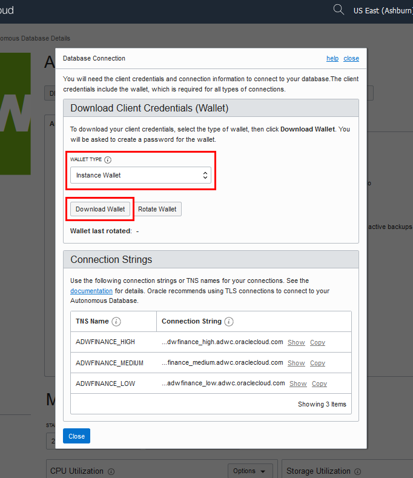
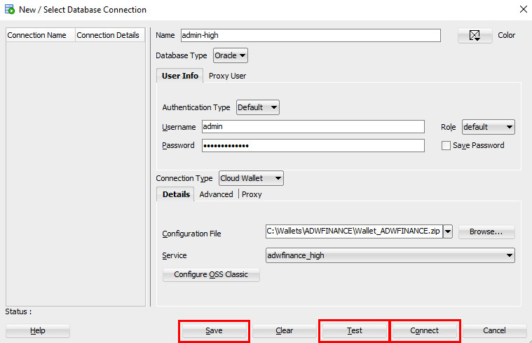

<!-- August 26, 2019 -->

# Connecting to ADW Securely with a Connection Wallet

## Introduction

This lab walks you through the steps to download and configure a connection wallet to connect securely to an Autonomous Data Warehouse (ADW) database. You will use this connection wallet to connect to the database using Oracle SQL Developer.

Click [here](https://www.youtube.com/watch?v=PHQqbUX4T50&autoplay=0&html5=1) to watch a video demonstration of connecting to your new Autonomous Data Warehouse using SQL Developer.

To **log issues**, click [here](https://github.com/millerhoo/journey4-adwc/issues/new)  to go to the GitHub Oracle repository issue submission form.

### Objectives

-   Learn how to download and configure a connection wallet

-   Learn how to connect to your Autonomous Data Warehouse with Oracle SQL Developer

### Required Artifacts

-   The following lab requires an Oracle Public Cloud account. You may use your own cloud account, a cloud account that you obtained through a trial, or a training account whose details were given to you by an Oracle instructor.

-   Oracle SQL Developer 19.2 or later is recommended (see <a href="http://www.oracle.com/technetwork/developer-tools/sql-developer/downloads/index.html" target="\_blank">Oracle Technology Network download site.</a>)
    Please use SQL Developer version 18.3 or later as this version contains enhancements for key Autonomous Data Warehouse features, including using ADW behind a VPN or Firewall.

    **Note:** If you are a Windows user on 64-bit platform, download the 'Windows 64-bit with JDK 8 included' distribution as it includes both Java 8 and the Java Cryptography Extension (JCE) files necessary to run SQL Developer and connect to your Autonomous Data Warehouse.
    If you are a non-Windows user, download and install the appropriate [Java 8 JDK](http://www.oracle.com/technetwork/java/javase/downloads/jdk8-downloads-2133151.html) for your Operating System. Download and extract the [Java Cryptography Encryption Archive](http://www.oracle.com/technetwork/java/javase/downloads/jce8-download-2133166.html) to the directory as indicated in the README.txt.

### Part 1. Connecting to ADW Securely with a Connection Wallet

### Downloading the Connection Wallet

As ADW only accepts secure connections to the database, you need to download a wallet file containing your credentials first. The wallet can be downloaded either from the instance's details page, or from the ADW service console.

## Step 1: Download the Connection Wallet

-   In your database's instance details page, click **DB Connection**.

-  Use the Database Connection dialog to download client credentials.
    - Select a wallet type. For this lab, select **Instance Wallet**. This wallet type is for a single database only; this provides a database-specific wallet.
    - **Note:** Oracle recommends you provide a database-specific wallet, using Instance Wallet, to end users and for application use whenever possible. Regional wallets should only be used for administrative purposes that require potential access to all Autonomous Databases within a region.
    - Click **Download Wallet**.

-   Specify a password of your choice for the wallet. You will need this password when connecting to the database via SQL Developer later, and is also used as the JKS keystore password for JDBC applications that use JKS for security. Click **Download** to download the wallet file to your client machine.
*Note*: If you are prevented from downloading your Connection Wallet, it may be due to your browser's pop-blocker. Please disable it or create an exception for Oracle Cloud domains.

### Connecting to the database using SQL Developer

Start SQL Developer and create a connection for your database using the default administrator account 'ADMIN' by following these steps.

## Step 2: Connect to the database using SQL Developer

-   Click the **New Connection** icon in the Connections toolbox on the top left of the SQL Developer homepage.

-   Fill in the connection details as below:

    -   **Connection Name:** admin_high

    -   **Username:** admin

    -   **Password:** The password you specified during provisioning your instance

    -   **Connection Type:** Cloud Wallet

    -   **Configuration File:** Enter the full path for the wallet file you downloaded before, or click the **Browse button** to point to the location of the file.

    -   **Service:** There are 3 pre-configured database services for each database. Pick **<*databasename*>\_high** for this lab. For
        example, if the database you created was named adwfinance, select **adwfinance_high** as the service.

*Note*: SQL Developer versions prior to 18.3 ask for a **Keystore Password.** Here, you would enter the password you specified when downloading the wallet from ADW.

-   Test your connection by clicking the **Test** button, if it succeeds save your connection information by clicking **Save**, then connect to your database by clicking the **Connect** button. An entry for the new connection appears under Connections.

-   If you are behind a VPN or Firewall and this Test fails, make sure you have <a href="https://www.oracle.com/technetwork/developer-tools/sql-developer/downloads/index.html" target="\_blank">SQL Developer 18.3</a> or higher. This version and above will allow you to select the "Use HTTP Proxy Host" option for a Cloud Wallet type connection. While creating your new ADW connection here, provide your proxy's Host and Port. If you are unsure where to find this, you may look at your computer's connection settings or contact your Network Administrator.

<table>
<tr><td class="td-logo"></td>
<td class="td-banner">
## Great Work - All Done!
**You are ready to move on to the next lab. You may now close this tab.**
</td>
</tr>
<table>
