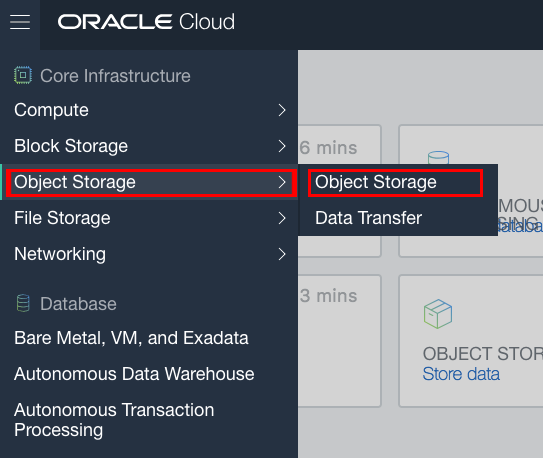
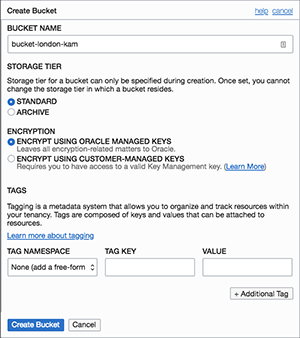
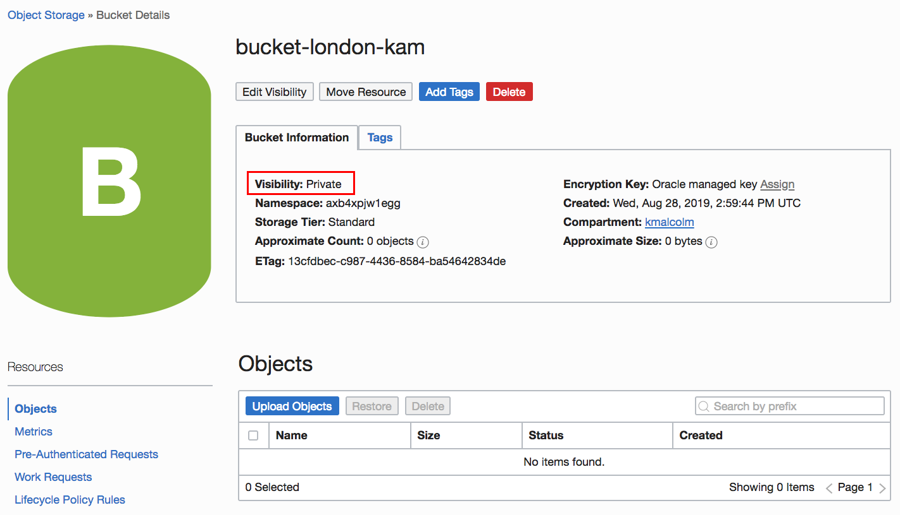
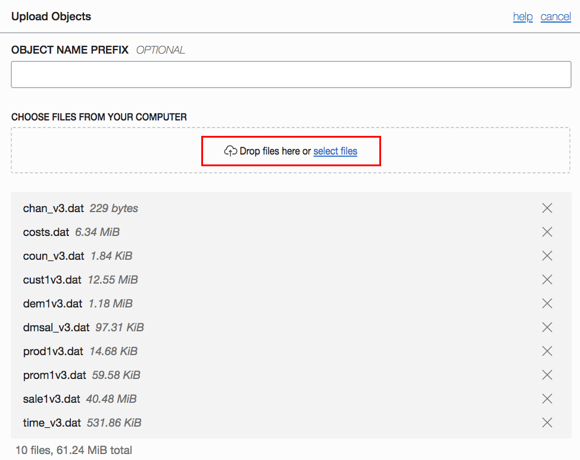
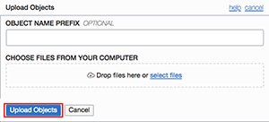
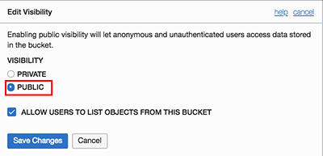

# Loading Data Into an Autonomous Database

## Table of Contents

- [Module 1: Upload Data Files to Your Object Store](#module-1--upload-data-files-to-your-object-store)
- [Module 2: Create an Object Store Auth Token](#module-2--create-an-object-store-auth-token)
- [Module 3: Create Object Store Credentials in your Autonomous Database](#module-3--create-object-store-credentials-in-your-autonomous-database)
- [Module 4: Copy Data from Object Store to Autonomous Database Tables](#module-4--copy-data-from-object-store-to-autonomous-database-tables)
- [Module 5: Confirm Your Data Loads](#module-5--confirm-your-data-loads)

***** 

## Loading Data Into Autonomous Database
=============================================

This lab shows you how to load data from an Oracle Object Store into a database
in Autonomous Database.

You can load data into Autonomous Database using Oracle Database tools, and
Oracle and 3rd party data integration tools. You can load data:

-   from files local to your client computer, or

-   from files stored in a cloud-based object store

For the fastest data loading experience Oracle recommends uploading the source
files to a cloud-based object store, such as Oracle Cloud Infrastructure Object
Storage, before loading the data into your Autonomous Database.

To load data from files in the cloud into your Autonomous Database database, use
the new PL/SQL **DBMS_CLOUD** package. The DBMS_CLOUD package supports loading
data files from the following Cloud sources: Oracle Cloud Infrastructure Object
Storage, Oracle Cloud Infrastructure Object Storage Classic, and Amazon AWS S3.

This tutorial shows how to load data from Oracle Cloud Infrastructure Object
Storage using two of the procedures in the DBMS_CLOUD package:

-   * `create_credential`: Stores the object store credentials in your Autonomous
    Database schema.

    -   You will use this procedure to create object store credentials in your
        Autonomous Database  adwc_user schema that you defined in a previous
        tutorial.

-   * `copy_data`: Loads the specified source file to a table. The table must
    already exist in Autonomous Database.

    -   You will use this procedure to load tables in the adwc_user schema with
        data from data files staged in the Oracle Cloud Infrastructure Object
        Storage cloud service.

    -   This tutorial shows how to load data to SH tables (sales history tables
        from an Oracle sample schema: SALES, COSTS, TIMES, PRODUCTS, CHANNELS,
        PROMOTIONS, CUSTOMERS, COUNTRIES, SUPPLEMENTARY_DEMOGRAPHICS).

    -   For more information about loading data, see the documentation [Loading
        Data from Files in the
        Cloud](https://www.oracle.com/pls/topic/lookup?ctx=en/cloud/paas/autonomous-data-warehouse-cloud&id=CSWHU-GUID-07900054-CB65-490A-AF3C-39EF45505802).

### What Do You Need?

-   Access to an instance of Autonomous Database. See previous tutorials in this
    series and the documentation: [Using Oracle Autonomous Database
    Cloud](http://www.oracle.com/pls/topic/lookup?ctx=en/cloud/paas/autonomous-data-warehouse-cloud&id=CSWHU-GUID-4B91499D-7C2B-46D9-8E4D-A6ABF2093414).

-   Data files already uploaded to a staging area; otherwise follow the steps in
    section 1, below, to upload your data files to the Oracle Cloud
    Infrastructure Object Storage service.

    -   To use data files already in an object store, your cloud administrator
        must provide you the object store credentials and the URL path to the
        files that you will be copying to your Autonomous Database tables.

    -   If you will be uploading data files to an object store in Oracle Cloud
        Infrastructure Object Storage, your cloud administrator must provide you
        the cloud tenant name, and user name and password with read/write
        privileges to the object store location where the data is to be stored.

[Back to Top](#table-of-contents) 

## Module 1:  Upload Data Files to Your Object Store
--------------------------------------

## Load a data file to your Object Store ##
Oracle Cloud Infrastructure offers two distinct storage class tiers.  Object Storage, for data which you need fast, immediate and frequent access and Archive Storage, for data which you seldom or rarely access.  In this ziplab you will stage data into an object store in the Oracle Cloud Infrastructure Object Storage service.

1. Login to your Oracle Cloud Infrastructure Console
2. Select **Object Storage** -> **Object Storage** from the drop down menu on the top left of the Oracle Cloud Infrastructure console.

    
    <p align="center">Figure 1-1</p>

3. Select **Create Bucket** to create a bucket to load your data in.  This will be your staging area.  Later in this lab you will move the data from this staging area to your ADW instance.
For this lab, we'll use the `adb-certification` compartment.

    
    <p align="center">Figure 1-2</p>

4. Enter the following information: 
    * **Bucket Name**:  `bucket-<city you were born in>-<your initials>`  (example: *bucket-london-kam*)
    * **Storage Tier**:  `Standard`
    * **Encryption**: `Encrypt using Oracle Managed Keys`

    
    <p align="center">Figure 1-3</p>

5. Click **Create Bucket**.
6. Click on the bucket name you just created.  

    
    <p align="center">Figure 1-4</p>
 
7. Review the screen. Note you have created an empty bucket with no objects in it and the visibility is set to private. 

    
    <p align="center">Figure 1-5</p>

8. Click **[here](https://www.oracle.com/webfolder/technetwork/tutorials/obe/cloud/adwc/OBE_Loading%20Your%20Data/files/datafiles_for_sh_tables.zip)** to download the zip file with the objects you will be importing into cloud storage.  The file will download to your desktop.  
9. Double click and **extract** the folder to your desktop.

10. Click the **Upload Object** button at the bottom of the page to begin selecting the data files to upload to the bucket.  

11. Choose all the files you just extracted, drag and drop them into the upload objects window.

    
    <p align="center">Figure 1-6</p>
    
12. Select the ten data files and click **Open**.  Once the files are finished loading, click **Upload Objects** to load. 

    
    <p align="center">Figure 1-7</p>

13. Once complete, verify **all** *.dat files have a status of `Finished` and click **Close**.
14. Your bucket should have 10 objects loaded.  If this were a true data load, you may be loading *hundreds* of large files here.
15. The final step will be to change the visibility of your bucket. Click the **Edit Visibility** button at the top of your Bucket Details screen.

    
    <p align="center">Figure 1-8</p>

16. Change the visibility to **Public**, accept all other defaults.  Click **Save Changes**.

    
    <p align="center">Figure 1-9</p>

17. Your bucket should now be visible and public.  Verify and proceed to setting up your Auth token.

    
    <p align="center">Figure 1-10</p>

[Back to Top](#table-of-contents) 

## Module 2: Create an Object Store Auth Token
--------------------------------------

Because I created each of you as a federated user, you cannot create Auth Tokens.  So I have created a local user.


    <p align="center">Figure 2-1</p>

For the next part of our lab, you will need to use this Auth Token: etfUIb1}Na5P-lLhq(dQ


[Back to Top](#table-of-contents) 

## Module 3:  Create Object Store Credentials in your Autonomous Database
-----------------------------------------------------------

Now that you have an object store Auth Token, you will store your credentail in your Autonomous database.

1.  Open SQL Developer Web and connect to your Autonomous Database as user admin
    with the connection you created in the Connecting to ADB Lab.
    (Go to your Autonomous Database details page, click on Service Console,  Click on Developement, Select SQL Developer )

    
    <p align="center">Figure 3-1</p>

2.  In a SQL Developer worksheet, use the create_credential procedure of the
    DBMS_CLOUD package to store the object store credentials in your database

    -   Create a credential name. You reference this credential name in the
        copy_data procedure in the next step.

    -   Specify the credentials for your Oracle Cloud Infrastructure Object
        Storage service: The username will be buket-user and the object
        store Auth Token is the one provided above.

```
begin  
   DBMS_CLOUD.create_credential (  
   credential_name => 'OBJ_STORE_CRED',  
   username => 'bucket-user',  
   password => 'etfUIb1}Na5P-lLhq(dQ'  
   ) ;  
end;  
/
```


<p align="center">Figure 3-2</p>


After you run this script, your object store's credentials are stored in
your Autonomous Database.

[Back to Top](#table-of-contents) 

## Module 4:  Copy Data from Object Store to Autonomous Database Tables
---------------------------------------------------------

The copy_data procedure of the DBMS_CLOUD package requires that target tables
must already exist in in your Autonomous database. To create the appropriate
tables, run the code below in SQL Developer.


1. Copy and paste all this code into the SQL worksheet in SQL Developer and click run script.

```
CREATE TABLE sales (

prod_id NUMBER NOT NULL,

cust_id NUMBER NOT NULL,

time_id DATE NOT NULL,

channel_id NUMBER NOT NULL,

promo_id NUMBER NOT NULL,

quantity_sold NUMBER(10,2) NOT NULL,

amount_sold NUMBER(10,2) NOT NULL);

CREATE TABLE salestemp (

prod_id NUMBER NOT NULL,

cust_id NUMBER NOT NULL,

time_id DATE NOT NULL,

channel_id NUMBER NOT NULL,

promo_id NUMBER NOT NULL,

quantity_sold NUMBER(10,2) NOT NULL,

amount_sold NUMBER(10,2) NOT NULL,

unit_cost NUMBER(10,2) ,

unit_price NUMBER(10,2) );

CREATE TABLE costs (

prod_id NUMBER NOT NULL,

time_id DATE NOT NULL,

promo_id NUMBER NOT NULL,

channel_id NUMBER NOT NULL,

unit_cost NUMBER(10,2) NOT NULL,

unit_price NUMBER(10,2) NOT NULL);

CREATE TABLE times (

time_id DATE NOT NULL,

day_name VARCHAR2(9) NOT NULL,

day_number_in_week NUMBER(1) NOT NULL,

day_number_in_month NUMBER(2) NOT NULL,

calendar_week_number NUMBER(2) NOT NULL,

fiscal_week_number NUMBER(2) NOT NULL,

week_ending_day DATE NOT NULL,

week_ending_day_id NUMBER NOT NULL,

calendar_month_number NUMBER(2) NOT NULL,

fiscal_month_number NUMBER(2) NOT NULL,

calendar_month_desc VARCHAR2(8) NOT NULL,

calendar_month_id NUMBER NOT NULL,

fiscal_month_desc VARCHAR2(8) NOT NULL,

fiscal_month_id NUMBER NOT NULL,

days_in_cal_month NUMBER NOT NULL,

days_in_fis_month NUMBER NOT NULL,

end_of_cal_month DATE NOT NULL,

end_of_fis_month DATE NOT NULL,

calendar_month_name VARCHAR2(9) NOT NULL,

fiscal_month_name VARCHAR2(9) NOT NULL,

calendar_quarter_desc CHAR(7) NOT NULL,

calendar_quarter_id NUMBER NOT NULL,

fiscal_quarter_desc CHAR(7) NOT NULL,

fiscal_quarter_id NUMBER NOT NULL,

days_in_cal_quarter NUMBER NOT NULL,

days_in_fis_quarter NUMBER NOT NULL,

end_of_cal_quarter DATE NOT NULL,

end_of_fis_quarter DATE NOT NULL,

calendar_quarter_number NUMBER(1) NOT NULL,

fiscal_quarter_number NUMBER(1) NOT NULL,

calendar_year NUMBER(4) NOT NULL,

calendar_year_id NUMBER NOT NULL,

fiscal_year NUMBER(4) NOT NULL,

fiscal_year_id NUMBER NOT NULL,

days_in_cal_year NUMBER NOT NULL,

days_in_fis_year NUMBER NOT NULL,

end_of_cal_year DATE NOT NULL,

end_of_fis_year DATE NOT NULL );

CREATE TABLE products (

prod_id NUMBER(6) NOT NULL,

prod_name VARCHAR2(50) NOT NULL,

prod_desc VARCHAR2(4000) NOT NULL,

prod_subcategory VARCHAR2(50) NOT NULL,

prod_subcategory_id NUMBER NOT NULL,

prod_subcategory_desc VARCHAR2(2000) NOT NULL,

prod_category VARCHAR2(50) NOT NULL,

prod_category_id NUMBER NOT NULL,

prod_category_desc VARCHAR2(2000) NOT NULL,

prod_weight_class NUMBER(3) NOT NULL,

prod_unit_of_measure VARCHAR2(20) ,

prod_pack_size VARCHAR2(30) NOT NULL,

supplier_id NUMBER(6) NOT NULL,

prod_status VARCHAR2(20) NOT NULL,

prod_list_price NUMBER(8,2) NOT NULL,

prod_min_price NUMBER(8,2) NOT NULL,

prod_total VARCHAR2(13) NOT NULL,

prod_total_id NUMBER NOT NULL,

prod_src_id NUMBER ,

prod_eff_from DATE ,

prod_eff_to DATE ,

prod_valid VARCHAR2(1) );

CREATE TABLE channels (

channel_id NUMBER NOT NULL,

channel_desc VARCHAR2(20) NOT NULL,

channel_class VARCHAR2(20) NOT NULL,

channel_class_id NUMBER NOT NULL,

channel_total VARCHAR2(13) NOT NULL,

channel_total_id NUMBER NOT NULL);

CREATE TABLE promotions (

promo_id NUMBER(6) NOT NULL,

promo_name VARCHAR2(30) NOT NULL,

promo_subcategory VARCHAR2(30) NOT NULL,

promo_subcategory_id NUMBER NOT NULL,

promo_category VARCHAR2(30) NOT NULL,

promo_category_id NUMBER NOT NULL,

promo_cost NUMBER(10,2) NOT NULL,

promo_begin_date DATE NOT NULL,

promo_end_date DATE NOT NULL,

promo_total VARCHAR2(15) NOT NULL,

promo_total_id NUMBER NOT NULL);

CREATE TABLE customers (

cust_id NUMBER NOT NULL,

cust_first_name VARCHAR2(20) NOT NULL,

cust_last_name VARCHAR2(40) NOT NULL,

cust_gender CHAR(1) NOT NULL,

cust_year_of_birth NUMBER(4) NOT NULL,

cust_marital_status VARCHAR2(20) ,

cust_street_address VARCHAR2(40) NOT NULL,

cust_postal_code VARCHAR2(10) NOT NULL,

cust_city VARCHAR2(30) NOT NULL,

cust_city_id NUMBER NOT NULL,

cust_state_province VARCHAR2(40) NOT NULL,

cust_state_province_id NUMBER NOT NULL,

country_id NUMBER NOT NULL,

cust_main_phone_number VARCHAR2(25) NOT NULL,

cust_income_level VARCHAR2(30) ,

cust_credit_limit NUMBER ,

cust_email VARCHAR2(50) ,

cust_total VARCHAR2(14) NOT NULL,

cust_total_id NUMBER NOT NULL,

cust_src_id NUMBER ,

cust_eff_from DATE ,

cust_eff_to DATE ,

cust_valid VARCHAR2(1) );

CREATE TABLE countries (

country_id NUMBER NOT NULL,

country_iso_code CHAR(2) NOT NULL,

country_name VARCHAR2(40) NOT NULL,

country_subregion VARCHAR2(30) NOT NULL,

country_subregion_id NUMBER NOT NULL,

country_region VARCHAR2(20) NOT NULL,

country_region_id NUMBER NOT NULL,

country_total VARCHAR2(11) NOT NULL,

country_total_id NUMBER NOT NULL,

country_name_hist VARCHAR2(40));

CREATE TABLE supplementary_demographics

( CUST_ID NUMBER not null,

EDUCATION VARCHAR2(21),

OCCUPATION VARCHAR2(21),

HOUSEHOLD_SIZE VARCHAR2(21),

YRS_RESIDENCE NUMBER,

AFFINITY_CARD NUMBER(10),

bulk_pack_diskettes NUMBER(10),

flat_panel_monitor NUMBER(10),

home_theater_package NUMBER(10),

bookkeeping_application NUMBER(10),

printer_supplies NUMBER(10),

y_box_games NUMBER(10),

os_doc_set_kanji NUMBER(10),

COMMENTS VARCHAR2(4000));

ALTER TABLE promotions

ADD CONSTRAINT promo_pk

PRIMARY KEY (promo_id)

RELY DISABLE NOVALIDATE;

ALTER TABLE sales

ADD CONSTRAINT sales_promo_fk

FOREIGN KEY (promo_id) REFERENCES promotions (promo_id)

RELY DISABLE NOVALIDATE;

ALTER TABLE costs

ADD CONSTRAINT costs_promo_fk

FOREIGN KEY (promo_id) REFERENCES promotions (promo_id)

RELY DISABLE NOVALIDATE;

ALTER TABLE customers

ADD CONSTRAINT customers_pk

PRIMARY KEY (cust_id)

RELY DISABLE NOVALIDATE;

ALTER TABLE sales

ADD CONSTRAINT sales_customer_fk

FOREIGN KEY (cust_id) REFERENCES customers (cust_id)

RELY DISABLE NOVALIDATE;

ALTER TABLE products

ADD CONSTRAINT products_pk

PRIMARY KEY (prod_id)

RELY DISABLE NOVALIDATE;

ALTER TABLE sales

ADD CONSTRAINT sales_product_fk

FOREIGN KEY (prod_id) REFERENCES products (prod_id)

RELY DISABLE NOVALIDATE;

ALTER TABLE costs

ADD CONSTRAINT costs_product_fk

FOREIGN KEY (prod_id) REFERENCES products (prod_id)

RELY DISABLE NOVALIDATE;

ALTER TABLE times

ADD CONSTRAINT times_pk

PRIMARY KEY (time_id)

RELY DISABLE NOVALIDATE;

ALTER TABLE sales

ADD CONSTRAINT sales_time_fk

FOREIGN KEY (time_id) REFERENCES times (time_id)

RELY DISABLE NOVALIDATE;

ALTER TABLE costs

ADD CONSTRAINT costs_time_fk

FOREIGN KEY (time_id) REFERENCES times (time_id)

RELY DISABLE NOVALIDATE;

ALTER TABLE channels

ADD CONSTRAINT channels_pk

PRIMARY KEY (channel_id)

RELY DISABLE NOVALIDATE;

ALTER TABLE sales

ADD CONSTRAINT sales_channel_fk

FOREIGN KEY (channel_id) REFERENCES channels (channel_id)

RELY DISABLE NOVALIDATE;

ALTER TABLE costs

ADD CONSTRAINT costs_channel_fk

FOREIGN KEY (channel_id) REFERENCES channels (channel_id)

RELY DISABLE NOVALIDATE;

ALTER TABLE countries

ADD CONSTRAINT countries_pk

PRIMARY KEY (country_id)

RELY DISABLE NOVALIDATE;

ALTER TABLE customers

ADD CONSTRAINT customers_country_fk

FOREIGN KEY (country_id) REFERENCES countries (country_id)

RELY DISABLE NOVALIDATE;

ALTER TABLE supplementary_demographics

ADD CONSTRAINT supp_demo_pk

PRIMARY KEY (cust_id)

RELY DISABLE NOVALIDATE;
```

Running the create statements and results will look like this in SQL Developer.


<p align="center">Figure 4-1</p>


In a SQL Developer worksheet, use the copy_data procedure of the DBMS_CLOUD
package to copy the data staged in your object store.

For credential_name, specify the name of the credential you defined in the
Create Object Store Credentials earlier.

For file_uri_list, specify the URL that points to the location of the file
staged in your object store. See screenshots below for how to obtain this.

[Right Click here to download](https://stbeehive.oracle.com/content/dav/st/DBPM_Repo/Public%20Documents/cert/adw-loading-copy-data.txt)
for an example script. In the script, the only line you need to change for each
table is the * `file_uri_list parameter` IF the credential you created is called
OBJ_STORE_CRED. If you called your credential a different name, you also need to
change the credential_name line.

To obtain the file_uri_list for each file you want to load, go to your storage
bucket (as described above when you created it), and for each object to load,
click on the 3 dots to the right and select, View Object Details:


<p align="center">Figure 4-2</p>

The object details windows appears, copy the URL Path (URI), then past this on
the corresponding dbms_cloud.copy_data statement as shown below


<p align="center">Figure 4-3</p>

2. Below is an example of what your statement should look like when you run it, filled in with your information instead. Remember, one statement per table being loaded.

```
begin
dbms_cloud.copy_data(table_name =\>'CHANNELS',
credential_name=\>'OBJ_STORE_CRED',
file_uri_list=\>'https://objectstorage.us-ashburn-1.oraclecloud.com/n/ospaadb/b/bucket-20190326-1401/o/chan_v3.dat',
format =\> json_object('ignoremissingcolumns' value 'true', 'removequotes' value 'true')
);
end;
/
```


<p align="center">Figure 4-4</p>

After you have updated the `file_uri-list` values, copy and run the statements in your SQL Worksheet.

3. After you run the procedure, observe that the data has been copied from the
object store to the tables in your Autonomous database by clicking the table
name in SQL Developer


<p align="center">Figure 4-5</p>

4. You can now view your table data.


<p align="center">Figure 4-5</p>


[Back to Top](#table-of-contents) 

## Module 5:  Confirm Your Data Loads
----------------------

All data load operations done using the PL/SQL package DBMS_CLOUD are logged in
the tables dba_load_operations and user_load_operations. These tables contain
the following:

-   dba_load_operations: shows all load operations.

-   user_load_operations: shows the load operations in your schema.
1. Query these tables to see information about ongoing and completed data
    loads. For example:

```
SELECT table_name, owner_name, type, status, start_time, update_time,  
logfile_table, badfile_table
FROM user_load_operations WHERE type = 'COPY';
```

2.  Examine the results. The log and bad files are accessible as tables:

TABLE_NAME STATUS ROWS_LOADED LOGFILE_TABLE   BADFILE_TABLE  
---------- ------------ ----------- -------------   -------------  
  CHANNELS FAILED COPY\$1_LOG      COPY\$1_BAD  
 CHANNELS COMPLETED 5   COPY\$2_LOG COPY\$2_BAD

**This concludes the loading lab.**

***END OF LAB***

[Back to Top](#table-of-contents) 