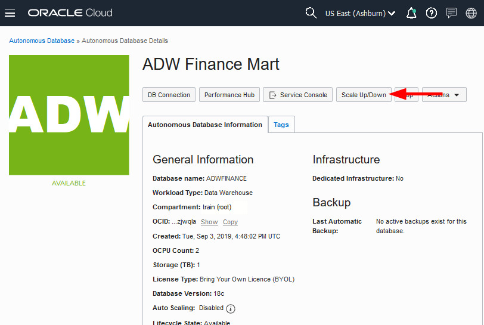
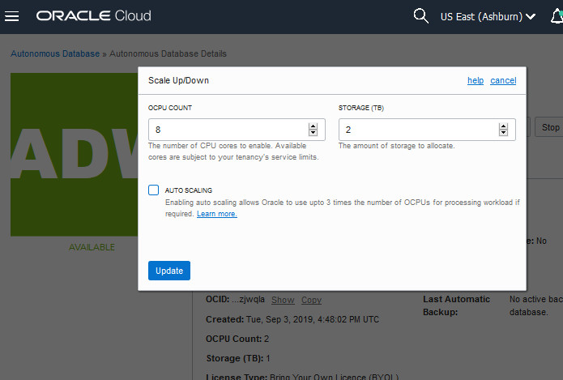

<!-- Updated March, 2020 -->

# Bonus Lab 9: Scaling and Performance in Your Autonomous Database

### Introduction

In this lab you will scale up your Oracle Autonomous Data Warehouse (ADW) or Autonomous Transaction Processing (ATP) service to have more CPUs. And you will watch a demo that shows the performance and concurrency impacts of scaling your service online.

### Objectives

-   Learn how to scale up an ADW or ATP service

-   Understand the performance and concurrency impacts of scaling your autonomous database service online

### Required Artifacts

-   The following lab requires an <a href="https://www.oracle.com/cloud/free/" target="\_blank">Oracle Public Cloud account</a>. If you don't already have your own cloud account then you can obtain a new cloud account through the free Oracle trial program.

## <!--buggy, did this so Part 1 would collapse-->

## Step 1: Scaling your Autonomous Database Instance

1. Go back to the Cloud Console you used during the provisioning exercise and open the database instance's Details screen. From the **action menu**, click **Scale Up/Down**.

    

2. Fill in the form with the following information.

    -   **CPU core count :** 8
    -   **Storage capacity:** 2 TB

3. Click **Update** after filling in the form. This will take you to the database instance's Details screen.

    

**Note** The applications can continue running during the scale operation without downtime.

4. **Refresh** the page to see the result of the scaled operation.

    

## Step 2: Performance and Concurrency Benefits of Dynamic Scaling

1. <a href="https://raw.githubusercontent.com/millerhoo/journey4-adwc/master/workshops/journey4-adwc/images/ADWC%20HOL%20-%20Scaling.mp4" target="\_blank">Click here</a> to watch a demo of the performance impact of scaling up your instance. In the demo you will see that scaling up provides more concurrency for your users.

2. The demo will show a workload that has 10 concurrent users running with the MEDIUM database service. You will see that on a 2 CPU autonomous database instance 5 queries are running whereas 5 queries are waiting in the queue for resources.

    

3. While the workload is running the database will be scaled up from 2 CPUs to 4 CPUs. You will see that the queries waiting in the queue are now able to start and there are no sessions waiting in the queue anymore.

    

4. ADW allows you to dynamically scale your service online when you require more concurrency and performance.

## Acknowledgements

- **Author** - Nilay Panchal, ADB Product Management
- **Adapted for Cloud by** - Richard Green, Principal Developer, Database User Assistance
- **Last Updated By/Date** - Richard Green, March 2020

See an issue?  Please open up a request [here](https://github.com/oracle/learning-library/issues).
