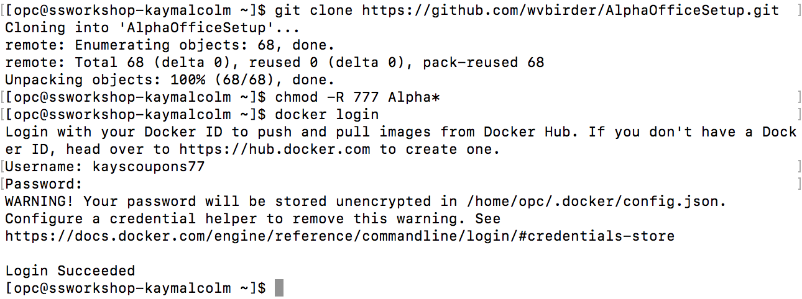
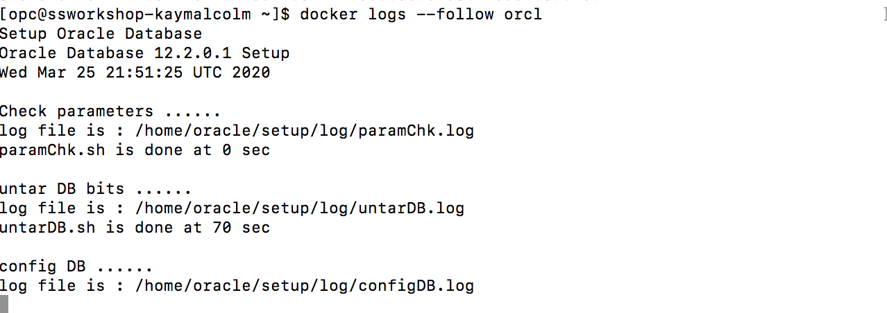
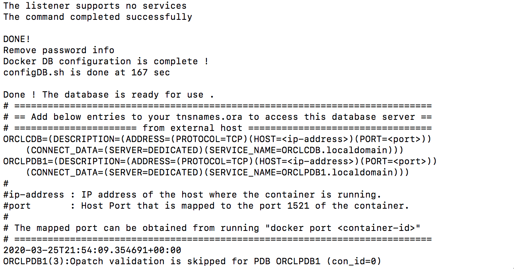

# Create an Oracle Database Container
## Before Your Begin

This lab walks you through the steps to deploy an Oracle Database to Docker container.

### What Do You Need?

* An Oracle Cloud paid account or free trial. To sign up for a trial account with $300 in credits for 30 days, click [here](http://oracle.com/cloud/free).
* SSH keys
* Has created a docker hub [account](http://hub.docker.com)

## **STEP 1**: Before Creating an Oracle Database Container

1.  Make sure you are in the /home/opc directory.

    ````
    [opc@oraclelinux77 ~]$ <copy>pwd</copy>
    /home/opc
    [opc@oraclelinux77 ~]$ 
    ````

    If not, type the below command to navigate to /home/opc directory.

    ````
    [opc@oraclelinux77 ~]$ <copy>cd /home/opc</copy>
    [opc@oraclelinux77 ~]$ 
    ````

2.  Clone setup scripts from git:
   
    ````
    [opc@oraclelinux77 ~]$ <copy>git clone https://github.com/wvbirder/AlphaOfficeSetup.git</copy>
    Cloning into 'AlphaOfficeSetup'...
    remote: Enumerating objects: 68, done.
    remote: Total 68 (delta 0), reused 0 (delta 0), pack-reused 68
    Unpacking objects: 100% (68/68), done.
    [opc@oraclelinux77 ~]$ 
    ````

3.  Change the access permissions:
   
    ````
    [opc@oraclelinux77 ~]$ <copy>chmod -R 777 Alpha*</copy> 
    [opc@oraclelinux77 ~]$ 
    ````

4.  Login with your Docker Hub credentials.

    ````
    [opc@oraclelinux77 ~]$ <copy>docker login</copy>
    ````

    

## **STEP 2**: Create an Oracle Database Container

There are database setup files that you cloned in the earlier step. Ensure the listener has stopped. Let's see how easy it is to deploy an Oracle Database to a docker container.  
   
1. Issue the command below:  
   
    ````
    [opc@oraclelinux77 ~]$ <copy>docker run -d -it --name orcl -h='oracledb-ao' -p=1521:1521 -p=5600:5600 -v /home/opc/AlphaOfficeSetup:/dbfiles wvbirder/database-enterprise:12.2.0.1-slim</copy> 
    ````

    

    - -d runs the command in the background
    - -h assigns it the hostname oracleadb-ao
    - -p maps ports 1521 and 5600 (Enterprise Manager Express) inside the container to your compute instance. In an earlier step, we added ingress rules for these ports
    - --name is the name of the container
    - v maps the directory where you downloaded the setup files to the /dbfiles directory inside the container

2.  To watch the progress type the following command passing the name of the container:  orcl.
   
    ````
    [opc@oraclelinux77 ~]$ <copy>docker logs --follow orcl</copy>
    ````

    

3.  When the database creating is complete, you may see "The database is ready for use". The instance creation may happen quickly and that message may scroll past. Press control-c to continue.

    

You may now proceed to the next lab.

## Acknowledgements
* **Author** - Oracle NATD Solution Engineering
* **Adapted for Cloud by** -  
* **Last Updated By/Date** - Anoosha, April 2020

See an issue?  Please open up a request [here](https://github.com/oracle/learning-library/issues).
