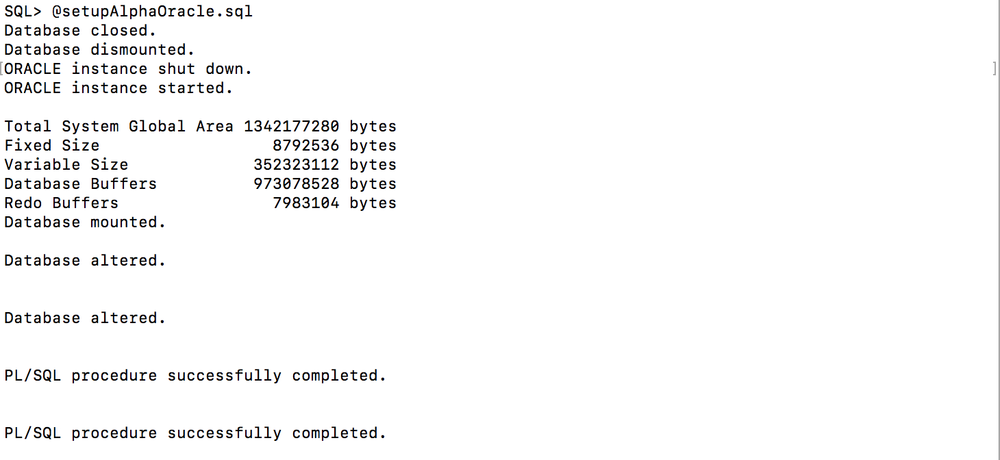
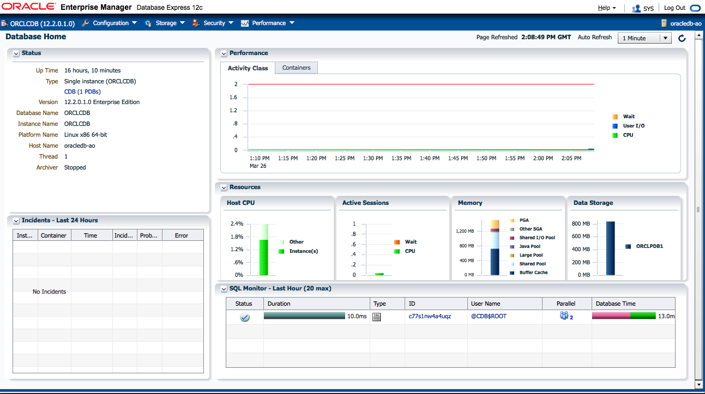

# Create A Schema In Running Oracle Database Container
## Before You Begin

This lab walks you through the steps to create a schema in a running Oracle database container and login to Enterprise Manager Express.

### What Do You Need?

* An Oracle Cloud paid account or free trial. To sign up for a trial account with $300 in credits for 30 days, click [here](http://oracle.com/cloud/free).
* SSH keys
* A running Oracle Database Container

## **STEP 1**: Create a Schema

1.  To create the schema we need to "login" to the container. Type the following:
   
    ````
    <copy>docker exec -it orcl bash</copy> 
    ````

2.  Let's make sure the /dbfiles directory mapped earlier is writeable

    ````
    <copy> cd /dbfiles
    touch xxx
    ls
    </copy> 
    ````

    

3.  Now run the sql scipt from inside the container using sqlplus
   
    ````
    <copy> 
    sqlplus / as sysdba
    @setupAlphaOracle.sql
    exit
    </copy> 
    ````

    

## **STEP 2**: Login to Enterprise Manager Express

Now that our schema is created, let's login to Enterprise Manager Express.

1.  Enter the address below into your browser:
   
    ````
    <copy>http://<Public IP Address>:5600/em</copy>
    ````

2.  If prompted to enable Adobe Flash, click Allow.
    
3.  Login using the credentials below. Leave the container name field blank. Explore the database using Enterprise Manager Express.
   
    ````
    <copy>
    Username: sys
    Password: Oradoc_db1
    Check the "as SYSDBA" checkbox
    </copy>
    ````

    

    

You may now proceed to the next lab.

## Acknowledgements
* **Author** - Oracle NATD Solution Engineering
* **Adapted for Cloud by** -  
* **Last Updated By/Date** - Anoosha, April 2020

See an issue?  Please open up a request [here](https://github.com/oracle/learning-library/issues).