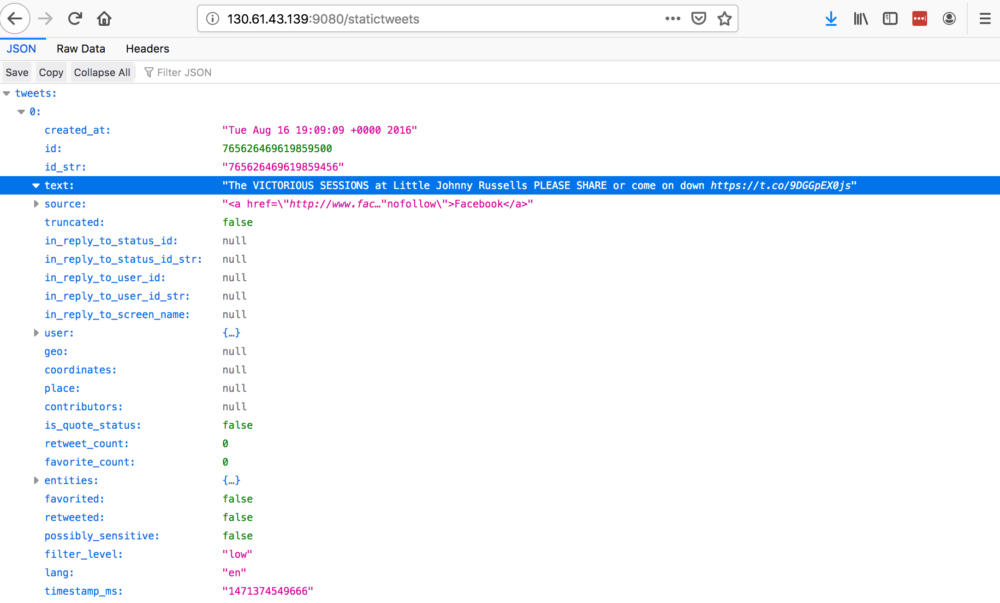
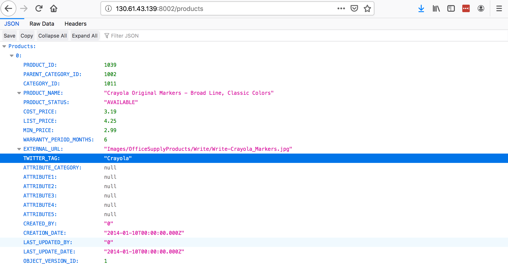
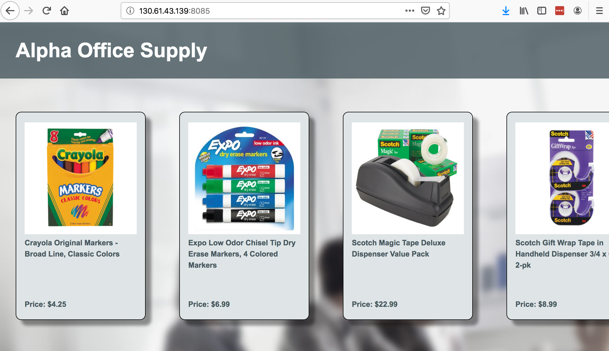
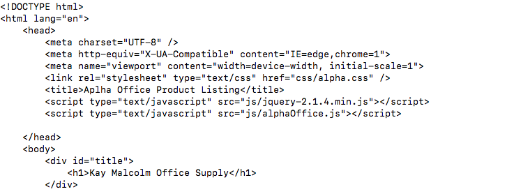
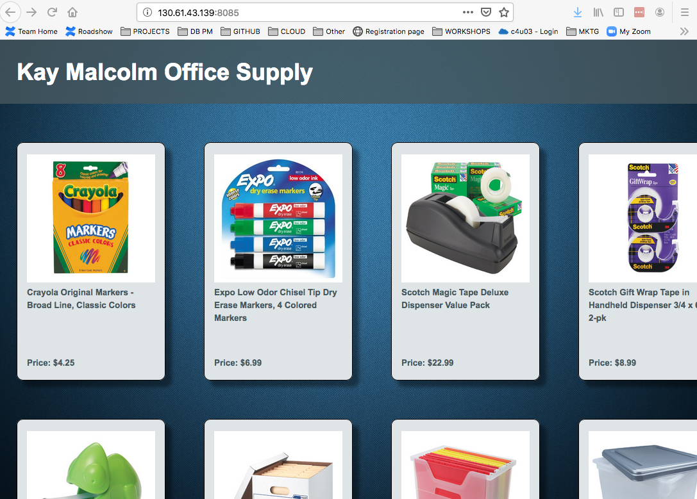

# Deploy and Change Application
## Before you begin

This lab walks you through the steps to deploy an application, twitterfeed, that is stored in the hub.docker.com site under the account wvbirder.  You will then run the rest client using an oracle database as the data source. You can share applications and make modifications in the container.

## **STEP 1**: Run the Docker Image in Container

1.  Download the docker image, twitterfeed, extract it and run the container. The download is from the wvbirder docker hub account where this application is staged.

    ````
    <copy>docker run -d --name=twitterfeed -p=9080:9080 wvbirder/twitterfeed</copy> 
    ````

    

2.  Check to see which containers are running.  
    
    ````
    <copy>docker ps</copy>
    ````

    

3.  Open up a broswer to see the application with the stream of texts.  http://Public IP address:9080/statictweets

    

## **STEP 2**: Run Restclient with Oracle Database as Datasource

1.  Let's run the restclient with the Oracle Database as the datasource.
   
    ````
    <copy>docker run -d -it --rm --name restclient -p=8002:8002 --link orcl:oracledb-ao -e ORACLE_CONNECT='oracledb-ao/orclpdb1.localdomain' -e DS='oracle' wvbirder/restclient</copy> 
    ````

2.  Go back to your broswer to see the application with the stream of texts.  http://Public IP address:8002/products

    

## **STEP 3**: Run AlphaOfficeUI Application

1.  An application called AlphaOfficeUI has been staged in wvbirders docker hub account.  Let's download it, extract and run it.
   
    ````
    <copy>docker run -d --name=alphaofficeui -p=8085:8085 wvbirder/alpha-office-ui-js</copy> 
    ````

    

2.  Go back to your broswer to see the application running on port 8085.  http://Public IP address:8085.  Click on one of the products to see the details and the twitterfeed comments.

    

## **STEP 4**: Copy Background Image

1.  Copy a background image from your compute instance into the filesystem of the container.
   
    ````
    <copy>docker cp /home/opc/AlphaOfficeSetup/dark_blue.jpg alphaofficeui:/pipeline/source/public/Images</copy> 
    ````

## **STEP 5**: Install VIM editor

1.  If wvbirder's container does not have vim installed, you will configure it. First you need to login to the container.

    ````
    <copy>docker exec -it alphaofficeui bash</copy> 
    ````

    

    Run below command to confirm if vim exists.

    ````
    <copy>which vim</copy> 
    ````

    If the path of vim is displayed empty, install vim by running the below commands, else skip to step 3.

    ````
    <copy>apt-get update</copy>
    ````

    ````
    <copy>apt-get install vim</copy> 
    ````

    

## **STEP 6**: Change Application

1.  Verify the dark_blue.jpg file is in the container.
   
    ````
    <copy>ls /pipeline/source/public/Images</copy>
    ````

2.  Use vim to edit the html file for the main page in your application. Change the highlighted areas to your name.
   
    ````
    <copy>vim /pipeline/source/public/alpha.html</copy> 
    ````

    

3.  Let's edit the css file as well and change the background color of the app and exit.

    ````
    <copy>vim /pipeline/source/public/css/alpha.css</copy>
    ````
    
    

    ````
    <copy>exit</copy> 
    ````

4. Let's view the running application now.  Notice the name and the background has changed.

    


## **STEP 7**: Commit Docker Image

1.  Let's commit this new docker image to your docker hub now.  Wvbirder thanks but we have our own Docker account.
   
    ````
    <copy>docker commit alphaofficeui (your-dockerhub-account)/(image-name)</copy>
    ````

    

2.  Now let's list the images. Note that your image is now listed.

    ````
    <copy>docker images</copy>
    ````

    

## **STEP 8**: Start Container Based on Image

1.  To start a container based on your image.  First we need to stop the existing container.
   
    ````
    <copy>docker stop alphaofficeui</copy>
    ````

2.  Let's start the container.
    
    ````
    <copy>docker rm alphaofficeui</copy> 
    ````

    

## **STEP 9**: View Image

1.  Let's download, extract and install the new container from your docker account.
    
    ````
    <copy>docker run -d --name=alphaofficeui -p=8085:8085 (your-dockerhub-account)/(image-name)</copy> 
    ````

    

2.  Go back to your broswer to view the application.  http://Public IP address:8085

## **STEP 10**: Push Image to Docker Hub Account

1.  Now let's push this image to your docker hub account
    
    ````
    <copy>docker push (your-dockerhub-account)/(image-name)</copy> 
    ````

2.  Open up a new browswer tab and login to hub.docker.com.  Verify your new account is there.

Congratulations, this lab is now complete!

## Acknowledgements
* **Author** - Oracle NATD Solution Engineering
* **Last Updated By/Date** - Anoosha Pilli, April 2020

See an issue?  Please open up a request [here](https://github.com/oracle/learning-library/issues).   Please include the workshop name and lab in your request. 
