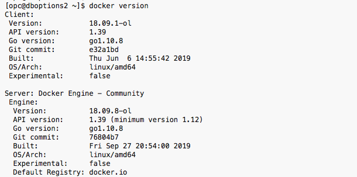
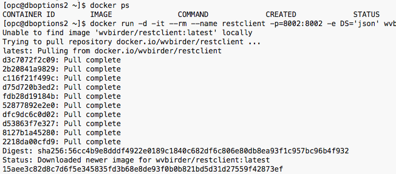
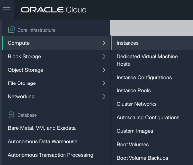
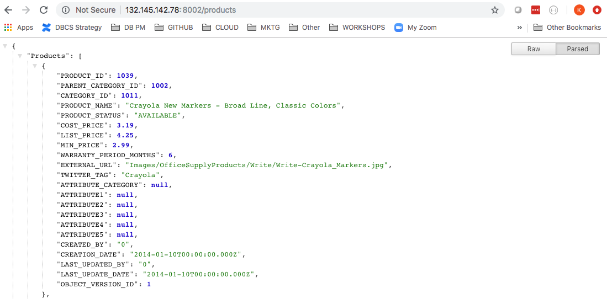
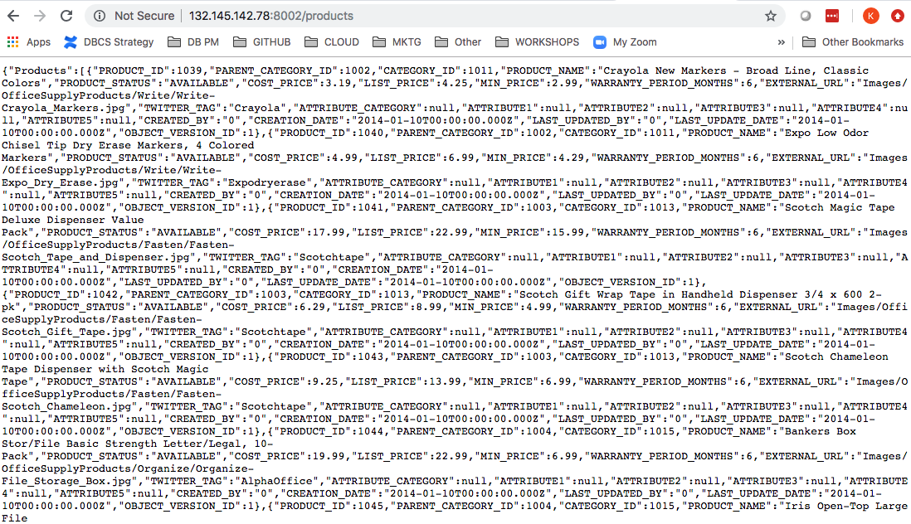
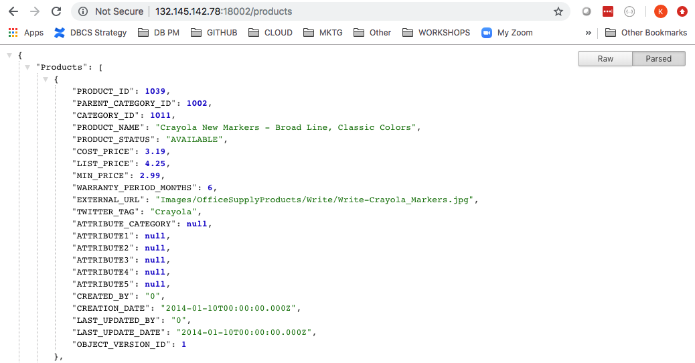

# Docker Basic Concepts
## Before Your Begin

This lab walks you through the steps to start the Docker container in JSON format.

### Background

A Docker container is a running instance of a Docker image. However, unlike in traditional virtualization with a type 1 or type 2 hypervisor, a Docker container runs on the kernel of the host operating system. Within a Docker container, there is no separate operating system.

### What Do You Need?

* An Oracle Cloud paid account or free trial. To sign up for a trial account with $300 in credits for 30 days, click [here](http://oracle.com/cloud/free).
* SSH keys

## **STEP 1**: Start the Application

1.  Check the version of docker:

    ````
    <copy>docker version</copy>
    ````

     

2.  The `ps` command is used to list the existing docker containers:
   
    ````
    <copy>docker ps</copy> 
    ````
   
3.  Start your application, restclient, in docker on port 8002 in json format.  

    ````
    <copy>docker run -d -it --rm --name restclient -p=8002:8002 -e DS='json' wvbirder/restclient</copy> 
    ````

    - "-d" flag runs the container in the background
    - "-it" flags instructs docker to allocate a pseudo-TTY connected to the container’s stdin, creating an interactive bash capable shell in the container (which we will use in a moment when we connect into the container)
    - "-h" We give the container a hostname "oracledb-ao" to make it easier to start/stop/remove, reference from other containers, etc
    - "-p" We map port 8002 from within the container to the same ports on the HOST for accessibility from outside of the container's private subnet (typically 172.17.0.0/16). This allows the container to be accessed from the HOST, for example. The default port for Oracle's tns listener is on port 1521 and port 5600 is used for HTTP access to Enterprise Manager Express
    - "--name" The name of the container will be "restclient"
    - "-v" This maps the directory where you downloaded the restclient setup.
    
     

4.  Find the public IP address of your instances.  Compute -> Instance

     

     

     

5.  Open up a browser on your laptop and go to your public URL on port 8002.  Go to http://Enter IP Address:8002/products. Depending on whether you have a JSON formatter, you should see the products in your application, in RAW or FORMATTED format. `Note:  If you are connected to Oracle's VPN, disconnect`

     

        

## **STEP 2**: Stop the Application

1.  The `restclient` container was started earlier with the -rm option.  This means when stopping, it will remove ALL allocated resources.

    ````
    <copy>docker stop restclient</copy>
    ````

    

2.  The `ps` command with the `-a` option shows the status of ALL containers that are running. As you can see, there are no containers running.

    ````
    <copy>docker ps -a</copy>
    ````

## **STEP 3**: Start the Container in Another Port

1.  Let's start another container on your compute instance's 18002 port.  Type the following command:

    ````
    <copy>docker run -d -it --rm --name restclient -p=18002:8002 -e DS='json' wvbirder/restclient</copy>
    ````

    

2.  Check the status of all the containers that are running.

    ````
    <copy>docker ps -a</copy>
    ````

3.  Go back to your browser and change the port to 18002.

    

You may now proceed to the next lab.

## Acknowledgements
* **Author** - Oracle NATD Solution Engineering
* **Adapted for Cloud by** -  
* **Last Updated By/Date** - Anoosha, April 2020

See an issue?  Please open up a request [here](https://github.com/oracle/learning-library/issues).


