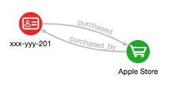

# Use Case: Customer 360 analysis #

This example shows how integrating multiple datasets, using a graph, facilitates additional analytics can lead to new insights. We will use three small datasets for illustrative purposes. The first contains accounts and account  owners. The second is purchases by the people who own those accounts. The third is transactions between these accounts.

The combined dataset is then used to perform the following common graph query and analyses: pattern matching, detection of cycles, finding important nodes, community detection, and recommendation.

For the data preparation process, please see:

[Create Graph as Files](../create_graph_as_files/create_graph_as_files.md)

[Load from Files](../load_from_files/load_from_files.md)

## Pattern Matching

PGQL Query is convenient for detecting specific patterns.

Find accounts that had an inbound and an outbound transfer, of over 500, on the same day. The PGQL query for this is:

```
g.queryPgql("""
  SELECT a.account_no, a.balance, t1.amount, t2.amount, t1.date
  MATCH (a)<-[t1:transfer]-(a1)
      , (a)-[t2:transfer]->(a2)
  WHERE t1.date = t2.date
    AND t1.amount > 500
    AND t2.amount > 500
    AND a.balance < 300
""").print()

+---------------------------------------------------------------+
| a.account_no | a.balance | t1.amount | t2.amount | t1.date    |
+---------------------------------------------------------------+
| xxx-yyy-202  | 200       | 900       | 850       | 2018-10-06 |
+---------------------------------------------------------------+
```

## Detection of Cycles

Next we use PGQL to find a series of transfers that start and end at the same account such as A to B to A, or A to B to C to A.

The first query could be expressed as:

```
g.queryPgql("""
  SELECT a1.account_no, t1.date, t1.amount, a2.account_no, t2.date, t2.amount
  MATCH (a1)-[t1:transfer]->(a2)-[t2:transfer]->(a1)
  WHERE t1.date < t2.date
""").print()

+---------------------------------------------------------------------------------+
| a1.account_no | t1.date    | t1.amount | a2.account_no | t2.date    | t2.amount |
+---------------------------------------------------------------------------------+
| xxx-yyy-201   | 2018-10-05 | 200       | xxx-yyy-202   | 2018-10-10 | 300       |
+---------------------------------------------------------------------------------+
```


The second query just adds one more transfer to the pattern (list) and could be expressed as:


```
g.queryPgql("""
  SELECT a1.account_no, t1.amount, a2.account_no, t2.amount
       , a3.account_no, t3.amount
  MATCH (a1)-[t1:transfer]->(a2)-[t2:transfer]->(a3)-[t3:transfer]->(a1)
  WHERE t1.date < t2.date
    AND t2.date < t3.date
""").print()

+-----------------------------------------------------------------------------------+
| a1.account_no | t1.amount | a2.account_no | t2.amount | a3.account_no | t3.amount |
+-----------------------------------------------------------------------------------+
| xxx-yyy-201   | 500       | xxx-yyy-203   | 400       | xxx-yyy-204   | 300       |
+-----------------------------------------------------------------------------------+
```


## Influential Accounts

Filter customers from the graph. (cf. [Filter Expressions](https://docs.oracle.com/cd/E56133_01/latest/reference/filter.html))

    sg = g.filter(new EdgeFilter("edge.label()='transfer'"))

Run [pagerank](https://docs.oracle.com/cd/E56133_01/latest/reference/algorithms/pagerank.html) algorithm.

    analyst.pagerank(sg)

Show the result.

```
sg.queryPgql("""
  SELECT a.account_no, a.pagerank
  MATCH (a)
  ORDER BY a.pagerank DESC
""").print()

+-------------------------------------+
| a.account_no | a.pagerank           |
+-------------------------------------+
| xxx-yyy-201  | 0.18012007557258927  |
| xxx-yyy-204  | 0.1412461615467829   |
| xxx-yyy-203  | 0.1365633635065475   |
| xxx-yyy-202  | 0.12293884324085073  |
| xxx-zzz-002  | 0.05987452026569676  |
| xxx-zzz-001  | 0.025000000000000005 |
+-------------------------------------+
```

## Community Detection

Let's find which subsets of accounts form communities. That is, there are more transfers among accounts in the same subset than there are between those and accounts in another subset. We'll use the built-in weekly / strongly connected components algorithm.

The first step is to create a subgraph that only has the accounts and the transfers among them. This is done by creating and applying an edge filter (for edges with the table "transfer') to the graph.

Filter customers from the graph.

    sg = g.filter(new EdgeFilter("edge.label()='transfer'"))
    
[Weakly connected component](https://docs.oracle.com/cd/E56133_01/latest/reference/algorithms/wcc.html) algorithm detects only one partition.

```
result = analyst.wcc(sg)
result.eachWithIndex {
  it, index -> println "Partition ${index} has ${it.size()} vertices"
}

Partition 0 has 6 vertices
```

Get the partition includes "201" (John's account) and list all other nodes in this partition.

```
partition = result.getPartitionByVertex(g.getVertex("201"))
partition.each{
  println it.getId() + " " + it.getProperty("account_no")
}

a01 xxx-yyy-201
a02 xxx-yyy-202
a03 xxx-yyy-203
a04 xxx-yyy-204
a11 xxx-zzz-001
a12 xxx-zzz-002
```

[Strongly connected component](https://docs.oracle.com/cd/E56133_01/latest/reference/algorithms/scc.html) algorithm detects three partitions.

```
result = analyst.sccKosaraju(sg)
result.eachWithIndex {
  it, index -> println "Partition ${index} has ${it.size()} vertices"
}

Partition 0 has 1 vertices
Partition 1 has 4 vertices
Partition 2 has 1 vertices
```

Get the partition includes "201" (John's account) and list all other nodes in this partition.

```
partition = result.getPartitionByVertex(g.getVertex("201"))
partition.each {
  println it.getId() + " " + it.getProperty("account_no")
}

a01 xxx-yyy-201
a02 xxx-yyy-202
a03 xxx-yyy-203
a04 xxx-yyy-204
```

Setting this result to node properties, it can be retrieved by PGQL queries.

```
cs = sg.createChangeSet()
rs = sg.queryPgql("SELECT DISTINCT a WHERE (a)-[:transfer]-()")
for (r in rs) {
  v = r.getVertex(1)
  i = result.getPartitionIndexOfVertex(v)
  cs.updateVertex(v.getId()).setProperty("component", i)
}
sg = cs.build()
sg.queryPgql("""
  SELECT a.component, COUNT(a.account_no), MAX(a.account_no)
  MATCH (a)
  GROUP BY a.component
  ORDER BY a.component
""").print()

+-------------------------------------------------------+
| a.component | COUNT(a.account_no) | MAX(a.account_no) |
+-------------------------------------------------------+
| 0           | 1                   | xxx-zzz-001       |
| 1           | 4                   | xxx-yyy-204       |
| 2           | 1                   | xxx-zzz-002       |
+-------------------------------------------------------+
```


## Recommendation

Lastly let's use Personalized PageRank to find stores that John may purchase from given that people he is connected to have made purchases from those stores.

Filter customers and merchants from the graph.

    sg = g.filter(new EdgeFilter("edge.label()='purchased'"))

Add reverse edges.

```
cs = sg.createChangeSet()
rs = sg.queryPgql("SELECT a, x MATCH (a)-[:purchased]->(x)")
for (r in rs) {
    a = r.getVertex(1).getId()
    x = r.getVertex(2).getId()
    cs.addEdge(x, a).setLabel("purchased_by")
}
sg = cs.build()
sg.queryPgql("""
  SELECT ID(r), x.name, LABEL(r), a.account_no
  MATCH (x)-[r:purchased_by]->(a)
  LIMIT 3
""").print()

+---------------------------------------------------+
| ID(r) | x.name      | LABEL(r)     | a.account_no |
+---------------------------------------------------+
| 11    | Apple Store | purchased_by | xxx-yyy-201  |
| 13    | Apple Store | purchased_by | xxx-yyy-202  |
| 16    | Apple Store | purchased_by | xxx-yyy-203  |
+---------------------------------------------------+
```




We will focus on the account no. a01 (John's account) and run PPR.

```
vertexSet = sg.createVertexSet()
vertexSet.addAll("201")
ppr = analyst.personalizedPagerank(sg, vertexSet)
```

Show the result. (cf. [EXISTS and NOT EXISTS subqueries](https://docs.oracle.com/cd/E56133_01/latest/reference/pgql-specification.html#exists-and-not-exists-subqueries))

```
sg.queryPgql("""
  SELECT ID(x), x.name, x.pagerank
  MATCH (x)
  WHERE x.type = 'merchant'
    AND NOT EXISTS (
      SELECT *
      MATCH (x)-[:purchased_by]->(a)
      WHERE ID(a) = '201'
    )
  ORDER BY x.pagerank DESC
""").print()

+--------------------------------------------+
| ID(x) | x.name       | x.pagerank          |
+--------------------------------------------+
| m03   | Kindle Store | 0.04932640133302745 |
| m04   | Asia Books   | 0.04932640133302745 |
| m05   | ABC Travel   | 0.01565535511504672 |
+--------------------------------------------+
```

## Acknowledgements ##

- **Author** - Ryota Yamanaka - Product Manager in Asia-Pacific for geospatial and graph technologies