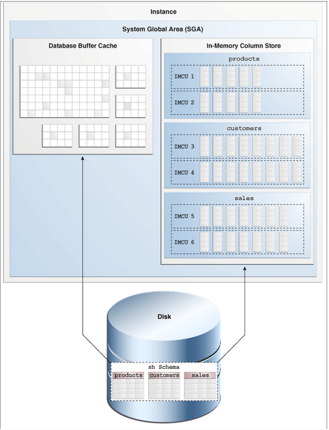
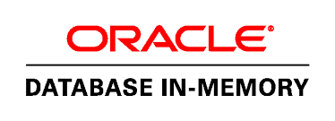
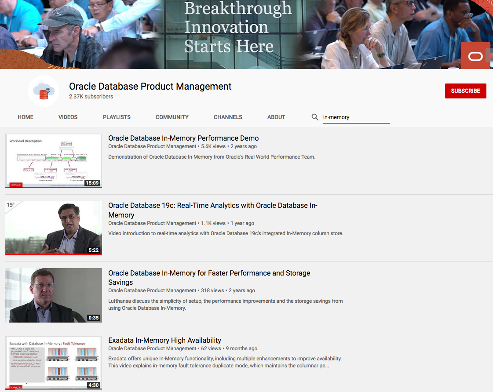

# Workshop Introduction and Overview #

## Introduction to Oracle In-Memory ##
Database In-Memory features a highly optimized In-Memory Column Store (IM column store) maintained alongside the existing row formatted buffer cache as depicted below in Figure 1. The primary purposeof the IM column store is to accelerate column-oriented data accesses made by analytics operations. It is similar in spirit to having a conventional index (for analytics) on every column in a table. However, it is much more lightweight than a conventional index, requiring no logging, or any writes to the database. Just as the performance benefit to an application from conventionalindexes depends on the amount of time the application spends accessing data in the tables that are indexed, the benefit from the IM column store also depends on the amount of time the application spends on data access for analytic operations. 

Watch the video below for an overview of Oracle In-Memory.

## Database In-Memory and Performance

There are four basic architectural elements of the column store that enable orders of magnitude faster analytic query processing:  

1. *Compressed columnar storage*: Storing data contiguously in compressed column units allows an analytic query to scan only data within the required columns, instead of having to skip past unneeded data in other columns as would be needed for a row major format. Columnar storage therefore allows a query to perform highly efficient sequential memory references while compression allows the query to optimize its use of the available system (processor to memory) bandwidth. 
    

2. *Vector Processing*: In addition to being able to process data sequentially, column organizedstorage also enables the use of vector processing. Modern CPUs feature highly parallel instructions known as SIMD or vectorinstructions(e.g. Intel AVX). These instructions can process multiple values in one instruction –for instance, they allow multiple values to be compared with a given value (e.g. find saleswith State = “California”) in one instruction. Vector processing of compressed columnar data further multiplies the scan speed obtained via columnar storage,resulting in scan speeds exceeding tens of billions of rows per second, per CPU core. 
   
3. *In-Memory Storage Indexes*: The IM column store for a given table is divided into units known as In-Memory Compression Units(IMCUs) that typically represent a large number of rows (typically several hundred thousand). Each IMCU automatically records the min and max values for the data within each column in the IMCU, as well as other summary information regarding the data. This metadata serves as an In-Memory Storage Index:  For instance, it allows an entire IMCU to be skipped during a scan when it is known from the scan predicates that no matching value will be found within the IMCU. 
   
4. *In-Memory Optimized Joins and Reporting*: As a result of massive increases in scan speeds, the Bloom Filteroptimization (introduced earlier in Oracle Database 10g) can be commonly selected by the optimizer. With the Bloom Filter optimization, the scan of the outer (dimension) table generates a compact bloom filter which can then be used to greatly reduce the amount of data processed by the join from the scan of the inner (fact) table. Similarly, an optimization known as Vector Group Bycan be used to reduce a complex aggregation query on a typical star schema into a series of filtered scans against the dimension and fact tables.

## In-Memory Architecture

The following figure shows a sample IM column store. The database stores the sh.sales table on disk in traditional row format. The SGA stores the data in columnar format in the IM column store, and in row format in the database buffer cache. 

 

## More Information on In-Memory

Database In-Memory Channel

Oracle Database Product Management Videos on In-Memory

Please proceed to the next lab.

## Acknowledgements

- **Authors/Contributors** - Andy Rivenes, Senior Principal Product Manager, In-Memory
- **Last Updated By/Date** - Kay Malcolm, March 2020
- **Workshop Expiration Date** - March 31, 2021

See an issue?  Please open up a request [here](https://github.com/oracle/learning-library/issues).
