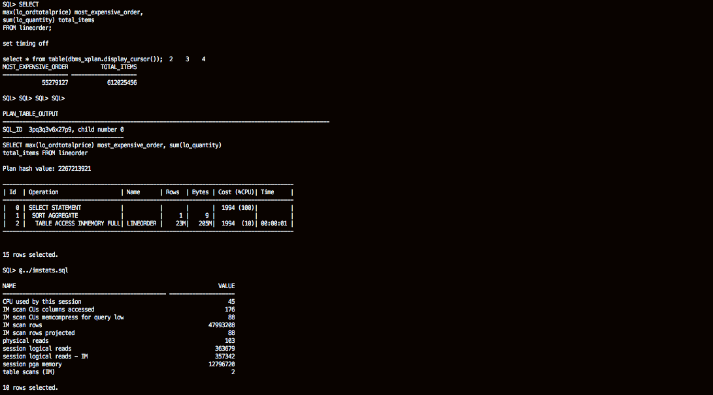
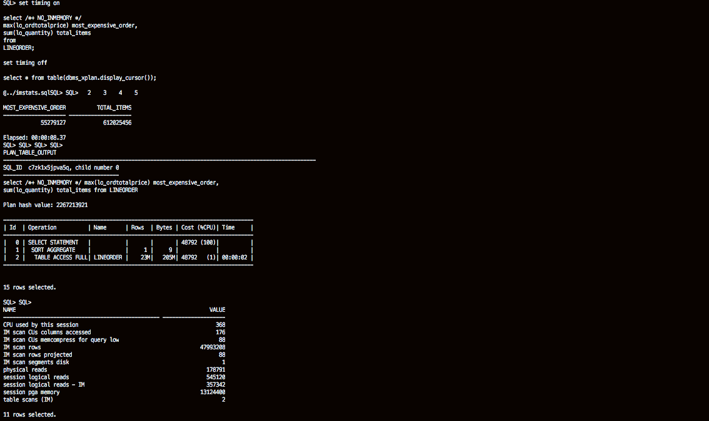
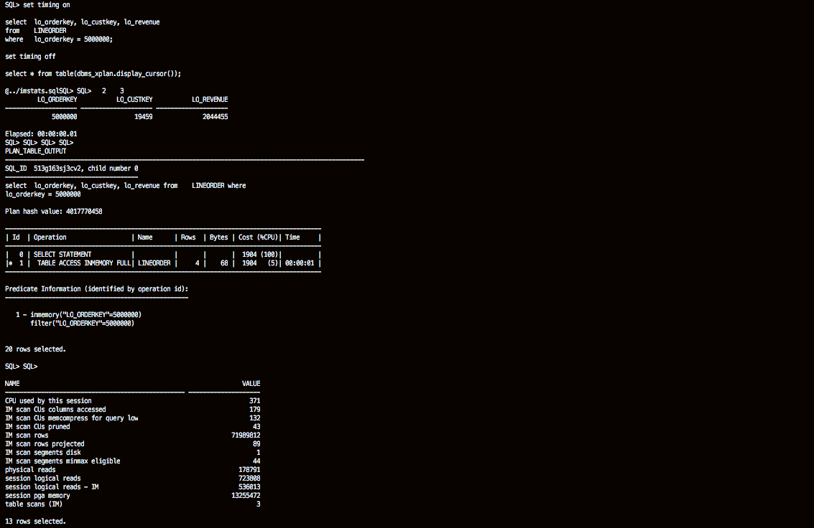
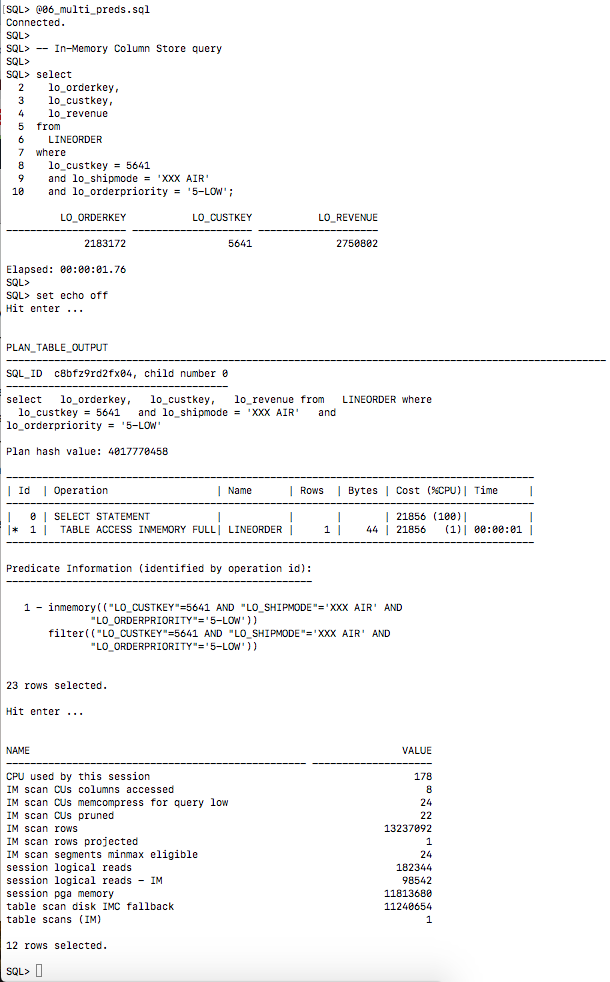

# In-Memory Queries

## Introduction

### Objectives

-   Perform various queries on the In-Memory Column Store

### Lab Prerequisites

This lab assumes you have completed the following labs:
* Lab: Login to Oracle Cloud
* Lab: Generate SSH Key
* Lab: Environment Setup
* Lab: Enabling In-Memory

### Lab Preview

Watch a preview video of querying the In-Memory Column Store

[](youtube:U9BmS53KuGs)

## Step 1: Querying the In-Memory Column Store

Now that you’ve gotten familiar with the IM column store let’s look at the benefits of using it. You will execute a series of queries against the large fact table LINEORDER, in both the buffer cache and the IM column store, to demonstrate the different ways the IM column store can improve query performance above and beyond the basic performance benefits of accessing data in memory only.

1.  Let's switch to the Part2 folder and log back in to the PDB. 
    ````
    <copy>
    cd /home/oracle/labs/inmemory/Part2
    sqlplus ssb/Ora_DB4U@localhost:1521/orclpdb
    set pages 9999
    set lines 100
    </copy>
    ````
     

2.  Let's begin with a simple query:  *What is the most expensive order we have received to date?*  There are no indexes or views setup for this.  So the execution plan will be to do a full table scan of the LINEORDER table.  Note the elapsed time. 

    ````
    <copy>
    set timing on

    SELECT
    max(lo_ordtotalprice) most_expensive_order,
    sum(lo_quantity) total_items
    FROM lineorder;

    set timing off

    select * from table(dbms_xplan.display_cursor());

    @../imstats.sql
    </copy>
    ````
    The execution plan shows that we performed a TABLE ACCESS INMEMORY FULL of the LINEORDER table.

     

3.  To execute the same query against the buffer cache you will need to disable the IM column store via a hint called NO_INMEMORY. If you don't, the Optimizer will try to access the data in the IM column store when the execution plan is a full table scan. 

    ````
    <copy>
    set timing on

    select /*+ NO_INMEMORY */
    max(lo_ordtotalprice) most_expensive_order,
    sum(lo_quantity) total_items
    from
    LINEORDER;

    set timing off

    select * from table(dbms_xplan.display_cursor());

    @../imstats.sql
    </copy>
    ````

         
   

    As you can see the query executed extremely quickly in both cases because this is purely an in-memory scan. However, the performance of the query against the IM column store was significantly faster than the traditional buffer cache - why?  

    The IM column store only has to scan two columns - lo_ordtotalprice and lo_quantity - while the row store has to scan all of the columns in each of the rows until it reaches the lo_ordtotalprice and lo_quantity columns. The IM column store also benefits from the fact that the data is compressed so the volume of data scanned is much less.  Finally, the column format requires no additional manipulation for SIMD vector processing (Single Instruction processing Multiple Data values). Instead of evaluating each entry in the column one at a time, SIMD vector processing allows a set of column values to be evaluated together in a single CPU instruction.

    In order to confirm that the IM column store was used, we need to examine the session level statistics. Notice that in the INMEMORY run several IM statistics show up (for this lab we have only displayed some key statistics – there are lots more!). The only one we are really interested in now is the "IM scan CUs columns accessed" which has been highlighted.

    IM scan rows: Number of rows in scanned In-Memory Compression Units (IMCUs).

    As our query did a full table scan of the LINEORDER table, that session statistic shows that we scanned 23 million rows from the IM column store. Notice that in our second buffer cache query that statistic does not show up. Only one statistic shows up, "IM scan segments disk" with a value of 1. This means that even though the LINEORDER table is in the IM column store (IM segment) we actually scan that segment outside of the column store either from disk or the buffer cache. In this case it’s from the buffer cache, as the query did no physical IO.

4.  Let's look for a specific order in the LINEORDER table based on the order key.  Typically, a full table scan is not an efficient execution plan when looking for a specific entry in a table. 

    ````
    <copy>
    set timing on

    select  lo_orderkey, lo_custkey, lo_revenue
    from    LINEORDER
    where   lo_orderkey = 5000000;

    set timing off

    select * from table(dbms_xplan.display_cursor());

    @../imstats.sql
    </copy>
    ````
   
     

5.  Think indexing lo_orderkey would provide the same performance as the IM column store? There is an invisible index already created on the lo_orderkey column of the LINEORDER table. By using the parameter OPTIMIZER_USE_INVISIBLE_INDEXES we can compare the performance of the IM column store and the index. Let's see how well the index performs.  

    ````
    <copy>
    alter session set optimizer_use_invisible_indexes=true;

    set timing on

    Select  /* With index */ lo_orderkey, lo_custkey, lo_revenue
    From    LINEORDER
    Where   lo_orderkey = 5000000;

    set timing off

    select * from table(dbms_xplan.display_cursor());

    @../imstats.sql
    </copy>
    ````

     

6.  Analytical queries have more than one equality WHERE clause predicate. What happens when there are multiple single column predicates on a table? Traditionally you would create a multi-column index. Can storage indexes compete with that?  

    Let’s change our query to look for a specific line item in an order and monitor the session statistics:

    To execute the query against the IM column store type.  

    ````
    <copy>
    set timing on

    select
    lo_orderkey,
    lo_custkey,
    lo_revenue
    from
    LINEORDER
    where
    lo_custkey = 5641
    and lo_shipmode = 'XXX AIR'
    and lo_orderpriority = '5-LOW';

    set timing off

    select * from table(dbms_xplan.display_cursor());

    @../imstats.sql

    exit
    </copy>
    ````
    You can see that the In-Memory storage index is still used. In fact, we are able to use multiple storage indexes together in a similar manner to how Oracle Database can combine multiple bitmap indexes.

       

## Conclusion

In this lab you had an opportunity to try out Oracle’s In-Memory performance claims with queries that run against a table with over 23 million rows (i.e. LINEORDER), which resides in both the IM column store and the buffer cache. From a very simple aggregation, to more complex queries with multiple columns and filter predicates, the IM column store was able to out perform the buffer cache queries. Remember both sets of queries are executing completely within memory, so that’s quite an impressive improvement.

These significant performance improvements are possible because of Oracle’s unique in-memory columnar format that allows us to only scan the columns we need and to take full advantage of SIMD vector processiong. We also got a little help from our new in-memory storage indexes, which allow us to prune out unnecessary data. Remember that with the IM column store, every column has a storage index that is automatically maintained for you.

## Acknowledgements

- **Author** - Andy Rivenes, Sr. Principal Product Manager, Oracle Database In-Memory
- **Last Updated By/Date** - Kay Malcolm, Director, DB Product Management, March 2020

See an issue?  Please open up a request [here](https://github.com/oracle/learning-library/issues).