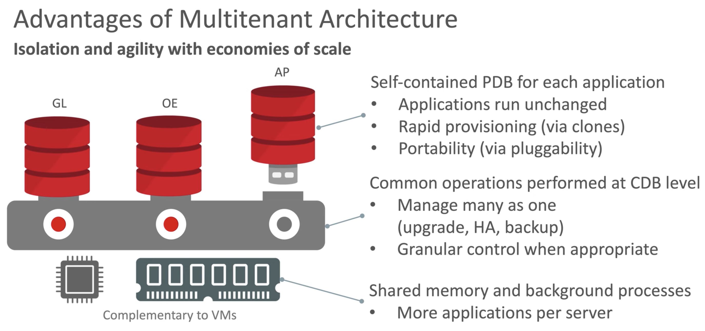

# Lab Introduction and Overview #

## Introduction ##
From the point of view of an application, the PDB is the database, in which applications run unchanged. PDBs can be very rapidly provisioned and a pluggable database is a portable database, which makes it very easy to move around, perhaps for load balancing or migration to the Cloud.

Many PDBs can be plugged into a single Multitenant Container Database or CDB. From the point of view of a DBA, the CDB is the database. Common operations are performed at the level of the CDB enabling the DBA to manage many as one for operations such as upgrade, configuration of high availability, taking backups; but we retain granular control when appropriate. This ability to manage many as one enables tremendous gains in operational efficiency.

Enormous gains in technical efficiency are enabled by a shared technical infrastructure. There’s a single set of background processes and a single, global memory area – the SGA – shared by all the PDBs. The result is that with this architecture we can consolidate more applications per server.



## Lab Assumptions ##
- Each participant has been provided a username and password to the tenancy c4u03.
- Each participant has completed the Environment Setup lab.
- Each participant has created an OCI compute instance using the database template.

There are two container databases running:
- CDB1 running on port 1523
- CDB2 running on port 1524

## Lab Setup ##

All the scripts for this lab are located in the /u01/app/oracle/labs/multitenant folder.  

1.  To access the scripts, secure shell into the OCI compute instance.

2.  Change to the ssh directory and ssh into your instance.  The public IP address can be found by going to Compute -> Instance.

    ````
    cd .ssh
    ssh -i optionskey opc@<your public ip address>
    ls
    sudo su - oracle
    cd /home/oracle/labs/multitenant
    ````