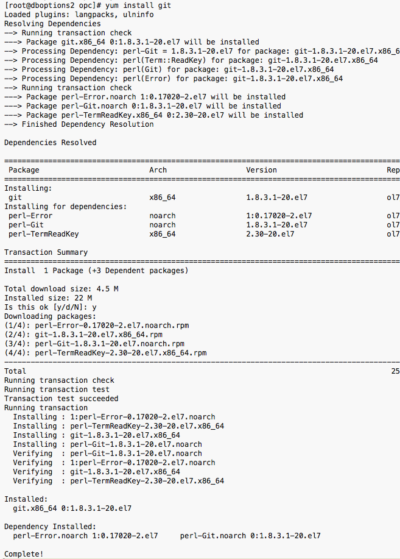
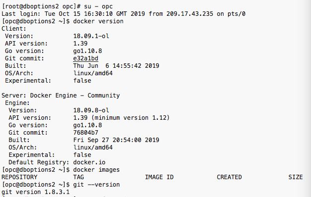

  

# Lab Introduction #
Docker is a set of platform-as-a-service products that use OS-level virtualization to deliver software in packages called containers. Containers are isolated from one another and bundle their own software, libraries and configuration files; they can communicate with each other through well-defined channels.

Lab courtesy of NATD Solution Engineering Team.  See original [here](http://go.oracle.com/docker).

# Lab Sections #
1. Install Docker and GIT
2. Basic concepts of Docker, container architectures and functions
3. Deploy a fully containerized version of an application

# Lab Assumptions #
- Each participant has been provided a username and password to the tenancy c4u03
- Each participant has completed the Environment Setup lab.


## Section 1: Create a Docker Account

The docker account is needed 
## Section 1: Login to your Oracle Cloud Account 

1.  From any browser go to www.oracle.com to access the Oracle Cloud.

    

2. Click the icon in the upper right corner.  Click on **Sign in to Cloud** at the bottom of the drop down.  *NOTE:  Do NOT click the Sign-In button, this will take you to Single Sign-On, not the Oracle Cloud*

        

3. Enter your **Cloud Account Name**: `c4u03` in the input field and click the **My Services** button. 

      

4.  Enter your **Username** and **Password** in the input fields and click **Sign In**.

     


## Section 2 - Lab Setup

1. Login to the ssh terminal

    ````
    ssh -i optionskey opc@<your ip address>
    ````
2. Install the Docker engine, enable it to start on re-boot, grant docker privledges to the opc user and finally install GIT.  Press Y to download.

    ````
    sudo -s
    yum install docker-engine
    usermod -aG docker opc
    systemctl enable docker
    systemctl start docker
    ````
    

     

3. Next, we are going to install git

    ````
    yum install git
    ````
     

4.  Verify the version

    ````
    su - opc
    docker version
    docker images
    git --version
    ````
     

5.  Place your server in permissive mode

    ````
    setenforce 0
    sestatus
    ````
     

6. Exit out of root and verify you are the `opc` user

    ````
    exit
    whoami
    `````

## Section 2:  Docker Basic Concepts

1.  Check the version of docker

    ````
    docker version
    ````
     

2.  Start your application, restclient, in docker on port 8002 in json format.  


    ````
    docker ps
    docker run -d -it --rm --name restclient -p=8002:8002 -e DS='json' wvbirder/restclient
    ````

    - "-d" flag runs the container in the background
    - "-it" flags instructs docker to allocate a pseudo-TTY connected to the container’s stdin, creating an interactive bash capable shell in the container (which we will use in a moment when we connect into the container)
    - "-h" We give the container a hostname "oracledb-ao" to make it easier to start/stop/remove, reference from other containers, etc
    - "-p" We map port 8002 from within the container to the same ports on the HOST for accessibility from outside of the container's private subnet (typically 172.17.0.0/16). This allows the container to be accessed from the HOST, for example. The default port for Oracle's tns listener is on port 1521 and port 5600 is used for HTTP access to Enterprise Manager Express
    - "--name" The name of the container will be "restclient"
    - "-v" This maps the directory where you downloaded the restclient setup.
     

3.  Find the public IP address of your instances.  Conpute -> Instance

     

     

     

4.  Open up a browser on your laptop and go to your public URL on port 8002.  Go to http://<YOUR IP ADDRESS>:8002/products. Depending on whether you have a JSON formatter, you should see the products in your application, in RAW or FORMATTED format.

     

        

5.  The `restclient` container was started earlier with the -rm option.  This means when stopping it will remove ALL allocated resources.  The `ps` command with the `-a` option shows the status of ALL containers that are running.  As you can see, there are no containers running.

    ````
    docker stop restclient
    docker ps -a
    ````
    

 6.  Let's start another container on your compute instance's 18002 port.  Type the following command:

        ````
        docker run -d -it --rm --name restclient -p=18002:8002 -e DS='json' wvbirder/restclient
        docker ps -a
        ```` 
        

7.  Go back to your browser and change the port to 18002.

    

## Docker Networking Basics

Now that you know how to start, stop and relocate a container, let's see how to get information abot the network.

1.  Inspect the network bridge that docker created for you out of the box.  This shows network information about all the containers running on the default bridge. We see that our restclient container is assigned IP Address 172.17.0.2. You can ping that address from the Host server.

    ````
    docker network inspect bridge
    ````
    

2.  Ping that address for your restclient container from your compute instance.

    ````
    ping 172.17.0.2 -c3
    ````
4.  Stop your restclient container

    ````
    docker stop restclient
    ````  

## Create 


   

