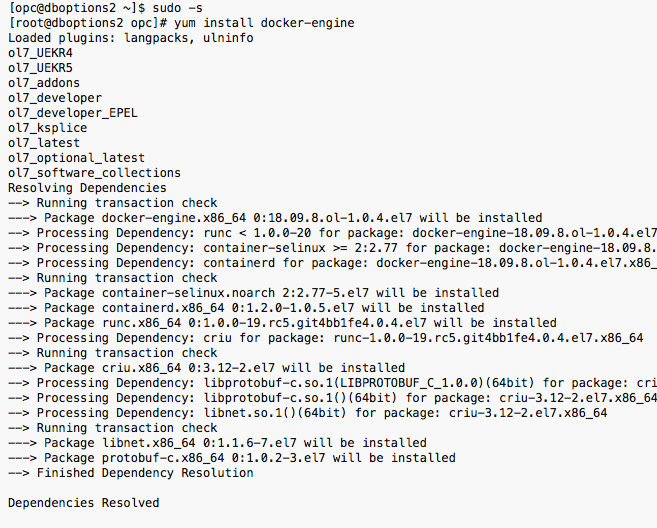
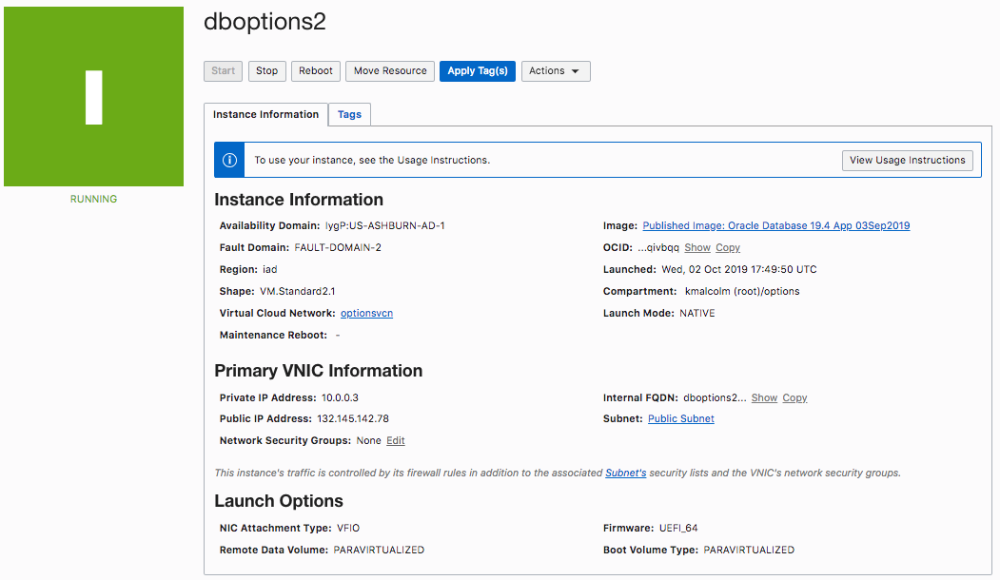
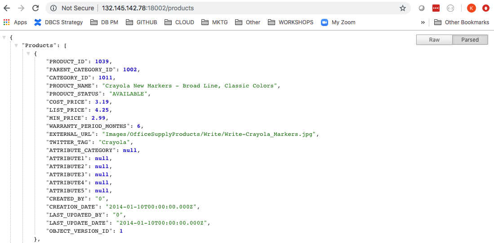

  

# Lab Introduction #
Docker is a set of platform-as-a-service products that use OS-level virtualization to deliver software in packages called containers. Containers are isolated from one another and bundle their own software, libraries and configuration files; they can communicate with each other through well-defined channels.

Lab courtesy of NATD Solution Engineering Team.  See original [here](http://go.oracle.com/docker).

# Lab Sections #
1. Install Docker and GIT
2. Basic concepts of Docker, container architectures and functions
3. Deploy a fully containerized version of an application

# Lab Assumptions #
- Each participant has been provided a username and password to the tenancy c4u03
- Each participant has completed the Environment Setup lab.


## Section 1: Login to your Oracle Cloud Account 

1.  From any browser go to www.oracle.com to access the Oracle Cloud.

    

2. Click the icon in the upper right corner.  Click on **Sign in to Cloud** at the bottom of the drop down.  *NOTE:  Do NOT click the Sign-In button, this will take you to Single Sign-On, not the Oracle Cloud*

        

3. Enter your **Cloud Account Name**: `c4u03` in the input field and click the **My Services** button. 

      

4.  Enter your **Username** and **Password** in the input fields and click **Sign In**.

     


## Section 2 - Lab Setup

1. Login to the ssh terminal

    ````
    ssh -i optionskey opc@<your ip address>
    ````
2. Install the Docker engine, enable it to start on re-boot, grant docker privledges to the opc user and finally install GIT.  Press Y to download.

    ````
    sudo -s
    yum install docker-engine
    usermod -aG docker opc
    systemctl enable docker
    systemctl start docker
    ````
    

     

3. Next, we are going to install git

    ````
    yum install git
    ````
     

4.  Verify the version

    ````
    su - opc
    docker version
    docker images
    git --version
    ````
     

5.  Place your server in permissive mode

    ````
    setenforce 0
    sestatus
    ````
     

6. Exit out of root and verify you are the `opc` user

    ````
    exit
    whoami
    `````

## Section 2:  Docker Basic Concepts

1.  Check the version of docker

    ````
    docker version
    ````
     

2.  Place your server in permissive mode

    ````
    docker ps
    docker run -d -it --rm --name restclient -p=8002:8002 -e DS='json' wvbirder/restclient
    ````
     

3.  Find the public IP address of your instances.  Conpute -> Instance

     

     

     

4.  Open up a browser on your laptop and go to your public URL on port 8002.  Go to http://<YOUR IP ADDRESS>:8002/products. Depending on whether you have a JSON formatter, you should see the products in your application, in RAW or FORMATTED format.

     

        

5.  The restclient container was started earlier   


   

