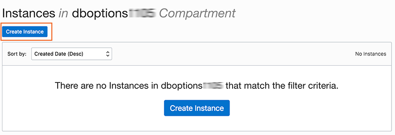
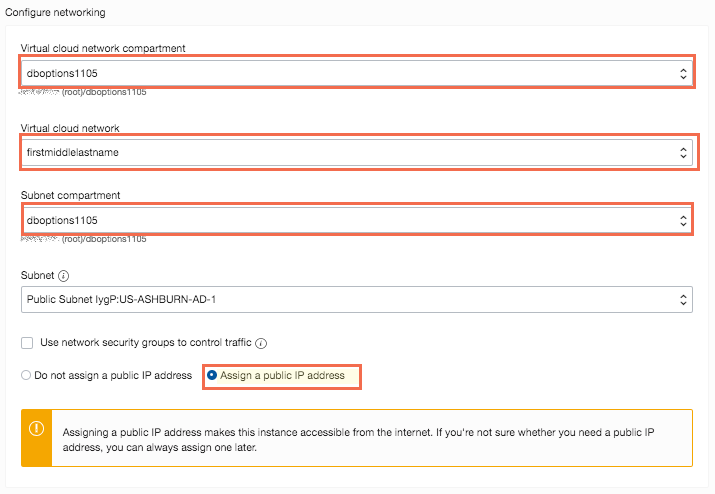
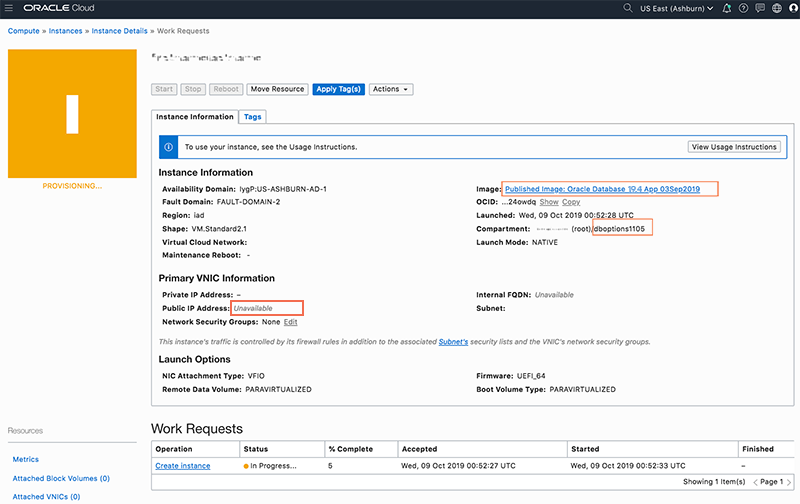
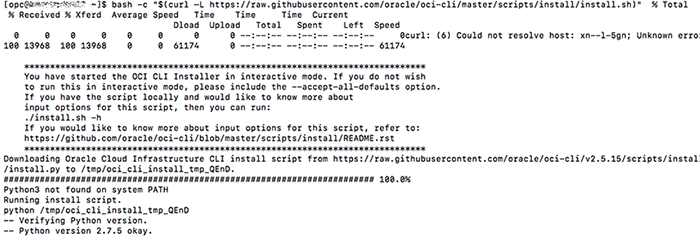
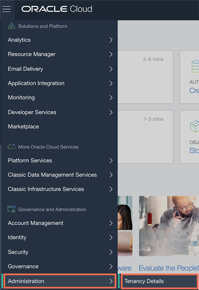

  

# Introduction #
This lab will show you how to login to the cloud and setup a DBCS VM running the Oracle 19c database.   In this lab, you will create an OCI Compute instance using the [Oracle Database](https://cloudmarketplace.oracle.com/marketplace/en_US/listing/47726045) image in the Oracle Cloud Marketplace. 

The Oracle Cloud Marketplace is an online store dedicated to marketing cloud business apps and professional services offered by Oracle and it's cloud partners. 

The automation is driven by the same framework that powers the decade long Oracle VM Templates for Oracle Database which have thousands of downloads and customers using it.

Automatically deploy a fully functional Database environment by leveraging a simple cloud-config script.  The deployment allows for basic customization of the environment, further configurations, like adding extra disks and NICs, is possible post-deployment.


# Lab Assumptions #
- For PM sponsored roadshows, each participant has been provided an account on the c4u03
- For self service, the user has access to a cloud account or free-tier account

## Table of Contents 

- [Section 1: Login to the Oracle Cloud](#section-1---login)
- [Section 2: Create an SSH key pair](#section-2---setup-ssh)
- [Section 3: Download Marketplace initialization zip and Script Zip File](#section-3---oracle-marketplace)
- [Section 4:  Create Networking](#section-4---networking)
- [Section 5:  Create Compute Instance](#section-5---dbcs-vm)
- [Section 6:  Setup OCI CLI and Extract Lab Scripts](#section-6---lab-prep)


## Section 1 - Login
----------------

1.  From any browser go to www.oracle.com to access the Oracle Cloud.

    

2. Click the icon in the upper right corner.  Click on **Sign in to Cloud** at the bottom of the drop down.  *NOTE:  Do NOT click the Sign-In button, this will take you to Single Sign-On, not the Oracle Cloud*

        

3. Enter your **Cloud Account Name**.  If you are in a PM sponsored roadshow, this will be provided by the PM team.  Otherwise, use your free-tier tenancy name or oracle cloud account. 

      

4.  If your username/password was provided follow step 4a.  If your password leverages single sign on, proceed to step 4b.

    4A. USERNAME/PASSWORD
    
    Enter your **Username** and **Password** in the input fields and click **Sign In**.

     

    **NOTE**: You will likely be prompted to change the temporary password listed in the welcome email. In that case, enter the new password in the password field.

    4B. SINGLE SIGN ON
    
    Select the **Sign in with Oracle SSO** link and enter your SSO credentials.

5. Once you successfully login, you will be presented with the Oracle Cloud homepage.  
   

[Back to Top](#table-of-contents)

## Section 2 - Setup SSH

### MAC Users ###
1.  Open up a terminal and type the following commands.  When prompted for a passphrase click **enter**. *Do not enter a passphrase*.
     ````
    cd ~
    cd .ssh
    ssh-keygen -b 2048 -t rsa -f optionskey
    ````

     

3.  Inspect your .ssh directory.  You should see two files.  optionskey and optionskey.pub.  Copy the contents of the pub file `optionskey.pub` into notepad.  Your key file should be one line. You will need this to access your instance in Section 5.  

    ````
    ls -l .ssh
    more optionskey.pub
    ````
     


### For Windows: Using GitBash or Windows Subsystem for Linux (WSL) ### 

1. Open the terminal tool of your choice
1. Type ssh-keygen -f optionskey at the prompt.
1. Press enter to accept default values
1. Do not assign a password for this exercise. (note you should always assign an SSH key password in production)
1. Type cat ~/.ssh/optionskey.pub to retrieve your public key. Save it for future use.

### For Windows: Using PuttyGen ### 

1. Open PuttyGen
1. Click the [Generate] button

     
1. Move your mouse around the screen randomly until the progress bar reaches 100%
1. Click the [Save private key] button. Name the file `options`.  This file will not have an extension.

     
1. Save the public key (displayed in the text field) by copying it to the clipboard and saving it manually to a new text file. Name the file id_rsa.pub

1. Note: Sometimes PuttyGen does not save the public key in the correct format. The text string displayed in the window is correct so we just copy/paste.


[Back to Top](#table-of-contents)

## Section 3 - Oracle Marketplace
1.  Click  [here](https://community.oracle.com/servlet/JiveServlet/download/1031489-6-462822/oci-db-app-script-examples.zip) to download the marketplace initialization zip file.

2.  Save it to your downloads folder

3.  Unzip the folder and locate the StandardIO-db.cloud-init file. You will need this later when you create your compute instance.

  

4. Click [here]() to download the scripts.zip file.  You will ftp this file to your newly created compute instance later in this lab.


[Back to Top](#table-of-contents)

## Section 4 - Networking

If you are in a PM sponsored Roadshow, skip this step.  Your VCN has already been created for you.

1. Go back to your browser to the tab with your logged in access to the Oracle Cloud.  Click on the hamburger menu.
 

2.  Click on **Networking** -> **Virtual Cloud Networks** to create a virtual cloud network for your instance.  Each particpant will create their own network, unless noted otherwise.

3.  Before creating the VCN, it is important you **select the correct compartment**.  If you are in a roadshow, you will be provided with the correct compartment.  In this example we will use `dboptions1105`.  **Do NOT select the root compartment**.
  
    
  
4.  Click the **Create Virtual Cloud Network** button.
    

5.  Enter the following:
    - **Name**:  Enter the name for your vcn 
    - **Create in Compartment**: Select the dboptions compartment
    - Select the 2nd radio button - **Create VCN PLUS RELATED RESOURCES**
    - Uncheck USE DNS HOSTNAMES IN THIS VCN
    - Accept all other defaults

    Scroll down and click the Create button.  Click Close after your VCN is created.
  
    

6. Now that the VCN is created, let's create the security list.  Click on the **Security Lists** link under the **Resources** section on the left hand side of your browser.

    

7.  Click on the **Default Security List**.

    

7. Click **Add Ingress Rules** to create rules for a future lab.

    

8.  Update the SOURCE CIDR and the PORT RANGE and click the **+Additional Ingress Rules** button.

    ````
    SOURCE RANGE: 0.0.0.0/0
    PORT RANGE:  8085
    ````
    

9.  Under Ingress Rule 2, add the same SOURCE CIDR value and a destination port range of 9080.  Repeat step 8 and 9 until you've added 10 rules.

    ````
    SOURCE RANGE: 0.0.0.0/0
    PORT RANGE:  9080

    SOURCE RANGE: 0.0.0.0/0
    PORT RANGE:  8002

    SOURCE RANGE: 0.0.0.0/0
    PORT RANGE:  18002

    SOURCE RANGE: 0.0.0.0/0
    PORT RANGE:  5600

    SOURCE RANGE: 0.0.0.0/0
    PORT RANGE:  443

    SOURCE RANGE: 0.0.0.0/0
    PORT RANGE:  7803

    SOURCE RANGE: 0.0.0.0/0
    PORT RANGE:  4903

    SOURCE RANGE: 0.0.0.0/0
    PORT RANGE:  7301

    SOURCE RANGE: 0.0.0.0/0
    PORT RANGE:  9851
    ````
      

10. Click **Add Ingress Rules** to proceed.  Once complete, the Ingress Rules should have the following port ranges.  Double check these values to ensure they are correct.

     

[Back to Top](#table-of-contents)

## Section 5 - DBCS-VM

1. Go back to your browser to the tab with your logged in access to the Oracle Cloud.  Click on the hamburger menu.
 

2. Select **Compute** -> **Instances** to go to the screen to create your instance.
  

3. Before creating the instance, it is important you **select the correct compartment**.  If you are in a PM sponsored roadshow, this will be provided. In this example we will use `dboptions1105`.  **Do NOT select the root compartment**.


4. Click the **Create Instance** button.


5. Enter your desired instance name.  Use your first initial, middle initial and last name.  *Do NOT enter kdmishra, that is for example purposes only*.  Click on the **Change Image Source** button.


6.  This is the OCI Marketplace library of images.  In the **Browse All Images** screen, click on **Oracle Images** to select your Oracle Database Marketplace image.  Select the **Oracle Database** app name in the marketplace.  Click the down arrow to select the database version.


6.  Select the 19c version.  18c is selected by default.  Ensure you choose 19c.


    

7. Scroll down, accept the standards and conditions and click the **Select Image** button.


8. Click **Show Shape, Network, Storage Options** if it is hidden.  Accept the defaults unless instructed otherwise.  The instance type we are creating is a **Virtual Machine**.  Keep the selected shape.


9. In a PM sponsored roadshow, instances will need to be balanced across Availability Domains (ADs).

9.  In the Configure networking section, select the dboptions compartment and the VCN you created in an earlier section. If you are in a Roadshow, use the VCN precreated by Product Management.  Click on the radio button to **Assign a public address**.  This is important.  DO NOT OVERLOOK THIS STEP!!!!!!!


10.  Paste your SSH key pub file contents from the earlier section into this window.  It should be one line.


11.  Click on **Show Advanced Options**.  Choose the dboptions compartment.  Click on the Choose cloud-init script file.  Click **Choose File**.


12.  Select the extracted StandardIO-cloud-init script.  There are multiple scripts dependent on the shape you want.  For this lab, we will be using the Standard IO.


18.  Once your script is loaded, you should see it in the window.


19.  Click the **Create** button to create your instance.  Your instance will be in provisioning state.  Verify that you chose the correct image.  In a few minutes you can also verify that you have a public IP address.  View the Work Requests at the bottom, this will show where your instance is.


20.  Locate your **public IP address** and jot it down. 

[Back to Top](#table-of-contents)

## Section 6 - Lab Prep
-------------------
Now that you have your instance, once you are able to ssh in, you will set up the OCI Command Line interface.
1.  Open up a terminal (MAC) or cygwin emulator as the opc user

    ````
    ssh -i ~/.ssh/optionskey opc@<Your Compute Instance Public IP Address>
    ````

2.  Download the Oracle Cloud CLI install script.  

    ````
    bash -c "$(curl –L https://raw.githubusercontent.com/oracle/oci-cli/master/scripts/install/install.sh)"
    ````
     

3.  Accept all the defaults.  This will install packages like python, configparser, etc.  Install the cx_Oracle package when prompted to install additional packages.  We will need this later for the python lab.  Enter Y to update your $PATH and enable shell/tab completion.

     

     

4.  Once you verify installation is successful, verify the install by running the oci command with the -v option.  This will tell you the version of oci installed (2.6.10 and later)

    ````
    oci -v
    ````
4.  Now that the binaries are complete.  You will need to provide your tenancy id and user id.  Go back to your browswer and click on the hamburger menu.
     

5.  Click Administration -> Tenancy Details

     

6.  Click **Show** to show the full tenancy id.  This is the unique identifier for the tenancy you are working in.  Click **Copy** and copy that to your notepad.

      

7.  Repeat the same steps for your user.  To locate your user details go to Identity-> Users.  Note the region in which you are working (upper left corner)

     

8.  Go back to your terminal window and run the oci setup commands to complete configuration.  Accept the default location when prompted.  Enter *Y* to generate an RSA key pair (no passphrase needed).

    ````
    oci setup config
    ````
     

9. Go to the hidden .oci directory and examime the public key file and the config file.

    ````
    cd /home/opc/.oci
    cat config
    cat /home/opc/.oci/oci_api_key_public.pem
    ````
     

     

10.  Congrats! You have command line access to your newly created instance!  Now we need to download the files for our public bucket.
    ````
    cd /home/opc/
    oci os object list -bn DBOptions
    oci os object bulk-download -bn DBOptions --download-dir /home/opc
    ````
    
 

  

12.  Now that your files are downloaded, run the scripts to import the schemas to prepare for the In-Memory lab.

    ````
    cd /home/opc/
    unzip labs.zip
    cd labs
    ./setupinmem.sh &
    ./setupmultitenant.sh &
    ````

[Back to Top](#table-of-contents)