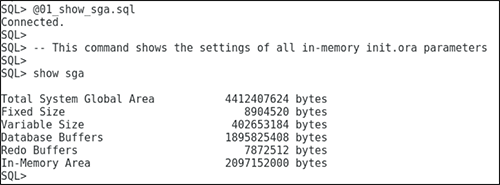
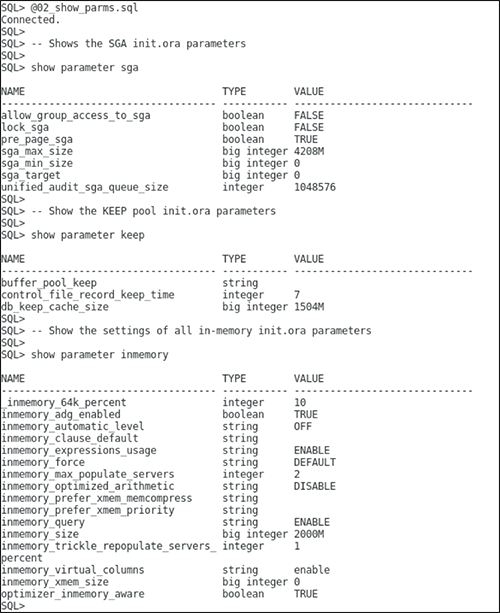
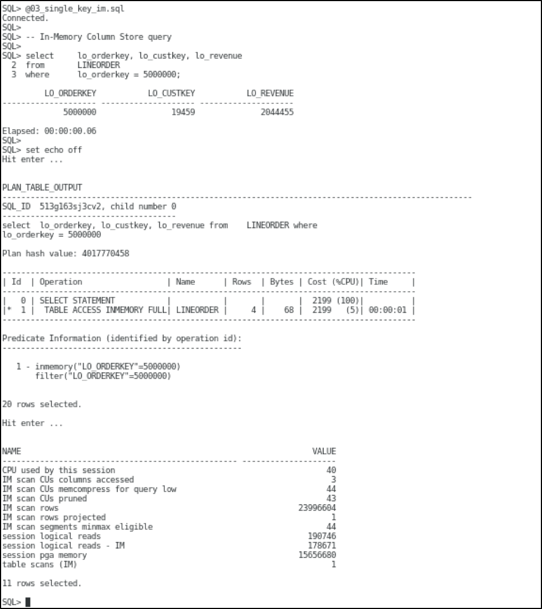
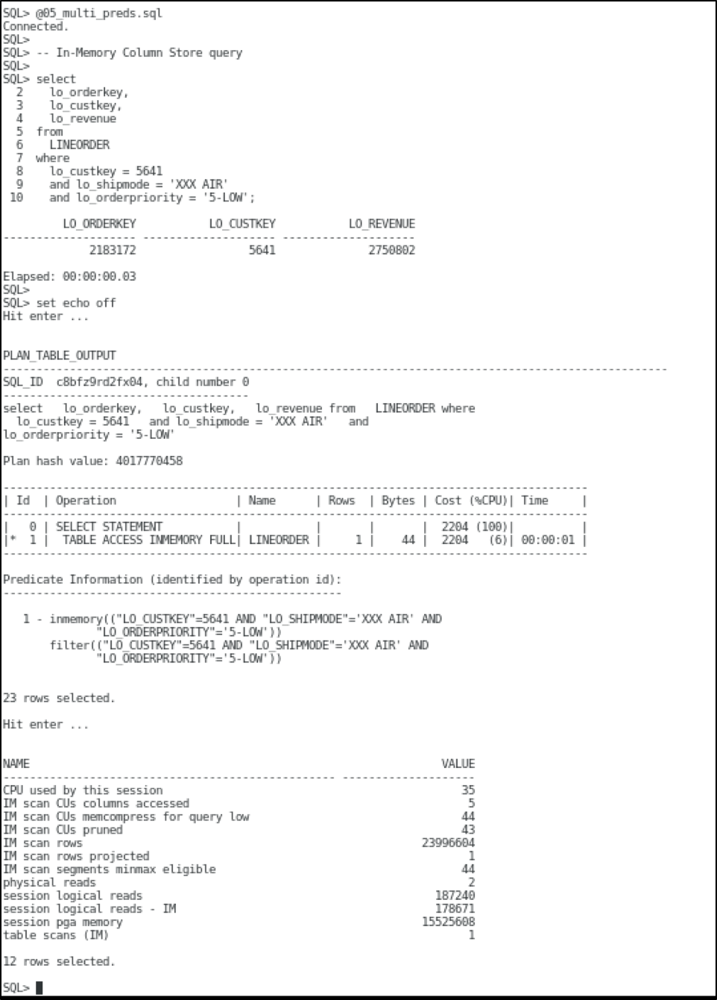
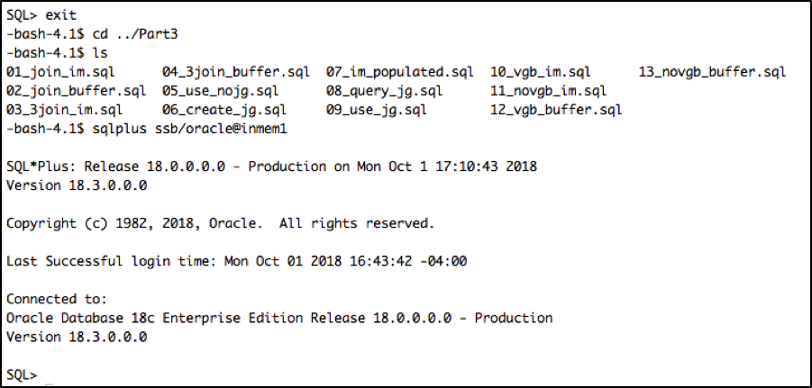
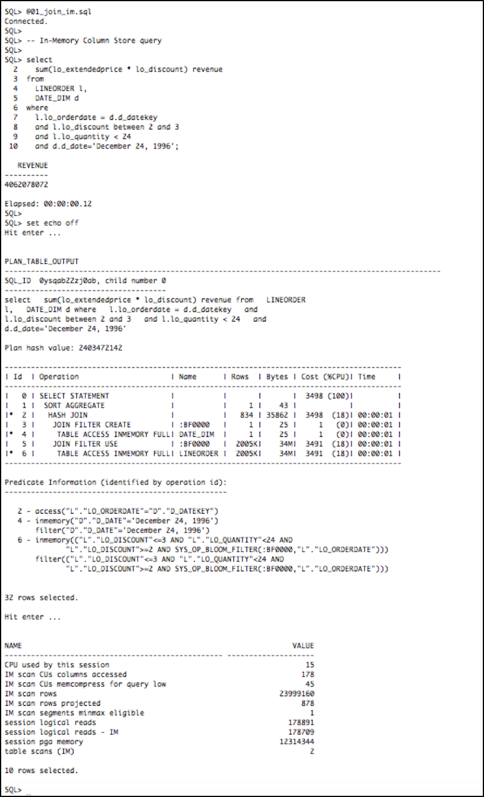
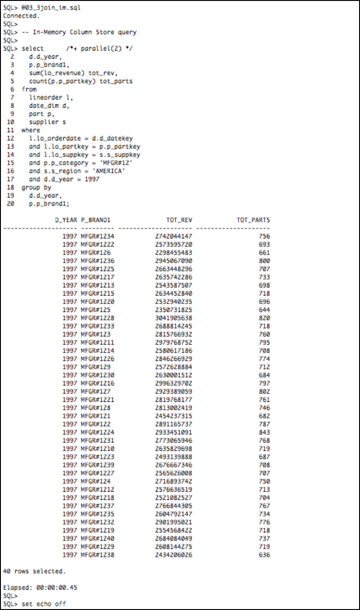
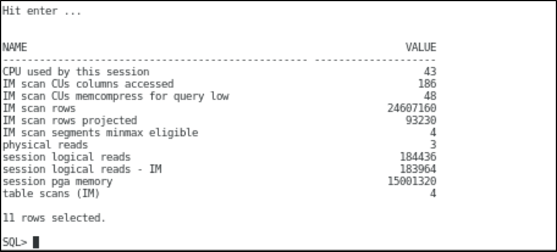

  

## Table of Contents 

- [Lab Introduction](#lab-introduction)
- [Lab Sections](#lab-sections)
- [Section 1: Login to Your Oracle Cloud Account](#section-1:-login-to-your-oracle-cloud-account)
- [Section 2:  Lab Setup](#section-2:-lab-setup)
- [Section 3:  Monitoring the In-Memory Column Store](#section-3:-monitoring-the-in-memory-column-store)
- [Section 4:  Querying the In-Memory Column Store](#section-4:-querying-the-in-memory-column-store)
- [Conclusion](#conclusion)


## Lab Introduction 
Oracle Database In-Memory provides a unique dual-format architecture that enables tables to be simultaneously represented in memory using traditional row format and a new in-memory column format. The Oracle SQL Optimizer automatically routes analytic queries to the column format and OLTP queries to the row format, transparently delivering best-of-both-worlds performance. Oracle Database automatically maintains full transactional consistency between the row and the column formats, just as it maintains consistency between tables and indexes today. The new column format is a pure in-memory format and is not persistent on disk, so there are no additional storage costs or storage synchronization issues.

This series of labs will guide you through the basic configuration of the In-Memory column store (IM
column store) as well as illustrating the benefits of its key features:
- In-Memory Column Store Tables
- In-Memory Joins and Aggregation
- In-Memory High Performance Features

We must first establish a performance baseline. It would be unfair to compare the IM column store with disk accessed data. After all, memory access in general is 10X faster than disk. In order to do a fair comparison the performance baseline will be established using the row store memory space, the buffer cache. For the purposes of the lab, the database environment has been sized so that the tables used will fit in both the row store and the column store. The idea is that no buffer accesses will cause physical I/O.

The following 5 table star schema will be used during the lab and has been created for you under the ssb user.

  

[Back to Top](#table-of-contents)

## Lab Sections 
1. Login to the Oracle Cloud
3. Monitoring the In-Memory Column Store
2. Querying In-Memory Column Store Tables
4. In-Memory Joins and Aggregations

## Lab Assumptions ##
- Each participant has been provided a username and password to the tenancy c4u03
- Each participant has completed the Environment Setup lab.


## Section 1: Login to Your Oracle Cloud Account
-----------------------------

1.  From any browser go to www.oracle.com to access the Oracle Cloud.

    

2. Click the icon in the upper right corner.  Click on **Sign in to Cloud** at the bottom of the drop down.  *NOTE:  Do NOT click the Sign-In button, this will take you to Single Sign-On, not the Oracle Cloud*

        

3. Enter your **Cloud Account Name**: `c4u03` in the input field and click the **My Services** button. 

      

4.  Enter your **Username** and **Password** in the input fields and click **Sign In**.

     

[Back to Top](#table-of-contents)

## Section 2 - Lab Setup
----------------------

All the scripts for this lab are located in the /home/oracle/inmemory/scripts folder.  

1.  To access the scripts, secure shell into the OCI compute instance.

2.  Change to the ssh directory and ssh into your instance.  The public IP address can be found by going to Compute -> Instance.

    ````
    cd .ssh
    ssh -i optionskey opc@<your public ip address>
    ls
    ````

     

[Back to Top](#table-of-contents)    

## Section 3 - Monitoring the In-Memory Column Store
---------------------------

The focus of this section is to show how the lab environment is setup and to demonstrate how to monitor the different parts of the In-Memory column store (IM column store). 

The Oracle environment is already set up so sqlplus can be invoked directly from the shell environment. Since the lab is being run in a pdb called orcl you must supply this alias when connecting to the ssb account. 

1.  Login to the orclpdb as the SSB user.  
    ````
    sqlplus ssb/Ora_DB4U@localhost:1521/orclpdb
    show sga
    ````

2.  Login to the instance using sqlplus and type the how sga command to see how much memory is in the database.  

    ````
    set numwidth 20
    show sga
    ````
   
      

2.  The size of the In-Memory column store is controlled by the init.ora parameter INMEMORY_SIZE.  Show the SGA, KEEP and INMEMORY parameters.  You can also run @02_show_parms.sql. 2GB of SGA has been assigned to the IM column store.

    ````
    show parameter sga
    show parameter keep
    show parameter inmemory 
    ````
      

3.  The In-Memory area is sub-divided into two pools:  a 1MB pool used to store actual column formatted data populated into memory and a 64K pool to store metadata about the objects populated into the IM columns store.  V$INMEMORY_AREA shows the total IM column store.  

    ````
    select * from v$inmemory_area;
    ````
      

4.  To check if the IM column store is populated with objects run the 05_im_segments.sql script 

    ````
    select v.owner, v.segment_name name, v.populate_status status from v$im_segments v; 
    ````
        

5.  To add objects to the IM column store the inmemory attribute needs to be set.  This tells the Oracle DB these tables should be populated into the IM column store.  

    ````
    ALTER TABLE lineorder INMEMORY;
    ALTER TABLE part INMEMORY;
    ALTER TABLE customer INMEMORY;
    ALTER TABLE supplier INMEMORY;
    ALTER TABLE date_dim INMEMORY;
    ````
        

6.  Run the `@07_im_attibutes.sql script`.  THis looks at the USER_TABLES view and queries attributes of tables in the SSB schema.

    ````
    set lines 200;
    
    SELECT table_name, cache, buffer_pool, compression, compress_for, inmemory,
        inmemory_priority, inmemory_distribute, inmemory_compression 
    FROM   user_tables; 
    ````
        

By default the IM column store is only populated when the object is accessed.

7.  Let's populate the store with some simple queries with the @08_im_start_pop.sql

    ````
    SELECT /*+ full(d)  noparallel (d )*/ Count(*)   FROM   date_dim d; 
    SELECT /*+ full(s)  noparallel (s )*/ Count(*)   FROM   supplier s; 
    SELECT /*+ full(p)  noparallel (p )*/ Count(*)   FROM   part p; 
    SELECT /*+ full(c)  noparallel (c )*/ Count(*)   FROM   customer c; 
    SELECT /*+ full(lo)  noparallel (lo )*/ Count(*) FROM   lineorder lo; 
    ````
      

8. Background processes are populating these segments into the IM column store.  To monitor this, you could query the V$IM_SEGMENTS.  Once the data population is complete, the BYTES_NOT_POPULATED should be 0 for each segment.

    ````
    SELECT v.owner, v.segment_name name, 
       v.populate_status status, v.bytes on_disk_size,
       v.inmemory_size in_mem_size, v.bytes_not_populated
    FROM   v$im_segments v;
    ````

      

9.  Now let's check the total space usage

    ````
    select * from v$inmemory_area;
    ````

     

## Section 4 - Querying the In-Memory Column Store

Now that you’ve gotten familiar with the IM column store let’s look at the benefits of using it. You will execute a series of queries against the large fact table LINEORDER, in both the buffer cache and the IM column store, to demonstrate the different ways the IM column store can improve query performance above and beyond the basic performance benefits of accessing data in memory only.

1. Exit your previous sqlplus session and change to the Part2 directory to access the SQL files for this part of the Lab.

    ````
    cd ../Part2
    ls
    sqlplus /nolog
    ````

     

2.  We want to know  `What is the most expensive order we have received to date`?  There are no indexes or views setup for this.  So the execution plan will be to do a full table scan of the LINEORDER table.

    ````
    SELECT
    max(lo_ordtotalprice) most_expensive_order,
    sum(lo_quantity) total_items
    FROM
    lineorder;
    ````

     

3.  We want to know  `What is the most expensive order we have received to date`?  There are no indexes or views setup for this.  So the execution plan will be to do a full table scan of the LINEORDER table.

    ````
    SELECT
    max(lo_ordtotalprice) most_expensive_order,
    sum(lo_quantity) total_items
    FROM
    lineorder;
    ````

    Note thta the execution plan shows a TABLE ACCESS INMEMORY FULL of the LINEORDER table.  44 IMCUs (In-Memory Column Units) and 23+ million rows were scanned in the IM column store.
     

4.  Let's run the same query now and disable the IM column store.  You will use a hint called `NO_INMEMORY`.  

    ````
    SELECT  /*+ NO_INMEMORY */
    max(lo_ordtotalprice) most_expensive_order,
    sum(lo_quantity) total_items
    FROM
    lineorder;
    ````

    Both queries executed extremely quickly but the performance against the IM column store was significantly faster, why?  
     

    Answer:  The IM column store only has to scan two columns - lo_ordtotalprice and lo_quantity - while the row store has to scan all of the columns in each of the rows until it reaches the lo_ordtotalprice and lo_quantity columns. The IM column store also benefits from the fact that the data is compressed so the volume of data scanned is much less.  Finally, the column format requires no additional manipulation for SIMD vector processing (Single Instruction processing Multiple Data values). Instead of evaluating each entry in the column one at a time, SIMD vector processing allows a set of column values to be evaluated together in a single CPU instruction.

    Your query did a full table scan of the LINEORDER table, that session statistic shows that we scanned 23 million rows from the IM column store. Notice that in our second buffer cache query that statistic does not show up. Only one statistic shows up, "IM scan segments disk" with a value of 1. This means that even though the LINEORDER table is in the IM column store (IM segment) we actually scan that segment outside of the column store either from disk or the buffer cache. In this case it’s from the buffer cache, as the query did no physical IO.

5.  Let's look for a specific order in the LINEORDER table based on the order key.  Typically, a full table scan is not an efficient execution plan when looking for a specific entry in a table.  

    ````
    SELECT lo_orderkey, lo_custkey, lo_revenue 
    FROM   lineorder 
    WHERE  lo_orderkey = 5000000; 

    ````

    Notice that of the 44 IMCUs populated, 43 of them were "pruned". This means that thanks to In-Memory storage indexes that Oracle was able to skip over almost all of the data because the filter predicate was outside the values for the In-Memory storage index on all but one of the IMCUs for the lo_orderkey column.

         

6.  Think a single index on lo_orderkey would give the same performance as the IM column store?  There is an invisible index already created on the lo_orderkey column of the LINEORDER table. By using the parameter OPTIMIZER_USE_INVISIBLE_INDEXES we can compare the performance of the IM column store and the index.

    ````
    @04_index_comparison.sql

    ````

        

7.  Analytical queries have more than one equality WHERE clause predicate. What happens when there are multiple single column predicates on a table? Traditionally you would create a multi-column index. Can storage indexes compete with that?  

    Let’s change our query to look for a specific line item in an order and monitor the session statistics:

    To execute the query against the IM column store type:
    ````
    SELECT lo_orderkey, lo_custkey, lo_revenue 
    FROM   lineorder 
    WHERE  lo_custkey = 5641 
    AND    lo_shipmode = 'XXX AIR'
    AND    lo_orderpriority = '5-LOW';                                                
    ````
    You can see that the In-Memory storage index is still used. In fact, we are able to use multiple storage indexes together in a similar manner to how Oracle Database can combine multiple bitmap indexes.

       
    Stopped on page 26

## Section 5 - In-Memory Joins and Aggregation

Up until now we have been focused on queries that scan only one table, the LINEORDER table. Let’s broaden the scope of our investigation to include joins and parallel execution. This section executes a series of queries that begin with a single join between the  fact table, LINEORDER, and a dimension table and works up to a 5 table join. The queries will be executed in both the buffer cache and the column store, to demonstrate the different ways the column store can improve query performance above and beyond the basic performance benefits of scanning data in a columnar format.

1. Exit your previous sqlplus session and change to the Part2 directory to access the SQL files for this part of the Lab.

    ````
    cd ../Part3
    ls
    sqlplus ssb/oracle@inmem1
    ````

     

2.  Join the LINEORDER and DATE_DIM tables in a "What If" style query that calculates the amount of revenue increase that would have resulted from eliminating certain company-wide discounts in a given percentage range for products shipped on a given day (Christmas eve 1996).

    ````
    SELECT SUM(lo_extendedprice * lo_discount) revenue 
    FROM   lineorder l, 
       date_dim d 
    WHERE  l.lo_orderdate = d.d_datekey 
    AND    l.lo_discount BETWEEN 2 AND 3 
    AND    l.lo_quantity < 24 
    AND    d.d_date='December 24, 1996'; 
    ````

     

3. Let’s try a more complex query that encompasses three joins and an aggregation to our query. This time our query will compare the revenue for different product classes, from suppliers in a certain region for the year 1997. This query returns more data than the others we have looked at so far so we will use parallel execution to speed up the elapsed times so we don’t need to wait too long for the results.  

    ````
    SELECT d.d_year, p.p_brand1,SUM(lo_revenue) rev 
    FROM   lineorder l, 
        date_dim d, 
        part p, 
        supplier s 
    WHERE  l.lo_orderdate = d.d_datekey 
    AND    l.lo_partkey = p.p_partkey 
    AND    l.lo_suppkey = s.s_suppkey 
    AND    p.p_category = 'MFGR#12' 
    AND    s.s_region   = 'AMERICA'
    AND    d.d_year     = 1997 
    GROUP  BY d.d_year,p.p_brand1; 
    ````

     

     

     


    Stopped at pg 49

    
## Conclusion

Part 3 saw our performance comparison expanded to queries with both joins and aggregations. You had an opportunity to see just how efficiently a join, that is automatically converted to a Bloom filter, can be executed on the IM column store. 

You also got to see just how sophisticated the Oracle Optimizer has become over the last 30 plus years,  when it used a combination of complex query transformations to find the optimal execution plan for a star query. 

Finally you got an opportunity to see the new vector group by transformation in action. This new transformation allows us to not only convert joins to filters applied as part of a scan but also to complete all aggregation operations as part of the scan of the fact table.
