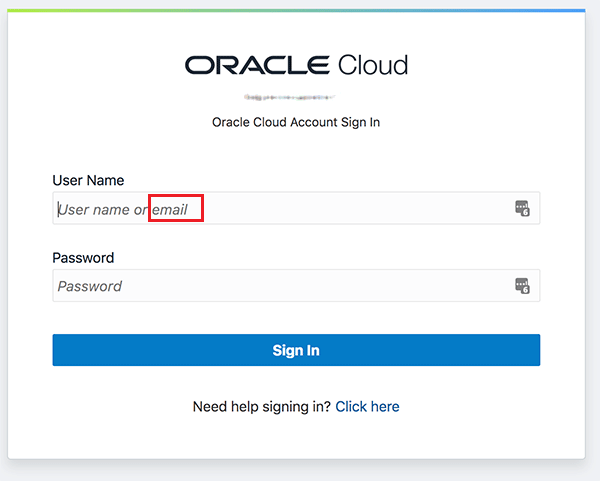

  

# Lab Introduction #
Oracle Database In-Memory provides a unique dual-format architecture that enables tables to be simultaneously represented in memory using traditional row format and a new in-memory column format. The Oracle SQL Optimizer automatically routes analytic queries to the column format and OLTP queries to the row format, transparently delivering best-of-both-worlds performance. Oracle Database automatically maintains full transactional consistency between the row and the column formats, just as it maintains consistency between tables and indexes today. The new column format is a pure in-memory format and is not persistent on disk, so there are no additional storage costs or storage synchronization issues.

This series of labs will guide you through the basic configuration of the In-Memory column store (IM
column store) as well as illustrating the benefits of its key features:
- In-Memory Column Store Tables
- In-Memory Joins and Aggregation
- In-Memory High Performance Features

We must first establish a performance baseline. It would be unfair to compare the IM column store with disk accessed data. After all, memory access in general is 10X faster than disk. In order to do a fair comparison the performance baseline will be established using the row store memory space, the buffer cache. For the purposes of the lab, the database environment has been sized so that the tables used will fit in both the row store and the column store. The idea is that no buffer accesses will cause physical I/O.

The following 5 table star schema will be used during the lab and has been created for you under the ssb user.

  


# Lab Sections #
1. Login to the Oracle Cloud
3. Monitoring the In-Memory Column Store
2. Querying In-Memory Column Store Tables
4. In-Memory Joins and Aggregations

# Lab Assumptions #
- Each participant has been provided a username and password to the tenancy c4u03
- Each participant has completed the Environment Setup lab.


## Section 1: Login to your Oracle Cloud Account

1.  From any browser go to www.oracle.com to access the Oracle Cloud.

    

2. Click the icon in the upper right corner.  Click on **Sign in to Cloud** at the bottom of the drop down.  *NOTE:  Do NOT click the Sign-In button, this will take you to Single Sign-On, not the Oracle Cloud*

        

3. Enter your **Cloud Account Name**: `c4u03` in the input field and click the **My Services** button. 

      

4.  Enter your **Username** and **Password** in the input fields and click **Sign In**.

     


## Section 2 - Lab Setup

All the scripts for this lab are located in the /home/oracle/inmemory/scripts folder.  

1.  To access the scripts, secure shell into the OCI compute instance.

2.  Change to the ssh directory and ssh into your instance.  THe public IP address can be found by going to Compute -> Instance.

    ````
    cd .ssh
    ssh -i optionskey opc@<your public ip address>
    ls
    ````

     

## Section 3 - Monitoring the In-Memory Column Store

The focus of part 1 of this lab is to show how the lab environment is setup and to demonstrate how to monitor the different parts of the In-Memory column store (IM column store). 

The Oracle environment is already set up so sqlplus can be invoked directly from the shell environment. Since the lab is being run in a pdb called orcl you must supply this alias when connecting to the ssb account. 

1.  Sqlplus into the instance and show sga to see how much memory is in the database.  You can also run @01_show_sga.sql

    ````
    sqlplus ssb/oracle@orcl
    show sga
    ````
   
    

2.  The size of the In-Memory column store is controlled by the init.ora parameter INMEMORY_SIZE.  Show the SGA, KEEP and INMEMORY parameters.  You can also run @02_show_parms.sql. 2GB of SGA has been assigned to the IM column store.

    ````
    show parameter sga
    show parameter keep
    show parameter inmemory 
    ````
    

3.  The In-Memory area is sub-divided into two pools:  a 1MB pool used to store actual column formatted data populated into memory and a 64K pool to store metadata about the objects populated into the IM columns store.  V$INMEMORY_AREA shows the total IM column store.  

    ````
    select * from v$inmemory_area;
    ````
    


