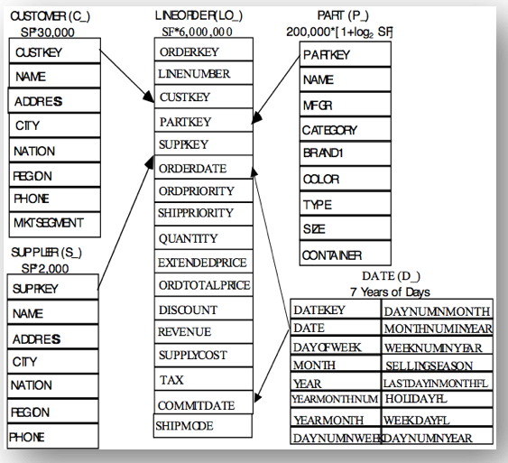
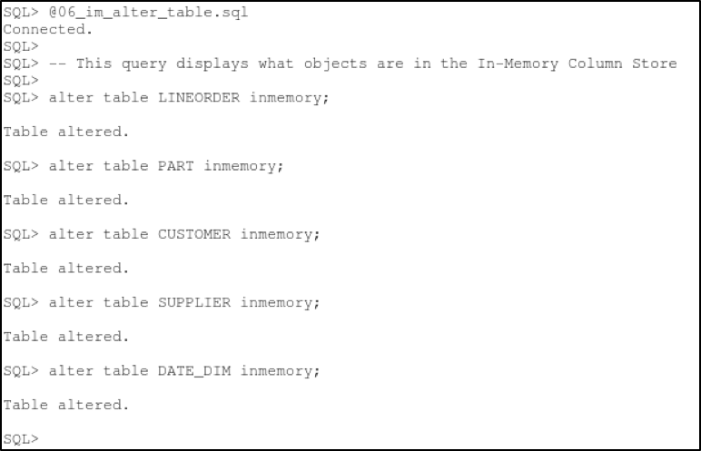
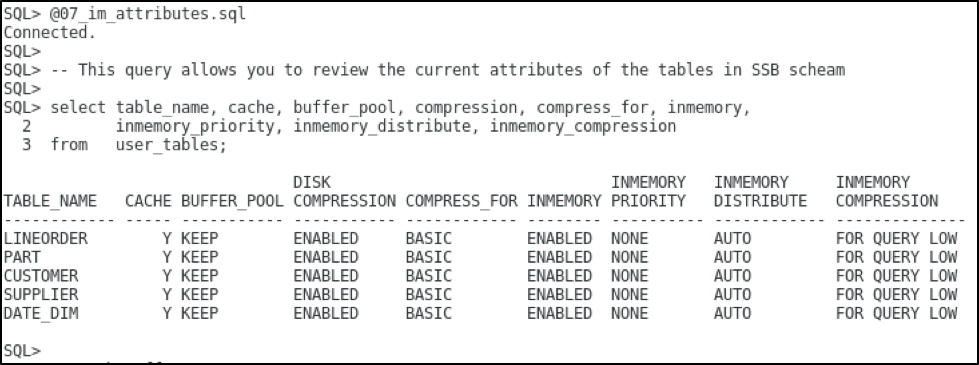
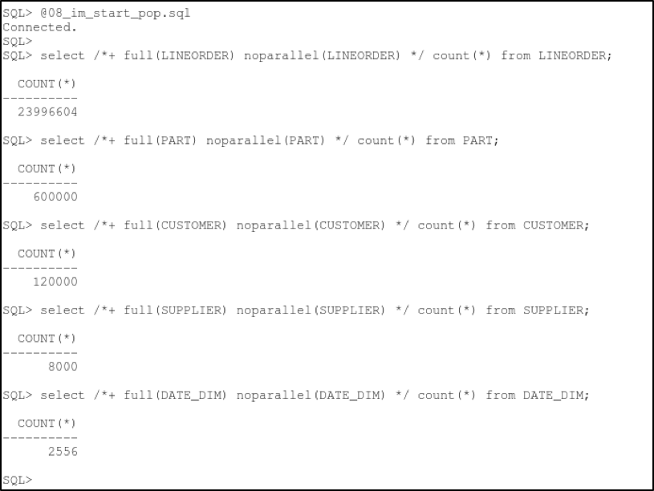
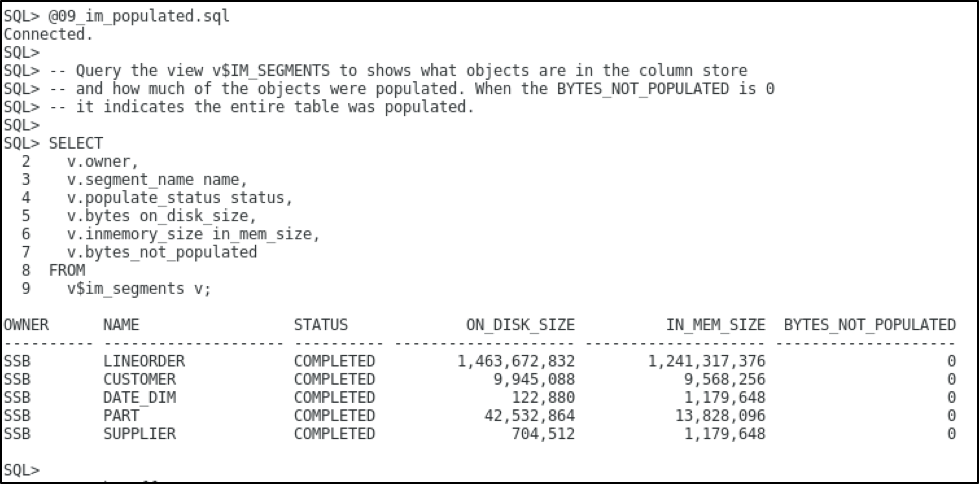
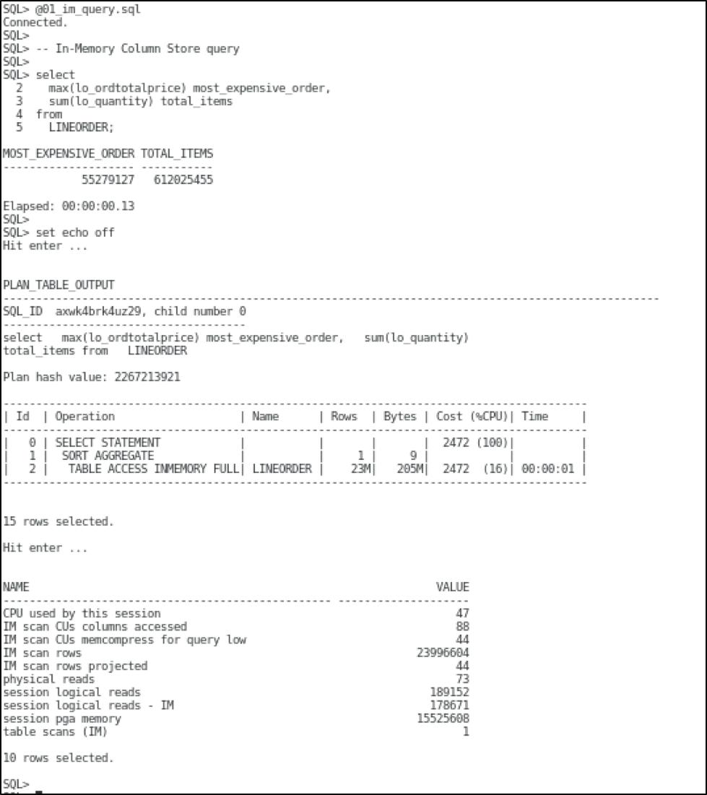
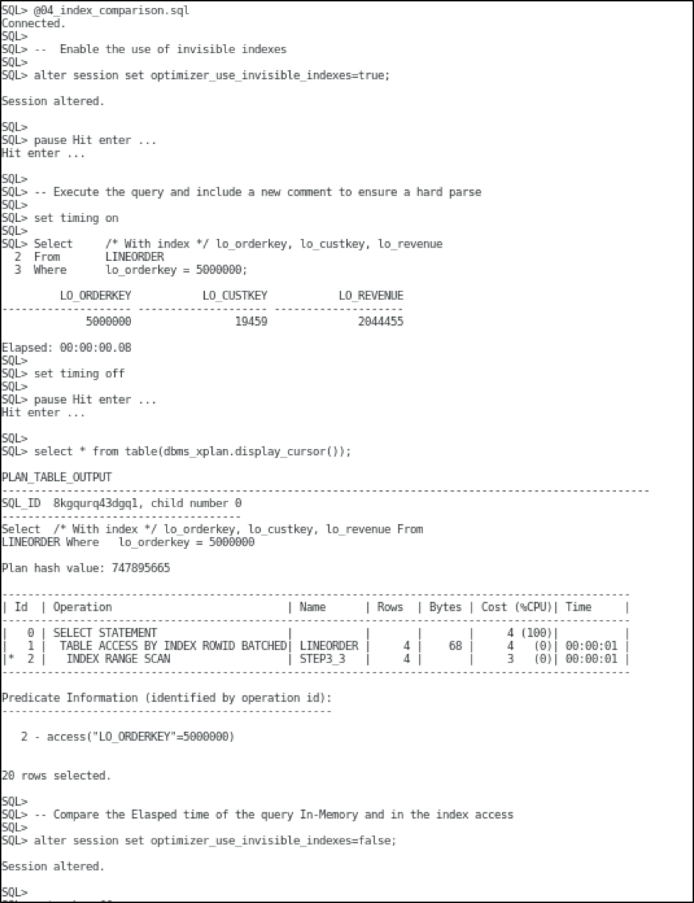
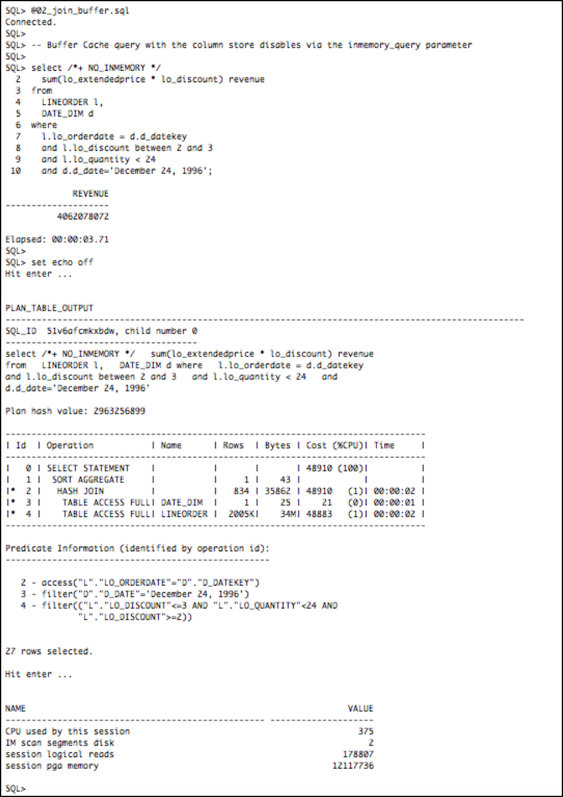
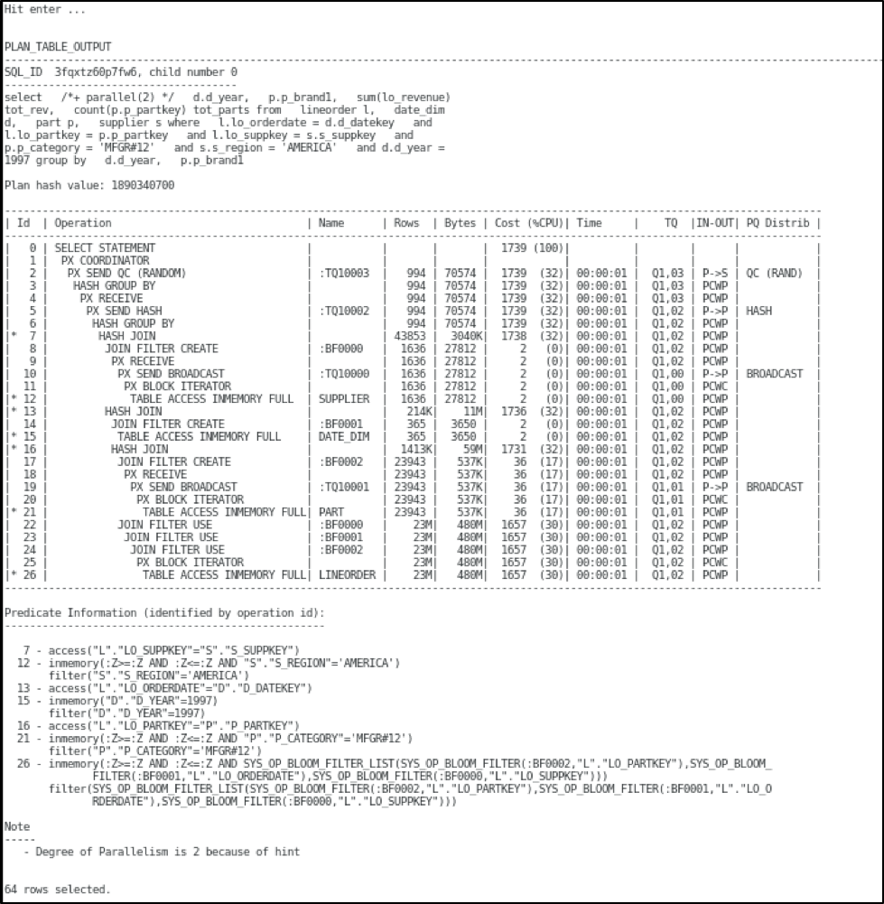

  

## Table of Contents 
- [Introduction](#introduction)
- [Lab Assumptions](#lab-assumptions)
- [Section 1-Logging In and Enabling In-Memory](#section-1-logging-in-and-enabling-in-memory)
- [Section 2-Enabling In-Memory](#section-2-enabling-in-memory)
- [Section 3-Querying the In-Memory Column Store](#section-3-querying-the-in-memory-column-store)
- [Section 4-In-Memory Joins and Aggregation](#section-4-in-memory-joins-and-aggregation)
- [Conclusion](#conclusion)


## Introduction 
Oracle Database In-Memory provides a unique dual-format architecture that enables tables to be simultaneously represented in memory using traditional row format and a new in-memory column format. The Oracle SQL Optimizer automatically routes analytic queries to the column format and OLTP queries to the row format, transparently delivering best-of-both-worlds performance. Oracle Database automatically maintains full transactional consistency between the row and the column formats, just as it maintains consistency between tables and indexes today. The new column format is a pure in-memory format and is not persistent on disk, so there are no additional storage costs or storage synchronization issues.

This series of labs will guide you through the basic configuration of the In-Memory column store (IM
column store) as well as illustrating the benefits of its key features:
- In-Memory Column Store Tables
- In-Memory Joins and Aggregation
- In-Memory High Performance Features

We must first establish a performance baseline. It would be unfair to compare the IM column store with disk accessed data. After all, memory access in general is 10X faster than disk. In order to do a fair comparison the performance baseline will be established using the row store memory space, the buffer cache. For the purposes of the lab, the database environment has been sized so that the tables used will fit in both the row store and the column store. The idea is that no buffer accesses will cause physical I/O.

In the previous lab, you imported a 5 table star schema, ssb, into your compute instance.  This will be used during this lab.

  

[Back to Top](#table-of-contents)

## Lab Assumptions
- Each participant has been provided a username and password to the c4u03 tenancy
- Each participant has completed the [Environment Setup](environment-setup-c4u03.md) lab successfully and imported the SSB schema

## Section 1-Logging In and Enabling In-Memory
1.  Open up a terminal and ssh into the instance you created in the Environment Setup Lab.  The public IP address can be found by going to Compute -> Instance.

    ````
    cd ~
    ssh -i ./ssh/optionskey opc@<your public ip address>
    ````
2.  All scripts for this lab are stored in the labs/inmemory folder and are run as the oracle user.  Let's navigate there now.  We recommend you type the commands to get a feel for working with In-Memory. But we will also give you the scripts to run as an alternative option.

    ````
    sudo su - oracle
    cd ~/labs/inmemory
    ls
    ````

3.  In-Memory is integrated into Oracle Database 12c and higher.  The IM column store is not enabled by default, but can be easily enabled via a few steps.  Before you enable it, let's take a look at the default configuration. 

    ````
    . oraenv
    ORCL
    sqlplus / as sysdba
    show sga;
    show parameter inmemory; 
    show parameter keep
    ````
    Notice that the SGA is made up of Fixed Size, Variable Size, Database Buffers and Redo.  There is no In-Memory in the SGA.  Let's enable it.

     

4.  Enter the commands to enable In-Memory.  The database will need to be restarted for the changes to take effect.
    ````
    alter system set inmemory_size=1G scope=spfile;
    shutdown immediate;
    startup;
    ````

5.  Now let's take a look at the parameters.
    ````
    show sga;
    show parameter inmemory; 
    show parameter keep
    ````
[Back to Top](#table-of-contents)

## Section 2-Enabling In-Memory

The Oracle environment is already set up so sqlplus can be invoked directly from the shell environment. Since the lab is being run in a pdb called orclpdb you must supply this alias when connecting to the ssb account. 

1.  Login to the pdb as the SSB user.  
    ````
    cd /home/oracle/labs/inmemory
    sqlplus ssb/Ora_DB4U@localhost:1521/orclpdb
    set pages 9999
    set lines 200
    ````

3.  The In-Memory area is sub-divided into two pools:  a 1MB pool used to store actual column formatted data populated into memory and a 64K pool to store metadata about the objects populated into the IM columns store.  V$INMEMORY_AREA shows the total IM column store.  The COLUMN command in these scripts identifies the column you want to format and the model you want to use.  Alternative script:  @Part1/03_im_usage.sql

    ````
    column alloc_bytes format 999,999,999,999;
    column used_bytes format 999,999,999,999;
    column populate_status format a15;
    --QUERY

    select * from v$inmemory_area;
    ````
      

4.  To check if the IM column store is populated with objects run the 05_im_segments.sql script. Alternative script:  @Part1/05_im_segments.sql 

    ````
    column name format a30
    column owner format a20
    --QUERY

    select v.owner, v.segment_name name, v.populate_status status from v$im_segments v; 
    ````
        

5.  To add objects to the IM column store the inmemory attribute needs to be set.  This tells the Oracle DB these tables should be populated into the IM column store.  

    ````
    ALTER TABLE lineorder INMEMORY;
    ALTER TABLE part INMEMORY;
    ALTER TABLE customer INMEMORY;
    ALTER TABLE supplier INMEMORY;
    ALTER TABLE date_dim INMEMORY;
    ````
        

6.  This looks at the USER_TABLES view and queries attributes of tables in the SSB schema.  Alternative script:  @Part1/07_im_attributes.sql

    ````
    set pages 999
    column table_name format a12
    column cache format a5;
    column buffer_pool format a11;
    column compression heading 'DISK|COMPRESSION' format a11;
    column compress_for format a12;
    column INMEMORY_PRIORITY heading 'INMEMORY|PRIORITY' format a10;
    column INMEMORY_DISTRIBUTE heading 'INMEMORY|DISTRIBUTE' format a12;
    column INMEMORY_COMPRESSION heading 'INMEMORY|COMPRESSION' format a14;
    --QUERY    

    SELECT table_name, cache, buffer_pool, compression, compress_for, inmemory,
        inmemory_priority, inmemory_distribute, inmemory_compression 
    FROM   user_tables; 
    ````
        

By default the IM column store is only populated when the object is accessed.

7.  Let's populate the store with some simple queries.

    ````
    SELECT /*+ full(d)  noparallel (d )*/ Count(*)   FROM   date_dim d; 
    SELECT /*+ full(s)  noparallel (s )*/ Count(*)   FROM   supplier s; 
    SELECT /*+ full(p)  noparallel (p )*/ Count(*)   FROM   part p; 
    SELECT /*+ full(c)  noparallel (c )*/ Count(*)   FROM   customer c; 
    SELECT /*+ full(lo)  noparallel (lo )*/ Count(*) FROM   lineorder lo; 
    ````
      

8. Background processes are populating these segments into the IM column store.  To monitor this, you could query the V$IM_SEGMENTS.  Once the data population is complete, the BYTES_NOT_POPULATED should be 0 for each segment.  Alternative script:  @Part1/09_im_populated.sql 

    ````
    column name format a20
    column owner format a15
    column segment_name format a30
    column populate_status format a20
    column bytes_in_mem format 999,999,999,999,999
    column bytes_not_populated format 999,999,999,999,999
    --QUERY

    SELECT v.owner, v.segment_name name, v.populate_status status, v.bytes bytes_in_mem, v.bytes_not_populated 
    FROM v$im_segments v;
    ````

      

9.  Now let's check the total space usage

    ````
    column alloc_bytes format 999,999,999,999;
    column used_bytes      format 999,999,999,999;
    column populate_status format a15;
    select * from v$inmemory_area;
    exit
    ````

     

In this section you saw that the IM column store is configured by setting the initialization parameter INMEMORY_SIZE. The IM column store is a new static pool in the SGA, and once allocated it can be resized dynamically, but it is not managed by either of the automatic SGA memory features. 

You also had an opportunity to populate and view objects in the IM column store and to see how much memory they use. In this Lab we populated about 1471 MB of compressed data into the  IM column store, and the LINEORDER table is the largest of the tables populated with over 23 million rows.  Remember that the population speed depends on the CPU capacity of the system as the in-memory data compression is a CPU intensive operation. The more CPU and processes you allocate the faster the populations will occur.

Finally you got to see how to determine if the objects were fully populated and how much space was being consumed in the IM column store.


[Back to Top](#table-of-contents)    


## Section 3-Querying the In-Memory Column Store

Now that you’ve gotten familiar with the IM column store let’s look at the benefits of using it. You will execute a series of queries against the large fact table LINEORDER, in both the buffer cache and the IM column store, to demonstrate the different ways the IM column store can improve query performance above and beyond the basic performance benefits of accessing data in memory only.

1.  Let's switch to the Part2 folder and log back in to the PDB. 
    ````
    cd /home/oracle/labs/inmemory/Part2
    sqlplus ssb/Ora_DB4U@localhost:1521/orclpdb
    set pages 9999
    set lines 100
    ````

2.  Let's begin with a simple query:  `What is the most expensive order we have received to date`?  There are no indexes or views setup for this.  So the execution plan will be to do a full table scan of the LINEORDER table.  Note the elapsed time. 

    ````
    set timing on

    SELECT
    max(lo_ordtotalprice) most_expensive_order,
    sum(lo_quantity) total_items
    FROM lineorder;

    set timing off

    select * from table(dbms_xplan.display_cursor());

    @../imstats.sql
    ````
    The execution plan shows that we performed a TABLE ACCESS INMEMORY FULL of the LINEORDER table.

     

3.  To execute the same query against the buffer cache you will need to disable the IM column store via a hint called NO_INMEMORY. If you don't, the Optimizer will try to access the data in the IM column store when the execution plan is a full table scan. 

    ````
    set timing on

    select /*+ NO_INMEMORY */
    max(lo_ordtotalprice) most_expensive_order,
    sum(lo_quantity) total_items
    from
    LINEORDER;

    set timing off

    select * from table(dbms_xplan.display_cursor());

    @../imstats.sql
    ````

    As you can see the query executed extremely quickly in both cases because this is purely an in-memory scan. However, the performance of the query against the IM column store was significantly faster than the traditional buffer cache - why?  

    The IM column store only has to scan two columns - lo_ordtotalprice and lo_quantity - while the row store has to scan all of the columns in each of the rows until it reaches the lo_ordtotalprice and lo_quantity columns. The IM column store also benefits from the fact that the data is compressed so the volume of data scanned is much less.  Finally, the column format requires no additional manipulation for SIMD vector processing (Single Instruction processing Multiple Data values). Instead of evaluating each entry in the column one at a time, SIMD vector processing allows a set of column values to be evaluated together in a single CPU instruction.

     

    In order to confirm that the IM column store was used, we need to examine the session level statistics. Notice that in the INMEMORY run several IM statistics show up (for this lab we have only displayed some key statistics – there are lots more!). The only one we are really interested in now is the "IM scan CUs columns accessed" which has been highlighted.

    IM scan rows: Number of rows in scanned In-Memory Compression Units (IMCUs).

    As our query did a full table scan of the LINEORDER table, that session statistic shows that we scanned 23 million rows from the IM column store. Notice that in our second buffer cache query that statistic does not show up. Only one statistic shows up, "IM scan segments disk" with a value of 1. This means that even though the LINEORDER table is in the IM column store (IM segment) we actually scan that segment outside of the column store either from disk or the buffer cache. In this case it’s from the buffer cache, as the query did no physical IO.

3.  Let's look for a specific order in the LINEORDER table based on the order key.  Typically, a full table scan is not an efficient execution plan when looking for a specific entry in a table.  

    ````
    set timing on

    select  lo_orderkey, lo_custkey, lo_revenue
    from    LINEORDER
    where   lo_orderkey = 5000000;

    set timing off

    select * from table(dbms_xplan.display_cursor());

    @../imstats.sql
    ````
   
     

4.  Think indexing lo_orderkey would provide the same performance as the IM column store? There is an invisible index already created on the lo_orderkey column of the LINEORDER table. By using the parameter OPTIMIZER_USE_INVISIBLE_INDEXES we can compare the performance of the IM column store and the index. Recall that we ran the script 03_single_key_im.sql in Step 3 to see the IM column store performance.  Run the script to see how well the index performs.  

    ````
    alter session set optimizer_use_invisible_indexes=true;

    set timing on

    Select  /* With index */ lo_orderkey, lo_custkey, lo_revenue
    From    LINEORDER
    Where   lo_orderkey = 5000000;

    set timing off

    select * from table(dbms_xplan.display_cursor());

    @../imstats.sql
    ````

     

7.  Analytical queries have more than one equality WHERE clause predicate. What happens when there are multiple single column predicates on a table? Traditionally you would create a multi-column index. Can storage indexes compete with that?  

    Let’s change our query to look for a specific line item in an order and monitor the session statistics:

    To execute the query against the IM column store type:

    ````
    set timing on

    select
    lo_orderkey,
    lo_custkey,
    lo_revenue
    from
    LINEORDER
    where
    lo_custkey = 5641
    and lo_shipmode = 'XXX AIR'
    and lo_orderpriority = '5-LOW';

    set timing off

    select * from table(dbms_xplan.display_cursor());

    @../imstats.sql

    exit
    ````
    You can see that the In-Memory storage index is still used. In fact, we are able to use multiple storage indexes together in a similar manner to how Oracle Database can combine multiple bitmap indexes.

       

In this section you had an opportunity to try out Oracle’s in-memory performance claims with queries that run against a table with over 23 million rows (i.e. LINEORDER), which resides in both the IM column store and the buffer cache. From a very simple aggregation, to more complex queries with multiple columns and filter predicates, the IM column store was able to out perform the buffer cache queries. Remember both sets of queries are executing completely within memory, so that’s quite an impressive improvement.

These significant performance improvements are possible because of Oracle’s unique in-memory columnar format that allows us to only scan the columns we need and to take full advantage of SIMD vector processiong. We also got a little help from our new in-memory storage indexes, which allow us to prune out unnecessary data. Remember that with the IM column store, every column has a storage index that is automatically maintained for you.

[Back to Top](#table-of-contents)

## Section 4-In-Memory Joins and Aggregation

Up until now we have been focused on queries that scan only one table, the LINEORDER table. Let’s broaden the scope of our investigation to include joins and parallel execution. This section executes a series of queries that begin with a single join between the  fact table, LINEORDER, and a dimension table and works up to a 5 table join. The queries will be executed in both the buffer cache and the column store, to demonstrate the different ways the column store can improve query performance above and beyond the basic performance benefits of scanning data in a columnar format.

1.  Let's switch to the Part2 folder and log back in to the PDB. 
    ````
    cd /home/oracle/labs/inmemory/Part3
    sqlplus ssb/Ora_DB4U@localhost:1521/orclpdb
    set pages 9999
    set lines 100
    ````

     

2.  Join the LINEORDER and DATE_DIM tables in a "What If" style query that calculates the amount of revenue increase that would have resulted from eliminating certain company-wide discounts in a given percentage range for products shipped on a given day (Christmas eve 1996).  In the first one, execute it against the IM column store.  Alternative script:  `@01_join_im.sql`

    ````
    set timing on

    SELECT SUM(lo_extendedprice * lo_discount) revenue 
    FROM   lineorder l, 
    date_dim d 
    WHERE  l.lo_orderdate = d.d_datekey 
    AND    l.lo_discount BETWEEN 2 AND 3 
    AND    l.lo_quantity < 24 
    AND    d.d_date='December 24, 1996'; 

    set timing off

    select * from table(dbms_xplan.display_cursor());

    @../imstats.sql
    ````
    The IM column store has no problem executing a query with a join because it is able to take advantage of Bloom Filters.  It’s easy to identify Bloom filters in the execution plan. They will appear in two places, at creation time and again when it is applied. Look at the highlighted areas in the plan above. You can also see what join condition was used to build the Bloom filter by looking at the predicate information under the plan. 

     

2.  Let's run against the buffer cache now.   Alternative script:  `@02_join_buffer.sql`

    ````
    set timing on

    select /*+ NO_INMEMORY */
    sum(lo_extendedprice * lo_discount) revenue
    from
    LINEORDER l,
    DATE_DIM d
    where
    l.lo_orderdate = d.d_datekey
    and l.lo_discount between 2 and 3
    and l.lo_quantity < 24
    and d.d_date='December 24, 1996';

    set timing off

    select * from table(dbms_xplan.display_cursor());

    @../imstats.sql
    ````

     

3. Let’s try a more complex query that encompasses three joins and an aggregation to our query. This time our query will compare the revenue for different product classes, from suppliers in a certain region for the year 1997. This query returns more data than the others we have looked at so far so we will use parallel execution to speed up the elapsed times so we don’t need to wait too long for the results.  

    ````
    set timing on

    SELECT d.d_year, p.p_brand1,SUM(lo_revenue) rev 
    FROM   lineorder l, 
        date_dim d, 
        part p, 
        supplier s 
    WHERE  l.lo_orderdate = d.d_datekey 
    AND    l.lo_partkey = p.p_partkey 
    AND    l.lo_suppkey = s.s_suppkey 
    AND    p.p_category = 'MFGR#12' 
    AND    s.s_region   = 'AMERICA'
    AND    d.d_year     = 1997 
    GROUP  BY d.d_year,p.p_brand1; 

    set timing off

    select * from table(dbms_xplan.display_cursor());

    @../imstats.sql
    ````

     

     

    The IM column store continues to out-perform the buffer cache query but what is more interesting is the execution plan for this query: 

     

    In this case, we noted above that three join filters have been created and applied to the scan of the LINEORDER table, one for the join to DATE_DIM table, one for the join to the PART table, and one for the join to the SUPPLIER table. How is Oracle able to apply three join filters when the join order would imply that the LINEORDER is accessed before the SUPPLER table? 

    This is where Oracle’s 30 plus years of database innovation kick in. By embedding the column store into Oracle Database we can take advantage of all of the optimizations that have been added to the database. In this case, the Optimizer has switched from its typically left deep tree to create a right deep tree using an optimization called ‘swap_join_inputs’. Your instructor can explain ‘swap_join_inputs’ in more depth should you wish to know more. What this means for the IM column store is that we are able to generate multiple Bloom filters before we scan the necessary columns for the fact table, meaning we are able to benefit by eliminating rows during the scan rather than waiting for the join to do it. 

    
## Conclusion

Section 4 saw our performance comparison expanded to queries with both joins and aggregations. You had an opportunity to see just how efficiently a join, that is automatically converted to a Bloom filter, can be executed on the IM column store. 

You also got to see just how sophisticated the Oracle Optimizer has become over the last 30 plus years,  when it used a combination of complex query transformations to find the optimal execution plan for a star query. 

Oracle Database adds in-memory database functionality to existing databases, and transparently accelerates analytics by orders of magnitude while simultaneously speeding up mixed-workload OLTP. With Oracle Database In-Memory, users get immediate answers to business questions that previously took hours. 


