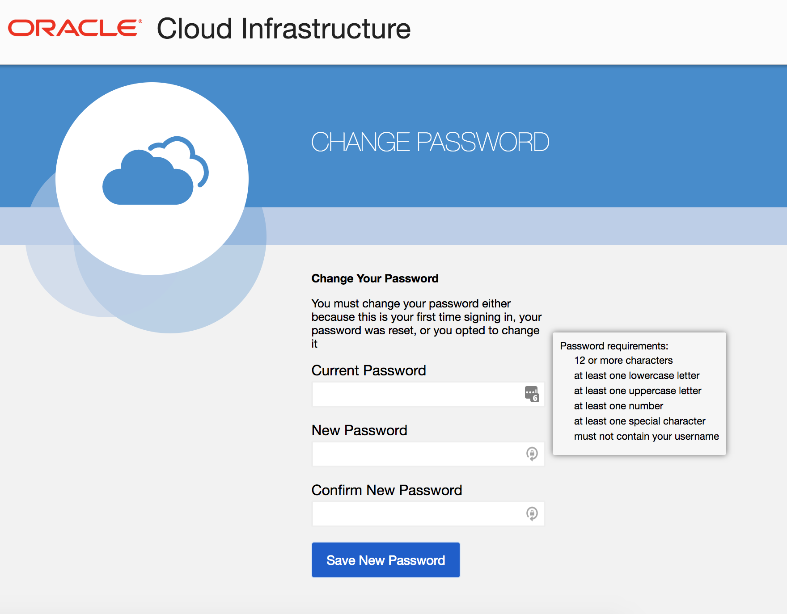
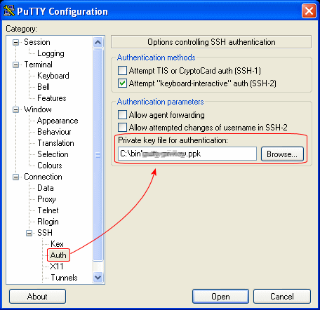

  

# SSWorkshop: In-Memory Fundamentals - SE Roadshow
## Table of Contents 
- [Introduction](#introduction)
- [Lab Assumptions](#lab-assumptions)
- [Section 1-Login to the Oracle Cloud](#section-1-login-to-the-oracle-cloud)
- [Section 2-Connect to your instance](#section-2-connect-to-your-instance)
- [Section 2b-Run the Setup Scripts](#section-2b-run-the-setup-scripts)


## Introduction
This lab will show you how to login to the cloud and setup your environment using Oracle Resource Manager.  Once the environment setup is complete, you will proceed to the Multitenant lab.


## Lab Assumptions
- Participant already has an instance running DB19c svia the SSWorkshop system


## Lab Settings
- **Tenancy**:  c4u03
- **Username/Password**:  Sent via email
- **Compartment**: \<Provided by Oracle\>
- **VCN**: \<Provided by Oracle\>
- **Region**: \<Provided by Oracle\>
- **Subnet**: \<Provided by Oracle\>


## Section 1-Login to the Oracle Cloud
1.  You should have received two emails.  **Email 1:**  From noreply with the subject **Verify Email Request** (check your spam and junk folders).  This has the link that verifies your email.  Without clicking on this link you cannot login to the tenancy.  Open up this email.  Click on the **Sign In to Oracle Cloud** link.  

    


2.  You should have received a 2nd email with your temporary password.  Enter your username and your password (Email 2) in the box on the right hand side that says **Oracle Infrastructure** (Do not use SSO, SSO is not enabled for this tenancy).  

    
   
3. You will then be taken to a screen to change your password.  Choose a new password that you can remember and click **Sign In** (make sure you are using an approved browser.  IE is not supported)

    


4. Once you successfully login, you will be presented with the Oracle Cloud homepage. (NOTE: If you get an *Email Activation Unsuccessful* message, check to see if you can still access the cloud by looking for the hamburger menu to the left). 
   


5.  In Email 2, you were also assigned a region.  Click in the upper right hand corner and set your Region appropriately.   (NOTE:  Setting the region is important, your network is region specific.  If you choose a different region that does not match your subnet, you will get an error on environment creation) 

     

[Back to Top](#table-of-contents)


## Section 2-Connect to your instance

Based on your laptop config, choose the appropriate step to connect to your instance.  

NOTE:  You cannot connect while on VPN or in the Oracle office on clear-corporate (choose clear-internet).  Also, the ssh-daemon is disable for the first 5 minutes or so while the instance is processing.  If you are unable to connect and sure you have a valid key, wait a few minutes and try again.

### Connecting via MAC or Windows CYGWIN Emulator
1.  Go to Compute -> Instance and select the instance you created (make sure you choose the correct compartment)
2.  On the instance homepage, find the Public IP addresss for your instance.

1.  Open up a terminal (MAC) or cygwin emulator as the opc user.  Enter yes when prompted.

    ````
    ssh -i ~/.ssh/optionskey opc@<Your Compute Instance Public IP Address>
    ````
     

3.  Continue to [Section 2b-Run the Setup Scripts](#section-2b-run-the-setup-scripts)

### Connecting via Windows

1.  Open up putty and create a new connection.

    ````
    ssh -i ~/.ssh/optionskey opc@<Your Compute Instance Public IP Address>
    ````
     

2.  Enter a name for the session and click **Save**.

     

3. Click **Connection** > **Data** in the left navigation pane and set the Auto-login username to root.

4. Click **Connection** > **SSH** > **Auth** in the left navigation pane and configure the SSH private key to use by clicking Browse under Private key file for authentication.

5. Navigate to the location where you saved your SSH private key file, select the file, and click Open.  NOTE:  You cannot connect while on VPN or in the Oracle office on clear-corporate (choose clear-internet).

     

6. The file path for the SSH private key file now displays in the Private key file for authentication field.

7. Click Session in the left navigation pane, then click Save in the Load, save or delete a stored session section.

8. Click Open to begin your session with the instance.

[Back to Top](#table-of-contents)

## Section 2b-Run the Setup Scripts

1.  Run this command to setup the schemas for In-Memory.   This script takes about 15 minutes to complete.
    ````
    cd /home/opc/
    wget https://objectstorage.us-ashburn-1.oraclecloud.com/p/3UHs8zJo7p-gLc3HEfci6SkYAH81ZQNxTgrQvASP0Js/n/c4u03/b/labfiles/o/inmemoryscript.sh
    nohup /home/opc/inmemoryscript.sh &> setupinmem.out&
    ````

2.  To check the status of the script above run the command below.   You can also use the unix **jobs** command to see if the script is still running.

    ````
    tail -f /home/opc/setupinmem.out
    ````

3.  Once the script is finished, congratulations!  Now you have the environment to run the In-Memory lab.   You may proceed to the [In-Memory Lab](https://oracle.github.io/learning-library/data-management-library/database/options/in-memory.html). 

[Back to Top](#table-of-contents)

