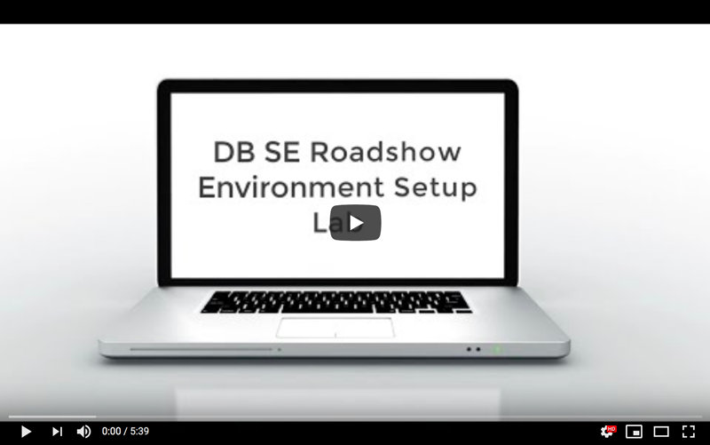
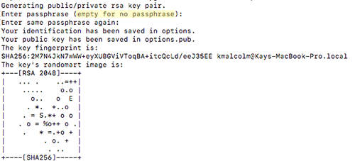
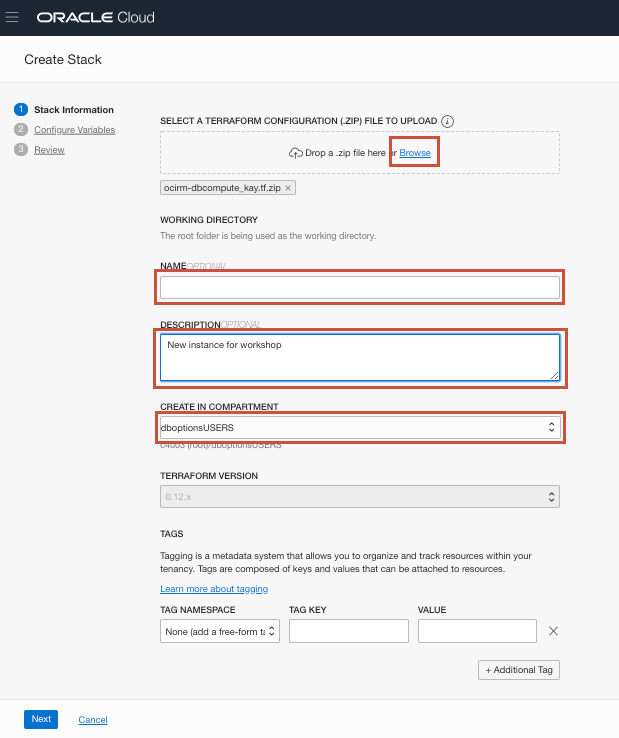
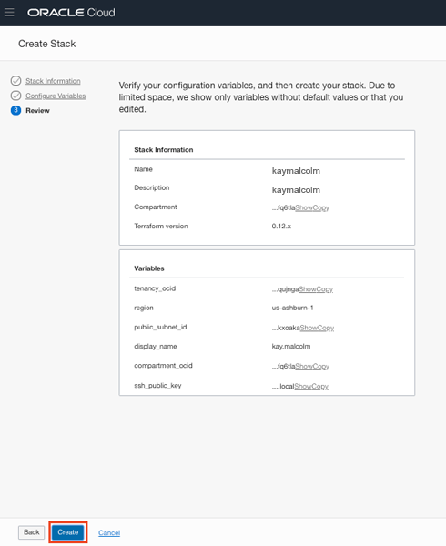
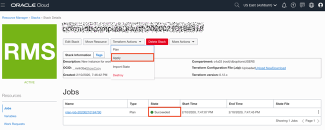
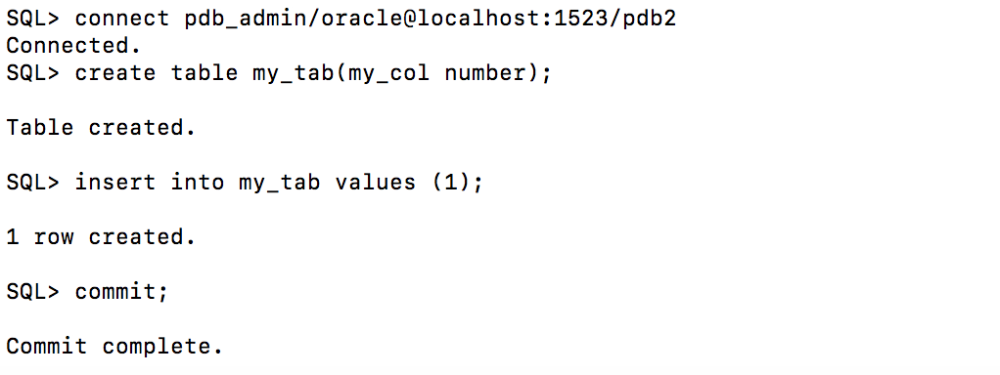
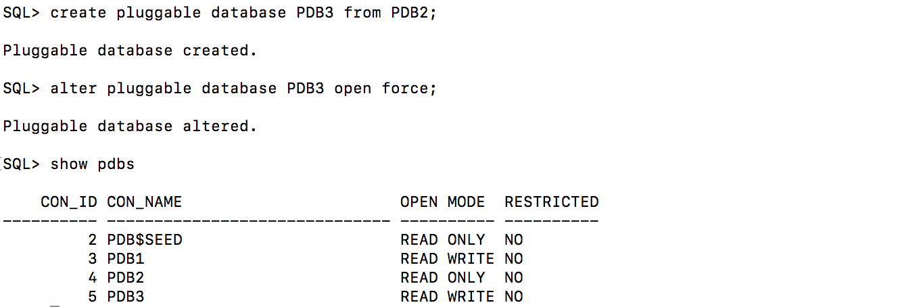
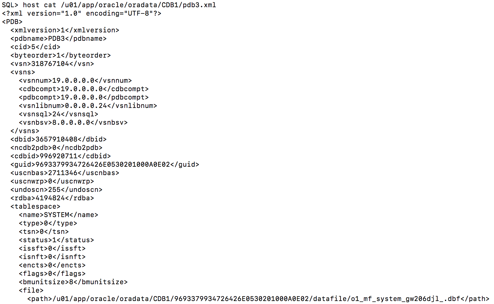
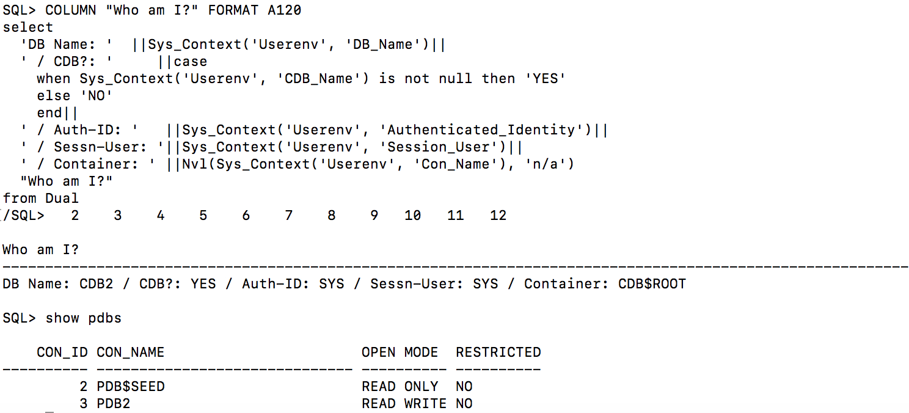
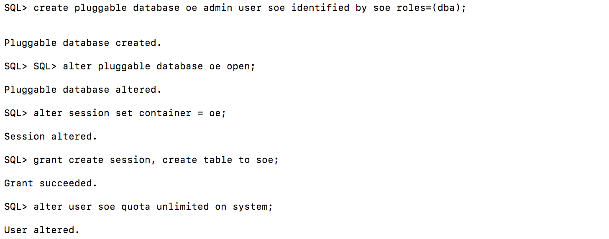

  

## Table of Contents 
- [Introduction](#introduction)
- [Lab Assumptions](#lab-assumptions)
- [Section 1-Login to the Oracle Cloud](#section-1-login-to-the-oracle-cloud)
- [Section 2-Create an SSH key pair](#section-2-create-an-ssh-key-pair)


## Introduction
This lab will show you how to login to the cloud and setup your environment using Oracle Resource Manager.  Once the environment setup is complete, you will execute the Multitenant lab.


## Lab Assumptions
- Each participant has been provided an account on the c4u03 tenancy and the network (VCN) has been pre-created.
- Each participant has been sent two emails, one from noreply@accountrecovery.oci.oraclecloud.com  with their username and another from the Database PM gmail account with their temporary password.

## Lab Settings
- **Tenancy**:  c4u03
- **Username/Password**:  Follow instructions below to access
- **Compartment**: \<Provided by Oracle\>
- **VCN**: \<Provided by Oracle\>
- **Region**: \<Provided by Oracle\>

## Lab Preview
[](https://www.youtube.com/watch?v=-sqtoqhlGo0)


## Section 1-Login to the Oracle Cloud and Create an SSH Key Pair
1.  You should have received two emails.  Email 1:  From noreply with the subject **Verify Email Request** (check your spam and junk folders).  This has the link that verifies your email.  Without clicking on this link you cannot login to the tenancy.  Open up this email.  Click on the **Sign In to Oracle Cloud** link.  

    

    

2.  You should have received a 2nd email with your temporary password.  Enter your username and your password (Email 2).  You will then be taken to a screen to change your password.  Choose a new password that you can remember and click **Sign In**

    


3. Once you successfully login, you will be presented with the Oracle Cloud homepage. If you get an *Email Activation Unsuccessful* message, check to see if you can still access the cloud by looking for the hamburger menu to the left. 
   


4.  In Email 2, you were also assigned a region.  Click in the upper right hand corner and set your Region appropriately.  

     


## Section 2-Generate an SSH Key Pair

If you already have an ssh key pair, you may use that to connect to your environment.

### For MAC Users ### 

1.  Open up a terminal and type the following commands.  When prompted for a passphrase click **enter**. *Do not enter a passphrase*.
     ````
    cd ~
    cd .ssh
    ssh-keygen -b 2048 -t rsa -f optionskey
    ````

     
3.  Inspect your .ssh directory.  You should see two files.  optionskey and optionskey.pub.  Copy the contents of the pub file `optionskey.pub` into notepad.  Your key file should be one line. You will need this to access your instance in Section 5.  

    ````
    ls -l .ssh
    more optionskey.pub
    ````

### For Windows: Using GitBash or Windows Subsystem for Linux (WSL) ### 

1. Open the terminal tool of your choice
2. Type the following command at the prompt to generate keys for your instance.
    ````
    ssh-keygen -f optionskey
    ````
3. Press enter to accept the default values
4. Do not assign a password for this exercise. (note you should always assign an SSH key password in production)
5. Type the following to retrieve your public key.  You will need this to access your instance in Section 5.  
    ````
    cat ~/.ssh/optionskey.pub 
    ````


### For Windows: Using PuttyGen ### 

1. Open PuttyGen
2. Click the [Generate] button

     
3. Move your mouse around the screen randomly until the progress bar reaches 100%
4. Click the [Save private key] button. Name the file `optionskey`.  This file will not have an extension.

     
5. Save the public key (displayed in the text field) by copying it to the clipboard and saving it manually to a new text file. Name the file `optionskey.pub`.   You will need this to access your instance in Section 5.  

6. Note: Sometimes PuttyGen does not save the public key in the correct format. The text string displayed in the window is correct so we just copy/paste.

## Section 3-Login and Create Stack using Resource Manager
You will be using Terraform to create your Multitenant environment.

1.  Click  \<[**here**](https://github.com/oracle/learning-library/raw/master/data-management-library/database/options/terraform/multitenant-terraform.zip)\> to download the Resource Manager zip file and click <[here](https://github.com/oracle/learning-library/raw/master/data-management-library/database/options/terraform/labs.zip)> to download the labs.zip file.  

2.  Save both in your downloads folder, you will need the labs.zip file later.

3.  Go back to your cloud and click on the hamburger menu in the left hand corner.  Click on **Resource Manager** under the *Solutions and Platform* section.

     

    

4.  In the Stacks page, choose the dboptionsUSERS compartment.

    

5.  Click the **Create Stack** button

    

6.  Click the Browse button and select the zip file that you downloaded. Click Select.

    


    Enter the following information.
    Name:  <firstname.lastname>
    Description:  New instance for workshop
    Compartment:  <enter from your email>

7.  Click **Next**.

    

    Enter the following inforamtion. Some information may already be pre-populated.  

    **Display Name:** <firstname.lastname> 
    
    **Public Subnet ID**:  Enter the subnet ID based on your region.   The subnets are provided in Email 2
    
    **AD**: Enter 1, 2, or 3 based on your last name.  (A-J -> 1, K - M -> 2, N-Z -> 3)
    
    **SSH Public Key**:  Enter the public key one line you copied in the earlier step,

8. Click **Next**.

    

9.  Your stack has now been created!  Now to create your environemnt.

    


## Section 4-Terraform Plan and Apply

1.  Click Terraform Actions -> Plan to validate your configuration.  This takes about a minute, please be patient.

    

    

    

2.  Once the Terraform Stack Plan finishes, click Terraform Actions -> Apply.  This will create your instance and install Oracle 19c.
    

    

3.  Once this job succeeds, your environment is created!  You can now proceed to the lab.

## Step 0: Connecting to your instance

### Connecting via MAC or Windows CYGWIN Emulator
1.  Go to Compute -> Instance and select the instance you created (make sure you choose the correct compartment)
2.  On the instance homepage, find the Public IP addresss for your instance.

1.  Open up a terminal (MAC) or cygwin emulator as the opc user.  Enter yes when prompted.

    ````
    ssh -i ~/.ssh/optionskey opc@<Your Compute Instance Public IP Address>
    ````
     

2.  Proceed to the Install CLI section.

### Connecting via Windows

1.  Open up putty and create a new connection.

    ````
    ssh -i ~/.ssh/optionskey opc@<Your Compute Instance Public IP Address>
    ````
     

2.  Enter a name for the session and click **Save**.

     

3. Click **Connection** > **Data** in the left navigation pane and set the Auto-login username to root.

4. Click **Connection** > **SSH** > **Auth** in the left navigation pane and configure the SSH private key to use by clicking Browse under Private key file for authentication.

5. Navigate to the location where you saved your SSH private key file, select the file, and click Open.

     

6. The file path for the SSH private key file now displays in the Private key file for authentication field.

7. Click Session in the left navigation pane, then click Save in the Load, save or delete a stored session section.

8. Click Open to begin your session with the instance.

9. In a separate window, secure FTP using either a client (or command line, see below) the labs.zip file to your /home/opc directory.

    ````
    sftp -i .ssh/optionskey opc@<YOUR PUBLIC IP ADDRESS>
    mput labs.zip
    ````

10.  Go back to your ssh'd terminal window.  Enter the following commands.  The script takes approximately 26 minutes to complete.  tail -f nohupenvprep.out to check on the progress.    

    ````
    cd /home/opc/
    sudo mv labs.zip /home/oracle
    sudo chown oracle:oinstall /home/oracle/labs.zip 
    sudo su - oracle
    unzip labs.zip
    cd /home/oracle/labs
    sudo su - 
    nohup /home/oracle/envprep.sh &> nohupenvprep.out&
    ````

11. Now it's time to create your multitenant environment.  This script takes about 35 minutes to create.  Make sure your session timeout on putty is set to 3600s.  You can also use the tail or jobs command to check the status.

    ````
    sudo su - oracle
    cd /home/oracle/labs
    nohup /home/oracle/labs/multitenant/createCDBs.sh &> nohupmultitenant.out&
    ````

Congratulations!  Now you have the environment to run the Multitenant labs.  

## Step 1: Create PDB
This section looks at how to create a new PDB.

The tasks you will accomplish in this lab are:
- Create a pluggable database **PDB2** in the container database **CDB1**  

1. Connect to **CDB1**, logged in as Oracle.

    ````
    sqlplus /nolog
    connect sys/oracle@localhost:1523/cdb1 as sysdba
    ````

2. Check to see who you are connected as. At any point in the lab you can run this script to see who or where you are connected.  

    ````
    select
      'DB Name: '  ||Sys_Context('Userenv', 'DB_Name')||
      ' / CDB?: '     ||case
        when Sys_Context('Userenv', 'CDB_Name') is not null then 'YES'
          else  'NO'
          end||
      ' / Auth-ID: '   ||Sys_Context('Userenv', 'Authenticated_Identity')||
      ' / Sessn-User: '||Sys_Context('Userenv', 'Session_User')||
      ' / Container: ' ||Nvl(Sys_Context('Userenv', 'Con_Name'), 'n/a')
      "Who am I?"
      from Dual
      /
    ````

    

3. Create a pluggable database **PDB2**.  

    ````
    show  pdbs;
    create pluggable database PDB2 admin user PDB_Admin identified by oracle;
    alter pluggable database PDB2 open;
    show pdbs;
    ````
    

    

    

4. Change the session to point to **PDB2**.  

    ````
    alter session set container = PDB2;
    ````
   

5. Grant **PDB_ADMIN** the necessary privileges and create the **USERS** tablespace for **PDB2**.  

    ````
    grant sysdba to pdb_admin;
    create tablespace users datafile size 20M autoextend on next 1M maxsize unlimited segment space management auto;
    alter database default tablespace Users;
    grant create table, unlimited tablespace to pdb_admin;
    ````

   

6. Connect as **PDB_ADMIN** to **PDB2**.  

    ````
    connect pdb_admin/oracle@localhost:1523/pdb2
    ````

7. Create a table **MY_TAB** in **PDB2**.  

    ````
    create table my_tab(my_col number);

    insert into my_tab values (1);

    commit;
    ````

   

8. Change back to **SYS** in the container database **CDB1** and show the tablespaces and datafiles created.  

    ````
    connect sys/oracle@localhost:1523/cdb1 as sysdba

    COLUMN "Con_Name" FORMAT A10
    COLUMN "T'space_Name" FORMAT A12
    COLUMN "File_Name" FORMAT A120
    SET LINESIZE 220
    SET PAGES 9999

    with Containers as (
      select PDB_ID Con_ID, PDB_Name Con_Name from DBA_PDBs
      union
      select 1 Con_ID, 'CDB$ROOT' Con_Name from Dual)
    select
      Con_ID,
      Con_Name "Con_Name",
      Tablespace_Name "T'space_Name",
      File_Name "File_Name"
    from CDB_Data_Files inner join Containers using (Con_ID)
    union
    select
      Con_ID,
      Con_Name "Con_Name",
      Tablespace_Name "T'space_Name",
      File_Name "File_Name"
    from CDB_Temp_Files inner join Containers using (Con_ID)
    order by 1, 3
    /
    ````
   


## Step 2: Clone a PDB
This section looks at how to clone a PDB

The tasks you will accomplish in this lab are:
- Clone a pluggable database **PDB2** into **PDB3**


1. Connect to **CDB1**.  

    ````
    sqlplus /nolog
    connect sys/oracle@localhost:1523/cdb1 as sysdba
    ````

2. Change **PDB2** to read only.  

    ````
    alter pluggable database PDB2 open read only force;
    show pdbs
    ````

   

   
   
3. Create a pluggable database **PDB3** from the read only database **PDB2**.  

    ````
    create pluggable database PDB3 from PDB2;
    alter pluggable database PDB3 open force;
    show pdbs
    ````
   

4. Change **PDB2** back to read write.  

    ````
    alter pluggable database PDB2 open read write force;
    show pdbs
    ````
   

5. Connect to **PDB2** and show the table **MY_TAB**.  

    ````
    connect pdb_admin/oracle@localhost:1523/pdb2
    select * from my_tab;
    ````
 
   

6. Connect to **PDB3** and show the table **MY_TAB**.  

    ````
    connect pdb_admin/oracle@localhost:1523/pdb3
    select * from my_tab;
    ````
   

## Steo 3: Unplug a PDB
This section looks at how to unplug a PDB

The tasks you will accomplish in this lab are:
- Unplug **PDB3** from **CDB1**

1. Connect to **CDB1**.  

    ````
    sqlplus /nolog
    connect sys/oracle@localhost:1523/cdb1 as sysdba
    ````

2. Unplug **PDB3** from **CDB1**.  

    ````
    show pdbs
    alter pluggable database PDB3 close immediate;

    alter pluggable database PDB3
    unplug into
    '/u01/app/oracle/oradata/CDB1/pdb3.xml';

    show pdbs
    ````

   

3. Remove **PDB3** from **CDB1**.  

    ````
    drop pluggable database PDB3 keep datafiles;

    show pdbs
    ````

   

4. Show the datafiles in **CDB1**.  

    ````
    COLUMN "Con_Name" FORMAT A10
    COLUMN "T'space_Name" FORMAT A12
    COLUMN "File_Name" FORMAT A120
    SET LINESIZE 220
    SET PAGES 9999

    with Containers as (
      select PDB_ID Con_ID, PDB_Name Con_Name from DBA_PDBs
      union
      select 1 Con_ID, 'CDB$ROOT' Con_Name from Dual)
    select
      Con_ID,
      Con_Name "Con_Name",
      Tablespace_Name "T'space_Name",
      File_Name "File_Name"
    from CDB_Data_Files inner join Containers using (Con_ID)
    union
    select
      Con_ID,
      Con_Name "Con_Name",
      Tablespace_Name "T'space_Name",
      File_Name "File_Name"
    from CDB_Temp_Files inner join Containers using (Con_ID)
    order by 1, 3
    /
    ````

    

5. Look at the XML file for the pluggable database **PDB3**.  

    ````
    host cat /u01/app/oracle/oradata/CDB1/pdb3.xml
    ````
    


## Step 4: Plug in a PDB
This section looks at how to plug in a PDB

The tasks you will accomplish in this lab are:
- Plug **PDB3** into **CDB2**

1. Connect to **CDB2**  

    ````
    sqlplus /nolog
    connect sys/oracle@localhost:1524/cdb2 as sysdba

    COLUMN "Who am I?" FORMAT A120
    select
      'DB Name: '  ||Sys_Context('Userenv', 'DB_Name')||
      ' / CDB?: '     ||case
        when Sys_Context('Userenv', 'CDB_Name') is not null then 'YES'
        else 'NO'
        end||
      ' / Auth-ID: '   ||Sys_Context('Userenv', 'Authenticated_Identity')||
      ' / Sessn-User: '||Sys_Context('Userenv', 'Session_User')||
      ' / Container: ' ||Nvl(Sys_Context('Userenv', 'Con_Name'), 'n/a')
      "Who am I?"
    from Dual
    /

    show pdbs
    ````
    

2. Check the compatibility of **PDB3** with **CDB2**  

    ````
    begin
      if not
        Sys.DBMS_PDB.Check_Plug_Compatibility
        ('/u01/app/oracle/oradata/CDB1/pdb3.xml')
      then
        Raise_Application_Error(-20000, 'Incompatible');
      end if;
    end;
    /
    ````


3. Plug **PDB3** into **CDB2**  

    ````
    create pluggable database PDB3
    using '/u01/app/oracle/oradata/CDB1/pdb3.xml'
    move;

    show pdbs
    alter pluggable database PDB3 open;
    show pdbs
    ````

    

4. Review the datafiles in **CDB2**  

    ````
    COLUMN "Con_Name" FORMAT A10
    COLUMN "T'space_Name" FORMAT A12
    COLUMN "File_Name" FORMAT A120
    SET LINESIZE 220
    SET PAGES 9999


    with Containers as (
      select PDB_ID Con_ID, PDB_Name Con_Name from DBA_PDBs
      union
      select 1 Con_ID, 'CDB$ROOT' Con_Name from Dual)
    select
      Con_ID,
      Con_Name "Con_Name",
      Tablespace_Name "T'space_Name",
      File_Name "File_Name"
    from CDB_Data_Files inner join Containers using (Con_ID)
    union
    select
      Con_ID,
      Con_Name "Con_Name",
      Tablespace_Name "T'space_Name",
      File_Name "File_Name"
    from CDB_Temp_Files inner join Containers using (Con_ID)
    order by 1, 3
    /
    ````

    

5. Connect as **PDB_ADMIN** to **PDB3** and look at **MY_TAB**;  

    ````
    connect pdb_admin/oracle@localhost:1524/pdb3

    select * from my_tab;
    ````

    

## Step 5: Drop a PDB
This section looks at how to drop a pluggable database.

The tasks you will accomplish in this lab are:
- Drop **PDB3** from **CDB2**

1. Connect to **CDB2**  

    ````
    sqlplus /nolog
    connect sys/oracle@localhost:1524/cdb2 as sysdba
    ````

2. Drop **PDB3** from **CDB2**  

    ````
    show pdbs

    alter pluggable database PDB3 close immediate;

    drop pluggable database PDB3 including datafiles;

    show pdbs
    ````

    


## Step 6: Clone an Unplugged PDB
This section looks at how to create a gold copy of a PDB and clone it into another container.

The tasks you will accomplish in this lab are:
- Create a gold copy of **PDB2** in **CDB1** as **GOLDPDB**
- Clone **GOLDPDB** into **COPYPDB1** and **COPYPDB2** in **CDB2**

1. Connect to **CDB1**  

    ````
    sqlplus /nolog
    connect sys/oracle@localhost:1523/cdb1 as sysdba
    ````

2. Change **PDB2** to read only  

    ````
    alter pluggable database PDB2 open read only force;
    show pdbs
    ````

3. Create a pluggable database **GOLDPDB** from the read only database **PDB2**  

    ````
    create pluggable database GOLDPDB from PDB2;
    alter pluggable database GOLDPDB open force;
    show pdbs
    ````

    

4. Change **PDB2** back to read write  

    ````
    alter pluggable database PDB2 open read write force;
    show pdbs
    ````

    

5. Unplug **GOLDPDB** from **CDB1**  

    ````
    show pdbs
    alter pluggable database GOLDPDB close immediate;

    alter pluggable database GOLDPDB
    unplug into '/u01/app/oracle/oradata/CDB1/goldpdb.xml';

    show pdbs
    ````

    

6. Remove **GOLDPDB** from **CDB1**  

    ````
    drop pluggable database GOLDPDB keep datafiles;

    show pdbs
    ````

7. Connect to **CDB2**  

    ````
    connect sys/oracle@localhost:1524/cdb2 as sysdba
    ````

8. Validate **GOLDPDB** is compatibile with **CDB2**  

    ````
    begin
      if not
        Sys.DBMS_PDB.Check_Plug_Compatibility
    ('/u01/app/oracle/oradata/CDB1/goldpdb.xml')
      then
        Raise_Application_Error(-20000, 'Incompatible');
      end if;
    end;
    /
    ````

9. Create a clone of **GOLDPDB** as **COPYPDB1**  

    ````
    create pluggable database COPYPDB1 as clone
    using '/u01/app/oracle/oradata/CDB1/goldpdb.xml'
    storage (maxsize unlimited max_shared_temp_size unlimited)
    copy;
    show pdbs
    ````

    

10. Create another clone of **GOLDPDB** as **COPYPDB2**  

    ````
    create pluggable database COPYPDB2 as clone
    using '/u01/app/oracle/oradata/CDB1/goldpdb.xml'
    storage (maxsize unlimited max_shared_temp_size unlimited)
    copy;
    show pdbs
    ````

    

11. Open all of the pluggable databases  

    ````
    alter pluggable database all open;

    show pdbs
    ````
    

12. Look at the GUID for the two cloned databases  

    ````
    COLUMN "PDB Name" FORMAT A20
    select PDB_Name "PDB Name", GUID
    from DBA_PDBs
    order by Creation_Scn
    /
    ````
    

## Step 7: PDB Hot Clones
This section looks at how to hot clone a pluggable database.

The tasks you will accomplish in this lab are:
- Create a pluggable database **OE** in the container database **CDB1**
- Create a load against the pluggable database **OE**
- Create a hot clone **OE_DEV** in the container database **CDB2** from the pluggable database **OE**

1. Connect to **CDB1**  

    ````
    sqlplus /nolog
    connect sys/oracle@localhost:1523/cdb1 as sysdba
    ````

2. Create a pluggable database **OE** with an admin user of **SOE**  

    ````
    create pluggable database oe admin user soe identified by soe roles=(dba);
    alter pluggable database oe open;
    alter session set container = oe;
    grant create session, create table to soe;
    alter user soe quota unlimited on system;
    ````

    

3. Connect as **SOE** and create the **sale_orders** table  

    ````
    connect soe/soe@localhost:1523/oe
    CREATE TABLE sale_orders 
    (ORDER_ID      number, 
    ORDER_DATE    date, 
    CUSTOMER_ID   number);
    ````
 
 4. Open a new terminal window, sudo to the oracle user and execute write-load.sh. Leave this window open and running throughout the rest of the multitenant labs.  

     ````
    sudo su - oracle
    cd /home/oracle/labs/multitenant
    ./write-load.sh
    ````
    Leave this window open and running for the next few labs.

5. Go back to your original terminal window.  Connect to **CDB2** and create the pluggable **OE_DEV** from the database link **oe@cdb1_link**  

    ````
    connect sys/oracle@localhost:1524/cdb2 as sysdba
    create pluggable database oe_dev from oe@cdb1_link;
    alter pluggable database oe_dev open;
    ````

6. Connect as **SOE** to **OE_DEV** and check the number of records in the **sale_orders** table  

    ````
    connect soe/soe@localhost:1524/oe_dev
    select count(*) from sale_orders;
    ````

7. Connect as **SOE** to **OE** and check the number of records in the **sale_orders** table  

    ````
    connect soe/soe@localhost:1523/oe
    select count(*) from sale_orders;
    ````

8. Close and remove the **OE_DEV** pluggable database  

    ````
    connect sys/oracle@localhost:1524/cdb2 as sysdba
    alter pluggable database oe_dev close;
    drop pluggable database oe_dev including datafiles;
    ````

9. Leave the **OE** pluggable database open with the load running against it for the rest of the labs.

You can see that the clone of the pluggable database worked without having to stop the load on the source database. In the next lab you will look at how to refresh a clone.

## Step 8: PDB Refresh
This section looks at how to hot clone a pluggable database, open it for read only and then refresh the database.

The tasks you will accomplish in this lab are:
- Leverage the **OE** pluggable database from the previous lab with the load still running against it.
- Create a hot clone **OE_REFRESH**` in the container database **CDB2** from the pluggable database **OE**
- Refresh the **OE_REFRESH**` pluggable database.

1. Connect to **CDB2**  

    ````
    sqlplus /nolog
    connect sys/oracle@localhost:1524/cdb2 as sysdba
    ````

2. Create a pluggable database **OE_REFRESH**` with manual refresh mode from the database link **oe@cdb1_link**  

    ````
    create pluggable database oe_refresh from oe@cdb1_link refresh mode manual;
    alter pluggable database oe_refresh open read only;
    ````

3. Connect as **SOE** to the pluggable database **OE_REFRESH**` and count the number of records in the sale_orders table  

    ````
    conn soe/soe@localhost:1524/oe_refresh
    select count(*) from sale_orders;
    ````

4. Close the pluggable database **OE_REFRESH**` and refresh it from the **OE** pluggable database  

    ````
    conn sys/oracle@localhost:1524/oe_refresh as sysdba

    alter pluggable database oe_refresh close;

    alter session set container=oe_refresh;
    alter pluggable database oe_refresh refresh;
    alter pluggable database oe_refresh open read only;
    ````

5. Connect as **SOE** to the pluggable dataabse **OE_REFRESH**` and count the number of records in the **sale_orders** table. You should see the number of records change.  

    ````
    conn soe/soe@localhost:1524/oe_refresh
    select count(*) from sale_orders;
    ````

6. Close and remove the **OE_DEV** pluggable database  

    ````
    conn sys/oracle@localhost:1524/cdb2 as sysdba

    alter pluggable database oe_refresh close;
    drop pluggable database oe_refresh including datafiles;
    ````

7. Leave the **OE** pluggable database open with the load running against it for the rest of the labs.


## Step 9: PDB Relocation

This section looks at how to relocate a pluggable database from one container database to another. One important note, either both container databases need to be using the same listener in order for sessions to keep connecting or local and remote listeners need to be setup correctly. For this lab we will change **CDB2** to use the same listener as **CDB1**.

The tasks you will accomplish in this lab are:
- Change **CDB2** to use the same listener as **CDB1**
- Relocate the pluggable database **OE** from **CDB1** to **CDB2** with the load still running
- Once **OE** is open the load should continue working.

1. Change **CDB2** to use the listener **LISTCDB1**  

    ````
    sqlplus /nolog
    conn sys/oracle@localhost:1524/cdb2 as sysdba;
    alter system set local_listener='LISTCDB1' scope=both;
    ````

2. Connect to **CDB2** and relocate **OE** using the database link **oe@cdb1_link**  

    ````
    conn sys/oracle@localhost:1523/cdb2 as sysdba;
    create pluggable database oe from oe@cdb1_link relocate;
    alter pluggable database oe open;
    show pdbs
    ````

3. Connect to **CDB1** and see what pluggable databases exist there  

    ````
    conn sys/oracle@localhost:1523/cdb1 as sysdba
    show pdbs
    ````

4. Close and remove the **OE** pluggable database  

    ````
    conn sys/oracle@localhost:1523/cdb2 as sysdba

    alter pluggable database oe close;
    drop pluggable database oe including datafiles;
    ````

5. The load program isn't needed anymore and that window can be closed.

6. If you are going to continue to use this environment you will need to change **CDB2** back to use **LISTCDB2**

    ````
    sqlplus /nolog
    conn sys/oracle@localhost:1523/cdb2 as sysdba;
    alter system set local_listener='LISTCDB2' scope=both;
    ````

## Conclusion
Now you've had a chance to try out the Multitenant option. You were able to create, clone, plug and unplug a pluggable database. You were then able to accomplish some advanced tasks that you could leverage when maintaining a large multitenant environment. 