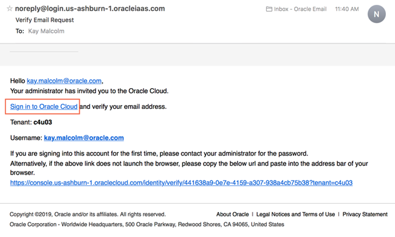
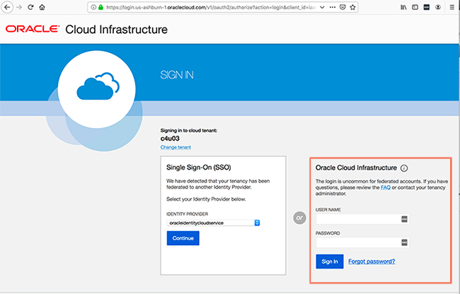
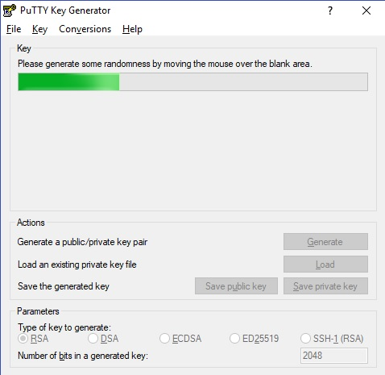
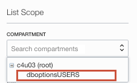
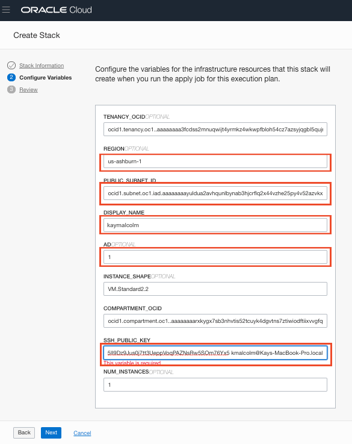

  

## Table of Contents 
- [Introduction](#introduction)
- [Lab Assumptions](#lab-assumptions)
- [Section 1-Login to the Oracle Cloud](#section-1-login-to-the-oracle-cloud)
- [Section 2-Generate an SSH key pair](#section-2-generate-an-ssh-key-pair)
- [Section 3-Login and Create Stack using Resource Manager](#section-3-login-and-create-stack-using-resource-manager)
- [Section 4-Terraform Plan and Apply](#section-4-terraform-plan-and-apply)
- [Section 5-Connect to your instance](#section-5-connect-to-your-instance)
- [Section 5b-Run the Setup Scripts](#section-5b-run-the-setup-scripts)


## Introduction
This lab will show you how to login to the cloud and setup your environment using Oracle Resource Manager.  Once the environment setup is complete, you will proceed to the Multitenant lab.


## Lab Assumptions
- Each participant has been sent two emails, one from Oracle Cloud  with their username and another from the Database PM gmail account with their temporary password.

## Lab Settings
- **Tenancy**:  c4u03
- **Username/Password**:  Sent via email
- **Compartment**: \<Provided by Oracle\>
- **VCN**: \<Provided by Oracle\>
- **Region**: \<Provided by Oracle\>


## Section 1-Login to the Oracle Cloud
1.  You should have received two emails.  **Email 1:**  From noreply with the subject **Verify Email Request** (check your spam and junk folders).  This has the link that verifies your email.  Without clicking on this link you cannot login to the tenancy.  Open up this email.  Click on the **Sign In to Oracle Cloud** link.  

    

    

2.  You should have received a 2nd email with your temporary password.  Enter your username and your password (Email 2).  You will then be taken to a screen to change your password.  Choose a new password that you can remember and click **Sign In**

    


3. Once you successfully login, you will be presented with the Oracle Cloud homepage. If you get an *Email Activation Unsuccessful* message, check to see if you can still access the cloud by looking for the hamburger menu to the left. 
   


4.  In Email 2, you were also assigned a region.  Click in the upper right hand corner and set your Region appropriately.  

     

[Back to Top](#table-of-contents)

## Section 2-Generate an SSH Key Pair

If you already have an ssh key pair, you may use that to connect to your environment.  Based on your laptop config, choose the appropriate step to connect to your instance.

### For MAC Users ### 

1.  Open up a terminal and type the following commands.  When prompted for a passphrase click **enter**. *Do not enter a passphrase*.
     ````
    cd ~
    cd .ssh
    ssh-keygen -b 2048 -t rsa -f optionskey
    ````

     
3.  Inspect your .ssh directory.  You should see two files.  optionskey and optionskey.pub.  Copy the contents of the pub file `optionskey.pub` into notepad.  Your key file should be one line. You will need this to access your instance in Section 5.  

    ````
    ls -l .ssh
    more optionskey.pub
    ````

### For Windows: Using GitBash or Windows Subsystem for Linux (WSL) ### 

1. Open the terminal tool of your choice
2. Type the following command at the prompt to generate keys for your instance.
    ````
    ssh-keygen -f optionskey
    ````
3. Press enter to accept the default values
4. Do not assign a password for this exercise. (note you should always assign an SSH key password in production)
5. Type the following to retrieve your public key.  You will need this to access your instance in Section 5.  
    ````
    cat ~/.ssh/optionskey.pub 
    ````


### For Windows: Using PuttyGen ### 

1. Open PuttyGen
2. Click the [Generate] button

     
3. Move your mouse around the screen randomly until the progress bar reaches 100%
4. Click the [Save private key] button. Name the file `optionskey`.  This file will not have an extension.

     
5. Save the public key (displayed in the text field) by copying it to the clipboard and saving it manually to a new text file. Name the file `optionskey.pub`.   You will need this to access your instance in Section 5.  

6. Note: Sometimes PuttyGen does not save the public key in the correct format. The text string displayed in the window is correct so copy/paste to be sure.

[Back to Top](#table-of-contents)

## Section 3-Login and Create Stack using Resource Manager
You will be using Terraform to create your database environment.

1.  Click on the link below to download the zip file you need to build your enviornment.  
- [multitenant-terraform.zip](https://objectstorage.us-ashburn-1.oraclecloud.com/p/1LYMqYL4xK0fq4iw1lr0ByzxyOACFQ_viboPmaEFGqM/n/c4u03/b/labfiles/o/multitenant-compute.tf.zip) - Packaged terraform instance creation script

2.  Save in your downloads folder.

3.  Open up the hamburger menu in the left hand corner.  Choose **Resource Manager > Stacks**.   Choose the compartment from your email, click the  **Create Stack** button

     

    

    

    

6.  Click the **Browse** button and select the zip file (multitenant-terraform.zip) that you downloaded. Click **Select**.

    


    Enter the following information.
    Name:  <firstname.lastname>
    Description:  New instance for workshop
    Compartment:  <enter from your email>

7.  Click **Next**.

    

    Enter the following inforamtion. Some information may already be pre-populated.  Do not change the pre-populated info.  

    **Display Name:** Enter your firstname and lastname and the day you were born (do not enter any special characters here, including periods, it may mess up the configuration)
    
    **Public Subnet ID**:  Enter the subnet ID based on your region.   The subnets are provided in Email 2
    
    **AD**: Enter 1, 2, or 3 based on your last name.  (A-J -> 1, K - M -> 2, N-Z -> 3)
    
    **SSH Public Key**:  Paste the public key you created in the earlier step (it should be one line)

8. Click **Next**.

    

9.  Your stack has now been created!  Now to create your environment.

    

[Back to Top](#table-of-contents)


## Section 4-Terraform Plan and Apply
When using Resource Manager to deploy an environment, execute a terraform **plan** and **apply**.  Let's do that now.

1.  [OPTIONAL]Click **Terraform Actions** -> **Plan** to validate your configuration.  This takes about a minute, please be patient.

    

    

    

2.  Click **Terraform Actions** -> **Apply**.  This will create your instance and install Oracle 19c.
    

    

3.  Once this job succeeds, your environment is created!  Time to login to your instance to finish the configuration.

[Back to Top](#table-of-contents)


## Section 5-Connect to your instance

Based on your laptop config, choose the appropriate step to connect to your instance.

### Connecting via MAC or Windows CYGWIN Emulator
1.  Go to Compute -> Instance and select the instance you created (make sure you choose the correct compartment)
2.  On the instance homepage, find the Public IP addresss for your instance.

1.  Open up a terminal (MAC) or cygwin emulator as the opc user.  Enter yes when prompted.

    ````
    ssh -i ~/.ssh/optionskey opc@<Your Compute Instance Public IP Address>
    ````
     

2.  Proceed to the Install CLI section.

### Connecting via Windows

1.  Open up putty and create a new connection.

    ````
    ssh -i ~/.ssh/optionskey opc@<Your Compute Instance Public IP Address>
    ````
     

2.  Enter a name for the session and click **Save**.

     

3. Click **Connection** > **Data** in the left navigation pane and set the Auto-login username to root.

4. Click **Connection** > **SSH** > **Auth** in the left navigation pane and configure the SSH private key to use by clicking Browse under Private key file for authentication.

5. Navigate to the location where you saved your SSH private key file, select the file, and click Open.

     

6. The file path for the SSH private key file now displays in the Private key file for authentication field.

7. Click Session in the left navigation pane, then click Save in the Load, save or delete a stored session section.

8. Click Open to begin your session with the instance.

[Back to Top](#table-of-contents)

## Section 5b-Run the Setup Scripts

1.  Copy the following commands into your terminal.  This script takes approximately 1.5hrs to run.  It is a series of scripts that create several databases in multiple ORACLE HOMES so that you can run both the Multitenant and Advanced Multitenant labs.  The scripts are run in the background.  Note: If you are running in windows using putty, ensure your Session Timeout is set to greater than 0

        ````
        cd /home/opc/
        wget https://objectstorage.us-ashburn-1.oraclecloud.com/p/ZfonUvgh0Lh6dbsyT0qEhAvHyowYvBdiRcuDkn-E_PY/n/c4u03/b/labfiles/o/labs.zip
        sudo mv labs.zip /home/oracle
        sudo chown oracle:oinstall /home/oracle/labs.zip 
        sudo su - oracle
        unzip labs.zip
        cd /home/oracle/labs
        exit
        sudo su - 
        nohup /home/oracle/labs/envprep.sh &> /home/oracle/labs/nohupenvprep.out&
        ````
2.   To check on the progress of this set of scripts, enter the command below.  This script takes about 90 minutes to complete.

        ````
        tail -f /home/oracle/labs/nohupenvprep.out
        ````

3.  Once the script is finished,        
Congratulations!  Now you have the environment to run the Multitenant labs.   You may proceed to the [Multitenant Lab](https://oracle.github.io/learning-library/data-management-library/database/options/multitenant.html). 

[Back to Top](#table-of-contents)

