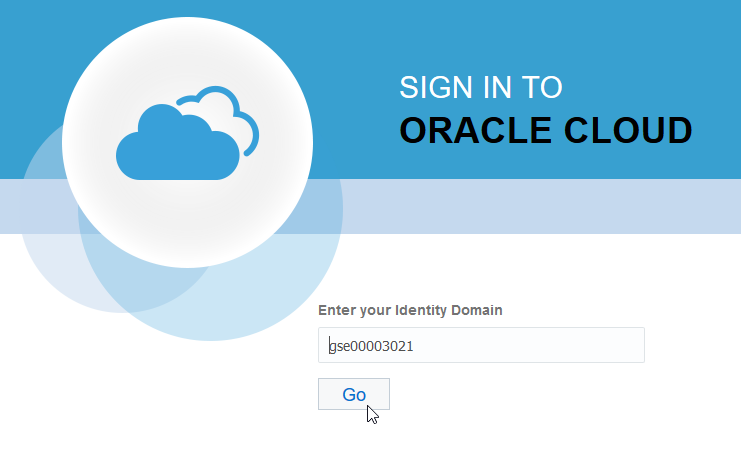
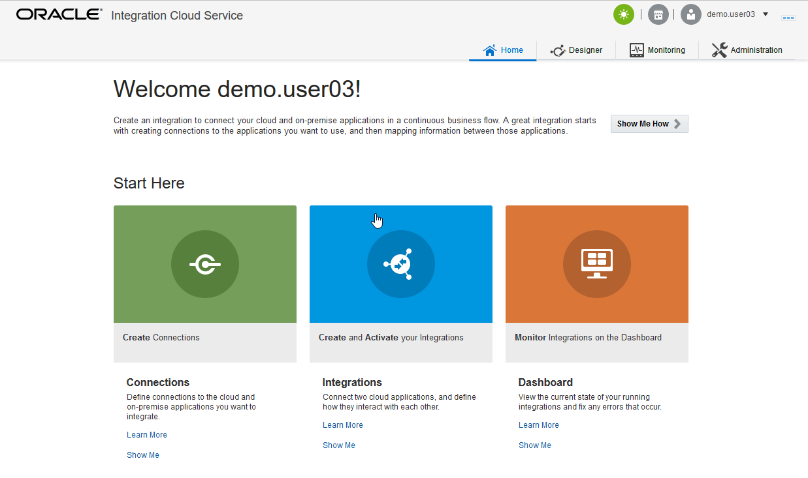
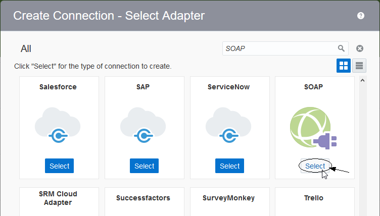
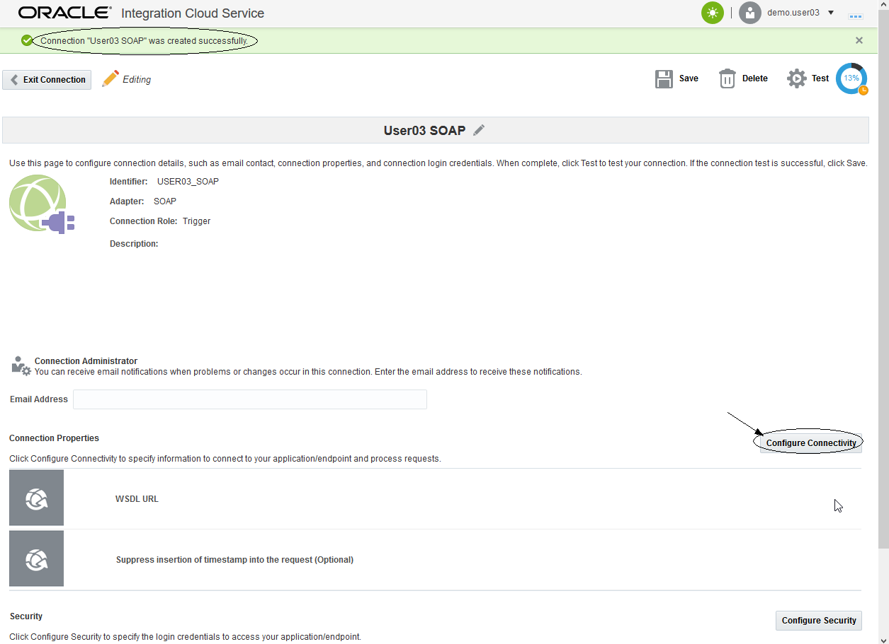
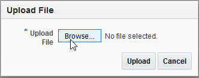
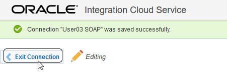
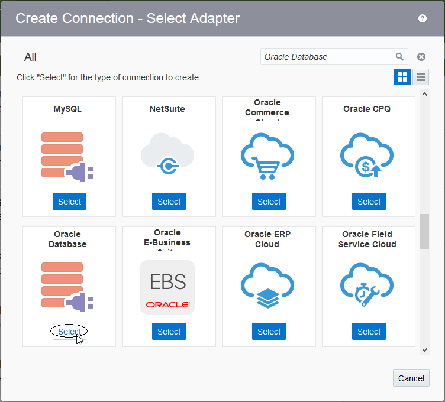
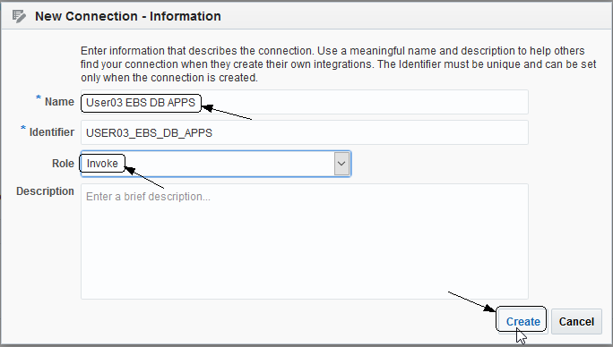
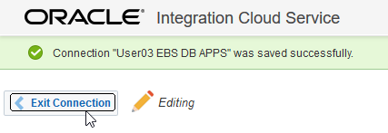

  

Update: March 30, 2017

# Lab 300 - Create an ICS Integration using a Database Adapter

---

## Introduction

This is the third of several labs that are part of the **ICS Development** workshop. 

In this lab, you develop an integration in ICS using a database adapter to query the Oracle EBS database.

## Objectives

- Learn how to create ICS SOAP and Database Adapter Connections
- Learn how to create an ICS Orchestration using the ICS Adapters
- Learn how to test the ICS integration using SoapUI

## Required Artifacts

- The following lab and an Oracle Public Cloud account that will be supplied by your instructor.
- SoapUI will need to be installed for ICS integration testing - see "Prerequisites" section of the workshop for details

## Part 1: Create the ICS Connections

In the previous lab, a REST connection was created.  In a similar manner we need to create the connections necessary for the integration in this lab which are for the inbound SOAP web service as well as the EBS Database.

The ICS integration that we'll be building is shown in the following picture:

Here is a description of what is happening with this integration:

SoapUI will be used to test the exposed Web Service endpoint of the ICS integration called *UserXX Create EBS Order* (where XX will be 00 -> 10).  This integration has 3 connections.  The incoming message is received by the incoming *UserXX SOAP* Soap Connection.  The *UserXX Create EBS Order* orchestration makes 2 queries into the EBS database using the *UserXX EBS DB APPS* connection to get details needed to create an order.  The orchestration finally uses the *UserXX EBS OPERATIONS* EBS Adapter connection for creating the order in EBS.  After the order is created in EBS, the Order Number is returned to the calling web service.

### **1.1**: Login to your Oracle Cloud account

---

**1.1.1** From your browser (Firefox or Chrome recommended) go to the following URL:
<https://cloud.oracle.com>

**1.1.2** Click Sign In in the upper right hand corner of the browser
**IMPORTANT** - Under My Services, change Data Center to `US Commercial 2 (us2)` and click on Sign In to My Services

**1.1.3** If your identity domain is not already set, enter it and click **Go**

**NOTE:** the **Identity Domain** values will be given to you from your instructor.

  

**1.1.4** Once your Identity Domain is set, enter your `User Name` and `Password` and click **Sign In**

***NOTE:*** the **User Name and Password** values will be given to you by your instructor.

  

**1.1.5** You will be presented with a Dashboard displaying the various cloud services available to this account.

**NOTE:** The Cloud Services dashboard is intended to be used by the *Cloud Administrator* user role.  The Cloud Administrator is responsible for adding users, service instances, and monitoring usage of the Oracle cloud service account.  Developers and Operations roles will go directly to the service console link, not through the service dashboard.

**1.1.6**  To get to the Integration Cloud Service (ICS) service console where you will work on developing the integration, click on the `hamburger` icon, then click on the `View Details` link.

**1.1.7**  Select the `Open Service Console` link to go to the ICS Service Console.  

  

**1.1.8**  You will now be presented with the ICS Service Console from which you will be performing the rest of this workshop lab.

  

### **1.2**: Create the SOAP Connector

---

**1.2.1** Select the `Connections` graphic in the designer portal

 

**1.2.2** Click on **New Connection**

 

**1.2.3** Select the **SOAP** Connection, by either doing a search, or by scrolling down to the **SOAP** connection, then click on the **Select** button of the **SOAP** connection.

**1.2.4** Fill in the information for the new connection 

- **Name:** Enter in the form of _UserXX SOAP_ where XX is the number in your allocated user.
- **Role:** Select _Trigger_ since we going to use the connection as a trigger to start the integration

Note that the **Identifier** will automatically be created based on the **Name** you entered.

**1.2.5** Click **Create**

 

**1.2.6** Click the **Configure Connectivity** button

 

**1.2.7** For the *WSDL URL*, select the *Upload File* checkbox, then the *Upload* button.

 

**1.2.8** Select the *Browse* button and browse to the file `createOrder.wsdl` which can be found in github relative to this lab here: [../artifacts/ics/createOrder.wsdl](../artifacts/ics/createOrder.wsdl) (Save that file to your local workstation so it can be uploaded)

 

**1.2.9** Select the "Upload" button

**1.2.10** In the field *Suppress insertion of timestamp into the re..." field, select *No*, then select the *OK* button.  This selection will disable the need for the WS-Utility (WSU) Timestamp in the WS-Security header.  When we test inbound requests with Basic Auth security policy, no timestamps will be required.

**1.2.11** Select the *Configure Security* button so we can change the default security configuration which is set to **Username Token**. 

**1.2.12** Select *Basic Authentication* from the picklist of _Security Policies_, then select the *OK* button.

**1.2.13** At the top of the connection configuration screen, Click on the **Test** button to test the connection.

Note how the progress indicator will go from 75% to 100% after the connection tests successfully.

 

**1.2.14** Click on the **Save** button in the upper right corner of the connection configuration screen.

 

**1.2.15** Click on the **Exit Connection** button in the upper right of the connection configuration screen.

Your new SOAP connection appears in the list of configured connections and is even marked as **New** !

 

### **1.3**: Create the Database Connector

---

**1.3.1** Select the `Connections` graphic in the designer portal

 

**1.3.2** Click on **New Connection** again

 

**1.3.3** Select the **Oracle Database** Connection, by either doing a search, or by scrolling down to the **Oracle Database** connection, then click on the **Select** button of the **Oracle Database** connection.

**1.3.4** Fill in the information for the new connection:

- **Name:** Enter in the form of _UserXX EBS DB APPS_ where XX is the number in your allocated user.
- **Role:** Select _Invoke_ since we going to call the connection as an invocation from the integration

Note that the **Identifier** will automatically be created based on the **Name** you entered.

**1.3.5** Click **Create**

 

**1.3.6** Click the **Configure Connectivity** button

 

**1.3.7** Enter the values given to you by your workshop instructor for the *Connection Properties*:

- **Host:** - `unit51102.oracleads.com` - this is only an example of an EBS hostname and may not be the EBS instance used in your workshop
- **Port:** - `1521` - this is the default database port for the EBS database
- **SID:** - `EBSSRV` - this is the Service ID for the sample EBS database we will be using
- **Service Name:** - leave this blank, you need either a SID, which we gave, or a Service Name but not both

 

**1.3.8** Next scroll down in the Connection Configuration page and select the **Configure Security** button.

 

**1.3.9** Enter the following Username and Password for the EBS adapter connection.

The following values are the default EBS DB schema username/password and may not be the one used in your workshop.  
Your workshop instructor will tell you if it needs to be changed.

- **Username:** - `apps` 
- **Password:** - `apps` 

**1.3.10** Click on the **OK** button to save the credentials.

**1.3.11** Now, scroll down again in the Connection Configuration page and select the **Configure Agents** button.

**1.3.12** Select the *EBS_AGENT_GROUP* which should be the only entry in the agent list by clicking the name, then select the **Use** button.

**1.2.12** At the top of the connection configuration screen, Click on the **Test** button to test the connection.

Note how the progress indicator will go from 85% to 100% after the connection tests successfully.

 

**1.2.13** Click on the **Save** button in the upper right corner of the connection configuration screen.

 

**1.2.14** Click on the **Exit Connection** button in the upper right of the connection configuration screen.

Your new Database connection appears in the list of configured connections and is even marked as **New** !

**Note** how the icon for the connection is different between the SOAP and Database connector.

 

## Part 2: Create the ICS Integration

---

#### **2.1**: Create Orchestration Integration

## Part 3: Test the ICS Integration

