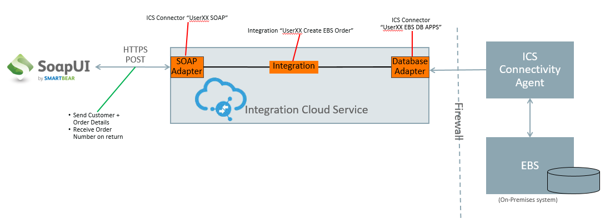
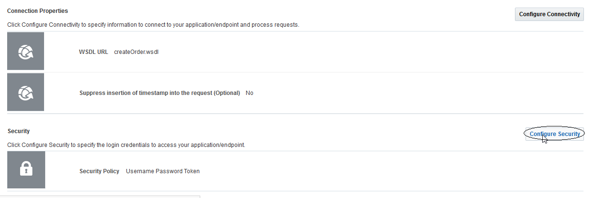
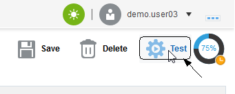

  

Update: March 30, 2017

# Lab 300 - Create an ICS Integration using a Database Adapter

---

## Introduction

This is the third of several labs that are part of the **ICS Development** workshop. 

In this lab, you develop an integration in ICS using a database adapter to query the Oracle EBS database.

## Objectives

- Learn how to create ICS Application Adapter Connections
- Learn how to create an ICS Orchestration using the ICS Adapter
- Learn how to test the ICS integration using SoapUI

## Required Artifacts

- The following lab and an Oracle Public Cloud account that will be supplied by your instructor.
- SoapUI will need to be installed for ICS integration testing - see "Prerequisites" section of the workshop for details

## Part 1: Create the ICS Connections

In the previous lab, a REST connection was created.  In a similar manner we need to create the connections necessary for the integration in this lab which are for the inbound SOAP web service as well as the EBS Database.

The ICS integration that we'll be building is shown in the following picture:

Here is a description of what is happening with this integration:

SoapUI will be used to test the exposed Web Service endpoint of the ICS integration called *Create EBS Order*.  This integration has 3 connections.  The incoming message is received by the incoming *Create Order* Soap Connection.  The *Create EBS Order* orchestration makes 2 queries into the EBS database using the *eBusiness Suite DB APPS* connection to get details needed to create an order.  The orchestration finally uses the *eBusiness Suite OPERATIONS* EBS Adapter connection for creating the order in EBS.  After the order is created in EBS, the Order Number is returned to the calling web service.

### **1.1**: Login to your Oracle Cloud account

---

- From your browser (Firefox or Chrome recommended) go to the following URL:
<https://cloud.oracle.com>
- Click Sign In in the upper right hand corner of the browser
- **IMPORTANT** - Under My Services, change Data Center to `US Commercial 2 (us2)` and click on Sign In to My Services

    

- If your identity domain is not already set, enter it and click **Go** (do not check to box to save it because this will set a cookie in the browser that needs to be cleared if you need to change identity domains later)  

    **NOTE:** the **Identity Domain** values will be given to you from your instructor.

      

- Once your Identity Domain is set, enter your `User Name` and `Password` and click **Sign In**

    ***NOTE:*** the **User Name and Password** values will be given to you by your instructor.

      

- You will be presented with a Dashboard displaying the various cloud services available to this account.

   **NOTE:** The Cloud Services dashboard is intended to be used by the *Cloud Administrator* user role.  The Cloud Administrator is responsible for adding users, service instances, and monitoring usage of the Oracle cloud service account.  Developers and Operations roles will go directly to the service console link, not through the service dashboard.

    

### **1.2**: Create SOAP Connections

---

**1.2.1** Select the `Connections` graphic in the designer portal

 

**1.2.2** Click on **New Connection**

 

**1.2.3** Select the **SOAP** Connection, by either doing a search, or by scrolling down to the **SOAP** connection, then click on the **Select** button of the **SOAP** connection.

**1.2.4** Fill in the information for the new connection 

- **Name** in the form of _UserXX SOAP_ where XX is the number in your allocated user.
- **Role** _Trigger_ since we going to use the connection as a trigger to start the integration

 

**1.2.5** click **Create**

 

**1.2.5** click the **Configure Connectivity** button

**1.2.6** for the *WSDL URL*, select the *Upload File* checkbox, then the *Upload* button.

 

**1.2.7** select the *Browse* button and browse to the file `createOrder.wsdl` which can be found in github relative to this lab here: 

 

**1.2.8** select the "Upload" button

**1.2.9** in the field *Suppress insertion of timestamp into the re..." field, select *No*, then select the *OK* button.  This selection will disable the need for the WS-Utility (WSU) Timestamp in the WS-Security header.  When we test inbound requests with Basic Auth security policy, no timestamps will be required.

**1.2.10** Select the *Configure Security* button so we can change the default security configuration which is set to **Username Token**. 

**1.2.11** Select *Basic Authentication* from the picklist of _Security Policies_, then select the *OK* button.

**1.2.12** At the top of the connection configuration screen, Click on the **Test** button to test the connection.

Note how the progress indicator will go from 75% to 100% after the connection tests successfully.

 

**1.2.13** Click on the **Save** button in the upper right corner of the connection configuration screen.

 

**1.2.14** Click on the **Exit Connection** button in the upper right of the connection configuration screen.

Your new SOAP connection appears in the list of configured connections and is even marked as **New** !

 

#### **1.2.2**: Create the Database Connection

## Part 2: Create the ICS Integration

---

#### **2.1**: Create Orchestration Integration

## Part 3: Test the ICS Integration

