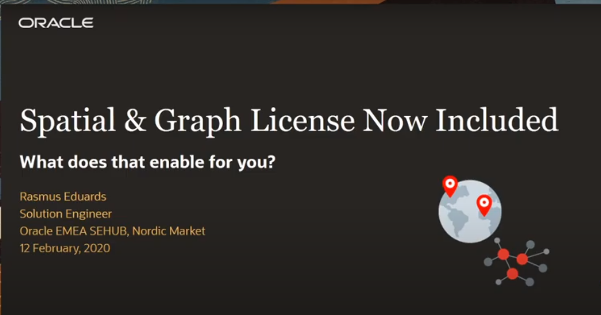

# Workshop Introduction and Overview

## Introduction to Oracle SPATIAL 

Oracle Spatial is an integrated set of functions, procedures, data types, and data models that support spatial analytics. The spatial features enable spatial data to be stored, accessed, and analyzed quickly and efficiently in an Oracle database.

Oracle Spatial is designed to make spatial data management easier and more natural to users of location-enabled applications and geographic information system (GIS) applications. Once spatial data is stored in an Oracle database, it can be easily manipulated, retrieved, and related to all other data stored in the database.

A common example of spatial data can be seen in a road map. A road map is a two-dimensional object that contains points, lines, and polygons that can represent cities, roads, and political boundaries such as states or provinces. A road map is a visualization of geographic information. 

The data that indicates the Earth location (such as longitude and latitude) of these rendered objects is the spatial data. When the map is rendered, this spatial data is used to project the locations of the objects on a two-dimensional piece of paper.

Oracle Spatial consists of the following: 

•	Schema (MDSYS)
•	A spatial indexing mechanism  	
•	Operators, functions, and procedures
•	Native data type for vector data called SDO-GEOMETRY(An Oracle table can contain one or more SDO-GEOMETRY columns.)

Scenario
MyCompany has several major warehouses. It needs to locate its customers who are near a given warehouse, to inform them of new advertising promotions. To locate its customers and perform location-based analysis, MyCompany must store location data for both its customers and warehouses. 
This tutorial uses CUSTOMERS and WAREHOUSES tables. 
Each table stores location using Oracle's native spatial data type, SDO-GEOMETRY. A location can be stored as a point in an SDO-GEOMETRY column of a table. The customer's location is associated with longitude and latitude values on the Earth's surface—for example, -63.13631, 52.485426.

 **Watch the video below for an overview of Oracle SPATIAL**

  
  

- [I have a Freetier or Oracle Cloud account](https://oracle.github.io/learning-library/data-management-library/database/multitenant/freetier/index.html)
- [I have an account from Livelabs](https://oracle.github.io/learning-library/data-management-library/database/multitenant/livelabs/index.html)

## Get an Oracle Cloud Trial Account for Free!
If you don't have an Oracle Cloud account then you can quickly and easily sign up for a free trial account that provides:
-	$300 of freee credits good for up to 3500 hours of Oracle Cloud usage
-	Credits can be used on all eligible Cloud Platform and Infrastructure services for the next 30 days
-	Your credit card will only be used for verification purposes and will not be charged unless you 'Upgrade to Paid' in My Services

Click here to request your trial account: [https://www.oracle.com/cloud/free](https://www.oracle.com/cloud/free)

## Acknowledgements

- **Authors/Contributors** - Arvind Bhope,Venkata Bandaru,Ashish Kumar,Priya Dhuriya , Maniselvan K.

- **Last Updated By/Date** - Laxmi A, kanika Sharma May 2020

- **Workshop Expiration Date**
  

### Issues?
Please submit an issue on our [issues](https://github.com/oracle/learning-library/issues) page. We review it regularly.

