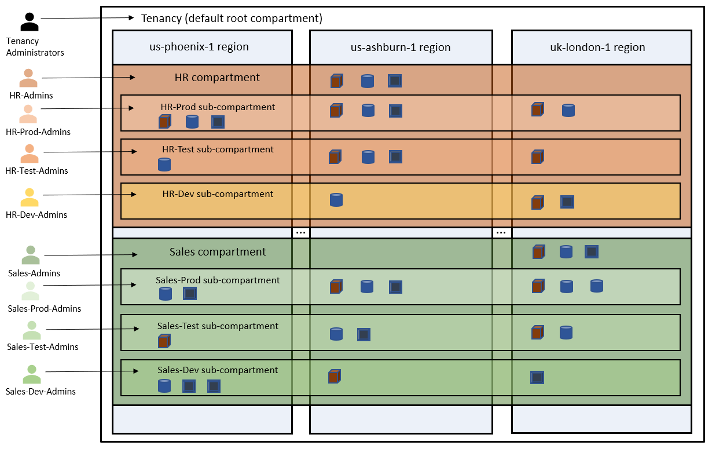

# Create a Compartment

## Overview

Compartments allow you to organize and control access to your cloud resources. A compartment is a collection of related resources (such as instances, virtual cloud networks, block volumes) that can be accessed only by certain groups that have been given permission by an administrator. A compartment should be thought of as a logical group and not a physical container. Additionally, when you begin working with resources in the OCI Console, the compartment acts as a filter for what you are viewing.

When you sign up for Oracle Cloud Infrastructure, Oracle creates your tenancy, which is the root compartment that holds all your cloud resources. You then create additional compartments within the tenancy (root compartment) and corresponding policies to control access to the resources in each compartment. When you create a cloud resource such as an instance, block volume, or cloud network, you must specify to which compartment you want the resource to belong.

This template allows you to create a compartment in Oracle Cloud.

## Before You Begin

Before you begin creating resources in Oracle Cloud Infrastructure, ensure that you have the following:

* Credentials for an Oracle Cloud tenancy

* Access to a computer that has the following software and access to the internet:

    * A [supported](https://docs.oracle.com/en/cloud/get-started/subscriptions-cloud/csgsg/web-browser-requirements.html) web browser for Oracle Cloud Infrastructure

### Prerequisites

* [Download](../scripts/terraform/resmgr/compartment.zip) the prebuilt Terraform script

### Required Parameters

| Resource       | Value |
|----------------|-------|
|Tenancy OCID    |Locate your [Tenancy OCID](https://docs.cloud.oracle.com/en-us/iaas/Content/General/Concepts/identifiers.htm)|
|Terraform Version | 0.11.x|

## Architecture

## Steps

- [Provision Resources](?lab=provision-resources)
- [Validate Provisioning](?lab=validate-provisioning)
