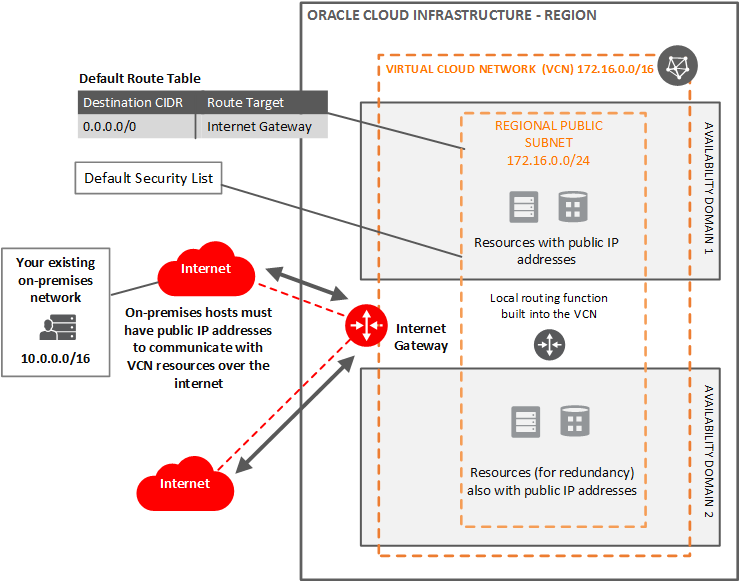

# Create a Virtual Cloud Network

## Overview

A virtual cloud network (VCN) is a customizable and private network in Oracle Cloud Infrastructure. Just like a traditional data center network, the VCN provides you with complete control over your network environment. This includes assigning your own private IP address space, creating subnets, route tables, and configuring stateful firewalls. A single tenant can contain multiple VCNs, thereby providing grouping and isolation of related resources. Oracle’s new 25Gb network infrastructure offers significantly more bandwidth and allows enterprises to cost effectively take full advantage of compute, storage, and database services.

This template creates a virtual cloud network (VCN) and a regional public subnet in Oracle Cloud Infrastructure.

> For more details, refer to Oracle Cloud Infrastructure Documentation [Networking Overview](https://docs.cloud.oracle.com/en-us/iaas/Content/Network/Concepts/overview.htm)

## Before You Begin

Before you begin creating resources in Oracle Cloud Infrastructure, ensure that you have the following:

* Credentials for an Oracle Cloud tenancy

* Access to a computer that has the following software and access to the internet:

    * A [supported](https://docs.oracle.com/en/cloud/get-started/subscriptions-cloud/csgsg/web-browser-requirements.html) web browser for Oracle Cloud Infrastructure

### Prerequisites

* [Download](../scripts/terraform/resmgr/vcn.zip) the prebuilt Terraform script

### Required Parameters

| Resource       | Value |
|----------------|-------|
|Tenancy OCID    |Locate your [Tenancy OCID](https://docs.cloud.oracle.com/en-us/iaas/Content/General/Concepts/identifiers.htm)|
|Terraform Version | 0.11.x|

## Architecture

## Steps

- [Provision Resources](?lab=provision-resources)
- [Validate Resources](?lab=validate-resources)
