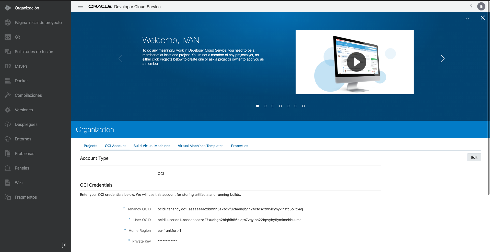
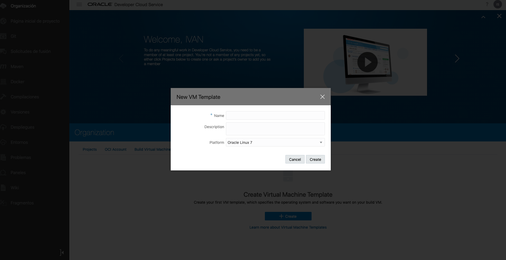
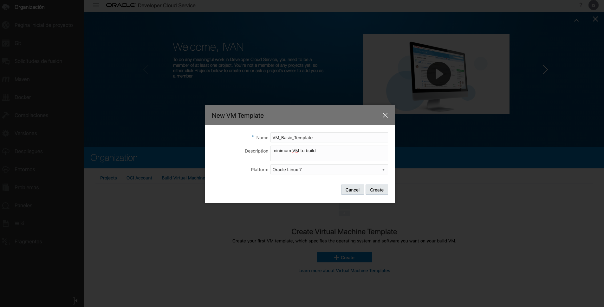
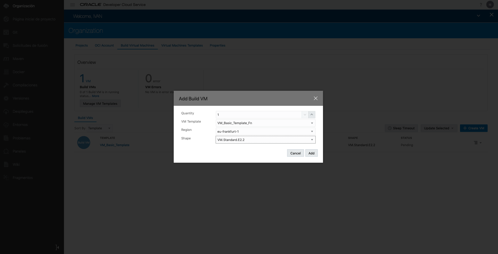

# Build Virtual Machines in Developer Cloud Service

## Before You Begin

In this lab you will create template configuration files and using these files. built virtual machines in Oracle Developer Cloud Service.

## **Step 1**: Configure Virtual Machines Templates in DevCS

1. Now we need to configure one or two VM servers to be able to build your project developments. We will create a VM Build Server to be used to compile and Build Microservices components and another to compile and Build Fn Function (Serverless) components that will require a different set of Software components:

  

2. To do this, we have to create a first virtual Machine Template to be used with Microservices, so click in Virtual Machines Templates tab:

  

3. Now click on Create button:

  

4. Provide a Name(like VM\_basic\_Template) and select Oracle Linux 7 as Platform:

  

5. Now Click in Configure Software button:

  

6. Now select the mínimum Software packages will will require later to build our project. If you remember from Introduction section, we will build microservices developed with Node JS v8 and Java . We will also require to access to OCI so OCICli will be required and thus Python will be also needed. Then we will have to build Docker images and also deploy those images in a Kubernetes Cluster thus KUBECtl will be needed too. Finally we also need the Minimum required Build VM components. So mark software components options below:

    - Docker 17.12
    - Kubectl
    - Node.js 8
    - OCIcli
    - Python 3.3.6
    - Required Build VM Components

  

7. Click in Done button and we will have finally our VM template created like below:

  

8. Now we will create a second Virtual Machine Template for Serverless Components. Click in Create Template again and fill in fields and click on Create button:

  

9. Now we will select specific Software components required for Fn Function build process. Click in Configure Software button:

  

10. Now configure software components. Fn 0 will have to be selected together with Docker, OCIcli, Kubectl, Python and required build VM
components. No Node JS and Java components this time required:

  

11. Click on Done and these are the software components in VM template:

  

## **Step 2**: Build Virtual Machines configuration in DevCS

1. Now we have to create a couple of real VM in OCI based in Virtual Machine template just created. So, we will select Build Virtual Machines Tab and will click on Create button:

  

2. Now Select 1 as quantity, select the previously created template, your region and finally select as Shape the option VM.Standard.E2.2:

  

3. Now your VM will start creation process

  

4. It is important to modify to Sleep Timeout a recommend value of300 minutes (basically longer than lab duration) so that once started, the build server won’t automatically enter into sleep mode.

  

5. And now we will create following the same process a second Build Virtual machine using the Fn Function defined template:

  

  

  *IMPORTANT NOTE: At this point try to manually start both VM Servers like in screenshot below:*

  

6. And check that Status changes to starting in both servers:

  

You can proceed to the next lab.

## Want to Learn More?

* [Oracle Developer Cloud Service Documentation](https://docs.oracle.com/en/cloud/paas/developer-cloud/index.html)

## Acknowledgements
* **Authors** -  Iván Postigo, Jesus Guerra, Carlos Olivares - Oracle Spain SE Team
* **Last Updated By/Date** - Tom McGinn, April 2020

See an issue?  Please open up a request [here](https://github.com/oracle/learning-library/issues). Please include the workshop name and lab in your request.
