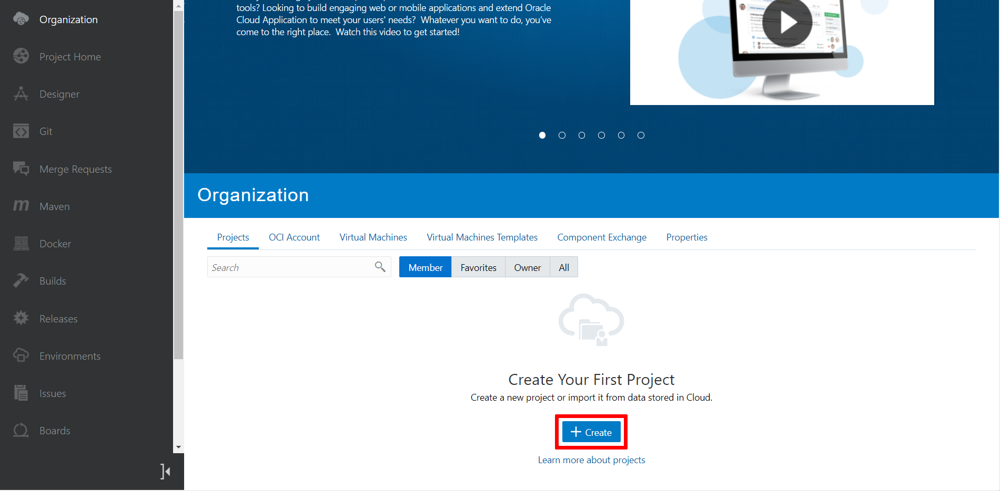
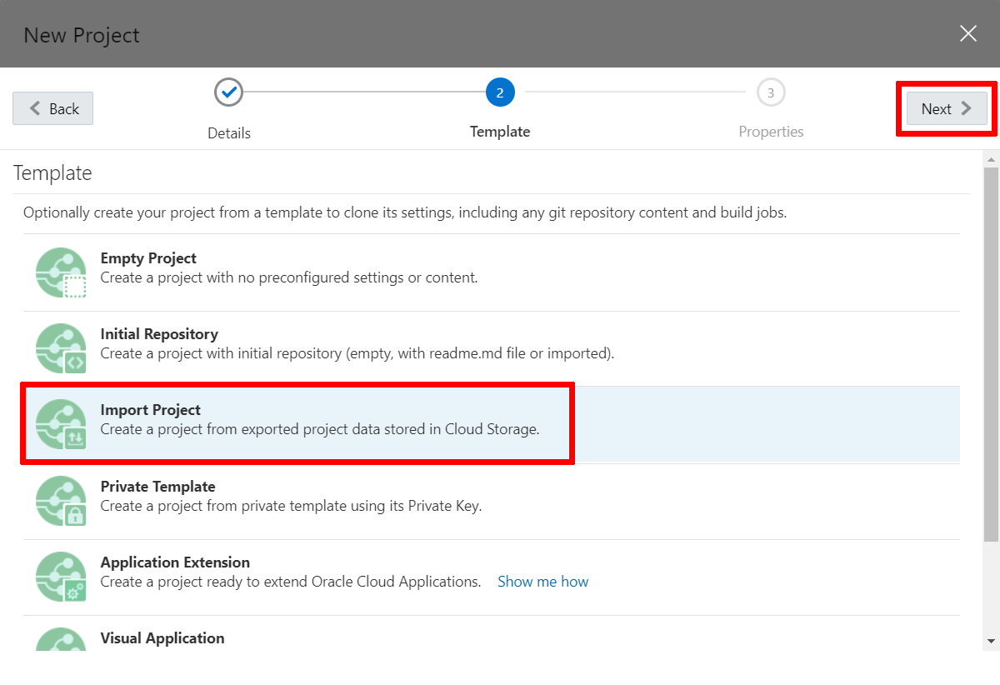
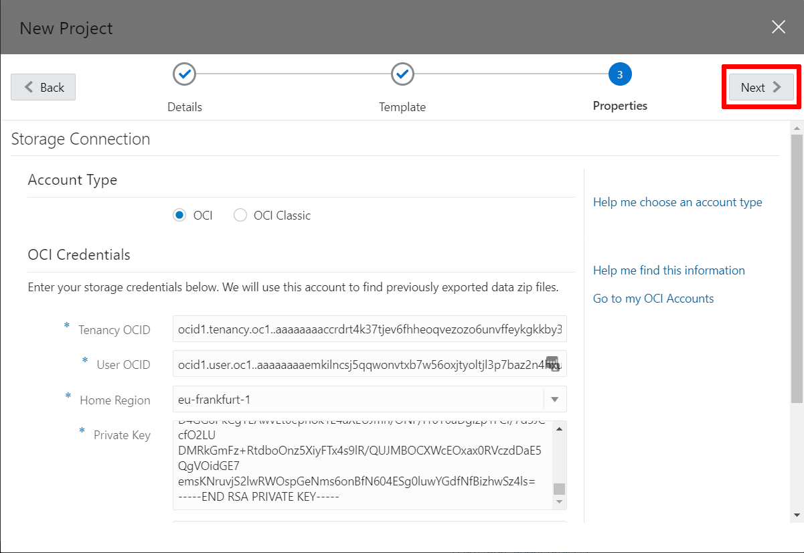
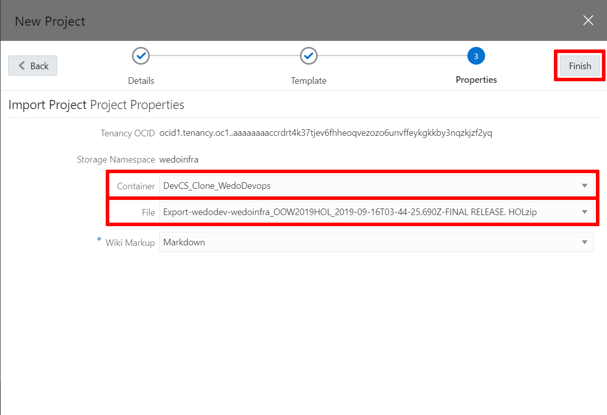
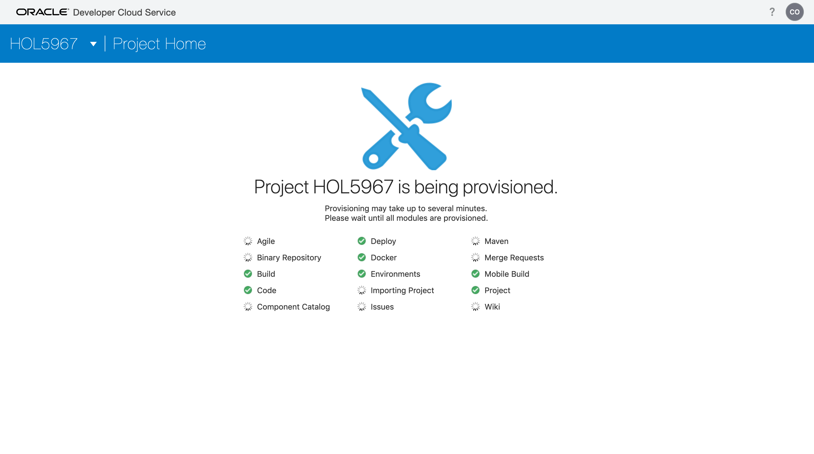
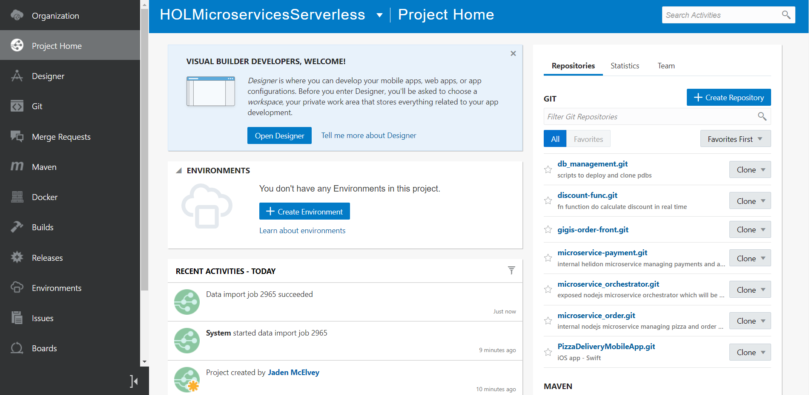
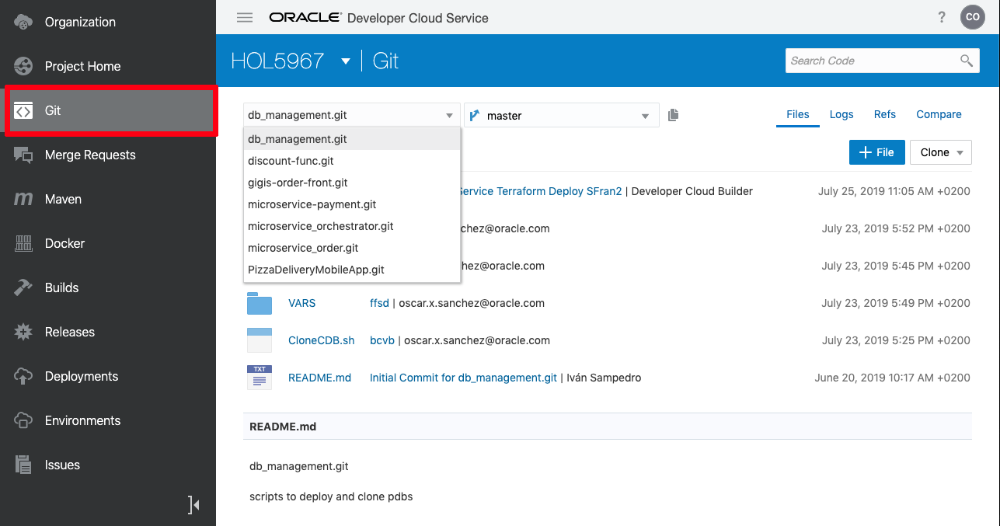
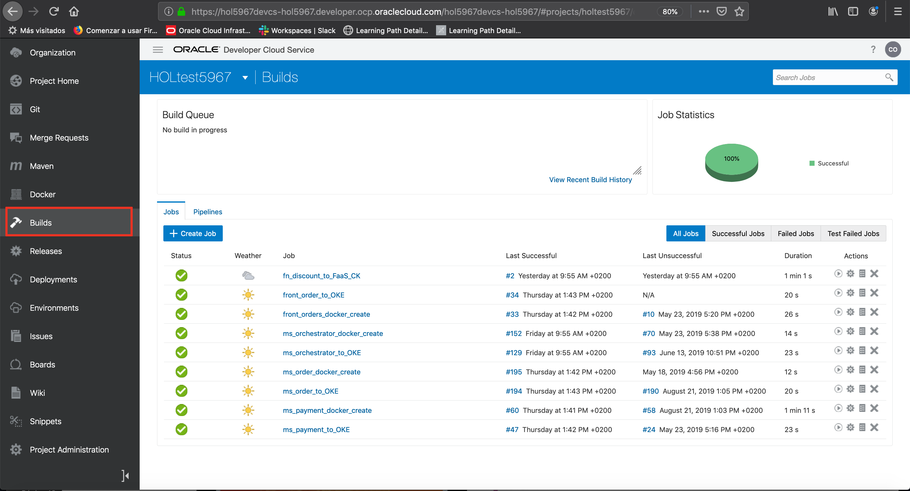
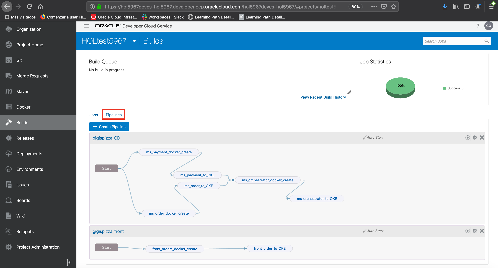

# Importing a Developer Cloud Service Project

## Introduction

Once that we have a Kubernetes Cluster, let’s move on to next step which is importing a DevCS that contains all the microservices that we will have to deploy in this Kubernetes Cluster.

Estimated time: 10 - 15 min

### Objectives

* Learn how to import a DevCS that contains all the microservices

### Lab Prerequisites

This lab assumes you have completed the following labs:
* Lab: Sign up for a Free Trial
* Lab: Provision a DevCS Instance
* Lab: Build Virtual Machines in Developer Cloud Service
* Lab: Create a Kubernetes Cluster
* Lab: Install the Front-end Client

## **Step 1**: Import a Developer Cloud Service Project

1. Go to your DevCS instance and in Organization Menu option, under Projects tab, click **Create**.

  

2. Enter a Name for your Project, for Security select Private and your Preferred Language. Then Click **Next**:

  

3. In Template Section, select Import Project Option:

  

4. For Properties section, we will provide you with details to connect to a preconfigured DevCS instance from which you an import the project in this url:

  [https://github.com/oraclespainpresales/GigisPizzaHOL/tree/master/microservices/Credentials](https://github.com/oraclespainpresales/GigisPizzaHOL/tree/master/microservices/Credentials)

5. Click on Next:

  

6. In next section, select the Container named: “DevCS\_Clone\_Wedodevops” and the zip File available with the Project export to be imported. Then Click **Finish**:

  

7. Then project start importing process:

  

8. Importing project goes on:

  

9. Finally you will have project imported:

  

10. Review different projects source code in Git menu:

  Note: We will work in next sections with all git but db\_management.git and PizzaDeliveryMobileApp.git

  

11. Now go to Builds Menu option and check different Jobs.

  

12. And click **Pipelines** tab to check different Pipelines.

  

You can proceed to the next lab.

## Acknowledgements
* **Authors** -  Iván Postigo, Jesus Guerra, Carlos Olivares - Oracle Spain SE Team
* **Last Updated By/Date** - Tom McGinn, April 2020

See an issue?  Please open up a request [here](https://github.com/oracle/learning-library/issues). Please include the workshop name and lab in your request.
