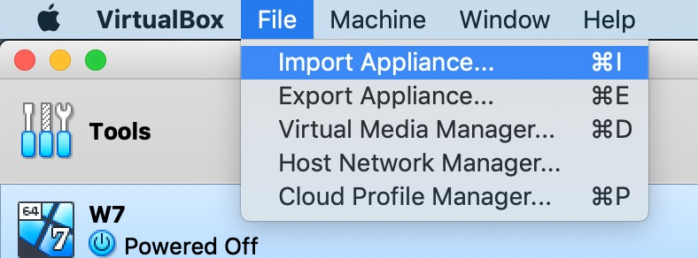
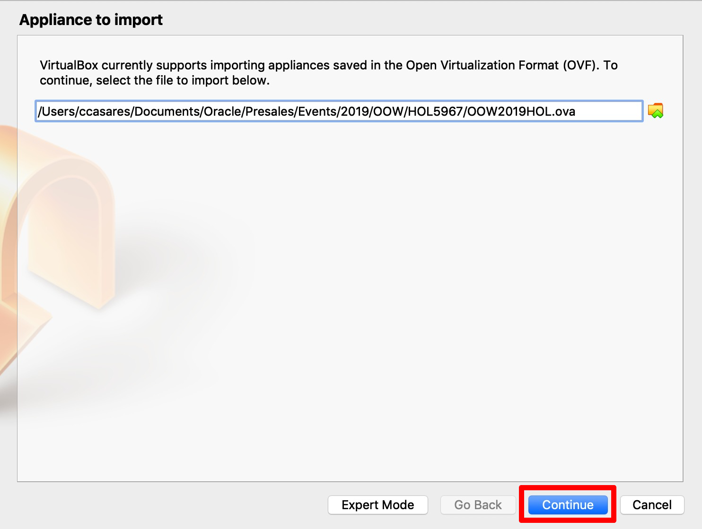
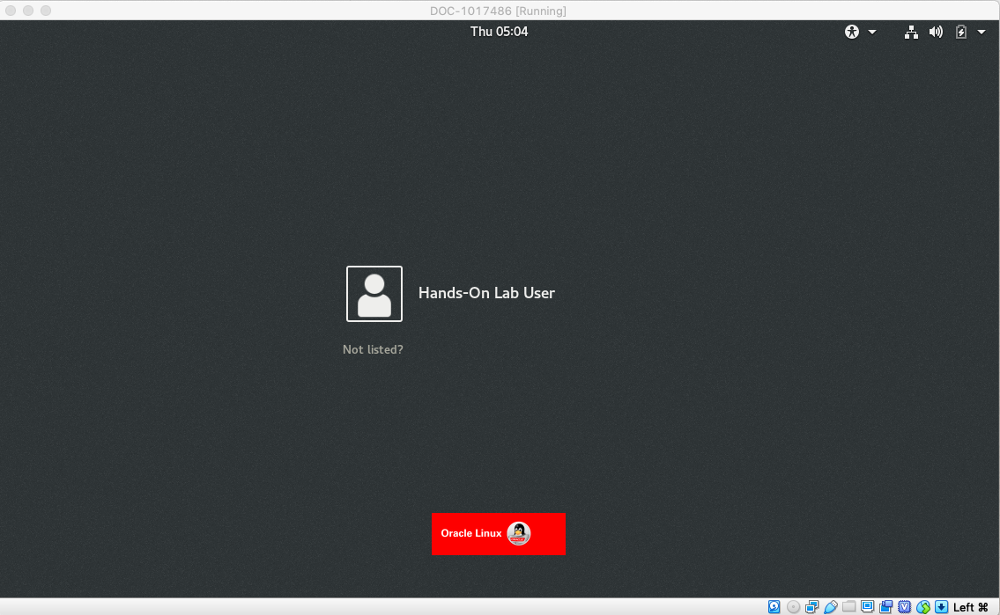
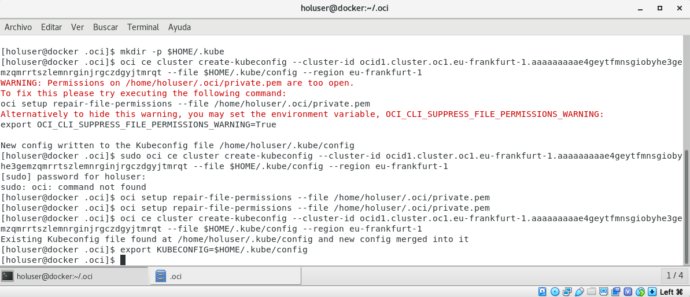
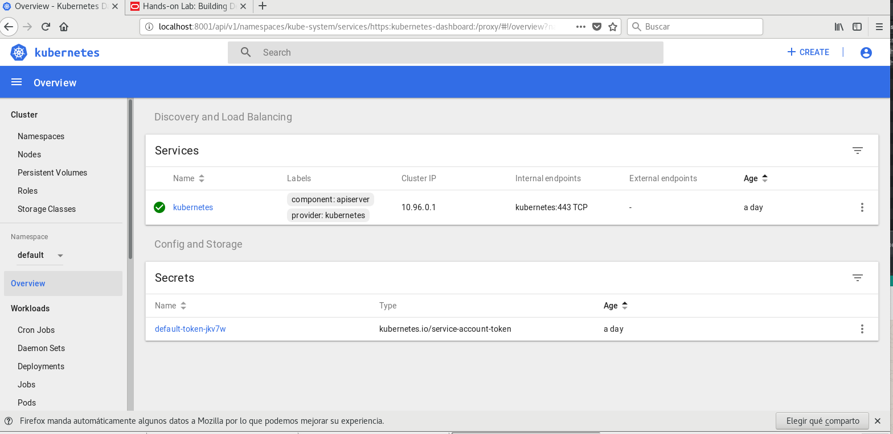
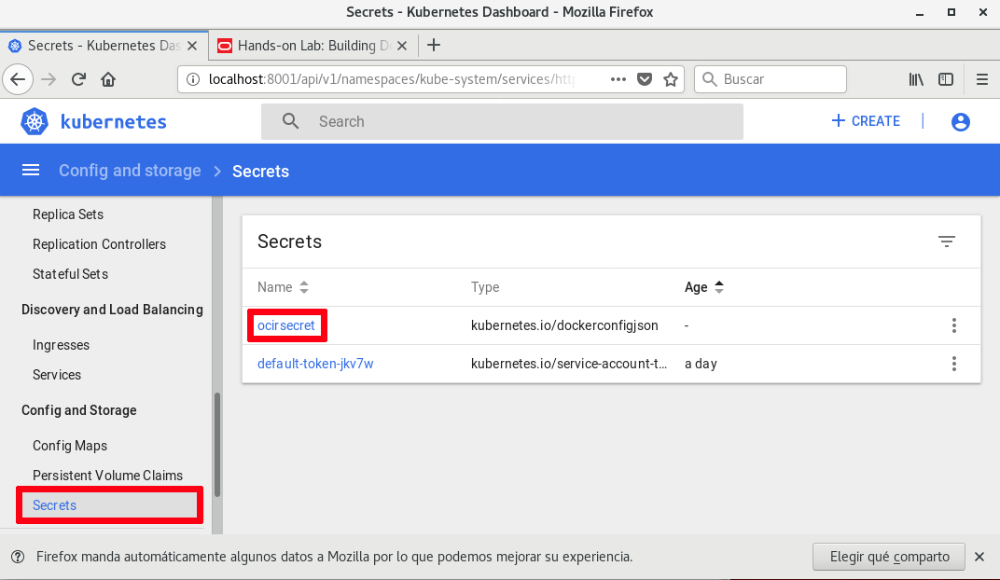
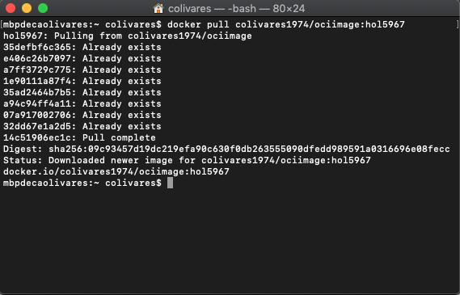
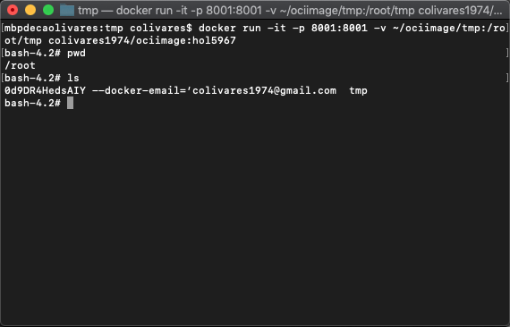
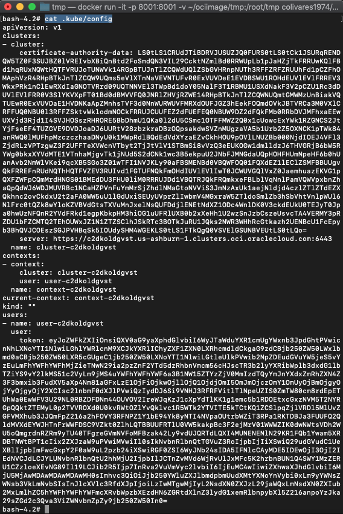

# Install a Front-end Client ???

## Before You Begin

Rather than requiring that you install Python and other software, the front-end application and related components have been created for you. In this lab, you'll choose to install the front-end client as a Virtual Box image (VM) or Docker image.

* You should choose the [Oracle VirtualBox](https://www.virtualbox.org/) option if you have neither Virtual Box nor Docker installed already.

* You should choose Docker if you are using an Apple Macbook or other Linux-based PC and have Docker installed.

*Note: you only need to choose one of the front-end client options.*

## Option 1: Install the Front-end Client as a VirtualBox image

1. Download OVA image from [here](https://objectstorage.eu-frankfurt-1.oraclecloud.com/p/hZnw2wJSeVpigjnOHBwSO9-GcZrdNyjqgWi1FObBvHg/n/wedoinfra/b/DevCS_Clone_WedoDevops/o/HOL5967-OOW2019.ova "ova hol").

  *Note: If you are not familiar with VirtualBox, please make sure you have Guest Additions installed or follow this manual to install: [https://www.virtualbox.org/manual/ch04.html\#sharedfolders](https://www.virtualbox.org/manual/ch04.html#sharedfolders)*

  This tooling will help you for instance to copy/paste between the VM and the host.

2. Once Image is downloaded or copied, please import the image in Oracle VM VirtualBox. Select **Menu File and Import Appliance…**:

  

3. Then choose the path to the .OVA copied or downloaded before and click in Continue button:

  

4. Leave default options and click on Import button:

  

5. The process will take several minutes:

  

6. Once imported, you will have a VM named DOC-1017486. Start the VM by clicking in start button:

  

7. It should take some time to start the VM. Click on enter and you should see the login screen.

  **NOTE:** If you face any issue, please check that Graphic Controller selected is VBoxSVGA as there are some issues in VirtualBox 6 if you use a different one.

  

8. Click on Hand-On Lab User. Password for user is oracle.

  

### Configure `ocicli`

1. Once logged in, open a terminal window and execute next command to configure ocicli:

  ```
  <copy>oci setup config</copy>
  ```

  

2. Keep the txt file with your OCI Tenancy parameters close as you will be asked for those parameters. Before starting, please copy into the VM the private key previously provided:

  

  

3. Decline to generate a new RSA key pair, copy your private key previously provided into the VM. We recommend you to paste it into this path:

  ```
  <copy>/home/holouser/.oci</copy>
  ```

  

4. Now let’s configure kubectl. Inside your cluster information page, click the “Access Kubeconfig” button:

  

5. A popup window will appear providing you with the commands you have to run to configure kubectl to connect to the Kubernetes cluster just created(change value below with your own cluster id and region):

  ```
  <copy>mkdir -p $HOME/.kube
  mkdir -p $HOME/.kube
  oci ce cluster create-kubeconfig --cluster-id <your_cluster_id> --file $HOME/.kube/config --region eu-frankfurt-1 --token-version 2.0.0
  export KUBECONFIG=$HOME/.kube/config</copy>
  ```

  

6. When you execute commands below, you can face an issue and you must run an extra command to configure private key permissions:

   ```
   <copy>oci setup-repair-file-permissions –file /home/holouser/.oci/private.pem</copy>
   ```

  

7. You will follow steps mentioned in Access Kubernetes Dashboard section, so that we can launch the Kubernetes Dashboard:

  

8. Click on SIGN IN button and finally you are logged in Kube Dashboard:

  

9. To enable Kubernetes to pull an image from Oracle Cloud Infrastructure Registry when deploying an application, you need to create a Kubernetes secret. The secret includes all the login details you would provide if you were manually logging in to Oracle Cloud Infrastructure Registry using the docker login command, including your auth token.

  Run kubectl command below with your credentials(remember that username is made of object storage namespace/username and password is the Authtoken we generated):

  ```
  <copy>kubectl create secret docker-registry ocirsecret --docker-server=fra.ocir.io --docker-username='frcjosyavuar/carlos.j.olivares@oracle.com' --docker-password='gewuo5U)b2)T6;r1yL\>1' --docker-mail='carlos.j.olivares@oracle.com'</copy>
  ```

  

10. If you go then to Kubernetes Dashboard in browser inside the VM and navigate to Secrets menu under Config and Storage Area, you will see the Secret you have just created:

  

**IMPORTANT NOTE:** Once you have completed section, proceed to the next lab []().

## Option 2: Install the Front-end Client as a Docker image

1. If you have docker already installed in your laptop (ideally on Mac or Linux as Windows docker version may face some issues), open a terminal window and pull docker image associated to this hands-on-lab:

  ```
  <copy>docker pull colivares1974/ociimage:hol5967</copy>
  ```

  

2. Now create a folder in your local drive:

  Linux/MacOS:

  ```
  <copy>mkdir -p ~/ociimage/tmp</copy>
  ```

  or Windows:

  ```
  c:\> <copy>md ociimage/tmp</copy>
  ```

  

3. Launch Container while mounting the `ociimage` file:

  ```
  <copy>docker run -it -p 8001:8001 -v ~/ociimage/tmp:/root/tmp colivares1974/ociimage:hol5967</copy>
  ```

  

### Configure `ocicli`

Now let’s configure access to oci tenancy via ocicli with our tenancy details. info will be used by kubectl to configure a config file to access to Kubernetes cluster previously created. Then, to enable Kubernetes to pull an image from Oracle Cloud Infrastructure Registry when deploying our application, you need to create a Kubernetes secret. The secret includes all the login details you would provide if you were manually logging in to Oracle Cloud Infrastructure Registry using the docker login command, including your auth token. Finally we will launch Kubernetes proxy so that we can have access to Kubernetes Dashboard from a web browser.

1. Edit oci config file using. Modify config file with your tenancy details:

  ```
  <copy>nano .oci/config</copy>
  ```

  

2. Modify config file with your tenancy details(User OCID, Fingerprint, Tenancy OCID and Region). Keep path to private key in key\_file as it has already been loaded to that default path. When done press CTRL+o to save changes and CTRL+x to close nano editor:

  

3. Launch command to create a kubeconfig file modifying cluster-id and region with your tenancy details:

  ```
  <copy>oci ce cluster create-kubeconfig --cluster-id <cluster-id> --file $HOME/.kube/config --region <region></copy>
  ```
  For example:

  ```
  oci ce cluster create-kubeconfig --cluster-id ocid1.cluster.oc1.iad.aaaaaaaaafqtomjsmq3tszddmuyggyrtmqzdenzrmyygmzjzhc2dkoldgvst --file $HOME/.kube/config --region us-ashburn-1
  ```

  

4. You can check details for config file created:

  ```
  <copy>cat .kube/config</copy>
  ```

  

5. To setup KUBECONFIG env variable, run next command:

  ```
  <copy>export KUBECONFIG=$HOME/.kube/config</copy>
  ```

6. Now let’s create Secret. You need to execute command below with your own tenancy credentials:

  ```
  <copy>kubectl create secret docker-registry ocirsecret --docker-server=<region>.ocir.io --docker-username='<object_storage namespace>/<tenancy username>' --docker-password='<Auth Token>' --docker-email='<tenancy_username>'</copy>
  ```

  For example:

  ```
  kubectl create secret docker-registry ocirsecret --docker-server=iad.ocir.io --docker-username='idkmbiwb03s9/colivares1974@gmail.com' --docker-password='vm{wRs\>0d9DR4HedsAIY' --docker-email='colivares1974@gmail.com'
  ```

  

  If successful, this line should appear as shown in the image above:

  ```
  $ secret/ocirsecret created
  ```

  You can proceed to the next lab.

  ## Want to Learn More?

  * [Oracle VirtualBox Documentation](https://www.virtualbox.org/wiki/Documentation)
  * [Docker Documentation](https://docs.docker.com/)

  ## Acknowledgements
  * **Authors** -  Iván Postigo, Jesus Guerra, Carlos Olivares - Oracle Spain SE Team
  * **Last Updated By/Date** - Tom McGinn, April 2020

  See an issue?  Please open up a request [here](https://github.com/oracle/learning-library/issues). Please include the workshop name and lab in your request.
