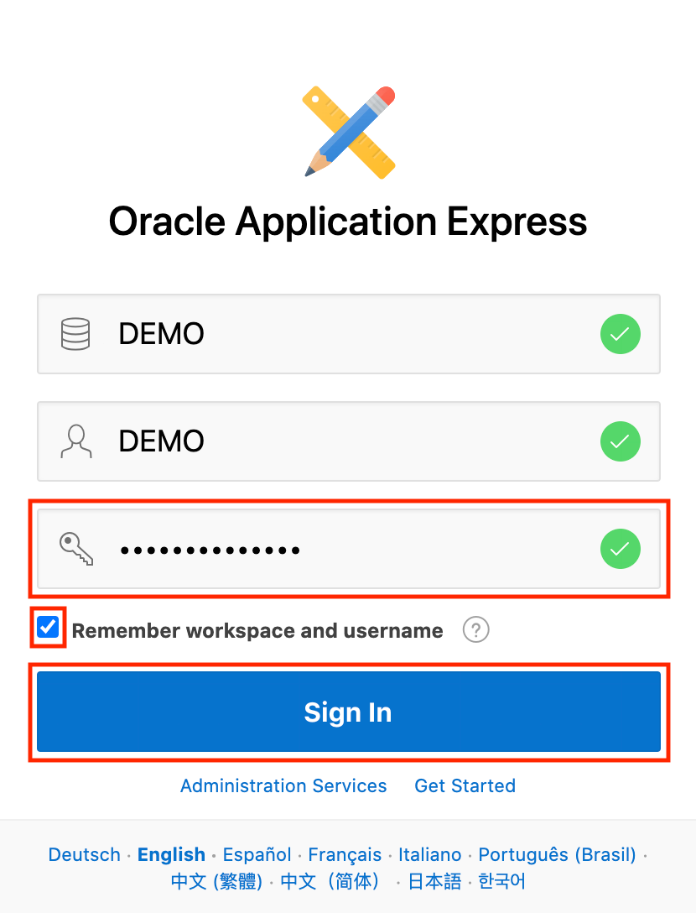

# Create an APEX App to Make Sense of the Data
## Overview

This lab will show you how to create an APEX application that will help make sense of the type of data being collected by the microservices created in the previous labs.

### Objectives

* Create an APEX workspace in ATP
* Create an APEX app using a file

### What Do You Need?

* An ATP database (created in Lab 1)

## **Step 1:** Create a new workspace in APEX

When you first access APEX you will need to log in as an APEX instance administrator to create a workspace. A workspace is a logical domain where you define APEX applications. Each workspace is associated with one or more database schemas (database users) which are used to store the database objects, such as tables, views, packages, and more. These database objects are generally what APEX applications are built on top of.

1.  Navigate to either of the ATP Database instances created in Lab 1. Click the **Tools** tab and then the **Open APEX** button.

    

2.  Enter the password for the Administration Services and click **Sign In to Administration**. The password should match the one you used when creating the ATP instance.

    

3.  Click **Create Workspace**.

   

4.  Set **Database User** to **DEMO**, enter a password (you may wish to reuse the admin password from before), and then click **Create Workspace**.

    

5.  After the workspace is created, click the **DEMO** link in the success message. This will log you out of APEX administration so that you can log into your new workspace.

    

6.  Enter the password you used when creating the workspace, check the **Remember workspace and username** checkbox, and then click **Sign In**.

    

You have successfully created an APEX workspace where you can begin creating applications.

