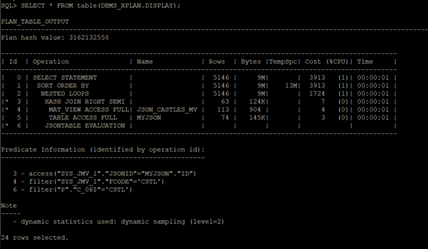

# Oracle Database 19c JSON Documents

## JSON Materialized View Support

Materialized views query rewriting has been enhanced so that queries with ***JSON_EXISTS***, ***JSON_VALUE*** and other functions can utilize a materialized view created over a query that contains a ***JSON_TABLE*** function.

This feature is particularly useful when the JSON documents in a table contain arrays. This type of materialized view provides fast performance for accessing data within those JSON arrays.

## Materialized View With Fast Refresh For Query Rewrite

As a performance enhancement in Oracle 19c, if you create a refresh-on-statement materialized view over json_table  and some other conditions apply then a query that matches the query defining the view can be rewritten to a materialized-view table access. You can use this feature instead of creating multiple functional indexes.

### Create A Materialized View

Create a materialized view that will help us retrieve information about the medieval castles, using the ***ON STATEMENT*** clause. The ***ENABLE QUERY REWRITE*** clause is not mandatory, the performance enhancements apply even if it’s not specified. Notice the error and null handling is specified explicitly for each column.

````
<copy>CREATE MATERIALIZED VIEW json_castles_mv
REFRESH FAST ON STATEMENT
ENABLE QUERY REWRITE
AS
SELECT j.id jsonID, jt.geonameId ID, jt.countryName Country,
       convert(jt.adminName1,'WE8ISO8859P1','AL32UTF8') Region,
       convert(jt.adminName2,'WE8ISO8859P1','AL32UTF8') Sub_Region,
       jt.fcode, convert(jt.toponymName,'WE8ISO8859P1','AL32UTF8') Title,
       convert(jt.name,'WE8ISO8859P1','AL32UTF8') Name FROM MYJSON j,
JSON_TABLE(DOC, '$' COLUMNS
 (NESTED PATH '$.geonames[*]'
  COLUMNS (countryName VARCHAR2(80) PATH '$.countryName' ERROR ON ERROR NULL ON EMPTY,
           adminName1 VARCHAR2(80) PATH '$.adminName1' ERROR ON ERROR NULL ON EMPTY,
           adminName2 VARCHAR2(80) PATH '$.adminName2' ERROR ON ERROR NULL ON EMPTY,
           toponymName VARCHAR2(120) PATH '$.toponymName' ERROR ON ERROR NULL ON EMPTY,
           name VARCHAR2(80) PATH '$.name' ERROR ON ERROR NULL ON EMPTY,
           adminCode1 VARCHAR(8) PATH '$.adminCode1' ERROR ON ERROR NULL ON EMPTY,
           fcode VARCHAR2(6) PATH '$.fcode' ERROR ON ERROR NULL ON EMPTY,
           geonameId VARCHAR2(10) PATH '$.geonameId' ERROR ON ERROR NULL ON EMPTY)))
AS jt;</copy>
````

Test the materialized view with the following query. Optionally, use set timing on when running this query, and the query we used to retrieve information about castles after we retrieved all required JSON documents from the GeoNames web service, and compare the results. The difference may look insignificant, because there are only 269 castles, but imagine that we could have millions of rows in one application, and thousands of concurrent users.

````
<copy>set timing on</copy>
````

````
> <copy>SELECT Country, Region, Sub_Region, Title, Name FROM json_castles_mv WHERE fcode = 'CSTL';</copy>
````

In the following section we will get into more details about performance.

## Performance Boost

Significant performance gains can often be achieved using query rewrite and materialized views, and in this exercise we will examine how these performance gains can be achieved without the need to change the application.

### Check Query Rewrite Mechanism

We will use the following SELECT statement as an example. Run this query on the database. It returns the first castle in every sub-region, so it should list 45 castles.

````
<copy>column CODE format a4</copy>
````

````
> <copy>SELECT JSON_VALUE(doc, '$.geonames[0].fcode') Code,
       JSON_VALUE(doc, '$.geonames[0].countryName') Country,
       JSON_VALUE(doc, '$.geonames[0].adminName1') Region,
       JSON_VALUE(doc, '$.geonames[0].adminName2') Sub_Region,
       JSON_VALUE(doc, '$.geonames[0].toponymName') Title,
       JSON_VALUE(doc, '$.geonames[0].name') Name
from MYJSON
  where JSON_VALUE(doc, '$.geonames[0].fcode') = 'CSTL'
  order by Region, Sub_Region;</copy>
````


Flush the shared pool, flushing the cached execution plan and SQL Queries from memory.

````
> <copy>ALTER SYSTEM FLUSH SHARED_POOL;</copy>
````

Display the execution plan chosen by the Oracle optimizer for this statement.

````
> <copy>EXPLAIN PLAN for
  SELECT JSON_VALUE(doc, '$.geonames[0].fcode') Code,
         JSON_VALUE(doc, '$.geonames[0].countryName') Country,
         JSON_VALUE(doc, '$.geonames[0].adminName1') Region,
         JSON_VALUE(doc, '$.geonames[0].adminName2') Sub_Region,
         JSON_VALUE(doc, '$.geonames[0].toponymName') Title,
         JSON_VALUE(doc, '$.geonames[0].name') Name
  from MYJSON
  where JSON_VALUE(doc, '$.geonames[0].fcode') = 'CSTL'
  order by Region, Sub_Region;</copy>
````

The ***DBMS_XPLAN*** package provides an easy way to display the output of the ***EXPLAIN PLAN*** command in several, predefined formats. By default, the table function ***DISPLAY*** format and display the contents of a plan table.

We can see the dot notation calls get rewritten as a ***JSON_TABLE*** call, because we can see the ***JSONTABLE EVALUATION*** step in the plan (6), and we can see the data has been returned from the ***JSON_CASTLES_MV*** materialized view (4).

````
> <copy>SELECT * FROM table(DBMS_XPLAN.DISPLAY);</copy>

Plan hash value: 3162132558

---------------------------------------------------------------------------------------------------
| Id  | Operation		| Name		  | Rows  | Bytes |TempSpc| Cost (%CPU)| Time	  |
---------------------------------------------------------------------------------------------------
|   0 | SELECT STATEMENT	|		  |  5146 |	9M|	  |  3915   (1)| 00:00:01 |
|   1 |  SORT ORDER BY		|		  |  5146 |	9M|    13M|  3915   (1)| 00:00:01 |
|   2 |   NESTED LOOPS		|		  |  5146 |	9M|	  |  1726   (1)| 00:00:01 |
|*  3 |    HASH JOIN RIGHT SEMI |		  |    63 |   124K|	  |	7   (0)| 00:00:01 |
|*  4 |     MAT_VIEW ACCESS FULL| JSON_CASTLES_MV |   113 |   904 |	  |	4   (0)| 00:00:01 |
|   5 |     TABLE ACCESS FULL	| MYJSON	  |    75 |   147K|	  |	3   (0)| 00:00:01 |
|*  6 |    JSONTABLE EVALUATION |		  |	  |	  |	  |	       |	  |
---------------------------------------------------------------------------------------------------
````


If the query is too simple, there may not be a query rewrite, in this case it will not be eligible to be rewritten to use the materialized view.

## Acknowledgements

- **Author** - Valentin Leonard Tabacaru
- **Last Updated By/Date** - Troy Anthony, April 2020

See an issue?  Please open up a request [here](https://github.com/oracle/learning-library/issues).   Please include the workshop name and lab in your request. 

---
