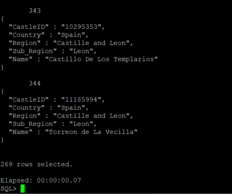
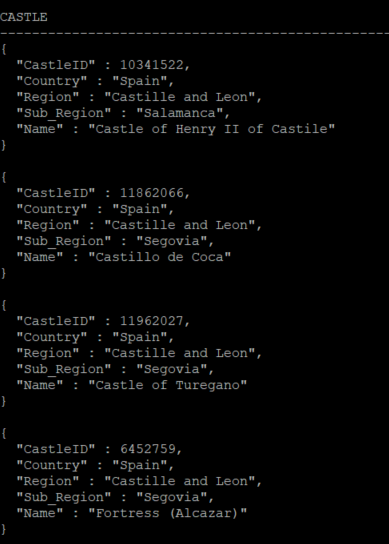
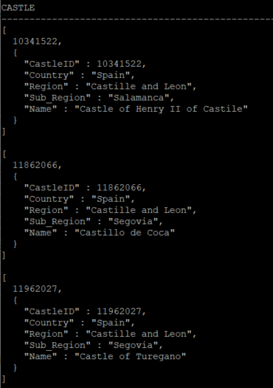

# Oracle Database 19c JSON Documents

## JSON-Object Mapping

This feature enables the mapping of JSON data to and from user-defined SQL object types and collections. You can convert JSON data into an instance of a SQL object type using SQL/JSON function ***JSON_VALUE***. In the opposite direction, you can generate JSON data from an instance of a SQL object type using SQL/JSON function ***JSON_OBJECT*** or ***JSON_ARRAY***.

## Create Your Own JSON Structure

We will start with the second use case, generating JSON data using SQL/JSON function ***JSON_OBJECT***. You will use the relational data from the ***JSON_CASTLES_MV*** materialized view to generate JSON documents with a customized structure.

### Insert Castles Data Using A Custom JSON Structure

Use this statement to generate data representing a JSON document version of a materialized view relational record.

````
> <copy>SELECT JSON_OBJECT(
               'CastleID' : id,
               'Country' : country,
               'Region' : region,
               'Sub_Region' : sub_region,
               'Name' : '"' || title || '"'
             FORMAT JSON)
  FROM json_castles_mv WHERE fcode = 'CSTL';</copy>
````


Some client drivers (like SQL Developer, for example) might try to scan query text and identify bind variables before sending the query to the database. In some such cases a colon as name–value separator in ***JSON_OBJECT*** might be misinterpreted as introducing a bind variable. You can use keyword VALUE as the separator to avoid this problem ('Country ' VALUE country), or you can simply enclose the value part of the pair in parentheses: 'Country':(country). Here is the same SELECT statement, that can be executed successfully in SQL Developer.

````
> <copy>SELECT JSON_OBJECT(
               key 'CastleID' value id,
               key 'Country' value country,
               key 'Region' value region,
               key 'Sub_Region' value sub_region,
               key 'Name' value '"' || title || '"'
             FORMAT JSON)
  FROM json_castles_mv WHERE fcode = 'CSTL';</copy>
````

These JSON documents generated from the relational data, and having a completely personalized structure, can be inserted in our table.

````
> <copy>INSERT INTO MYJSON (doc)
  SELECT JSON_OBJECT(
               'CastleID' : id,
               'Country' : country,
               'Region' : region,
               'Sub_Region' : sub_region,
               'Name' : '"' || title || '"'
             FORMAT JSON)
  FROM json_castles_mv WHERE fcode = 'CSTL';</copy>
````

````
> <copy>COMMIT;</copy>
````


Run the following select to verify the inserted documents, and observe these are individual JSON objects, describing each medieval castle, from the 269 entries we have in this database.

````
> <copy>SELECT j.id, JSON_SERIALIZE(j.doc PRETTY) FROM myjson j WHERE j.doc."CastleID" is not null;</copy>
````



Observe the structure, and values, in these JSON documents. Note it is easier for our Tourist Recommendations application to list these castles for our end users.

## JSON To User-Defined Object Type Instance

Conversely, you can convert JSON documents to a user-defined object type.

### Create A New Type And Retrieve Data

We can create object types that may not match the JSON data in the table. One with all attributes, and another one with fewer attributes than the JSON data available in the database. Create a new type with all the attributes of our JSON documents.

````
> <copy>CREATE TYPE t_castle AS OBJECT (
  "CastleID"  NUMBER(10),
  "Country"  VARCHAR2(10),
  "Region"  VARCHAR2(120),
  "Sub_Region"  VARCHAR2(120),
  "Name"  VARCHAR2(120)
  );
/
</copy>
````

Now convert the JSON data to an instance of a SQL object type using the SQL/JSON function ***JSON_VALUE***. This can be done in just one query.

````
> <copy>SELECT JSON_VALUE(j.doc, '$' RETURNING t_castle) AS castle FROM myjson j WHERE j.doc."CastleID" is not null;</copy>
````


In Oracle Database 19c, the function ***JSON_VALUE*** also accepts an optional ***RETURNING*** clause, apart from the optional ERROR clause we tested already. In this case, the ***JSON_VALUE*** function uses the user-defined object type in the ***RETURNING*** clause, and returns the instantiated object type from a query, based on the data in the source JSON document.

### Use Multiple Types For Same Data

Create another object type that doesn’t match the JSON data in our documents. This object type gives a simplified version of the JSON structure, using only two attributes. Imagine we have a list of all medieval castles in our application, and we just want to display the names, using the ID as a reference. In this case don’t want to use memory for attributes that we don’t use, and a simpler object type would do the job.

````
> <copy>CREATE TYPE t_castle_short AS OBJECT (
  "CastleID"  NUMBER(10),
  "Name"  VARCHAR2(120)
  );
/
</copy>
````

Review the results of this query, compared with the previous one, and check the differences.

````
> <copy>SELECT JSON_VALUE(j.doc, '$' RETURNING t_castle_short) AS castle FROM myjson j WHERE j.doc."CastleID" is not null;</copy>
````


These custom object types can be used to optimize our applications, directly from the database layer.

### Create A Table With Columns Of Custom Type

Custom object types can be used also as for table columns. Create this new table, with one single column, of a custom type.

````
> <copy>CREATE TABLE mycastles ( castle t_castle );</copy>
````

Insert into the new table the information about our all 269 medieval castles.

````
> <copy>INSERT INTO mycastles
  SELECT JSON_VALUE(j.doc, '$' RETURNING t_castle) AS castle
  FROM myjson j WHERE j.doc."CastleID" is not null;</copy>
````

````
> <copy>COMMIT;</copy>
````

Select all 269 records from the new table, returned as user-defined SQL objects.

````
> <copy>SELECT * FROM mycastles;</copy>
````


Now we have just the castles in a new table, with the attributes we need in our application.

## User-Defined Object Type Instance To JSON

It would be equally easy to convert user-defined SQL object type instances into JSON documents.

### Convert To JSON A Custom Type

Using the ***JSON_OBJECT*** function, we can retrieve the JSON representation of this data, stored using the user-defined object types, from our new table.

````
> <copy>SELECT JSON_OBJECT(castle) AS castle FROM mycastles;</copy>
````


In this case our application uses JSON format, and you can make this conversion on the fly from the SELECT statement.

### Use Pretty Format

The pretty format may help you to better understand the output.

````
> <copy>SELECT JSON_SERIALIZE( JSON_OBJECT(castle) PRETTY) AS castle FROM mycastles;</copy>
````


This is a very simple example, and it is not totally necessary, but imagine you have JSON documents with hundreds of attributes.

### Group Custom Format Values In Array

The ***JSON_ARRAY*** function will also convert user-defined object type instances to JSON. In the following example we create a JSON array for each row, containing the castle ID number for reference, and the JSON representation of the castle row retrieved from the user-defined object type.

````
> <copy>SELECT JSON_ARRAY(c.castle."CastleID", castle) AS castle FROM mycastles c;</copy>
````


The output is a collection with two records, having a valid JSON structure.

### Use Pretty Format For Array

As before, the pretty format could be useful in understanding the output.

````
> <copy>SELECT JSON_SERIALIZE( JSON_ARRAY(c.castle."CastleID", castle) PRETTY) AS castle FROM mycastles c;</copy>
````


We hope you enjoyed this lab.

---
