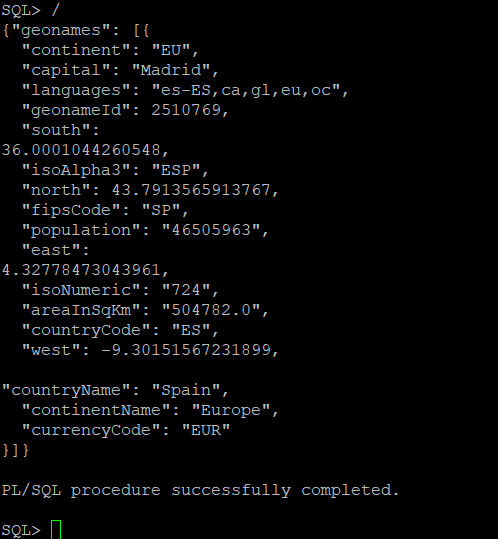
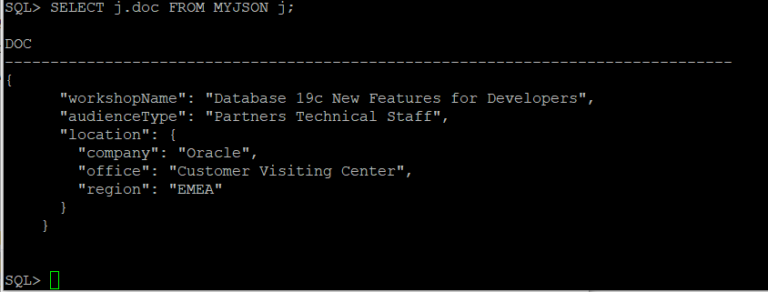
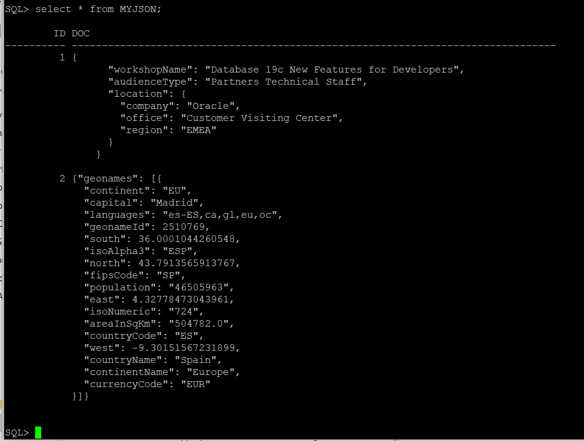

# Oracle Database 19c JSON Documents

## Introduction

This workshop aims to help you understanding JSON data and how you can use SQL and PL/SQL with JSON data stored in Oracle Database.  This lab takes approximately 20 minutes.

### About JSON in the Oracle Database

**JavaScript Object Notation (JSON)** is defined in standards ECMA-404 (JSON Data Interchange Format) and ECMA-262 (ECMAScript Language Specification, third edition). The JavaScript dialect of ECMAScript is a general programming language used widely in web browsers and web servers.  **Oracle Database** supports **JavaScript Object Notation (JSON)** data natively with relational database features, including transactions, indexing, declarative querying, and views.

Watch this video to learn more about JSON in the Oracle Database.

[](youtube:OXxA6SFqlJ4)


*Schemaless* development based on persisting application data in the form of JSON documents lets you quickly react to changing application requirements. You can change and redeploy your application without needing to change the storage schemas it uses. SQL and relational databases provide flexible support for complex data analysis and reporting, as well as rock-solid data protection and access control. This is typically not the case for NoSQL databases, which have often been associated with schemaless development with JSON in the past. Oracle Database provides all of the benefits of SQL and relational databases to JSON data, which you store and manipulate in the same ways and with the same confidence as any other type of database data.


### Lab Prerequisites

This lab assumes you have completed the following labs:
* Lab: Login to Oracle Cloud
* Lab: Generate SSH Key
* Lab: Environment Setup
* Lab: Sample Schema Setup

### Lab User Schema

For this lab we will use the *Order Entry (OE)* sample schema that is provided with the Oracle Database installation. If you have completed the setup previously you will already have the *OE* schema installed.

## Step 1: Environment Preparation

Grant Required Privileges to the OE user

0. Login to the instance using ssh.  We recommend using the Oracle Cloud Shell

    ````
    ssh -i yourkeyname opc@ your ip address
    ````

1. Connect to the **ORCLPDB** pluggable database, as SYSDBA.

  ````
  $ <copy>sqlplus sys/Ora_DB4U@localhost:1521/orclpdb as SYSDBA</copy>
  ````

2. Grant **OE** user some privileges required for the tasks we will execute in this lab.

  ````
  <copy>GRANT SELECT ON v_$session TO oe;
  GRANT SELECT ON v_$sql_plan_statistics_all TO oe;
  GRANT SELECT ON v_$sql_plan TO oe;
  GRANT SELECT ON v_$sql TO oe;
  GRANT ALTER SYSTEM TO oe;
  </copy>
  ````

*Note: The ALTER SYSTEM privilege is required to flush the Shared Pool in one exercise about performance.*

1. Create Network Access Control List as our database needs to connect to a web service, and retrieve information over HTTP, and this requires an *Access Control List (ACL)*. This ACL can be created by a user with SYSDBA privileges, SYS in this case, from the Pluggable Database called **ORCLPDB**, by executing the following procedure.

  ````
  <copy>begin
    DBMS_NETWORK_ACL_ADMIN.append_host_ace (
      host       => 'api.geonames.org',
      ace        => xs$ace_type(privilege_list => xs$name_list('http','connect','resolve'),
                                principal_name => 'OE',
                                principal_type => xs_acl.ptype_db));
  end;
  /</copy>
  ````

  

4. Ensure the execution is successful.  SQL*Plus Formatting is suggested

3. Close the SYSDBA connection and connect as the **OE** user to pluggable database ORCLPDB. From this point, all tasks on the database side will be performed using the **OE** user. For SQL*Plus, it is also useful to format the output. Feel free to use your own formatting, or just run these formatting commands every time you connect.

  ````
  > <copy>conn oe/Ora_DB4U@localhost:1521/orclpdb</copy>
  ````

  ````
  <copy>set linesize 130
  set serveroutput on
  set pages 9999
  set long 90000
  column WORKSHOPNAME format a50
  column LOCATION format a20
  column COUNTRY format a8
  column GEONAMEID format a10
  column TITLE format a35
  column NAME format a32
  column REGION format a20
  column SUB_REGION format a22
  column REGION format a12
  </copy>
  ````

## Step 2:  Register for Geonames

For the purpose of this exercise we will use a web service, that returns information in JSON format, provided by GeoNames - [geonames.org](http://www.geonames.org/). GeoNames is licensed under a [Creative Commons Attribution 4.0 License](https://creativecommons.org/licenses/by/4.0/). You are free to:

- Share — copy and redistribute the material in any medium or format;
- Adapt — remix, transform, and build upon the material for any purpose, even commercially.

1. Click '**login**' link on the upper right corner of GeoNames website, and create a new account. **Note:** When you create your GeoNames account you will receive an email to activate the account.

2. Enable the account for web services on the account page [GeoNames Account Page](http://www.geonames.org/manageaccount)


## Step 3: Generate JSON Data

First step is to generate some JSON data into the database, or retrieve sample documents from a web service. Oracle Database supports *JavaScript Object Notation (JSON)* data natively with relational database features, including transactions, indexing, declarative querying, and views.

This lab covers the use of database languages and features to work with JSON data that is stored in Oracle Database. In particular, it covers how to use SQL and PL/SQL with JSON data.
1. Please make sure you activate your GeoNames account before continuing with the exercise.

2. Test the access to the external web service – in this case countryInfo web service from GeoNames. You have to replace **<GeoNames_username>** with the username of your account on GeoNames website.

  ````
  <copy>set serveroutput on</copy>
  ````
  >**Note**: Remember to replace ***<GeoNames_username>***

  ````
  <copy>
  declare
      t_http_req  utl_http.req;
      t_http_resp  utl_http.resp;
      t_response_text clob;
  begin   
      t_http_req:= utl_http.begin_request('http://api.geonames.org/countryInfoJSON?formatted=true' || '&' || 'country=ES' || '&' || 'username=<GeoNames_username>' || '&' || 'style=full', 'GET', 'HTTP/1.1');
      t_http_resp:= utl_http.get_response(t_http_req);
      UTL_HTTP.read_text(t_http_resp, t_response_text);
      UTL_HTTP.end_response(t_http_resp);
      DBMS_OUTPUT.put_line(t_response_text);
  end;
  /
  </copy>
  ````
  
3.  Preview the sample output below.

  

4. Please make sure you receive a similar output to the sample shown above.

## Step 4: Store Json Documents Into Oracle Database

2. Create a new table to store all JSON documents inside the pluggable database.

  ````
  <copy>CREATE TABLE MYJSON (
    id NUMBER GENERATED BY DEFAULT ON NULL AS IDENTITY (CACHE 5) PRIMARY KEY,
    doc CLOB CONSTRAINT valid_json CHECK (doc IS JSON));</copy>
  ````

3. Using JSON inside Oracle database is very flexible, and does not require a predefined data structure, or specific schema. You can store any JSON document in a relational table, like the one we just created, with any internal document structure. Here is another JSON document example, with a totally different structure than the one we have received from GeoNames, and we can store it in the same table.

  ````
  <copy>
  INSERT INTO MYJSON (doc) VALUES (
  '{
    "workshopName": "Database 19c New Features for Developers",
    "audienceType": "Partners Technical Staff",
    "location": {
      "company": "Oracle",
      "office": "Customer Visiting Center",
      "region": "EMEA"
    }
  }');
  </copy>
  ````

  ````
  <copy>commit;</copy>
  ````

4. Once stored, we can query these documents and retrieve the JSON values as traditional relational data.

  ````
  <copy>set pages 9999
  set long 90000
  SELECT j.doc FROM MYJSON j;
  </copy>
  ````

  

## Step 5:  Single Dot Notation

Oracle database SQL engine allows you to use a **simple-dot-notation (SDN)** syntax on your JSON data. With other words, you can write SQL queries that contain something like *TABLE_Alias.JSON_Column.JSON_Property.JSON_Property>* which comes quite handy as the region attribute is an attribute of the nested object location within the JSON document. Remember, JSDN syntax is case sensitive.

The return value for a dot-notation query is always a string (data type VARCHAR2(4000)) representing JSON data. The content of the string depends on the targeted JSON data, as follows:
- If a single JSON value is targeted, then that value is the string content, whether it is a JSON scalar, object, or array.
- If multiple JSON values are targeted, then the string content is a JSON array whose elements are those values.

1.  Let's format your SQL query environment
  ````
  <copy>
  column WORKSHOPNAME format a50
  column LOCATION format a20
  </copy>
  ````

2.  Issue the query to choose the workshop name and region from the table you loaded earlier.
  ````
  > <copy>SELECT j.doc.workshopName, j.doc.location.region FROM MYJSON j;</copy>
  ````

  

3. Test other queries and review the output.

## Step 6: Retrieve Sample Data

The objective for our lab is to retrieve information about castles in Europe, and use them as JSON documents in different scenarios. Imagine you are starting the development of a new mobile application that provides recommendations for tourists.  For convenience and comfort, we can encapsulate the communication with a web service into a function. This way, we don’t have to write all the code required for a simple request, which in most of the cases is even more complicated than our simple example here, because they require a more complex authentication.

*Note: Remember to replace <GeoNames_username>*

1.  Create a function to get country information

  ````
  <copy>create or replace function get_country_info (countryCode in VARCHAR2) return clob
    is
      t_http_req  utl_http.req;
      t_http_resp  utl_http.resp;
      t_response_text clob;
    begin   
      t_http_req:= utl_http.begin_request('http://api.geonames.org/countryInfoJSON?formatted=true' || '&' || 'country=' || countryCode || '&' || 'username=<GeoNames_username>' || '&' || 'style=full', 'GET', 'HTTP/1.1');
      t_http_resp:= utl_http.get_response(t_http_req);
      UTL_HTTP.read_text(t_http_resp, t_response_text);
      UTL_HTTP.end_response(t_http_resp);
      return t_response_text;
    end;
  /
  </copy>
  ````

2. The input of the function we just created is the ISO code of a country. Run this query to get information about Spain, for example.

  ````
  <copy>select get_country_info('ES') country_info from dual;</copy>
  ````

  

3. Insert the JSON document retrieved from the web service into the JSON column of that same table, even though this JSON document has a totally different structure.

  ````
  <copy>insert into MYJSON (doc) values (get_country_info('ES'));</copy>
  ````

  ````
  <copy>commit;</copy>
  ````

4. Select the contents of that table, and notice we use the same column.

````
<copy>select * from MYJSON;</copy>
````



5. Working with attributes, allows us to get the information we want from a specific document. We can assign default values for attributes that do not match, and treat the issue further from the application. The SQL/JSON function *JSON_VALUE* finds a specified scalar JSON value in JSON data and returns it as a SQL value.

  ````
  <copy>column GEONAMEID format a10
  column COUNTRY format a40
  </copy>
  ````

  ````
  > <copy>SELECT JSON_VALUE(doc, '$.geonames.geonameId' NULL ON ERROR) AS GeoNameID,
  JSON_VALUE(doc, '$.geonames.countryName' DEFAULT 'Not a country' ON ERROR) AS Country
  FROM MYJSON;</copy>
  ````

  `

6. Or we can filter the results to receive only the documents that are useful for the query, using the SDN syntax.

  ````
  > <copy>select j.doc.geonames.geonameId GeoNameID, j.doc.geonames.countryName Country
      from MYJSON j where j.doc.geonames.isoAlpha3 IS NOT NULL;</copy>
  ````

  

7. In both cases, we can see that Spain geonameId is 2510769. This value will be used in the following steps.

8. A new function is required to retrieve JSON documents with country regions information from GeoNames web service. This function requires the  **geonameId** of the country, and a style value used internally by GeoNames web service to specify the level of details.

*Note: Remember to replace <GeoNames_username>*

  ````
  <copy>create or replace function get_subdivision (geonameId in NUMBER, style in VARCHAR2) return clob
    is
      t_http_req  utl_http.req;
      t_http_resp  utl_http.resp;
      t_response_text clob;
    begin
      t_http_req:= utl_http.begin_request('http://api.geonames.org/childrenJSON?formatted=true' || '&' || 'geonameId=' || geonameId || '&' || 'username=<GeoNames_username>' || '&' || 'style=' || style, 'GET', 'HTTP/1.1');
      t_http_resp:= utl_http.get_response(t_http_req);
      UTL_HTTP.read_text(t_http_resp, t_response_text);
      UTL_HTTP.end_response(t_http_resp);
      return t_response_text;
    end;
  /
  </copy>
  ````

9. Test this function using the following inputs.

  ````
  > <copy>select get_subdivision(2510769, 'medium') regions_document from dual;</copy>
  ````

  

10. If the test is successful, insert this new JSON document in the same table.

  ````
  > <copy>insert into MYJSON (doc) values (get_subdivision(2510769, 'medium'));</copy>
  ````

  ````
  <copy>commit;</copy>
  ````

11. The SQL/JSON function *JSON_TABLE* creates a relational view of JSON data. It maps the result of a JSON data evaluation into relational rows and columns. You can query the result returned by the function as a virtual relational table using SQL. The main purpose of *JSON_TABLE* is to create a row of relational data for each object inside a JSON array and output JSON values from within that object as individual SQL column values. Nested clause allows you to flatten JSON values in a nested JSON object or JSON array into individual columns in a single row along with JSON values from the parent object or array. You can use this clause recursively to project data from multiple layers of nested objects or arrays into a single row. This path expression is relative to the SQL/JSON row path expression specified in the *JSON_TABLE* function.

  ````
  <copy>column TITLE format a35
  column NAME format a32
  </copy>
  ````

  ````
  > <copy>SELECT jt.countryName Country, jt.fcode, convert(jt.toponymName,'WE8ISO8859P1','AL32UTF8') Title,
    convert(jt.name,'WE8ISO8859P1','AL32UTF8') Name, jt.geonameId GeoNameID FROM MYJSON,
    JSON_TABLE(DOC, '$' COLUMNS
      (NESTED PATH '$.geonames[*]'
        COLUMNS (countryName VARCHAR2(80) PATH '$.countryName',
                toponymName VARCHAR2(120) PATH '$.toponymName',
                geonameId VARCHAR2(20) PATH '$.geonameId',
                name VARCHAR2(80) PATH '$.name',
                fcode VARCHAR2(6) PATH '$.fcode')))
    AS jt  WHERE (fcode = 'ADM1');</copy>
  ````

  

12. Having all regions from Spain, we can ask the GeoNames web service for more information about each region, for example Andalucia with **geonameId** 2593109.

  ````
  > <copy>SELECT get_subdivision(2593109, 'full') sub_regions FROM dual;</copy>
  ````

13. Our next goal is to get more details about each region, and for that we need the geonameId for each region. One option is to use *JSON_TABLE* to return only that column, or the following SDN syntax.

  ````
  > <copy>SELECT j.doc.geonames.geonameId FROM MYJSON j WHERE j.doc.geonames.fcode like '%ADM1%';</copy>
  ````

  

The SDN syntax returns an array, not a relational view of JSON data in one column.

Please proceed to the next lab

## Acknowledgements

- **Author** - Valentin Leonard Tabacaru
- **Last Updated By/Date** - Troy Anthony, April 2020

See an issue?  Please open up a request [here](https://github.com/oracle/learning-library/issues).   Please include the workshop name and lab in your request.
