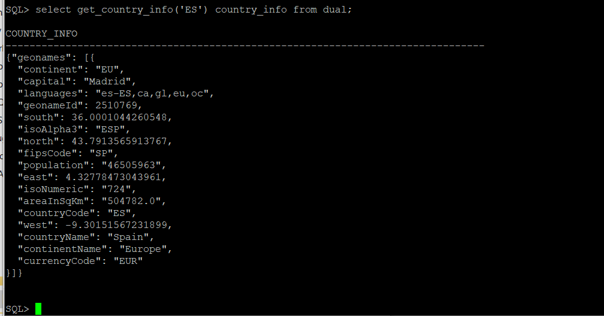
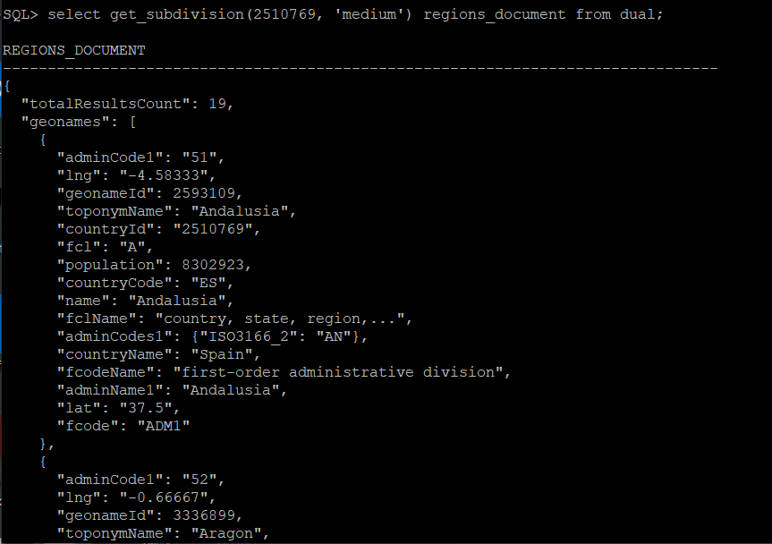
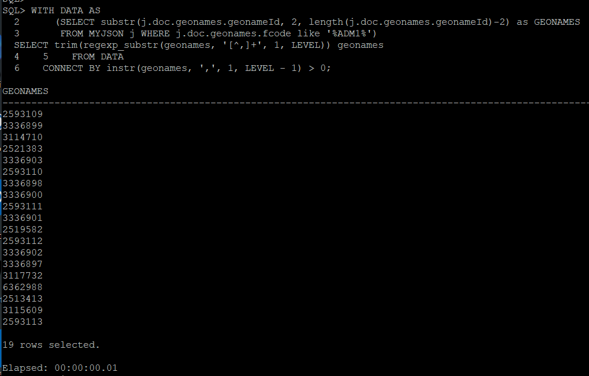
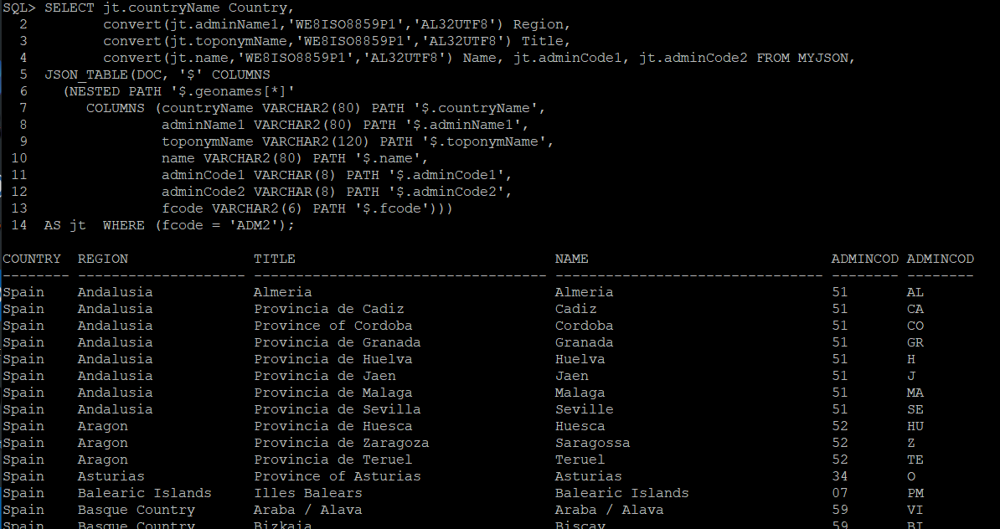

# Oracle Database 19c JSON Documents

## Working with JSON

First step is to generate some JSON data into the database, or retrieve sample documents from a web service. Oracle Database supports ***JavaScript Object Notation (JSON)*** data natively with relational database features, including transactions, indexing, declarative querying, and views.

This workshop covers the use of database languages and features to work with JSON data that is stored in Oracle Database. In particular, it covers how to use SQL and PL/SQL with JSON data.

## Access JSON Web Service

Please make sure you activate your GeoNames account before continuing with the exercise.

### Test Connection To Web Service

Test the access to the external web service – in this case countryInfo web service from GeoNames. You have to replace **<GeoNames_username>** with the username of your account on GeoNames website.

````
<copy>set serveroutput on</copy>
````

>**Note**: Remember to replace ***<GeoNames_username>***

````
<copy>
declare
    t_http_req  utl_http.req;
    t_http_resp  utl_http.resp;
    t_response_text clob;
begin   
    t_http_req:= utl_http.begin_request('http://api.geonames.org/countryInfoJSON?formatted=true' || '&' || 'country=ES' || '&' || 'username=<GeoNames_username>' || '&' || 'style=full', 'GET', 'HTTP/1.1');
    t_http_resp:= utl_http.get_response(t_http_req);
    UTL_HTTP.read_text(t_http_resp, t_response_text);
    UTL_HTTP.end_response(t_http_resp);
    DBMS_OUTPUT.put_line(t_response_text);
end;
/
</copy>
````

Sample output.


Please make sure you receive a similar output to the sample shown above.

### Store Json Documents Into Oracle Database

Create a new table to store all JSON documents inside the pluggable database.

````
<copy>CREATE TABLE MYJSON (
  id NUMBER GENERATED BY DEFAULT ON NULL AS IDENTITY (CACHE 5) PRIMARY KEY,
  doc CLOB CONSTRAINT valid_json CHECK (doc IS JSON));</copy>
````

Using JSON inside Oracle database is very flexible, and does not require a predefined data structure, or specific schema. You can store any JSON document in a relational table, like the one we just created, with any internal document structure. Here is another JSON document example, with a totally different structure than the one we have received from GeoNames, and we can store it in the same table.

````
<copy>INSERT INTO MYJSON (doc) VALUES (
   '{
      "workshopName": "Database 19c New Features for Developers",
      "audienceType": "Partners Technical Staff",
      "location": {
        "company": "Oracle",
        "office": "Customer Visiting Center",
        "region": "EMEA"
      }
    }');</copy>
````

````
<copy>commit;</copy>
````

Once stored, we can query these documents and retrieve the JSON values as traditional relational data.

````
<copy>set pages 9999
set long 90000
</copy>
````

````
> <copy>SELECT j.doc FROM MYJSON j;</copy>
````


Oracle database SQL engine allows you to use a **simple-dot-notation (SDN)** syntax on your JSON data. With other words, you can write SQL queries that contain something like ***TABLE_Alias.JSON_Column.JSON_Property.JSON_Property>*** which comes quite handy as the region attribute is an attribute of the nested object location within the JSON document. Remember, SDN syntax is case sensitive.

The return value for a dot-notation query is always a string (data type VARCHAR2(4000)) representing JSON data. The content of the string depends on the targeted JSON data, as follows:
- If a single JSON value is targeted, then that value is the string content, whether it is a JSON scalar, object, or array.
- If multiple JSON values are targeted, then the string content is a JSON array whose elements are those values.

````
<copy>
column WORKSHOPNAME format a50
column LOCATION format a20
</copy>
````

````
> <copy>SELECT j.doc.workshopName, j.doc.location.region FROM MYJSON j;</copy>
````


Test other queries and review the output.

## Retrieve Sample Data

The objective for our lab is to retrieve information about castles in Europe, and use them as JSON documents in different scenarios. Imagine you are starting the development of a new mobile application that provides recommendations for tourists.

### Retrieve Country Information In JSON Format

For convenience and comfort, we can encapsulate the communication with a web service into a function. This way, we don’t have to write all the code required for a simple request, which in most of the cases is even more complicated than our simple example here, because they require a more complex authentication.

>**Note**: Remember to replace ***<GeoNames_username>***

````
<copy>create or replace function get_country_info (countryCode in VARCHAR2) return clob
  is
    t_http_req  utl_http.req;
    t_http_resp  utl_http.resp;
    t_response_text clob;
  begin   
    t_http_req:= utl_http.begin_request('http://api.geonames.org/countryInfoJSON?formatted=true' || '&' || 'country=' || countryCode || '&' || 'username=<GeoNames_username>' || '&' || 'style=full', 'GET', 'HTTP/1.1');
    t_http_resp:= utl_http.get_response(t_http_req);
    UTL_HTTP.read_text(t_http_resp, t_response_text);
    UTL_HTTP.end_response(t_http_resp);
    return t_response_text;
  end;
/
</copy>
````

The input of the function we just created is the ISO code of a country. Run this query to get information about Spain, for example.

````
<copy>select get_country_info('ES') country_info from dual;</copy>
````


Insert the JSON document retrieved from the web service into the JSON column of that same table, even though this JSON document has a totally different structure.

````
<copy>insert into MYJSON (doc) values (get_country_info('ES'));</copy>
````

````
<copy>commit;</copy>
````

Select the contents of that table, and notice we use the same column.

````
<copy>select * from MYJSON;</copy>
````


Working with attributes, allows us to get the information we want from a specific document. We can assign default values for attributes that do not match, and treat the issue further from the application. The SQL/JSON function ***JSON_VALUE*** finds a specified scalar JSON value in JSON data and returns it as a SQL value.

````
<copy>column GEONAMEID format a10
column COUNTRY format a40
</copy>
````

````
> <copy>SELECT JSON_VALUE(doc, '$.geonames.geonameId' NULL ON ERROR) AS GeoNameID,
  JSON_VALUE(doc, '$.geonames.countryName' DEFAULT 'Not a country' ON ERROR) AS Country
    FROM MYJSON;</copy>
````


Or we can filter the results to receive only the documents that are useful for the query, using the SDN syntax.

````
> <copy>select j.doc.geonames.geonameId GeoNameID, j.doc.geonames.countryName Country
    from MYJSON j where j.doc.geonames.isoAlpha3 IS NOT NULL;</copy>
````


In both cases, we can see that Spain geonameId is 2510769. This value will be used in the following steps.

### Retrieve Regions Information In JSON Format

A new function is required to retrieve JSON documents with country regions information from GeoNames web service. This function requires the  **geonameId** of the country, and a style value used internally by GeoNames web service to specify the level of details.

>**Note**: Remember to replace ***<GeoNames_username>***

````
<copy>create or replace function get_subdivision (geonameId in NUMBER, style in VARCHAR2) return clob
  is
    t_http_req  utl_http.req;
    t_http_resp  utl_http.resp;
    t_response_text clob;
  begin
    t_http_req:= utl_http.begin_request('http://api.geonames.org/childrenJSON?formatted=true' || '&' || 'geonameId=' || geonameId || '&' || 'username=<GeoNames_username>' || '&' || 'style=' || style, 'GET', 'HTTP/1.1');
    t_http_resp:= utl_http.get_response(t_http_req);
    UTL_HTTP.read_text(t_http_resp, t_response_text);
    UTL_HTTP.end_response(t_http_resp);
    return t_response_text;
  end;
/
</copy>
````

Test this function using the following inputs.

````
> <copy>select get_subdivision(2510769, 'medium') regions_document from dual;</copy>
````



If the test is successful, insert this new JSON document in the same table.

````
> <copy>insert into MYJSON (doc) values (get_subdivision(2510769, 'medium'));</copy>
````

````
<copy>commit;</copy>
````

The SQL/JSON function ***JSON_TABLE*** creates a relational view of JSON data. It maps the result of a JSON data evaluation into relational rows and columns. You can query the result returned by the function as a virtual relational table using SQL. The main purpose of ***JSON_TABLE*** is to create a row of relational data for each object inside a JSON array and output JSON values from within that object as individual SQL column values.

Nested clause allows you to flatten JSON values in a nested JSON object or JSON array into individual columns in a single row along with JSON values from the parent object or array. You can use this clause recursively to project data from multiple layers of nested objects or arrays into a single row. This path expression is relative to the SQL/JSON row path expression specified in the ***JSON_TABLE*** function.

````
<copy>column TITLE format a35
column NAME format a32
</copy>
````

````
> <copy>SELECT jt.countryName Country, jt.fcode, convert(jt.toponymName,'WE8ISO8859P1','AL32UTF8') Title,
  convert(jt.name,'WE8ISO8859P1','AL32UTF8') Name, jt.geonameId GeoNameID FROM MYJSON,
  JSON_TABLE(DOC, '$' COLUMNS
    (NESTED PATH '$.geonames[*]'
       COLUMNS (countryName VARCHAR2(80) PATH '$.countryName',
              toponymName VARCHAR2(120) PATH '$.toponymName',
              geonameId VARCHAR2(20) PATH '$.geonameId',
              name VARCHAR2(80) PATH '$.name',
              fcode VARCHAR2(6) PATH '$.fcode')))
  AS jt  WHERE (fcode = 'ADM1');</copy>
````


Having all regions from Spain, we can ask again GeoNames web service for more information about each region, for example Andalucia with **geonameId** 2593109.

````
> <copy>SELECT get_subdivision(2593109, 'full') sub_regions FROM dual;</copy>
````

So our next goal is to get more details about each region, and for that we need the geonameId for each region. One option is to use ***JSON_TABLE*** to return only that column, or the following SDN syntax.

````
> <copy>SELECT j.doc.geonames.geonameId FROM MYJSON j WHERE j.doc.geonames.fcode like '%ADM1%';</copy>
````


The SDN syntax returns an array, not a relational view of JSON data in one column.

## Performance Considerations

Using PL/SQL, we may treat and manipulate JSON arrays as strings, inside Oracle database, using standard functions and procedures.

### Consider Multiple Choices When Querying JSON Documents

However, there are performance considerations, for example when using regular expressions on strings, like in this example.

````
<copy>set timing on</copy>
````

````
> <copy>WITH DATA AS
    (SELECT substr(j.doc.geonames.geonameId, 2, length(j.doc.geonames.geonameId)-2) as GEONAMES
     FROM MYJSON j WHERE j.doc.geonames.fcode like '%ADM1%')
  SELECT trim(regexp_substr(geonames, '[^,]+', 1, LEVEL)) geonames
  FROM DATA
  CONNECT BY instr(geonames, ',', 1, LEVEL - 1) > 0;</copy>
````



Take a note of the execution time, and compare it with the following code, that returns the same result, but faster.

````
> <copy>WITH ids ( GEONAMES, start_pos, end_pos ) AS
  ( SELECT GEONAMES, 1, INSTR( GEONAMES, ',' ) FROM
(SELECT substr(j.doc.geonames.geonameId, 2, length(j.doc.geonames.geonameId)-2) as GEONAMES FROM MYJSON j WHERE j.doc.geonames.fcode like '%ADM1%')
  UNION ALL
  SELECT GEONAMES,
    end_pos + 1,
    INSTR( GEONAMES, ',', end_pos + 1 )
  FROM ids
  WHERE end_pos > 0
  )
SELECT SUBSTR( GEONAMES, start_pos, DECODE( end_pos, 0, LENGTH( GEONAMES ) + 1, end_pos ) - start_pos ) AS geonameId
FROM ids;</copy>
````

The execution time difference is insignificant (00:00:00.02 compared to 00:00:00.00), however, for millions of transactions it may have to be considered. The point is coding with JSON objects is a matter of choice, and always there will be multiple options for reaching the same result, and we need to choose the most optimal one.

### Retrieve Sub-Regions Information In JSON Format

Using a cursor, and the query you like most, we can run a loop, to retrieve the sub-regions for every region in Spain. This procedure will store a JSON document in our table, with the sub-regions, for each region (19 documents).

````
<copy>declare
   cursor c1 is
	WITH ids ( GEONAMES, start_pos, end_pos ) AS
	  ( SELECT GEONAMES, 1, INSTR( GEONAMES, ',' ) FROM
	(SELECT substr(j.doc.geonames.geonameId, 2, length(j.doc.geonames.geonameId)-2) as GEONAMES
	 FROM MYJSON j WHERE j.doc.geonames.fcode like '%ADM1%')
	  UNION ALL
	  SELECT GEONAMES,
	    end_pos + 1,
	    INSTR( GEONAMES, ',', end_pos + 1 )
	  FROM ids
	  WHERE end_pos > 0
	  )
	SELECT SUBSTR(GEONAMES, start_pos, DECODE(end_pos, 0, LENGTH( GEONAMES ) + 1, end_pos) - start_pos) AS geonameId
	FROM ids;
begin
   FOR subregionID in c1
   LOOP
      insert into MYJSON (doc) values (get_subdivision(subregionID.geonameId, 'full'));
   END LOOP;
commit;
end;
/
</copy>
````

Query the regions and sub-regions stored in these 19 documents, retrieving them as relational data.

````
<copy>column COUNTRY format a8
column REGION format a20
</copy>
````

````
> <copy>SELECT jt.countryName Country,
       convert(jt.adminName1,'WE8ISO8859P1','AL32UTF8') Region,
       convert(jt.toponymName,'WE8ISO8859P1','AL32UTF8') Title,
       convert(jt.name,'WE8ISO8859P1','AL32UTF8') Name, jt.adminCode1, jt.adminCode2 FROM MYJSON,
JSON_TABLE(DOC, '$' COLUMNS
  (NESTED PATH '$.geonames[*]'
     COLUMNS (countryName VARCHAR2(80) PATH '$.countryName',
              adminName1 VARCHAR2(80) PATH '$.adminName1',
              toponymName VARCHAR2(120) PATH '$.toponymName',
              name VARCHAR2(80) PATH '$.name',
              adminCode1 VARCHAR(8) PATH '$.adminCode1',
              adminCode2 VARCHAR(8) PATH '$.adminCode2',
              fcode VARCHAR2(6) PATH '$.fcode')))
AS jt  WHERE (fcode = 'ADM2');</copy>
````



Now we have the entire geographic division.

### Retrieve Castles Information In JSON Format

In order to retrieve information about castles from GeoNames web service, we have to create a new function. The input for this function is the ISO country code, the code of the region, and the code of the sub-region. The output is a JSON document with all castles in that sub-region.

>**Note**: Remember to replace ***<GeoNames_username>***

````
<copy>create or replace function get_castles (country in VARCHAR2, adminCode1 in VARCHAR2, adminCode2 in VARCHAR2) return clob   
  is
    t_http_req  utl_http.req;
    t_http_resp  utl_http.resp;
    t_response_text clob;
  begin
    t_http_req:= utl_http.begin_request('http://api.geonames.org/searchJSON?formatted=true' || '&' || 'featureCode=CSTL' || '&' || 'country=' || country || '&' || 'adminCode1=' || adminCode1 ||  '&' || 'adminCode2=' || adminCode2 || '&' || 'username=<GeoNames_username>' || '&' || 'style=full', 'GET', 'HTTP/1.1');
    t_http_resp:= utl_http.get_response(t_http_req);
    UTL_HTTP.read_text(t_http_resp, t_response_text);
    UTL_HTTP.end_response(t_http_resp);
    return t_response_text;
  end;
/
</copy>
````

Test get_castles function, using as input ***Valencia*** region (adminCode1 : 60), and ***Provincia de Alicante*** sub-region (adminCode2: A).

````
> <copy>select get_castles('ES', 60, 'A') castles_document from dual;</copy>
````


Use this function in a loop to retrieve castles from all sub-regions, as shown in the following example, storing the JSON documents inside the same table.

````
<copy>column SUB_REGION format a20
column REGION format a12
</copy>
````

````
<copy>declare
   cursor c1 is
     SELECT jt.adminCode1, jt.adminCode2 FROM MYJSON,
     JSON_TABLE(DOC, '$' COLUMNS
       (NESTED PATH '$.geonames[*]'
          COLUMNS (adminCode1 VARCHAR(8) PATH '$.adminCode1',
                   adminCode2 VARCHAR(8) PATH '$.adminCode2',
                   fcode VARCHAR2(6) PATH '$.fcode')))
      AS jt  WHERE (fcode = 'ADM2');
begin
   FOR SubRegion in c1
   LOOP
      insert into MYJSON (doc) values (get_castles('ES', SubRegion.adminCode1, SubRegion.adminCode2));
   END LOOP;
commit;
end;
/
</copy>
````


At this point we have enough JSON documents inside the database, and all the information to develop our application that provides information about medieval castles in Spain.

````
> <copy>SELECT jt.countryName Country,
       convert(jt.adminName1,'WE8ISO8859P1','AL32UTF8') Region,
       convert(jt.adminName2,'WE8ISO8859P1','AL32UTF8') Sub_Region,
       jt.fcode, convert(jt.toponymName,'WE8ISO8859P1','AL32UTF8') Title,
       convert(jt.name,'WE8ISO8859P1','AL32UTF8') Name FROM MYJSON,
JSON_TABLE(DOC, '$' COLUMNS
  (NESTED PATH '$.geonames[*]'
     COLUMNS (countryName VARCHAR2(80) PATH '$.countryName',
              adminName1 VARCHAR2(80) PATH '$.adminName1',
              adminName2 VARCHAR2(80) PATH '$.adminName2',
              toponymName VARCHAR2(120) PATH '$.toponymName',
              name VARCHAR2(80) PATH '$.name',
              adminCode1 VARCHAR(8) PATH '$.adminCode1',
              fcode VARCHAR2(6) PATH '$.fcode')))
AS jt  WHERE (fcode = 'CSTL');</copy>
````


> This query should return 269 rows.


---
