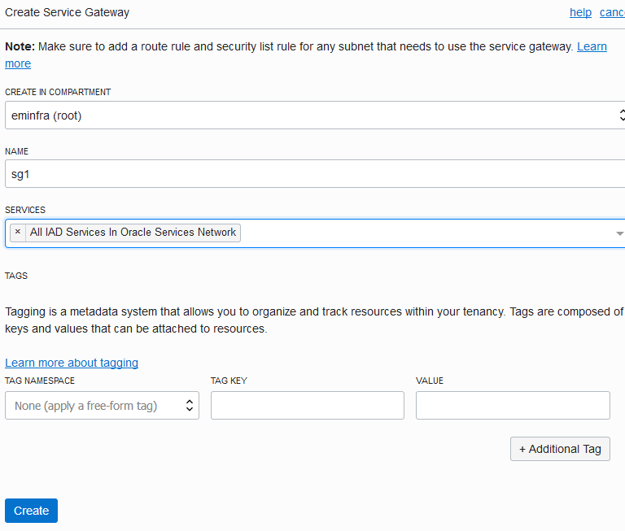
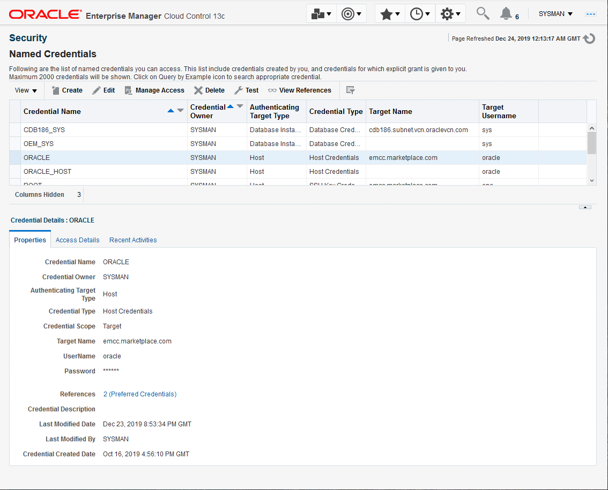
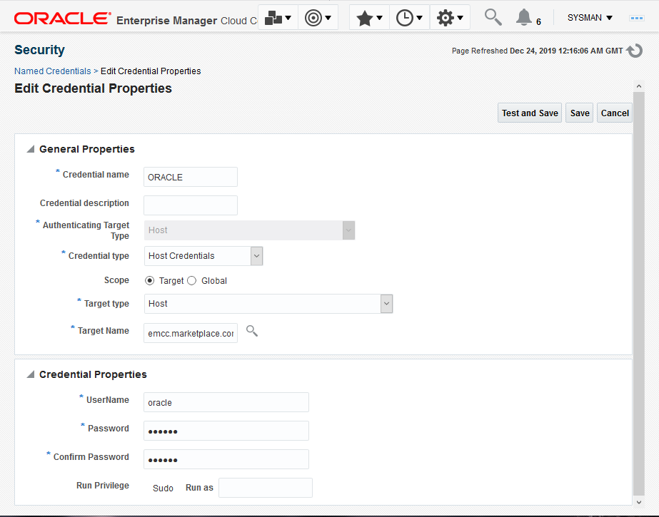

## Frequently Asked Questions / Troubleshooting of Oracle Cloud Marketplace instances for Enterprise Manager (EM) Workshop ##

##### February 01, 2020 | Version 2.0 Copyright © 2020, Oracle and/or its affiliates Confidential: Restricted #####

## **Contents** ##

1. How to Create a SSH key-pair for launching and connecting to an OCI Instance
2. How to connect to an OCI Instance via SSH
3. How to Check Status of Oracle Management Service, Other Services and Agent
4. How to Locate EMCLI on Your Instance
5. Oracle Management Server (OMS) / WebTier is Down
6. Unable to Connect to Oracle Management Server (OMS) Website
7. Restart an Agent Not Responding
8. How to Stop all Enterprise Manager (EM) Services Before Stopping an OCI instance
9. Steps To Setup VCN for FastConnect
10. Licensing Terms for the Enterprise Manager Marketplace Instance
11. How to Reset user oracle  password or if Named Credentials for user oracle are not working
12. Unable to connect to Enterprise Manager Console
13. Unable to Select Shape for Creating an instance
14. While trying to launch the EM instance: "Unable to accept Terms of Use." 
15. Information about Oracle Cloud Infrastructure Pricing
16. Additional information on Oracle Cloud Infrastructure Setup

### **1. How to Create a SSH key-pair for launching and connecting to an OCI Instance** ###

An SSH key-pair is needed to create an OCI instance, connect and access the
system or to debug,

#### Creating a Key Pair ####

Instances use an SSH key pair instead of a password to authenticate a remote
user. A key pair file contains a private key and public key. You keep the
private key on your computer and provide the public key every time you launch an
instance.

To create key pairs, you can use a third-party tool such as OpenSSH on
UNIX-style systems (including Linux, Solaris, BSD, and OS X) or PuTTY Key
Generator on Windows.

#### Before You Begin ####

-   If you're using a Linux distribution, you probably already have the
    ssh-keygen utility installed. To determine if it's installed, type
    ssh-keygen on the command line. If it's not installed, you can download
    OpenSSH for UNIX from <http://www.openssh.com/portable.html> and install it.

-   If you're using Windows and you don't already have the PuTTY Key Generator,
    it can be downloaded from [http://www.putty.org](http://www.putty.org/) and
    install it.

#### Creation of an SSH Key Pair from the command line ####

-   Open a shell or terminal window for entering the commands.

-   At the prompt, enter ssh-keygen and provide a name and passphrase when
    prompted.  
    The keys will be created with the default values: RSA keys of 2048 bits.

Alternatively, you can type a complete ssh-keygen command, for example:

   #ssh-keygen -t rsa -N "" -b 2048 -C "*\<key_name\>*" -f
   *\<path/root_name\>*

The command arguments are shown in the following table:

| **Argument**               | **Description**                                                                                                                                                                                                                                                         |
|----------------------------|-------------------------------------------------------------------------------------------------------------------------------------------------------------------------------------------------------------------------------------------------------------------------|
| **-t rsa**                 | Use the RSA algorithm.                                                                                                                                                                                                                                                  |
| **-N "\<_passphrase_\>"**    | A passphrase to protect the use of the key (like a password). If you don't want to set a passphrase, don't enter anything between the quotes. A passphrase is not required. You can specify one as a security measure to protect the private key from unauthorized use. |
| **-b 2048**                | Generate a 2048-bit key. You don't have to set this if 2048 is acceptable, as 2048 is the default. A minimum of 2048 bits is recommended for SSH-2 RSA.                                                                                                                 |
| **-C "\<_key_name_\>"**      | A name to identify the key.                                                                                                                                                             |
**-f \<_path/root_name_\>**  | Location where key pair will be saved and the root name for the files.

#### Creation of an SSH Key Pair on WINDOWS using PuTTY KEY generator ####

1.  Locate puttygen.exe in the PuTTY folder on your computer, for example,
    
       C:\\Program Files (x86)\\PuTTY.  Then double-click puttygen.exe to open.

2.  Specify a key type of SSH-2 RSA and a key size of 2048 bits:

    -   In the **Key** menu, confirm that the default value of **SSH-2 RSA key**
        is selected.

    -   For the **Type of key to generate**, accept the default key type of
        **RSA**.

    -   Set the **Number of bits in a generated key** to 2048 if it is not
        already set.

3.  Click **Generate**.

4.  Move your mouse around the blank area in the PuTTY window to generate random
    data in the key.

When the key is generated, it appears under **Public key for pasting into
OpenSSH authorized_keys file**.

5.  A **Key comment** is generated for you, including the date and time stamp.
    You can keep the default comment or replace it with your own more
    descriptive comment.

6.  Leave the **Key passphrase** field blank.

7.  Click **Save private key**, and then click **Yes** in the prompt about
    saving the key without a passphrase.

The key pair is saved in the PuTTY Private Key (PPK) format, which is a
proprietary format that works only with the PuTTY tool set.

You can name the key anything you want, but use the ppk file extension. For
example, mykey.ppk.

8.  Select *all* of the generated key that appears under **Public key for
    pasting into OpenSSH authorized_keys file**, copy it using **Ctrl + C**,
    paste it into a text file, and then save the file in the same location as
    the private key.

   (NOTE: Do NOT use the **Save public key** because it does not save the key
   in the OpenSSH format.)

You can name the key anything you want, but for consistency, use the same
name as the private key and a file extension of pub. For example, mykey.pub.

9.  Write down the names and location of your public and private key files. You
    will need the public key when launching an instance. You will need the
    private key to access the instance via SSH.

### **2. How to Connect to an OCI Instance via SSH** ###

In case that services do not come up several minutes after creation/start of the
instance, or to make changes in the system, you can connect to the instance via
SSH. You can then run scripts from /home/oracle

**Requirements**:

-   Windows, Mac or UNIX-based

-   PuTTY as an SSH client if using Windows

-   Your service instance’s public IP address

#### **Connecting to a VM from a Windows System** ###

On Windows, you can use PuTTY as an SSH client. PuTTY enables Windows users to
connect to remote systems over the internet using SSH and Telnet. SSH is
supported in PuTTY, provides for a secure shell, and encrypts information before
it's transferred.

1.  Download and install PuTTY. ( <http://www.putty.org> )

2.  Run the PuTTY program. On your computer, go to All Programs \> PuTTY \>
    PuTTY

3.  Select or enter the following information:

    Category: _Session_

    IP address: _Your service instance’s public IP address_

    Port: _22_

    Connection type: _SSH_

https://github.com/oracle/learning-library/raw/master/enterprise-manageability-library/enterprise_manager/media/7c9e4d803ae849daa227b6684705964c.jpg

#### **Configuring Automatic Login** ####

1.  In the category section, **Click** Connection and then **Select** Data.

2.  Enter your auto-login username. Enter **opc**.

https://github.com/oracle/learning-library/raw/master/enterprise-manageability-library/enterprise_manager/media/36164be0029033be6d65f883bbf31713.jpg

#### **Adding Your Private Key** ####

1.  In the category section, **Click** Auth.

2.  **Click** browse and find the private key file that matches your VM’s public
    key. This private key should have a .ppk extension for PuTTy to work.

https://github.com/oracle/learning-library/raw/master/enterprise-manageability-library/enterprise_manager/media/df56bc989ad85f9bfad17ddb6ed6038e.jpg

To save all your settings:

1.  In the category section, **Click** session.

2.  In the saved sessions section, name your session, for example ( EM13C-ABC )
    and **Click** Save.

#### **Connecting to a VM from a UNIX-style System (Linux/Mac)** ###

Use the following command to set the file permissions so that only you can
read the file:

    #chmod 400 *\<private_key\>* * 
    where *\<private_key\>* is the full path and name of the file that contains the private key associated with the instance you want to access.

Use the following SSH command to access the instance

    #ssh –i *\<private_key\> opc\@\<public-ip-address\>*  
    where *\<public-ip-address\>* is your instance IP address that you retrieved
    from the console.

### **3. How to Check Status of Oracle Management Service, Other Services and Agent** ###

As user *oracle*

    #/u01/app/em13c/middleware/bin/emctl status oms

    #/u01/app/em13c/emagent/agent_13.3.0.0.0/bin/emctl status agent

### **4. How to Locate Emcli on Your Instance** ###

emcli can be located at /u01/app/em13c/middleware/bin/emcli

### **5. Oracle Management Server (OMS) / WebTier is Down** ###

Restart the OMS as user *oracle*  

    #sudo su - oracle  
    #/home/oracle/start_oms.sh  OR  #/home/oracle/start_all.sh

### **6. Unable to Connect to Oracle Management Server (OMS)  Website** ###

Make sure you are on a public network or Oracle Cloud Network Access VPN. Verify
services are up and running as shown in line item 3 above. Restart services as
shown in line item 5 as needed.

### **7. Restart an Agent Not Responding** ###

Restart the agent as user *oracle*

    #sudo su - oracle   
    #/home/oracle/start_agent.sh

### **8. How to Stop all Enterprise Manager (EM) Services Before Stopping an OCI instance** ###

Before stopping an OCI instance, stop all EM services as user *oracle* for a
clean shutdown 

    #sudo su - oracle  
    #/home/oracle/stop_all.sh

### **9. Steps To Setup VCN for FastConnect** ###

If (and only if) you are using a private subnet/FastConnect with your VCN**,
there are a few additional steps required to create the Service gateway, define
the routing rule and egress rules.

1.  Create the Service Gateway and “All \<RegionCode\> Services in Oracle
    Services Network”, where \<regioncode\> refers to the OCI region of your EM
    compartment. 

2.  Add a new Route Rule for the Service Gateway you just created.

3.  If (and only if) your private subnet has restrictions on outgoing
    traffic/egress you have to add egress rules for service network CIDRs for
    your OCI region.  For a list of CIDRs that apply to your region, refer to
    the OCI documentation “Public IP Address Ranges for the Oracle Services
    Network”.    

### **10. Licensing Terms for the Enterprise Manager Marketplace Instance**

In order to use the functionality in the workshop, the following Licensed Packs have been enabled in the
Enterprise Manager workshop image:

For the Database Lifecycle Management
-	Database Lifecycle Management Pack for Oracle  Database

For Database Performance Management On-premises
-	Oracle Diagnostics Pack
-	Oracle Tuning pack 
-	Real Application Testing

### **11. How to Reset user *oracle* password or if Named Credentials for user oracle is not working**

Reset the password for user *oracle* as user *root*  
password oracle (and then enter new password twice to confirm).  
  
If *oracle* password is updated, the Named Credential for *ORACLE* and also *ORACLE_HOST* needs to
be updated. This can be done on the command line as user *oracle* 
 
    #/u01/app/em13c/middleware/bin/emcli login -username=sysman -password=\<sysman_password\> 
    #/u01/app/em13c/middleware/bin/emcli modify_named_credential -cred_name=oracle -attributes="HostPassword:\<oracle_password\>"
    #/u01/app/em13c/middleware/bin/emcli modify_named_credential -cred_name=oracle_host -attributes="HostPassword:\<oracle_password\>" 
    #/u01/app/em13c/middleware/bin/emcli logout 

The Named Credential can also be updated via Enterprise Manager UI. On the EM
Console navigate to Setup, then Security, and then Named Credentials.

**Click** on Credential Name ORACLE and **Click** on Edit. **Enter** the new
password in the Credentials Sections twice and **Click** on Save.
Repeat for Credential ORACLE_HOST

### **12. Unable to connect to Enterprise Manager Console**

Make sure you are on a public network and not connected to a restricted corporate intranet or corporate wifi.
Also ensure all web services are up and running by logging into your instance via SSH as indicated in this guide.

### **13. Unable to Select Shape for Creating an instance**

If you are seeing an Authorization Error while trying to Select Shape to Create an Instance:
1. From the Hamburger Menu on the Top Left of the Oracle Cloud Home Page, Go to Compute->Instances
2. Select the Compartment available to you in the Left Compartment Menu (not root)
3. Now that the compartment is set-up for new user, re-do the steps to create the Enterprise Manager Workshop from the Listing Link

### **14. While trying to launch the EM instance: Unable to accept Terms of Use.**

Make sure your email has been verified. Log out and Log back in and restart from the listing link.

### **15. Additional information on Oracle Cloud Infrastructure Setup**
<https://www.oracle.com/cloud/pricing.html>

### **16. Additional information on Oracle Cloud Infrastructure Setup**
<https://docs.cloud.oracle.com/en-us/iaas/Content/GSG/Concepts/baremetalintro.htm>

