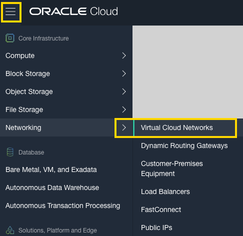
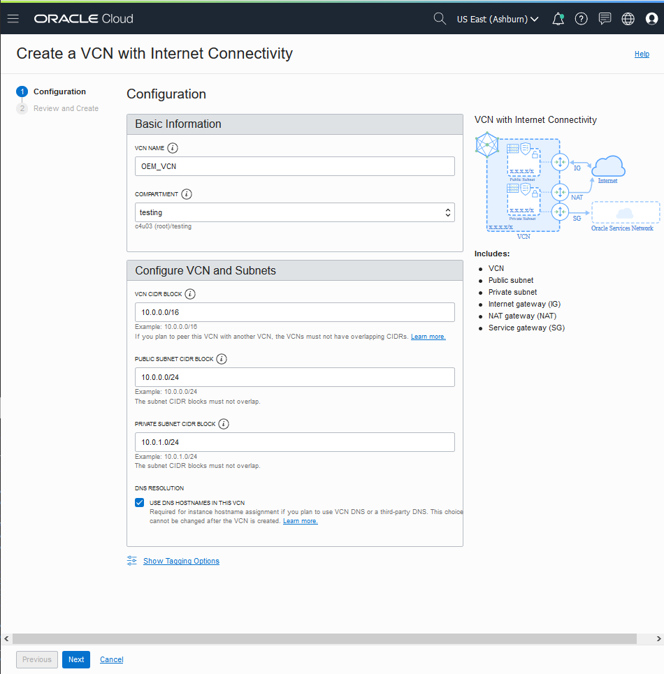
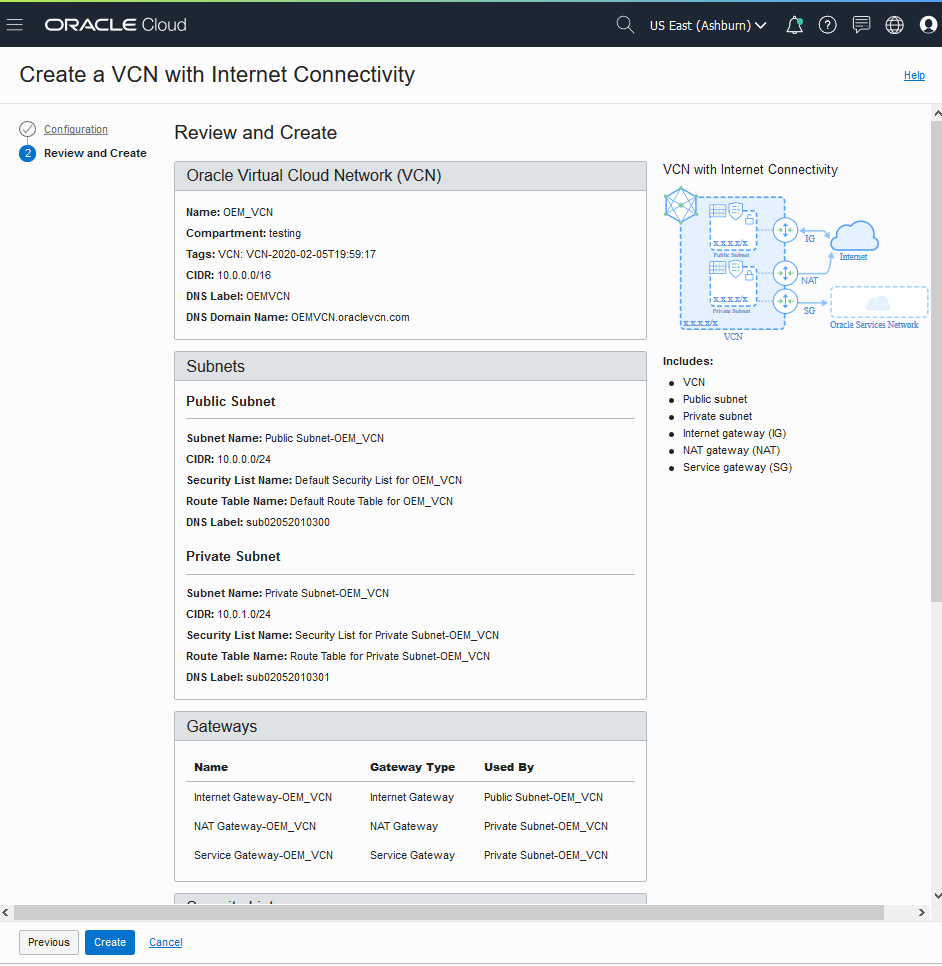
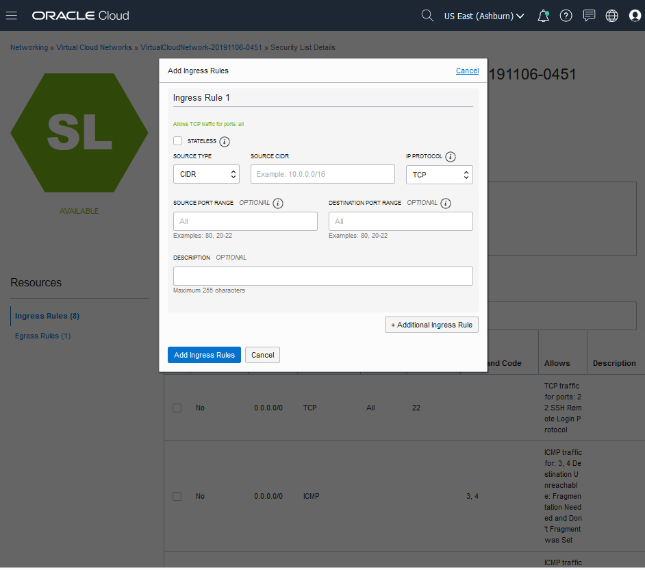
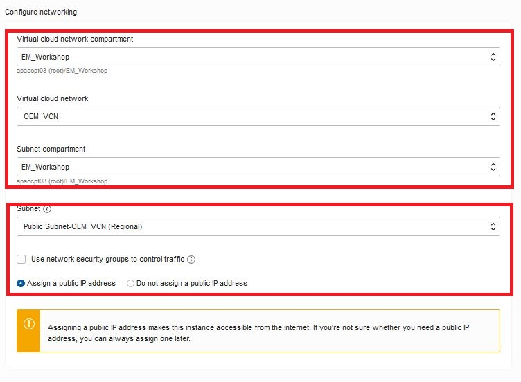
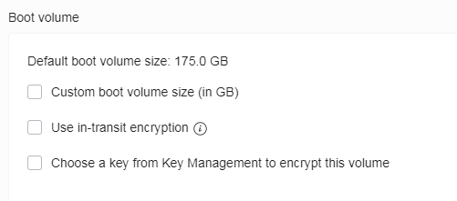

# Enterprise Manager Oracle Cloud Marketplace Image Setup #

##### February 01, 2020 | Version 2.0 Copyright © 2020, Oracle and/or its affiliates Confidential: Restricted #####

## **Contents** ##
1. Oracle Cloud Prerequisites Setup
    - How to Create a Virtual Cloud Network
    - How to Set Ingress Rules
2. How To Create a Compute Instance
3. Get to Know the Preconfigured EM Environment Image
    - Named Credentials Secured by Best Practice
    - Database Target Inventory
    - Summary of Enterprise Manager and Host Details

Purpose 
========

In this Workshop you will learn how to perform the initial Oracle
Cloud pre-requisites to setup and configure Virtual Cloud Network in your
tenancy and compartment and create a Compute Instance utilizing the Oracle
Enterprise Manager (EM) image from the Oracle Cloud marketplace. The Enterprise
Manager instance you instantiate includes a pre-configured Enterprise Manager,
repository and Oracle Database targets.

After you have completed this Setup Workshop, you can then move on and complete 
other Workshops for Database Lifecycle Management, Real Application Testing etc
using the EM environment instance.

GOAL
====

Without having to wait for an available host to be setup on-premise, in minutes
gaining access to a configured and running Oracle Enterprise Manager environment
to learn it capabilities and functionalities hand on. Better understand how
Oracle Cloud can be utilized in day to day duties and business problem solving.

Disclaimer
==========

This document in any form, software or printed matter, contains proprietary
information that is the exclusive property of Oracle. Your access to and use of
this confidential material is subject to the terms and conditions of your Oracle
software license and service agreement, which has been executed and with which
you agree to comply. This document and information contained herein may not be
disclosed, copied, reproduced or distributed to anyone outside Oracle without
prior written consent of Oracle. This document is not part of your license
agreement nor can it be incorporated into any contractual agreement with Oracle
or its subsidiaries or affiliates.

This document is for informational purposes only and is intended solely to
assist you in planning for the implementation and upgrade of the product
features described. It is not a commitment to deliver any material, code, or
functionality, and should not be relied upon in making purchasing decisions. The
development, release, and timing of any features or functionality described in
this document remains at the sole discretion of Oracle.

Due to the nature of the product architecture, it may not be possible to safely
include all features described in this document without risking significant
destabilization of the code.

==================================================================

Oracle Cloud Prerequisites Setup
================================

How to Create a Virtual Cloud Network
-------------------------------------

Using the Oracle Cloud account credentials you were provided upon your
subscription or trial for the Oracle Cloud, log-in to your tenancy and make sure
you have a compartment created/available for your activity. For more detail on
logging into Oracle Cloud the first time, you can consult the [documentation
here](https://docs.oracle.com/en/cloud/get-started/subscriptions-cloud/csgsg/get-started-oracle-cloud-services.html)

Before launching an instance, you need to have a Virtual Cloud Network (VCN) and
subnet setup. And it’s recommended to have it within its own compartment (TEST
for example). A subnet is a subdivision of your VCN and directs traffic
according to a **route table. **You will access the instance over the internet
using its public IP address. Your traffic will be directed via an internet
gateway and the subnet uses a security list to control traffic in and out of the
instance.

1. Using account credentials supplied by email (check your SPAM folder), or
    Oracle Cloud Administrator (if applicable) login using the link in the email
    to access.

	 >NOTE: If logging in for the very first time, you will be prompted to enter
 the user id and temporary password from the email to login and then asked to change your password. Be prepared to enter a strong password that meets the security criteria. Typically your username will be your email address you received the notification.

 	>NOTE: If you haven’t received an introduction email you can login directly and request a password reset. Open a browser and navigate to: <https://cloud.oracle.com/en_US/sign-in> Use the ‘Can’t Sign In’ link to reset your password, a password reset link will be sent to your email. The initial invitation will expire within 24 hours. If your login offer has expired, contact an admin.

	>If your company setup Single-Sign-On authorization, and you are unable to use or reset it, then contact your company’s Oracle Cloud administrator.

2. After successful login to the Oracle Cloud

	

3. Navigate to the upper left of your browser page to the navigation bar (aka
    hamburger menu).

	

4. Select it and navigate to **Core Infrastructure**, and from there navigate
    to **Networking** and select **Virtual Cloud Networks**.

5. Verify that the compartment (you designated/was created for you) is selected
    in the **Compartment** list on the left and then click **Networking
    Quickstart**.

6. Select **VCN with Internet Connectivity**, and then click **Start
    Workflow**. The Create a VCN with Internet Connectivity dialog appears.

	

7. For these entry fields, enter the following:

    -   **VCN Name:** Enter a name for your cloud network, for example,
        \<your_initials\>_Network. The name is incorporated into the names of
        all the related resources that are automatically created. Avoid entering
        confidential information.

    -   **Compartment:** This field defaults to your current compartment. Select
        the compartment you want to create the VCN and related resources in, if
        not already selected.

    -   **VCN CIDR Block:** Enter a valid CIDR block for the VCN. For example
        10.0.0.0/16. (Classless Inter-Domain Routing (CIDR) is a set of Internet
        protocol (IP) standards used to create unique identifiers for networks
        and individual devices. The IP addresses allow particular packets of
        information to be sent to specific computers).

    -   **Public Subnet CIDR Block:** Enter a valid CIDR block for the subnet.
        The value must be within the VCN's CIDR block. For example: 10.0.0.0/24.

    -   **Private Subnet CIDR Block:** Enter a valid CIDR block for the subnet.
        The value must be within the VCN's CIDR block and not overlap with the
        public subnet's CIDR block. For example: 10.0.1.0/24.

    -   Accept the defaults for any other fields.

8.  Click **Next** and review the list of resources that the workflow will
    create for you. Notice that the workflow will set up security list rules and
    route table rules to enable basic access for the VCN.  
      
    

 	   

9.  After review, click **Create** to start the short workflow.

10.  After the workflow completes, click **View Virtual Cloud Network**. The
    cloud network now has the following resources and characteristics:

-   [Internet
    gateway](https://docs.cloud.oracle.com/en-us/iaas/Content/Network/Tasks/managingIGs.htm)

-   [NAT
    gateway](https://docs.cloud.oracle.com/en-us/iaas/Content/Network/Tasks/NATgateway.htm)

-   [Service
    gateway](https://docs.cloud.oracle.com/en-us/iaas/Content/Network/Tasks/servicegateway.htm)
    with access to the Oracle Services Network.

-   A regional *public* subnet with access to the internet gateway. This subnet
    uses the VCN's default security list and default route table. Instances in
    this subnet may optionally have public IP addresses.

-   A regional *private* subnet with access to the NAT gateway and service
    gateway. This subnet uses a custom security list and custom route table that
    the workflow created. Instances in this subnet *cannot* have public
    IP addresses.

-   Use of the [Internet and VCN
    Resolver](https://docs.cloud.oracle.com/en-us/iaas/Content/Network/Concepts/dns.htm)
    for DNS.

How to Set Ingress Rules
------------------------

| Destination port range | Protocol Type | Service      |
|------------------------|---------------|--------------|
| 22                     | TCP           | SSH          |
| 7803                   | TCP           | Console      |
| 4903                   | TCP           | Agent Upload |
| 7301                   | TCP           | JVMD         |
| 9851                   | TCP           | BIP          |

As the administrator / or performed by the administrator of your Oracle Cloud
instance, these stateful Ingress Rules need to be added into the Security List
of VCN you just created.

1. To do that, click on the VCN you just created and on the **Virtual Cloud
    Network Details** page, navigate to **Security Lists, click** on **Security
    List** and then **Add Ingress Rules.**

	

2.  A dialog box appears, you **enter** your Ingress Rules ( Use **0.0.0.0/0** for **Source CIDR**)
    and then click the **Add Ingress Rules** button to save them to your VCN.
    

	>**NOTE**: **For those using FastConnect**  
Refer to the [Frequently Asked Questions (FAQ) and Troubleshooting Guide](https://github.com/oracle/learning-library/blob/master/enterprise-manageability-library/enterprise_manager/OCIMarketplaceEM-FAQ.md) for
additional configuration details if you are using FastConnect with your VCN

	You have completed the Oracle Cloud VCN prerequisite and are ready to Create a
Compute Instance for your Oracle Enterprise Manager Marketplace image

How To Create a Compute Instance
================================

The Instance can be created directly from the listing link OR by going to the Oracle Cloud hamburger menu, **Click** on Compute, **Click** on Instances and **Click** on Create Instance button. On the **Create Compute Instance** Screen (Also shown in Step 7) Under **Choosing an image source**, Select the image from Marketplace.

1.  Access the published image from the Oracle Marketplace. For example
    <https://cloudmarketplace.oracle.com/marketplace/listing/69658839>

	
	
	

2.  **Click** on the Get App button

3.  **Select** the nearest or most appropriate Oracle Cloud Region and **Click**
    the Sign In button  
      
    
    
    	
	

4.  Login to your tenancy using your account USER NAME and PASSWORD  
    
    
    

    	
	

5.  After login, Select the compartment you want the image in by clicking the
    **Compartment** drop down menu and selecting the *compartment_name* .

	> NOTE: do NOT use the root compartment. Choose the compartment your company Cloud Administrator setup for you or use one you created for the image. (example TEST)

6.  **Click** the check box for reviewing and accepting the Oracle Standard
    Terms and Restrictions and then **Click** on the **Launch Instance** button

	

7.  When the Create Compute Instance dialog appears, **enter** a unique name you
    desire to identify this instance. For example: *your first name*\_em_handson
    and not what is shown in the screenshot.  
      
    

	

8.  Select/Verify the image source you want(in this example Enterprise Manager 13c Workshop). Then **Click Show Shape, Network, and Storage Options** if hidden.
    
    > NOTE: If you didn't start with the Listing Link, You can Select the Image Source by clicking on **Change Image Source** and searching for Enterprise Manager 13c Workshop and Selecting it. 

9.  After which, it’s recommended to balance instances across Availability
    Domains AD which also helps with any tenancy limits; especially if there are
    multiple users using the tenancy at the same time to get hands on experience
    with the image.

	> NOTE: when there are many users, if your last name is A-J, **select AD1**,J-M, **select AD2**, and if it’s N-Z, **select AD3**.

10.  For the **Instance Type**, select Virtual Machine and select the **Change
    Shape** button.

		

11.  When presented with the Browse All Shapes choices, Select the 
    **VMStandard2.4** (4 OCPU and 60 GB memory) shape. Click on **Select Shape** to Apply the change

	> NOTE: VMStandard2.2 may be used if VM.Standard2.4 is not available
	
	
12.  After the **AD**, **Instance Type** and **Instance Shape** have been set,
    the next step is to configure the networking section.

13.  For the Virtual Cloud Network Compartment and Subnet compartment, verify the
    **compartment_name** chosen is the same as in step 5. For the Virtual Cloud
    Network, verify you have the VCN identified that you created with ingress
    rules for the EM image.

14.  Verify the **Assign a public IP address** radio button is selected. DO NOT
    OVERLOOK THIS STEP!!!!!!!

15.  Leave the **Default boot volume size** as is and do NOT check any additional
    settings.

16.  Dependent on how you generated and saved your Public SSH Key (refer to
    Frequently Asked Questions covering how to obtain an SSH key), select the
    Choose SSH key file or Paste SSH keys radio button and complete the
    associated action.

17.  Next **Click** the **Create** button for your instance to be created.
    Dependent on how many are using a tenancy, you will see the yellow
    provisioning state take about \~4 minutes to be running and \~ 20 mins for startup of the
    databases and Enterprise Manager within your VM.

18.  You can view the Work Requests section towards the bottom, for status
    information of your instance.

19.  Once the instance is in the green running state, locate your **public IP
    address** and write it down as it will be essential to have it later.

	> NOTE: that as part of this pre-configured image, all Enterprise Manager services automatically start up so you do not have to separately start up the OMS, etc. via EMCTL or scripts

20. After the services are running, access Enterprise Manager to verify access
    to it by using this URL format in your browser (Chrome is suggested)
     https://<Public_IP_Address>:7803/em

	> NOTE: Don’t be **alarmed if you see a** certification warning like this.

	

21.  It is safe to ignore it that and move ahead. Click on the **Advanced**
    button and then click on the **Accept the Risk and Continue** button.

	> NOTE: if you receive a Cannot Connect screen, wait a few more minutes for the image to complete its startup and then try again. You should then see the Enterprise Manager Cloud Control 13c login screen.  

	You now have an Oracle Cloud container with a running Oracle Enterprise Manager environment.

	>NOTE: when your environment is not in use, it is recommended that it be shutdown to minimize billing use or trial credit charges.

Get To Know The Preconfigured Environment 
===============================================

In this Workshop example, the image used was a pre-configured environment of Oracle
Enterprise Manager 13.3 with databases and targets all running within a single
Virtual Machine. Oracle Cloud Marketplace is routinely updated with new product
images and versions.

Named Credentials Secured by Best Practice
------------------------------------------

Target credentials are stored within Enterprise Manager as "named" entities.
Administrators can define and store credentials within Enterprise Manager and
refer to the credential by a credential name.

If only a specific DBA is to have knowledge of higher privileged credentials
like *SYS* credentials for a database, they can store such credentials in a
named credential and then share that name with other users/administrators who
need privileged access to use them. Standard users are able to perform their
jobs using the named credentials without knowing what the actual credentials
are.

If administrators have the same credentials for targets, they can create one
named credential containing those credentials and share the name with
appropriate personnel. That simplifies credential maintenance (changing
passwords, for example) by eliminating the need to create several copies of
named credentials containing the same credentials.

These named credentials are already defined in the Oracle Cloud Marketplace EM
image instance.

| Credential Name | Credential Owner | Authenticating Target Type | CRedential Type      | Target name                  | Target Username |
|-----------------|------------------|----------------------------|----------------------|------------------------------|-----------------|
| CDB186_SYS      | SYSMAN           | Database Instance          | Database Credentials | cdb186.subnet.vcn.oracle.com | sys             |
| OEM_SYS         | SYSMAN           | Database Instance          | Database Credentials |                              | sys             |
| ORACLE          | SYSMAN           | Host                       | Host Credentials     | emcc.marketplace.com         | oracle          |
| ORACLE_HOST     | SYSMAN           | Host                       | Host Credentials     |                              | oracle          |

Database Target Inventory
-------------------------

These database targets are installed and setup in the Oracle Cloud Marketplace
EM image instance.

-   cdb186.subnet.vcn.oraclevcn.com

-   hr.subnet.vcn.oraclevcn.com

-   sales.subnet.vcn.oraclevcn.com

Summary of Enterprise Manager and Host Details
----------------------------------------------

| EM and Host Properties          | DEtails                                                                                                                                                                                                                                                                                                                                                                                                                                                                                                                                                                                                                                                                                                       |
|---------------------------------|---------------------------------------------------------------------------------------------------------------------------------------------------------------------------------------------------------------------------------------------------------------------------------------------------------------------------------------------------------------------------------------------------------------------------------------------------------------------------------------------------------------------------------------------------------------------------------------------------------------------------------------------------------------------------------------------------------------|
| **OMS URL**                     | https://\<YOUR_PUBLIC_IP_ADDRESS_HERE\>:7803/em                                                                                                                                                                                                                                                                                                                                                                                                                                                                                                                                                                                                                                                               |
| **EM Credentials**              | Username: sysman Password: welcome1 Self–Service User:                                                                                                                                                                                                                                                                                                                                                                                                                                                                                                                                                                                                                                                        |
|                                 | Username: CYRUS                                                                                                                                                                                                                                                                                                                                                                                                                                                                                                                                                                                                                                                                                               |
|                                 | Password: welcome1                                                                                                                                                                                                                                                                                                                                                                                                                                                                                                                                                                                                                                                                                            |
| **Oracle Database (CDB)**       | CDB186 (18.8) Sales (18.3) HR (18.3)                                                                                                                                                                                                                                                                                                                                                                                                                                                                                                                                                                                                                                                                          |
| **Oracle Database Credentials** | Name Credential as specified in use case or use sys/welcome1                                                                                                                                                                                                                                                                                                                                                                                                                                                                                                                                                                                                                                                  |
| **Host Credentials**            | Login as opc user using your private key (as described in *connecting to an instance* section) Login to root if needed: sudo –s (from opc user) Login to oracle if needed: sudo su – oracle                                                                                                                                                                                                                                                                                                                                                                                                                                                                                                                   |
| **Startup Scripts**             | All scripts are in /home/oracle. **Note:** All required EM services are brought up at creation and every reboot of the instance, so allot time for them to start automatically. **In case** you run into an issue, these scripts can help stop/start services within the instance. start_all.sh - Starts ALL services for EM (OMS, Agent etc.) start_oms.sh - Starts OMS start_agent.sh – Starts Agent start_db_hr.sh – Starts HR Database stop_db.sh – Stops emprep Database/Listener start_db_sales.sh – Starts Sales Database stop_oms.sh – Stops OMS start_db_cdb186.sh – Starts cdb186 Database start_db.sh – Starts all Databases stop_agent.sh – Stops Agent startdb_emrep.sh start_db.sh_orig stop_all.sh |
