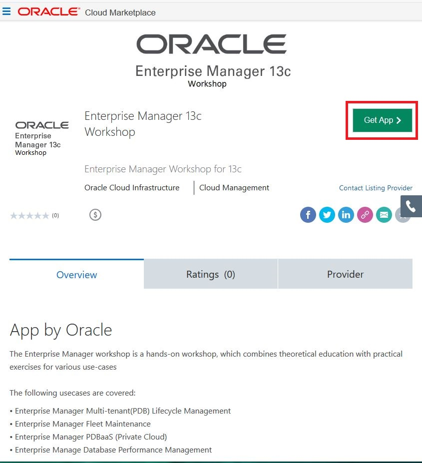
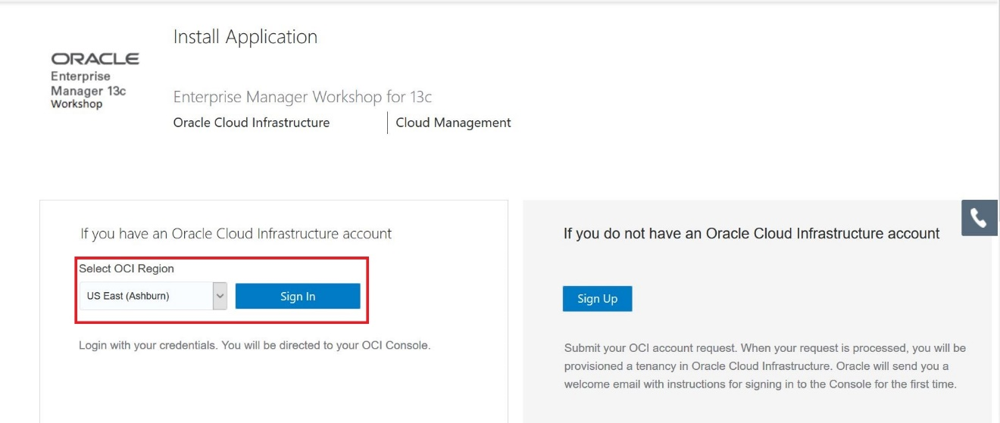
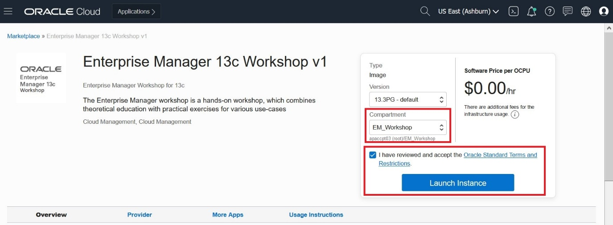
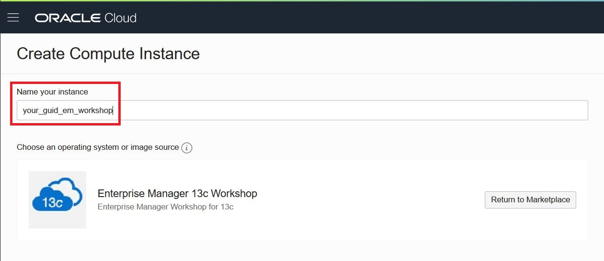
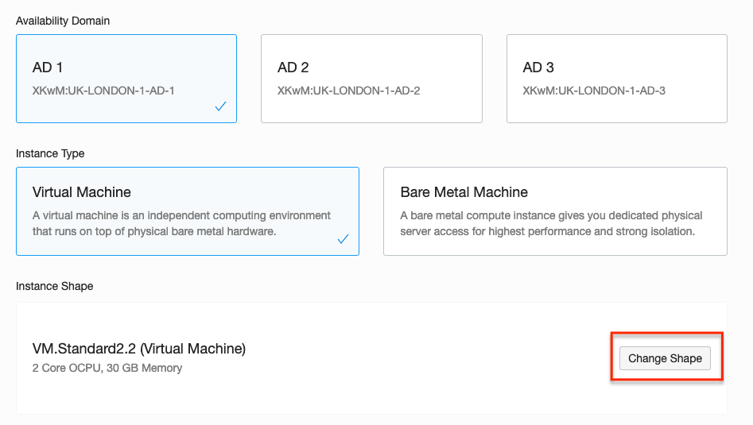
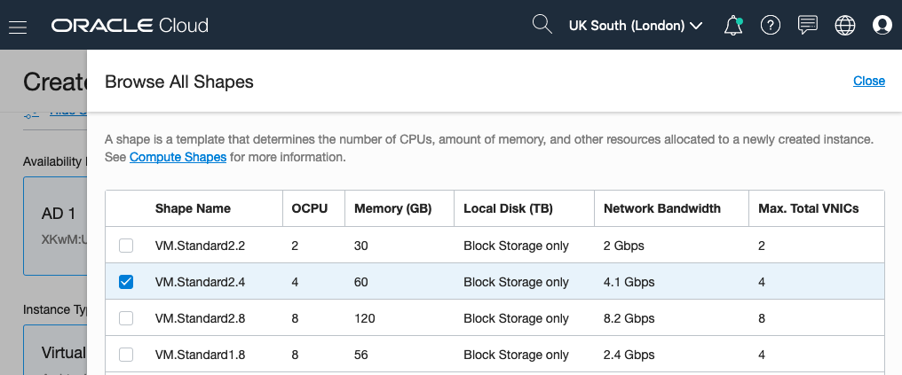
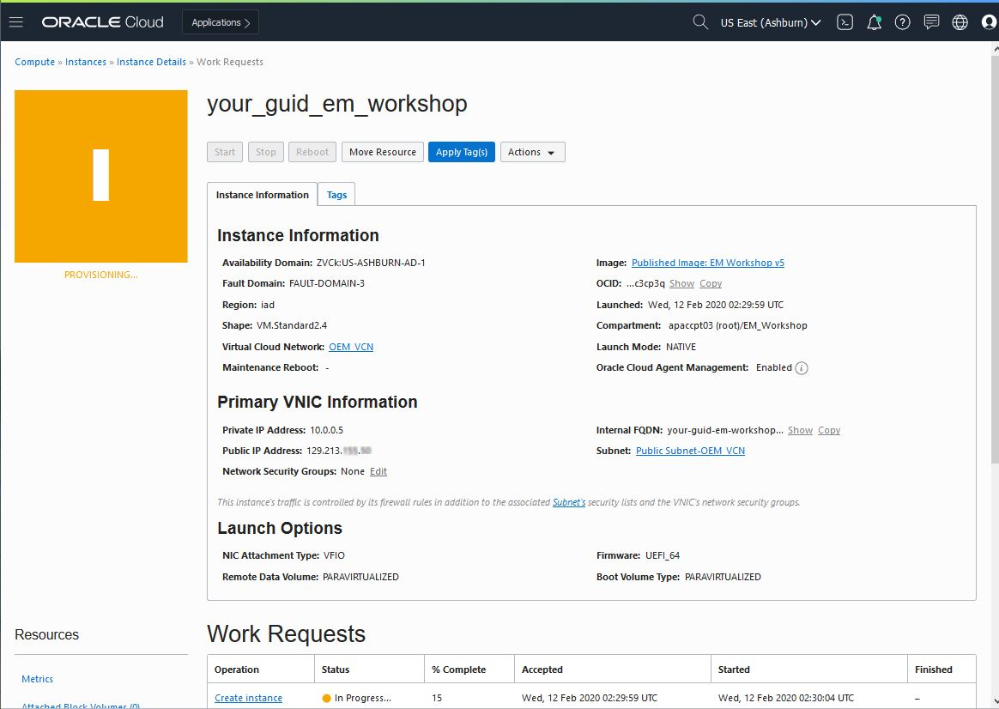
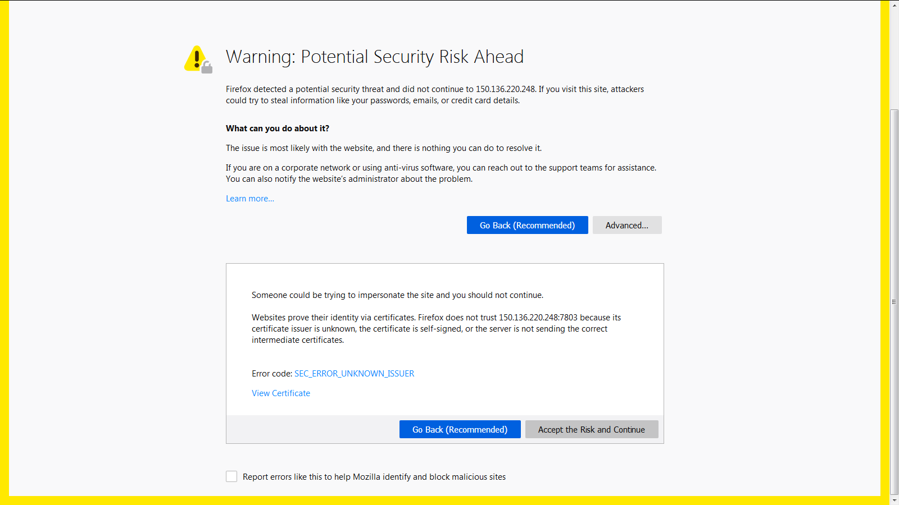

# Enterprise Manager Oracle Cloud Marketplace Image Setup #

##### February 01, 2020 | Version 2.0 Copyright © 2020, Oracle and/or its affiliates Confidential: Restricted #####

## **Contents** ##
1. Oracle Cloud Pre-requisites
2. How To Create a Compute Instance
3. Get to Know the Preconfigured EM Environment Image
    - Named Credentials Secured by Best Practice
    - Database Target Inventory
    - Summary of Enterprise Manager and Host Details
4. Workshops and FAQ/Troubleshooting Guide

Purpose 
========

In this Workshop you will learn how to create a Compute Instance utilizing the Oracle
Enterprise Manager (EM) image from the Oracle Cloud marketplace. The Enterprise
Manager instance you instantiate includes a pre-configured Enterprise Manager,
repository and Oracle Database targets.

After you have completed this HOL, you can then move on and complete other Hands
on Labs using the EM environment instance.

GOAL
====

Without having to wait for an available host to be setup on-premise, in minutes
gaining access to a configured and running Oracle Enterprise Manager environment
to learn it capabilities and functionalities hand on. Better understand how
Oracle Cloud can be utilized in day to day duties and business problem solving.

Disclaimer
==========

This document in any form, software or printed matter, contains proprietary
information that is the exclusive property of Oracle. Your access to and use of
this confidential material is subject to the terms and conditions of your Oracle
software license and service agreement, which has been executed and with which
you agree to comply. This document and information contained herein may not be
disclosed, copied, reproduced or distributed to anyone outside Oracle without
prior written consent of Oracle. This document is not part of your license
agreement nor can it be incorporated into any contractual agreement with Oracle
or its subsidiaries or affiliates.

This document is for informational purposes only and is intended solely to
assist you in planning for the implementation and upgrade of the product
features described. It is not a commitment to deliver any material, code, or
functionality, and should not be relied upon in making purchasing decisions. The
development, release, and timing of any features or functionality described in
this document remains at the sole discretion of Oracle.

Due to the nature of the product architecture, it may not be possible to safely
include all features described in this document without risking significant
destabilization of the code.

==================================================================

Oracle Cloud Prerequisites 
==========================
1.  An OCI administrator has setup an Oracle Cloud Compartment and Virtual Cloud Network for this activity.
2.  The Virtual Cloud Network's ingress rules have been enabled for the Enterprise Manager Workshop.
3.  Each participant has a SSH public/private key-pair to Create/Login to your OCI instance.

How To Create a Compute Instance
================================

1.  Access the published image from the Oracle Marketplace. For example
    <https://cloudmarketplace.oracle.com/marketplace/listing/69658839>

	

2.  **Click** on the Get App button

3.  **Select** the nearest or most appropriate Oracle Cloud Region and **Click**
    the Sign In button  
      
    

    

4.  Login to your tenancy using your account USER NAME and PASSWORD  
      
    

    

5.  After login, Select the compartment you want the image in by clicking the
    **Compartment** drop down menu and selecting the *compartment_name*.

	> NOTE: do NOT use the root compartment. Choose the compartment your company Cloud Administrator setup for you or use one you created for the image. (example TEST)

1.  **Click** the check box for reviewing and accepting the Oracle Standard
    Terms and Restrictions and then **Click** on the **Launch Instance** button

	

1.  When the Create Compute Instance dialog appears, **enter** a unique name you
    desire to identify this instance. For example: *your first name*\_em_handson
    and not what is shown in the screenshot.  
      
    

    

2.  Verify the image source you want is selected (in this example Enterprise
    Manager 13c Workshop), then **Click Show Shape, Network,** and **Storage
    Options** if hidden.

1.  After which, it’s recommended to balance instances across Availability
    Domains AD which also helps with any tenancy limits; especially if there are
    multiple users using the tenancy at the same time to get hands on experience
    with the image.

	> NOTE: when there are many users, if your last name is A-J, **select AD1**,J-M, **select AD2**, and if it’s N-Z, **select AD3**.

1.  For the **Instance Type**, select Virtual Machine and select the **Change
    Shape** button.

	

1.  When presented with the Browse All Shapes choices, Select the
    VMStandard2.4 (4 OCPU and 60 GB memory) shape. Click on Select Shape to Apply the change

	

	> NOTE: VMStandard2.2 may be used if VM.Standard2.4 is not available
	

1.  After the **AD**, **Instance Type** and **Instance Shape** have been set,
    the next step is to configure the networking section.

1.  For the **Virtual Cloud Network Compartment** and **Subnet compartment**, verify the
    **compartment_name** chosen is the same as in step 5. For the Virtual Cloud
    Network, verify you have the VCN identified that was created with ingress
    rules for the EM image.

	

1.  Verify the **Assign a public IP address** radio button is selected. DO NOT
    OVERLOOK THIS STEP!!!!!!!

1.  Leave the **Default boot volume size** as is and do NOT check any additional
    settings.

	

1.  Dependent on how you generated and saved your Public SSH Key (refer to
    Frequently Asked Questions covering how to obtain an SSH key), select the
    Choose SSH key file or Paste SSH keys radio button and complete the
    associated action.

	

1.  Next **Click** the **Create** button for your instance to be created.
    Dependent on how many are using a tenancy, you will see the yellow
    provisioning state take about \~4 minutes to be running and \~ 20 mins for startup of the
    databases and Enterprise Manager within your VM.

2.  You can view the Work Requests section towards the bottom, for status
    information of your instance.

	

1.  Once the instance is in the green running state, locate your **public IP
    address** and write it down as it will be essential to have it later.

	

	> NOTE: that as part of this pre-configured image, all Enterprise Manager services automatically start up so you do not have to separately start up the OMS, etc… via EMCTL or scripts

1. After the services are running, access Enterprise Manager to verify access
   to it by using this URL format in your browser (Chrome is suggested)
   https://<Public_IP_Address>:7803/em

	> NOTE: Don’t be **alarmed if you see a** certification warning like this.

	

1.  It is safe to ignore it and move ahead. Click on the **Advanced**
    button and then click on the **Accept the Risk and Continue** button.

	> NOTE: if you receive a Cannot Connect screen, wait a few more minutes for the image to complete its startup and then try again. You should then see the Enterprise Manager Cloud Control 13c login screen.  

	You now have an Oracle Cloud container with a running Oracle Enterprise Manager environment.

	>NOTE: when your environment is not in use, it is recommended that it be shutdown to minimize billing use or trial credit charges.

Get To Know The Preconfigured Environment 
===============================================

In this Workshop example, the image used was a pre-configured environment of Oracle
Enterprise Manager 13.3 with databases and targets all running within a single
Virtual Machine. Oracle Cloud Marketplace is routinely updated with new product
images and versions.

Named Credentials Secured by Best Practice
------------------------------------------

Target credentials are stored within Enterprise Manager as "named" entities.
Administrators can define and store credentials within Enterprise Manager and
refer to the credential by a credential name.

If only a specific DBA is to have knowledge of higher privileged credentials
like *SYS* credentials for a database, they can store such credentials in a
named credential and then share that name with other users/administrators who
need privileged access to use them. Standard users are able to perform their
jobs using the named credentials without knowing what the actual credentials
are.

If administrators have the same credentials for targets, they can create one
named credential containing those credentials and share the name with
appropriate personnel. That simplifies credential maintenance (changing
passwords, for example) by eliminating the need to create several copies of
named credentials containing the same credentials.

These named credentials are already defined in the Oracle Cloud Marketplace EM
image instance.

| Credential Name | Credential Owner | Authenticating Target Type | CRedential Type      | Target name                  | Target Username |
|-----------------|------------------|----------------------------|----------------------|------------------------------|-----------------|
| CDB186_SYS      | SYSMAN           | Database Instance          | Database Credentials | cdb186.subnet.vcn.oracle.com | sys             |
| OEM_SYS         | SYSMAN           | Database Instance          | Database Credentials |                              | sys             |
| ORACLE          | SYSMAN           | Host                       | Host Credentials     | emcc.marketplace.com         | oracle          |
| ORACLE_HOST     | SYSMAN           | Host                       | Host Credentials     |                              | oracle          |

Database Target Inventory
-------------------------

These database targets are installed and setup in the Oracle Cloud Marketplace
EM image instance.

-   cdb186.subnet.vcn.oraclevcn.com

-   hr.subnet.vcn.oraclevcn.com

-   sales.subnet.vcn.oraclevcn.com

Summary of Enterprise Manager and Host Details
----------------------------------------------

| EM and Host Properties          | DEtails                                                                                                                                                                                                                                                                                                                                                                                                                                                                                                                                                                                                                                                                                                       |
|---------------------------------|---------------------------------------------------------------------------------------------------------------------------------------------------------------------------------------------------------------------------------------------------------------------------------------------------------------------------------------------------------------------------------------------------------------------------------------------------------------------------------------------------------------------------------------------------------------------------------------------------------------------------------------------------------------------------------------------------------------|
| **OMS URL**                     | https://\<YOUR_PUBLIC_IP_ADDRESS_HERE\>:7803/em                                                                                                                                                                                                                                                                                                                                                                                                                                                                                                                                                                                                                                                               |
| **EM Credentials**              | Username: sysman Password: welcome1 Self–Service User:                                                                                                                                                                                                                                                                                                                                                                                                                                                                                                                                                                                                                                                        |
|                                 | Username: CYRUS                                                                                                                                                                                                                                                                                                                                                                                                                                                                                                                                                                                                                                                                                               |
|                                 | Password: welcome1                                                                                                                                                                                                                                                                                                                                                                                                                                                                                                                                                                                                                                                                                            |
| **Oracle Database (CDB)**       | CDB186 (18.8) Sales (18.3) HR (18.3)                                                                                                                                                                                                                                                                                                                                                                                                                                                                                                                                                                                                                                                                          |
| **Oracle Database Credentials** | Name Credential as specified in use case or use sys/welcome1                                                                                                                                                                                                                                                                                                                                                                                                                                                                                                                                                                                                                                                  |
| **Host Credentials**            | Login as opc user using your private key (as described in *connecting to an instance* section of FAQ) Login to root if needed: sudo –s (from opc user) Login to oracle if needed: sudo su – oracle                                                                                                                                                                                                                                                                                                                                                                                                                                                                                                                   |
| **Startup Scripts**             | All scripts are in /home/oracle. **Note:** All required EM services are brought up at creation and every reboot of the instance, so allot time for them to start automatically. **In case** you run into an issue, these scripts can help stop/start services within the instance. start_all.sh - Starts ALL services for EM (OMS, Agent etc.) start_oms.sh - Starts OMS start_agent.sh – Starts Agent start_db_hr.sh – Starts HR Database stop_db.sh – Stops emprep Database/Listener start_db_sales.sh – Starts Sales Database stop_oms.sh – Stops OMS start_db_cdb186.sh – Starts cdb186 Database start_db.sh – Starts all Databases stop_agent.sh – Stops Agent startdb_emrep.sh start_db.sh_orig stop_all.sh |

Workshops and FAQ/Troubleshooting Guide
=======================================

 [Frequently Asked Questions (FAQ) and Troubleshooting Guide](https://github.com/oracle/learning-library/blob/master/enterprise-manageability-library/enterprise_manager/OCIMarketplaceEM-FAQ.md)

The Workshop documents are available at:

[DB Lifecycle Automation using Enterprise Manager Workshop](https://github.com/oracle/learning-library/blob/master/enterprise-manageability-library/enterprise_manager/em_db_lifecycle_automation.md)

[Database Performance Management On-Premises and Real Application Testing Workshop](https://github.com/smbharga/learning-library/blob/master/enterprise-manageability-library/enterprise_manager/em_find_fix_validate.md)

The following use cases are covered:

1. Enterprise Manager Multi-tenant(PDB) Lifecycle Management
2. Enterprise Manager PDBaaS (Private Cloud)
3. Database Performance Management On-Premises
4. OCI User Managed DB Systems
5. Real Application Testing
