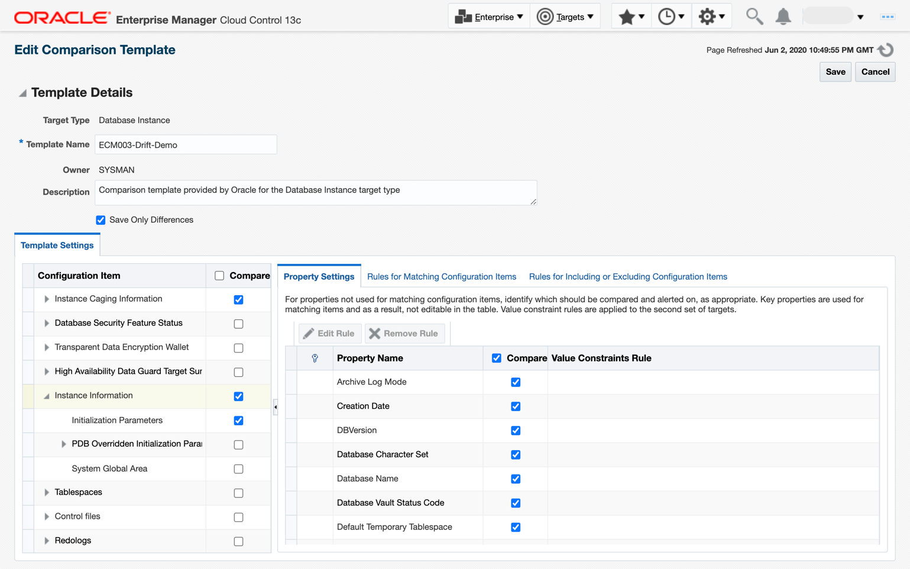
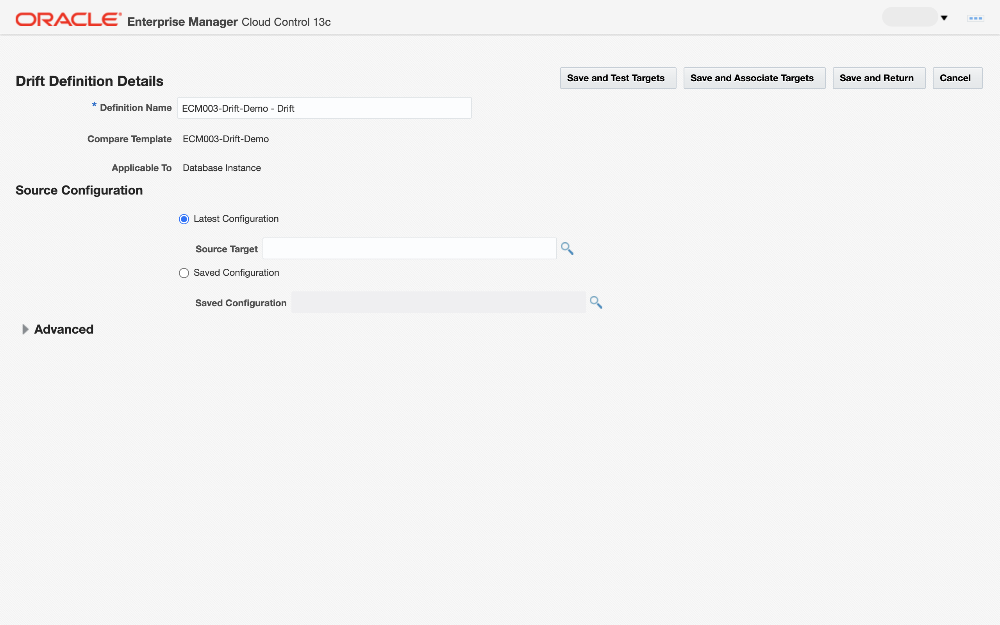
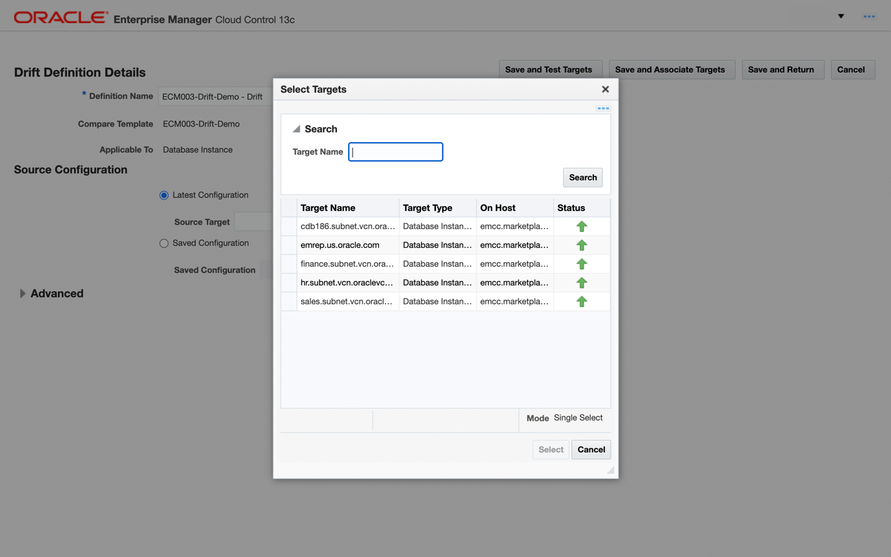
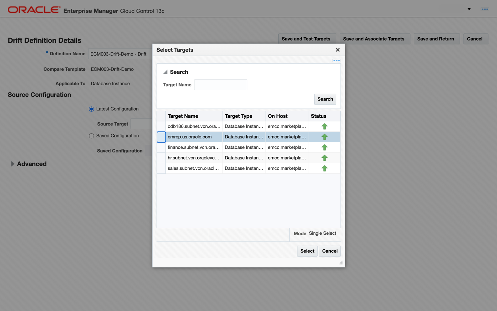
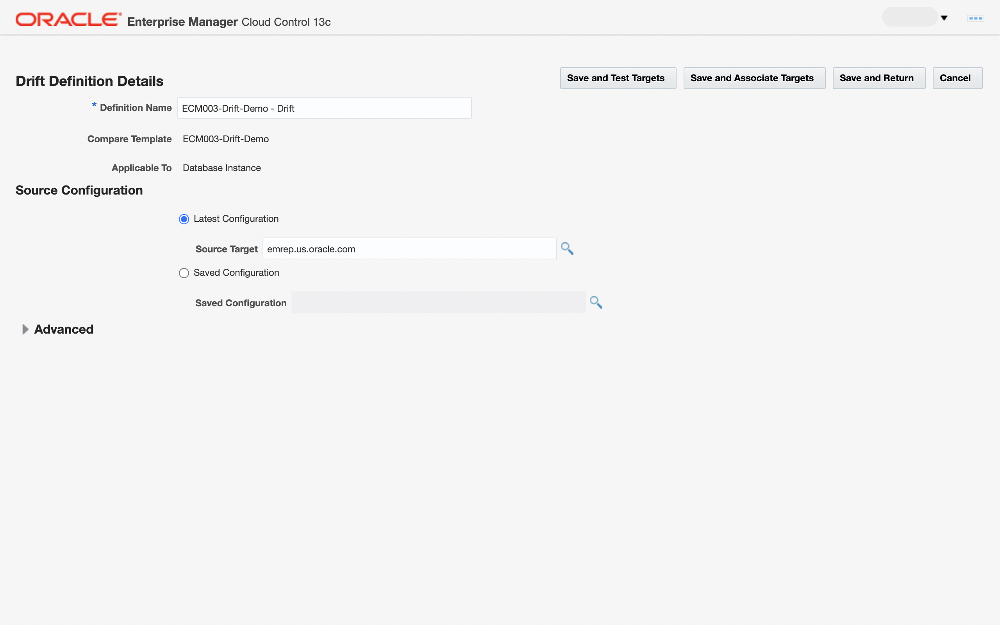
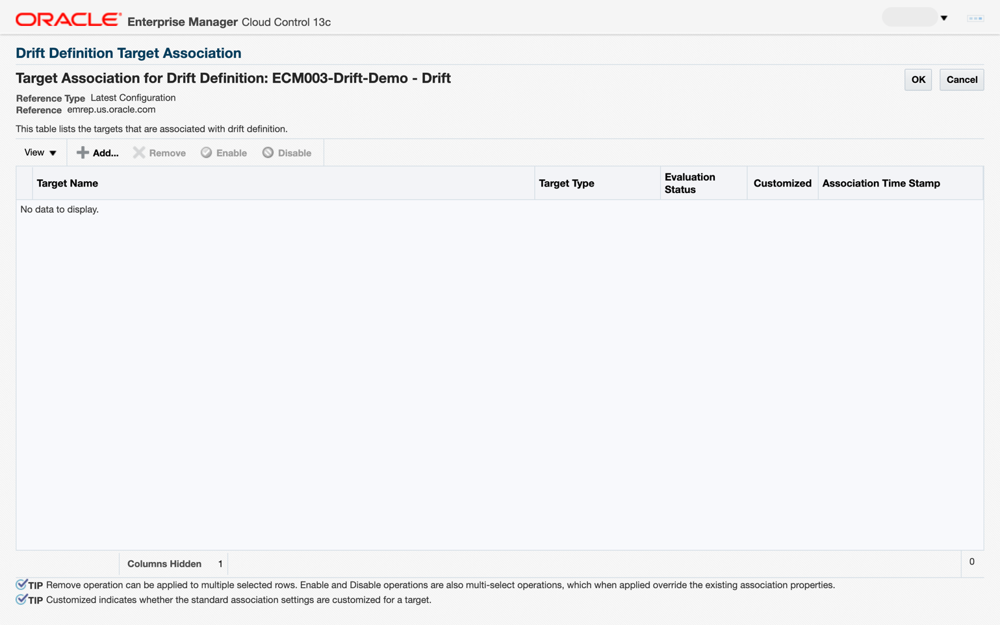
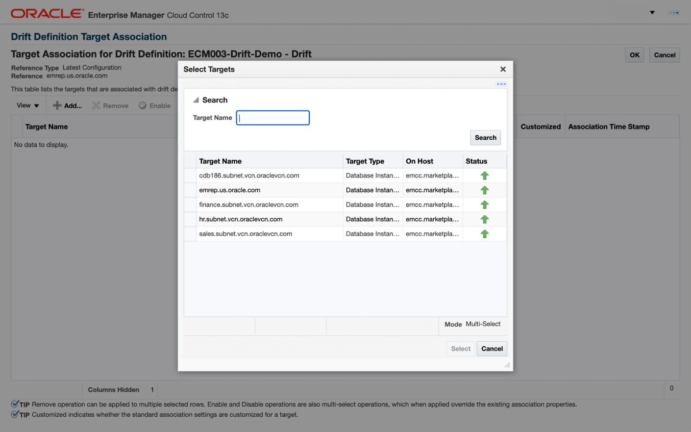
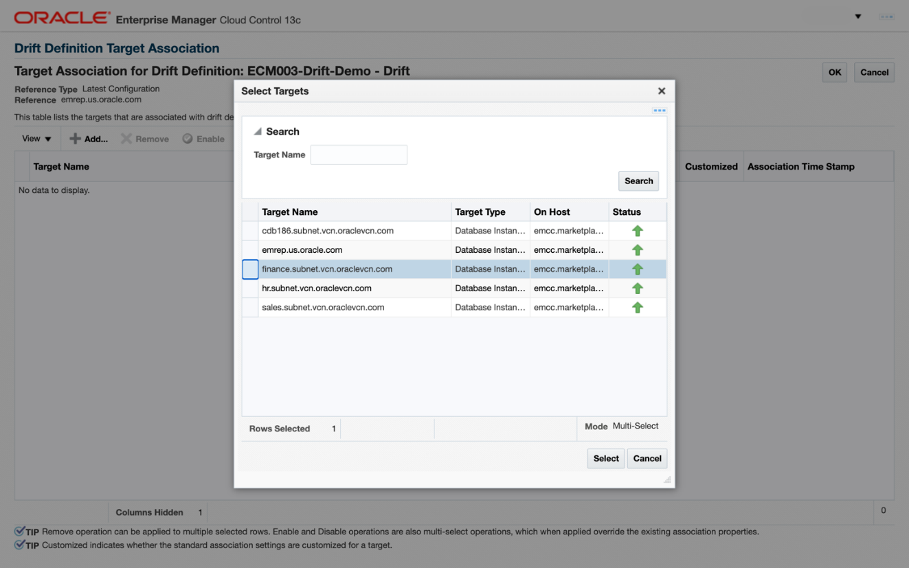
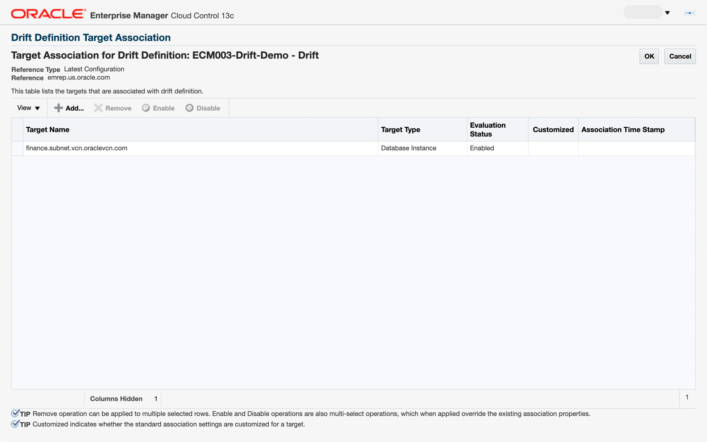
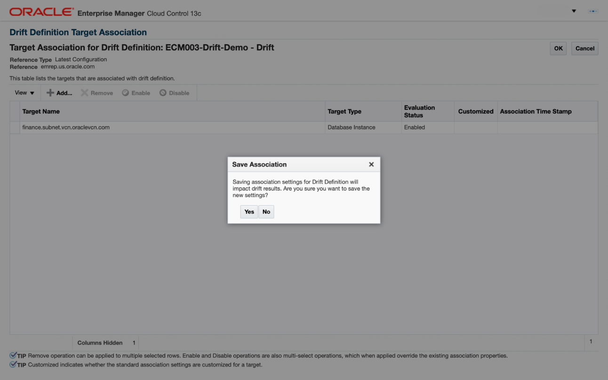

| ./media/image1.emf                                                       |
|--------------------------------------------------------------------------|
|                                                                          |
|                                                                          |
| [./media/image2.png](../../../Downloads/media/image2.png)                |
|                                                                          |
| \| Version Copyright © 2020, Oracle and/or its affiliates Confidential – |

# Purpose Statement

This document provides an overview of Configuration and Compliance Management
features in . It is intended solely to help you assess the business benefits of
upgrading to and to plan your I.T. projects.

# Disclaimer

This document in any form, software or printed matter, contains proprietary
information that is the exclusive property of Oracle. Your access to and use of
this confidential material is subject to the terms and conditions of your Oracle
software license and service agreement, which has been executed and with which
you agree to comply. This document and information contained herein may not be
disclosed, copied, reproduced or distributed to anyone outside Oracle without
prior written consent of Oracle. This document is not part of your license
agreement nor can it be incorporated into any contractual agreement with Oracle
or its subsidiaries or affiliates.

This document is for informational purposes only and is intended solely to
assist you in planning for the implementation and upgrade of the product
features described. It is not a commitment to deliver any material, code, or
functionality, and should not be relied upon in making purchasing decisions. The
development, release, and timing of any features or functionality described in
this document remains at the sole discretion of Oracle.

Due to the nature of the product architecture, it may not be possible to safely
include all features described in this document without risking significant
destabilization of the code.

# Disclaimers For Pre-Release, Pre-GA Products

The **revenue recognition disclaimer** on this page is required for any white
paper that addresses future functionality or for products that are not yet
generally available (GA). If you are unsure whether your statement of direction
needs the disclaimer, read the [revenue recognition
policy](https://stbeehive.oracle.com/content/dav/st/GDMI/Public/REFG-P06.htm).
If you have further questions about your content and the disclaimer
requirements, e-mail [REVREC_US\@oracle.com](http://REVREC_US@oracle.com).

The **testing disclaimer** in the copyright section on the last page
(highlighted in yellow) is provided by the FCC for hardware products. It must
appear in the copyright section for all pre-release, pre-GA hardware products.
Be sure to remove the yellow highlighting before publishing. When the product
becomes GA, update your collateral by removing the disclaimer from the copyright
section. If your product is already GA or if you are writing about a software
product, delete the disclaimer from the copyright section.

**Important:** If your product is not GA, then you cannot include any regulatory
compliance information in the statement of direction. Regulatory compliance
information may be included for GA products only if you have completed all
required safety and emissions testing, and you have received the certificates
issued by the testing organization

# Workshop Highlights

| Workshop Activity No                                      | Feature                                                                 | Approx. Time | Details                                                                                                                                                                                    | Value proposition                                                                                                   |
|-----------------------------------------------------------|-------------------------------------------------------------------------|--------------|--------------------------------------------------------------------------------------------------------------------------------------------------------------------------------------------|---------------------------------------------------------------------------------------------------------------------|
| 1                                                         | Inventory & Usage details                                               | 10 minutes   | IT Manager wants to get an inventory of all existing databases managed by Enterprise Manager including different versions of databases, number of instances deployed over a period of time | Reduce number of different configuration sets and increase standardization across the data center.                  |
| 2                                                         | One-time database comparison                                            | 10 minutes   | Compare latest reference configuration to one or more targets to determine the configuration differences                                                                                   | Validate the configuration of new database provisioned aligns with IT configuration policy                          |
| 3                                                         | Database configuration drift management                                 | 20 minutes   | Compare latest or saved target configuration to one or more targets.                                                                                                                       | Monitor databases in your organization for any configuration drift, remediate to align with reference configuration |
| 4                                                         | Database and host security compliance using custom compliance framework | 20 minutes   | Aggregated security compliance framework and standard for Oracle Database 12c and Oracle Host targets                                                                                      | Monitor security compliance for heterogenous targets from one customized dashboard.                                 |
| [./media/image4.jpg](../../../Downloads/media/image4.jpg) |                                                                         |              |                                                                                                                                                                                            |                                                                                                                     |

\~ A picture containing elephant, clothing, table Description automatically
generated

# Introduction

The objective of this workshop is to highlight Oracle Enterprise Manager Cloud
Control 13c’s Lifecycle Management capabilities related to configuration and
security compliance management of managed targets. Each activity focuses on
different capabilities for an administrator.

# Workshop Activity 1: Inventory & Usage Details

**Summary**

IT Manager wants to get an inventory of all existing databases managed by
Enterprise Manager including different versions of databases, number of
instances deployed over a period of time. This is to reduce number of different
configuration sets and increase standardization across the data center.

All the steps in this activity are read-only, primary goal is to learn about
inventory usage details within Enterprise Manager for all supported targets

1.  Log into your Enterprise Manager VM using the IP provided on your cheat
    sheet.

2.  From the Enterprise menu, select Configuration, then select Inventory and
    Usage Details

3.  In the ‘Show’ filter menu, select **Databases** to see all database
    instances managed by Enterprise Manager

4.  Analyze various database versions and number of instances for each version

5.  Explore pie chart to see the break-down of database inventory by color-code
    percentages. Also, in the **Graphical View**, choose **Trend** radio button
    to see the growth of given database instance over a period of time.

6.  In the Details table below, you will see details like

-   a. Database instance name

    b. Host on which this database is located

    c. Database type - cluster or single instance

    d. Database version number

    e. OS specific details like OS version, platform, etc.

    f. Most importantly, LOB/Department information

Details table gives more information of each Database instance for you to get a
good understanding of number of database targets deployed on a given host with
OS version. If your organization uses properties like Lifecycle, Line of
Business or Department, then you will be able to determine the number of targets
deployed for a given business unit

Explore these features to get a good handle on Inventory and Usage Details

1.  Export inventory details to excel for reports. These inventory details can
    be exported to an excel file for offline analysis or sharing the report to
    management. With the excel report, you can filter based on the properties
    you are using to show department or line of business specific assets
    allocation and usage

# Workshop Activity 2: One Time Database Comparison

In this workshop, you will compare two database targets to determine
configuration differences. One of the databases will act as reference target
that aligns with your configuration policy. Your objective is to compare
initialization parameters to ensure it is compliant with reference target

1.  Log into your Enterprise Manager VM using the IP provided on your cheat
    sheet.

2.  From the Enterprise menu, select Configuration, then select “Configuration &
    Drift Management”

3.  Review the different types of comparisons supported. Select “Create
    Comparison” under One-Time Comparison to define one-time comparison

4.  Choose the reference target that you want other targets to be compared with.

5.  Identify the reference target to compare other targets. To begin with,
    filter ‘Target Type’ to Database Instance

6.  Select emrep.us.oracle.com as reference target

7.  Choose Database Instance Template for Comparison Template

8.  Provide a name for Comparison

9.  Add targets to be compared

10. Choose finance.subnet.vcn.oraclevcn.com target to compare with reference
    target

11. Click Submit. Comparison of the selected targets happens and below are the
    results

12. Filter configurations items to review only Initialization Parameters

-   You can see the differences in the Initialization Parameters between the two
    targets.

    Under the target compared column, you will see few icons. The icons that
    appear in the view are mostly intuitive:

    a. Equal sign means parameter properties are same across the reference and
    target compared

    b. Not equal sign indicates parameter properties are different across the
    reference and target compared

    c. A red box with 1 (left only) means that the comparison did not find a
    matching item to compare, this means 2nd target doesn’t have property
    configured to compare

    d. A red box 2 (right only) means that the comparison did not find a
    matching item to compare to the second configuration

1.  Now, let’s go to Comparison and Drift Management dashboard page for further
    analysis of results

2.  In the dashboard page, there are few tabs on the left side of the screen.
    One of the tab is a page for one-time comparison results

3.  Click on One-Time Comparison Results tab to review all corresponding
    comparison definitions

-   You should see the comparison definition you created in this page.

1.  Export the comparison results into an excel report for offline analysis. In
    the One-Time Comparison Results page, highlight the definition and choose
    Export Results. You can choose the specific results to export.

2.  Exported results in excel for offline analysis looks like:

-   In this workshop, you learnt steps to compare two database targets to
    determine configuration differences. This one-time database (or any
    Enterprise Manager managed targets) comparison will help you quickly
    determine specific configuration changes when compared with reference
    configuration. This is very ideal for troubleshooting any target
    configuration parameters.

# Workshop Activity 3: Database CONFIGURATION Drift Management

In this workshop, you will learn about continuous configuration drift monitoring
of database targets against a reference target for initialization parameters
using customized configuration monitoring template

1.  Log into your Enterprise Manager VM using the IP provided on your cheat
    sheet.

2.  From the Enterprise menu select Configuration, then select “Configuration &
    Drift Management”. Review the different types of comparisons supported.

3.  Go to Templates library on the left panel and look for Database Instance
    Template as shown below.

4.  With Database Instance Template highlighted, choose ‘Create Like’ to create
    a copy of this template for further customization. Provide a unique name to
    the new template and click OK

5.  A complete copy of Database Instance template with unique name is created
    with all configuration items enabled, by default Highlight this new template
    and click Edit

6.  In this workshop, we will customize this template and monitor configuration
    drift for two configuration items. To begin with, uncheck all configuration
    items

7.  Select the following three configuration items only

-   a. Instance Caging Information

    b. Instance Information

    c. Initialization Parameters under Instance Information configuration item

    d. Click Save

    ~~~~~~~~~~~~~~~~~~~~~~~~~~~~~~~~~~~~~~~~~~~~~~~~~~~~~~~~~~~~~~~~~~~~~~~~~~~~
    
    ~~~~~~~~~~~~~~~~~~~~~~~~~~~~~~~~~~~~~~~~~~~~~~~~~~~~~~~~~~~~~~~~~~~~~~~~~~~~

1.  A new customized configuration drift monitoring template is created. This
    template can be used for drift monitoring

2.  Go to Overview tab to create Drift Management definition

3.  Click on Create Definition under Drift Management.

-   a. Choose Database Instance as the Target Type

    b. Select the template created in the previous step

    c. Click OK

1.  In the drift definition details page, provide a unique name for the drift
    definition

~~~~~~~~~~~~~~~~~~~~~~~~~~~~~~~~~~~~~~~~~~~~~~~~~~~~~~~~~~~~~~~~~~~~~~~~~~~~~~~~

~~~~~~~~~~~~~~~~~~~~~~~~~~~~~~~~~~~~~~~~~~~~~~~~~~~~~~~~~~~~~~~~~~~~~~~~~~~~~~~~

1.  Under Source Configuration, do the following

~~~~~~~~~~~~~~~~~~~~~~~~~~~~~~~~~~~~~~~~~~~~~~~~~~~~~~~~~~~~~~~~~~~~~~~~~~~~~~~~
a.  Select ‘Latest Configuration’

b.  Click search to choose Source Target  

    
~~~~~~~~~~~~~~~~~~~~~~~~~~~~~~~~~~~~~~~~~~~~~~~~~~~~~~~~~~~~~~~~~~~~~~~~~~~~~~~~

1.  Choose emrep.us.oracle.com as your source target. Click on Select

~~~~~~~~~~~~~~~~~~~~~~~~~~~~~~~~~~~~~~~~~~~~~~~~~~~~~~~~~~~~~~~~~~~~~~~~~~~~~~~~

~~~~~~~~~~~~~~~~~~~~~~~~~~~~~~~~~~~~~~~~~~~~~~~~~~~~~~~~~~~~~~~~~~~~~~~~~~~~~~~~

1.  You will see Source Target (emrep.us.oracle.com) is selected that acts as
    your reference target

~~~~~~~~~~~~~~~~~~~~~~~~~~~~~~~~~~~~~~~~~~~~~~~~~~~~~~~~~~~~~~~~~~~~~~~~~~~~~~~~

~~~~~~~~~~~~~~~~~~~~~~~~~~~~~~~~~~~~~~~~~~~~~~~~~~~~~~~~~~~~~~~~~~~~~~~~~~~~~~~~

1.  Select ‘Save and Associate Targets’ to select targets to be monitored

~~~~~~~~~~~~~~~~~~~~~~~~~~~~~~~~~~~~~~~~~~~~~~~~~~~~~~~~~~~~~~~~~~~~~~~~~~~~~~~~

~~~~~~~~~~~~~~~~~~~~~~~~~~~~~~~~~~~~~~~~~~~~~~~~~~~~~~~~~~~~~~~~~~~~~~~~~~~~~~~~

1.  Click on Add to select and associate a target to be monitored for drift

~~~~~~~~~~~~~~~~~~~~~~~~~~~~~~~~~~~~~~~~~~~~~~~~~~~~~~~~~~~~~~~~~~~~~~~~~~~~~~~~

~~~~~~~~~~~~~~~~~~~~~~~~~~~~~~~~~~~~~~~~~~~~~~~~~~~~~~~~~~~~~~~~~~~~~~~~~~~~~~~~

1.  Select finance.subnet.vcn.oraclevcn.com as the target.

~~~~~~~~~~~~~~~~~~~~~~~~~~~~~~~~~~~~~~~~~~~~~~~~~~~~~~~~~~~~~~~~~~~~~~~~~~~~~~~~

~~~~~~~~~~~~~~~~~~~~~~~~~~~~~~~~~~~~~~~~~~~~~~~~~~~~~~~~~~~~~~~~~~~~~~~~~~~~~~~~

1.  Click Select. You will see one target selected to be associated with drift
    definition.

~~~~~~~~~~~~~~~~~~~~~~~~~~~~~~~~~~~~~~~~~~~~~~~~~~~~~~~~~~~~~~~~~~~~~~~~~~~~~~~~

~~~~~~~~~~~~~~~~~~~~~~~~~~~~~~~~~~~~~~~~~~~~~~~~~~~~~~~~~~~~~~~~~~~~~~~~~~~~~~~~

1.  Click OK. A pop-up will ask for confirmation to save association. Select
    Yes. This will start the association of this target to drift definition and
    initiated the configuration comparison and continuous drift monitoring.

~~~~~~~~~~~~~~~~~~~~~~~~~~~~~~~~~~~~~~~~~~~~~~~~~~~~~~~~~~~~~~~~~~~~~~~~~~~~~~~~

~~~~~~~~~~~~~~~~~~~~~~~~~~~~~~~~~~~~~~~~~~~~~~~~~~~~~~~~~~~~~~~~~~~~~~~~~~~~~~~~

1.  Once you select Yes in the previous step, you will come to main dashboard
    page. Drift monitoring has already been initiated. After a minute, refresh
    the page to see the drift monitoring completed. You should see an updated in
    the ‘Drifted Targets’ widget in the main dashboard

2.  Click on Drift Results tab on the left panel (2nd tab from the top). This
    page will show results for all drift definitions managed by this instance of
    Enterprise Manager. Identify the drift definition you created for further
    analysis of configuration drift results.

3.  Review the drift details. Click on the Drift Definition (ECM003-Drift-Demo –
    Drift) for detailed analysis of configuration drift

-   You can see the differences in the Initialization Parameters between the two
    targets.

    Under the target compared column, you will see few icons. The icons that
    appear in the view are mostly intuitive:

    a. Equal sign means parameter properties are same across the reference and
    target compared

    b. Not equal sign indicates parameter properties are different across the
    reference and target compared

    c. A red box with 1 (left only) means that the comparison did not find a
    matching item to compare, this means 2nd target doesn’t have property
    configured to compare

    d. A red box 2 (right only) means that the comparison did not find a
    matching item to compare to the second configuration

1.  Export the comparison results into an excel report for offline analysis. In
    the Drift Results page, highlight the definition and choose Export Results.
    You can choose the specific results to export.

2.  Exported results in excel for offline analysis looks like:

-   In this workshop, you learnt about continuous configuration drift monitoring
    of database targets against a reference target for initialization parameters
    using customized configuration monitoring template. This can be customized
    to align with your policies. By establishing a configuration drift
    definition, you can continuously monitor any configuration changes that can
    be potentially secure risk and remediate the drift immediately.

# Workshop Activity 4: Database and Host Security Compliance

Summary:

Compliance Management provides the ability to evaluate the compliance of targets
and systems as they relate to business best practices for configuration,
security, and storage.

In this workshop, you will define and manage compliance framework, two different
compliance standards, and corresponding compliance standard rules for managing
security compliance of database and host targets.

Terminology Used in this Compliance specific workshop

-   Compliance Framework

A compliance framework is an organized list of control areas that need to be
followed for a company to stay in compliance in their industry. Enterprise
Manager uses compliance frameworks as a pyramid structure to map standards and
rules to the control areas they affect. Compliance frameworks are hierarchical
to allow for direct representation of these industry frameworks.

A single framework control area maps to one or more compliance standards. The
outcome of these compliance standard evaluations results in a score for the
given framework area.

-   Compliance Standard

A compliance standard is a collection of checks or rules that follow broadly
accepted best practices. It is the Cloud Control representation of a compliance
control that must be tested against some set of IT infrastructure to determine
if the control is being followed. This ensures that IT infrastructure,
applications, business services and processes are organized, configured,
managed, and monitored properly. A compliance standard evaluation can provide
information related to platform compatibility, known issues affecting other
customers with similar configurations, security vulnerabilities, patch
recommendations, and more. A compliance standard is also used to define where to
perform real-time change monitoring.

A compliance standard is mapped to one or more compliance standard rules and is
associated to one or more targets which should be evaluated.

-   Compliance Standard Rule

A compliance standard rule is a specific test to determine if a configuration
data change affects compliance. A compliance standard rule is mapped to one or
more compliance standards

1.  Log into your Enterprise Manager VM using the IP provided on your cheat
    sheet.

2.  From the Enterprise menu,select Compliance, then select Library

3.  Compliance Standards tab contains all standards for various supported
    targets.

4.  In the Compliance Standards tab, search for “Basic Security Configuration
    for Oracle Database” standard

5.  Select the Basic Security Configuration for Oracle Database standard

6.  Create a copy of this database standard by clicking on ‘Create Like’. Give a
    unique name to the new standard you are creating to imply this is a new
    database standard. Also change the Author name per your preference

7.  Review the various compliance rules for Basic Security standard grouped
    based on the configuration area. Click Save

8.  A new custom database standard is created. Pop-up confirms the successful
    creation of this standards

9.  Select the newly created custom database standard

10. Click on “Associate Targets” to associate a database target for this newly
    created custom standard

11. When Associate Target option is chosen, you will be taken to a page to add
    database targets.

-   Click Add to add targets for association with this compliance standard

1.  Choose emrep.us.oracle.com target to check the compliance security posture

2.  The list of targets chosen will show up in the target association page as
    shown below

3.  Click OK and a pop-up shows up to confirm association. Click Yes to save the
    association which initiates compliance check on this target by executing all
    the compliance rules associated with this compliance standard

4.  To check if the compliance check is complete, click the target number in
    ‘Association Count’ column.

5.  If the Transfer Status indicates ‘Successfully Done’, it means compliance
    check is complete. Click cancel button

6.  Go to Compliance Results page to check the compliance posture

7.  Highlight the standard that you created in the previous steps to review the
    overall compliance score, target evaluations and violation details

8.  Click on the Compliance Standard name to see the details of the result

9.  Explore different tabs in this results page. Result By Compliance Standard
    Rule tab gives you more details of each compliance rule executed on this
    selected target

-   All these will give you a security posture of database target

1.  Now, let’s go repeat these steps for host target. Go to Compliance Library
    page

2.  Search for Secure Configuration for Host and select that standard

3.  Create a copy of this host standard by clicking on ‘Create Like’. Give a
    unique name to the new standard you are creating to imply this is a new host
    standard. Also change the Author name per your preference

4.  Review the various compliance rules for Basic Security standard grouped
    based on the configuration area. Click Save

5.  A new custom host standard is created. Pop-up confirms the successful
    creation of this standards

6.  Select the newly created custom host standard

7.  Click on “Associate Targets” to associate a host target for this newly
    created custom standard

8.  When Associate Target option is chosen, you will be taken to a page to add
    database targets

9.  Choose emcc.marketplace.com target to check the compliance security posture

10. The list of targets chosen will show up in the target association page as
    shown below

11. Click OK and a pop-up shows up to confirm association. Click Yes to save the
    association which initiates compliance check on this target by executing all
    the compliance rules associated with this compliance standard

12. Go to Compliance Results page to check the compliance posture

13. Highlight the standard that you created in the previous steps to review the
    overall compliance score, target evaluations and violation details

14. Click on the Compliance Standard name to see the details of the result

15. Now, let’s create Compliance Framework to include the two standards you
    created so far. Objective here is to look at aggregated compliance score of
    both database and host at framework level. Go to Compliance Library page

16. Go to Compliance Framework tab

17. Create a new framework. Click Create, provide a unique name for the
    framework and author

18. Click Continue. This will take you to a new page so that compliance
    standards can be added

19. With right-mouse button on the framework name in the left panel, you will
    see a menu list for adding standards.

20. Click Add Standard that will pop-up a window to select the standards to add

21. Filter the standards by choosing Database Instance in “Applicable To” menu.
    Choose the database compliance standard you created in the previous steps

22. Repeat the above steps for adding

23. Now both database and host custom compliance standards have been added to
    the new custom compliance framework as shown below

24. Click Save. A pop-up confirms the successful creation of custom framework

25. Since two compliance standards are associated to this new framework, you can
    review the compliance results at framework level. Go to compliance results
    page

26. In the results page, go to Compliance Framework tab to see the framework you
    created. You see an aggregated compliance score at framework level. This is
    an aggregation of both database and host standard you added to this
    framework.

27. Click on the framework name to see details of the results. You can see the
    results at target level

28. You can also look at results at compliance standard level by choosing the
    standard tab. You will be able to see compliance score for each standard

29. You can also step into standard level score from the left panel as shown
    below for database standard

30. And below is the compliance score and details for the host standard

With this workshop, you got a hands-on experience in creating a custom framework
to monitor the security compliance of heterogeneous targets (Database and Host,
this example). This will help you assess overall security compliance of all
Enterprise Manager managed targets from one aggregated view. And if required,
you can drill down into each standard to assess details of target specific
security compliance
