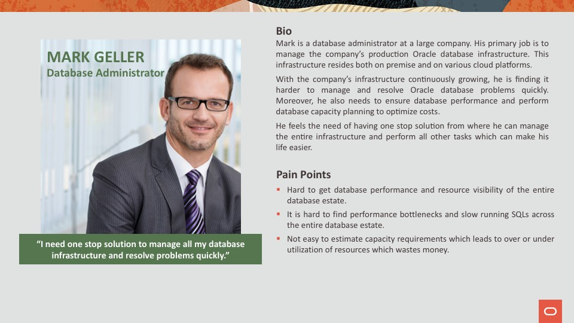
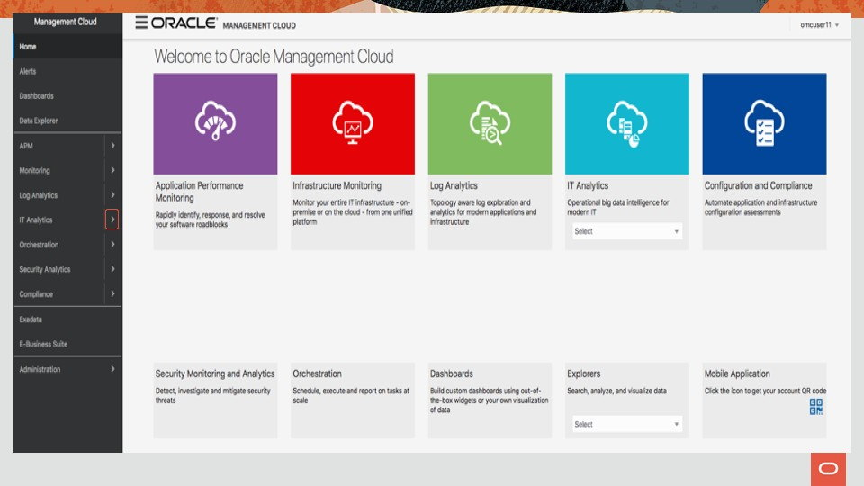
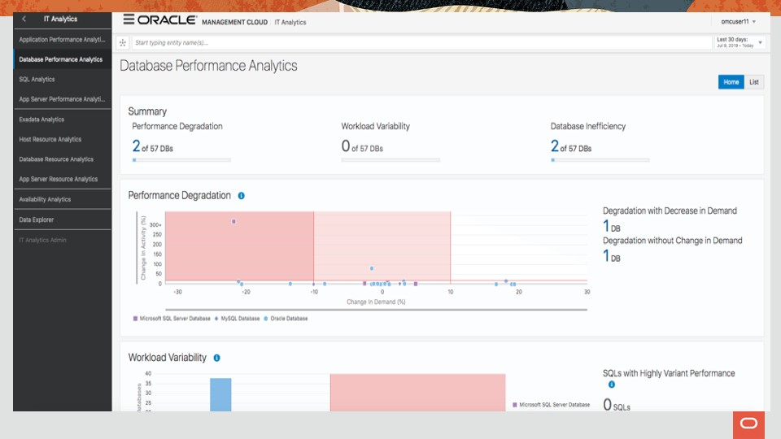
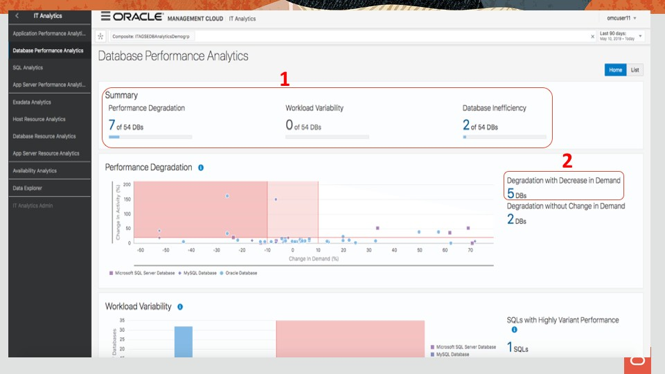
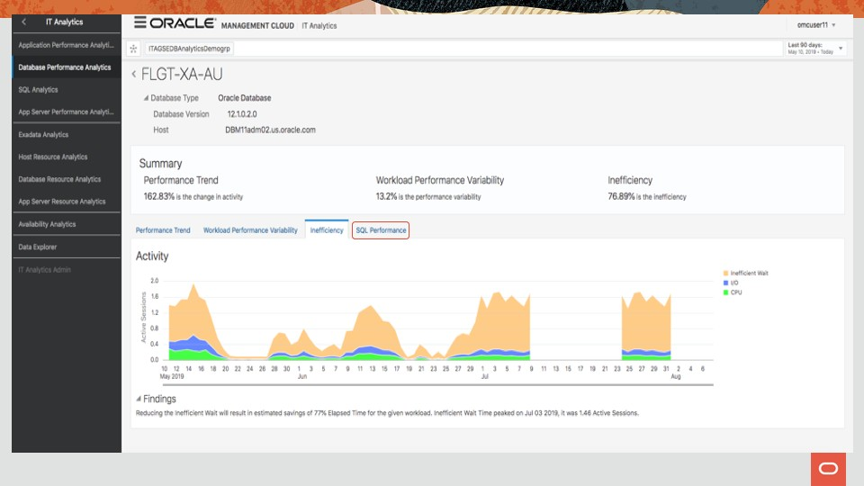
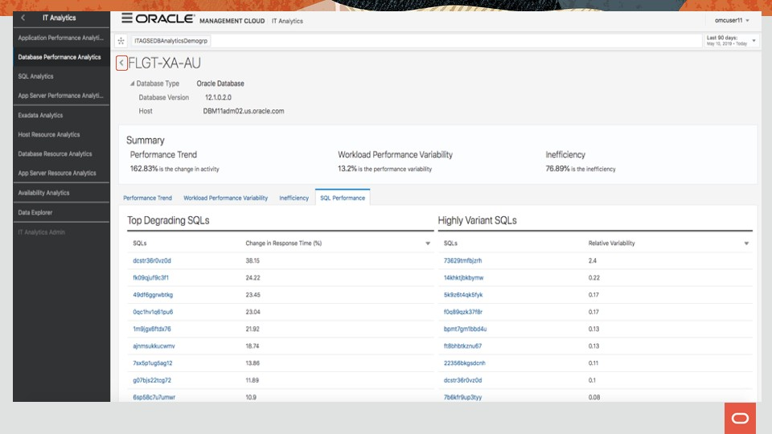
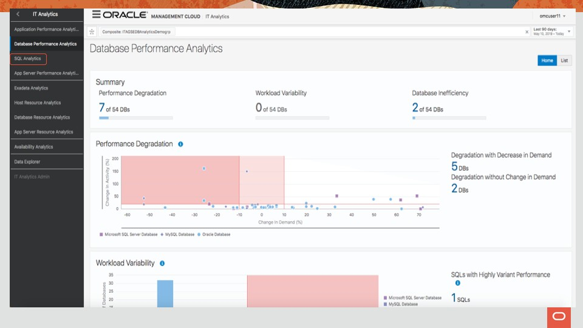
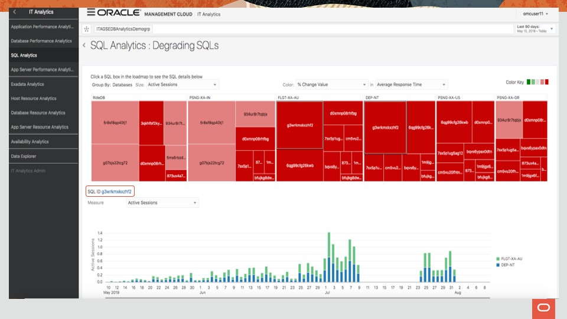
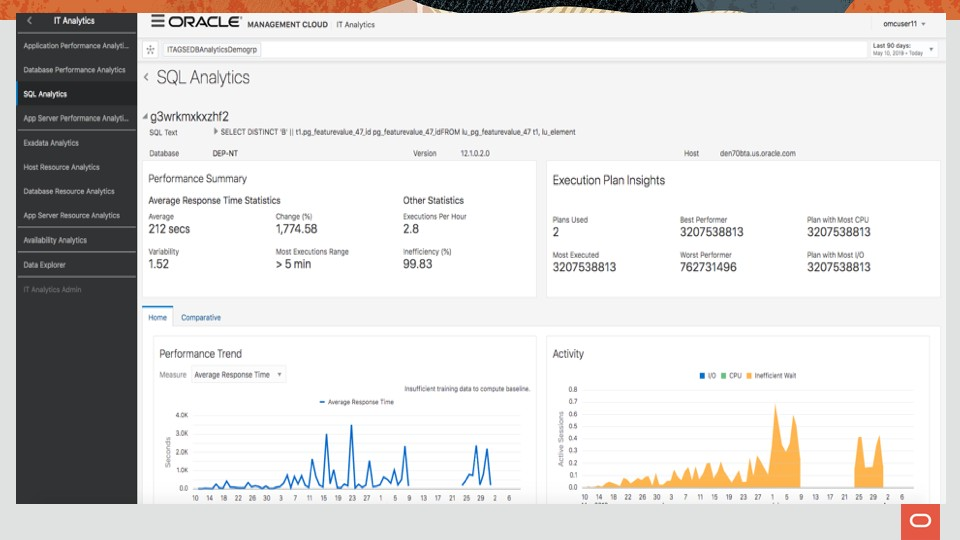

**Proactive Oracle Database Performance Management**
====================================================

In these hands-on lab activities, learn how to identify systemic database and
SQL performance issues, and proactively forecast database resource utilization.
See how to obtain complete and centralized visibility of your Oracle Databases
whether they are on-premises or in the Oracle Cloud using Oracle IT Analytics.

Lab Exercise Persona
--------------------

**NOTE**: Use Google Chrome to perform the lab for the best hands on experience

First, you need to get logged in to the Oracle Cloud. [Enter the Identity
Domain], then **Click** the Go button.

[Enter Username and Password], then **Click** the Sign In button

**Lab 1: Identifying Database Performance Bottlenecks**
=======================================================

**Scenario Details**

Users need to identify databases which are degrading or inefficient over a
period of time. Identify the SQL causing performance issues

**Task**

Get insight on performance bottlenecks by performing database performance
analysis.

NOTE: During activities in this lab, data in dashboard may appear differently
than what appears in screenshots. Please focus on the flow and steps, instead of
the actual data values displayed in screenshots.

**Learner Goal**

How performance insights on databases can be obtained starting with the IT
Analytics Database Performance Analytics Dashboard.

**Value Proposition**

“Time is money” for business. Troubleshooting database performance and finding
root cause is complex and takes a lot of time; requiring review and analysis of
a lot of different data. Too often the result is finger pointing, not resolution
because there is no “single source of truth”

**Duration**: 15 mins.

1.  From the left side services navigation listing, **Click** on the greater
    than arrow to the right of the IT Analytics title

    

2.  Then Click on Database Performance Analytics

    

3.  This will open ‘Database Performance Analytics’ dashboard which is an out of
    the box dashboard supplied by OMC for database performance analysis.

    

4.  In the global entity selector at the top, type in **ITA** and a drop down
    entry **ITAGSEDBAnalyticsDemogrp** will appear; Select it

    

5.  Now, select a time period to review for the performance analysis. From the
    time selector drop down in the upper right that has the default ‘Last 30
    days’ appearing, **Select Last 90 days** from the menu.

    

6.  **First** within the ITAGSEDBAnalyticsDemogrp group, the dashboard now
    identifies in the Summary section at the top, the Oracle Databases (DBs)
    that have had the following performance issues in the last 90 days: DBs with
    performance degradations, DBs with workload performance variability, and DBs
    with inefficiency. The Performance Degradation section shows change in
    activity (%) vs change in demand (%) for various DBs in
    “ITAGSEDBAnalyticsDemogrp” group and highlights the DBs whose activity has
    increased with decrease in demand or no change in demand. Databases with
    performance degradation are the databases whose performance has degraded
    over time and is correlated with change in demand. Where Demand = Executions
    and Activity = Database Time. Databases with Decrease in Demand are the
    databases having negative correlations between demand and activity. From the
    Performance Degradation section in Database Performance Analytics, you can
    identify the databases that have degraded in performance as follows:
    Degradation with decrease in demand Change in response time greater than 20%
    Change in activity less than -10% Degradation without change in demand
    Change in response time greater than 20% Change in activity between 10% and
    -10%. **Second**: under the ‘Degradation with Decrease in Demand’ heading
    **Click** on the **5 DBs link.**

    

7.  Now shown are the details of databases having performance degradation with
    decrease in demand. To further drill down. **Click** one of the Database
    Name links, for example FLGT-XA-AU.

    

8.  It navigates to a page with more performance details on that database.
    **Scroll** down the page

    

9.  The **Performance Trend** tab provides details of the activity and demand
    trend for the selected database. First, on the right, under the settings
    header **Click** on Settings. Using this, one can also do activity and
    demand projections using different regression models. **Second**, **Click**
    on the **Workload Performance Variability** tab next as databases with
    variable performance are symptomatic of unpredictable workload and
    application response times. These are the databases with high degree of
    variance in SQL response time.

    

10. Under the Workload Performance Variability tab we see databases having a
    high degree of variance in SQL performance responsiveness. Next, **Click**
    on the **Inefficiency** tab

    

11. This tab shows activity in terms of active sessions and their breakup by
    CPU, I/O and Inefficient waits. Reducing the Inefficient Waits improves the
    performance of the database. Inefficient databases are databases where large
    % of the database time in spent in application waits (not on CPU or I/O)
    [Click on SQL Performance]

    

12. This tab highlights the top degrading and highly variant SQLs on this
    database. [Scroll Up] [Click on the back button “\<” on the top, next to DB
    name]

    

13. This brings us back to the ‘Database Performance Analytics’ dashboard. Step
    1: [Scroll Down] ‘Workload Variability’ section shows the SQL performance
    variance summary for the DBs and highlights SQLs with high performance
    variance. ‘Database Inefficiency’ section shows summary of the inefficiency
    for all DBs and highlights the inefficient DBs. Step 2:[Click ‘2 DBs’ under
    ‘Inefficient Databases’]

    

14. This gives the details of the DBs with high inefficiency. One can drill down
    to a particular DB further by clicking the DB name as we saw in earlier
    slides. [Click Close]. Similarly, one can get more details about the
    ‘Increasingly Inefficient’ DBs.

    

15. [Click ‘SQL Analytics’ from OMC Menu]

    

16. This opens another OOB dashboard provided by OMC for SQL performance
    analysis. This shows the degrading, highly variant, inefficient SQLs and
    SQLs with plan changes running across all DBs in ITAGSEDBAnalyticsDemogrp.
    Also highlights top SQLs by CPU and I/O. At the bottom it shows performance
    analysis chart for SQLs with various filter options. NOTE: this is a live
    environment and the time range we have selected is relative i.e. last 90
    days and not constant, so the data on live dashboard may differ from what is
    shown in the screenshots. Please pay more attention to the steps, rather
    than the exactness of data on the page.[Click on degrading SQLs count 47]

    

17. Here one can view all these degrading SQLs and select one to analyze
    further. [Click on SQL ID i.e. ‘g3wrkmxkxzhf2’]

    

18. From here one can drill down into a specific degrading SQL and analyze to
    find the reason for slowness.

19. This completes Lab 1.
