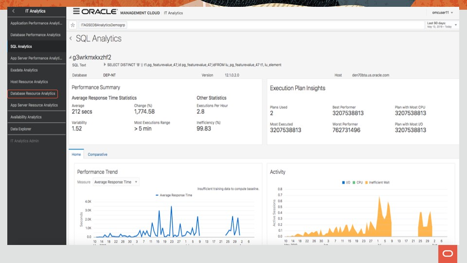
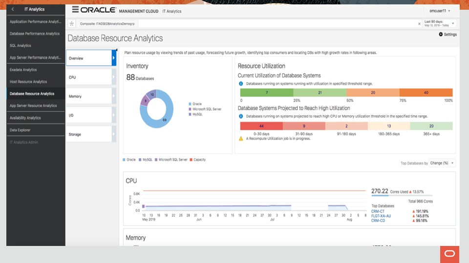
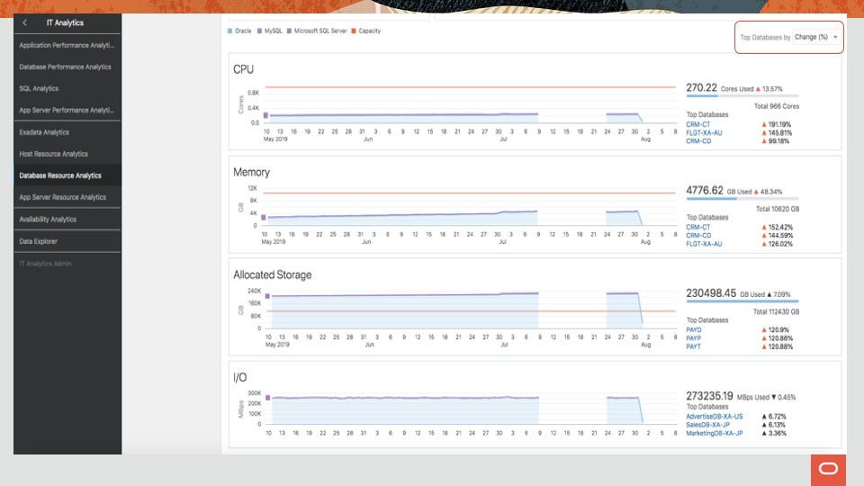
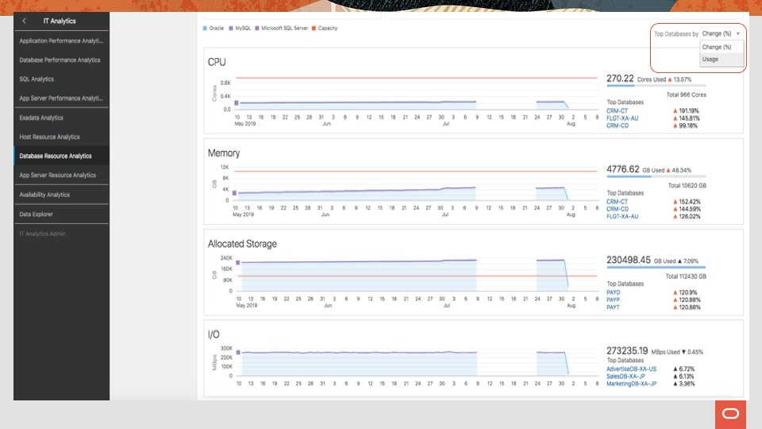
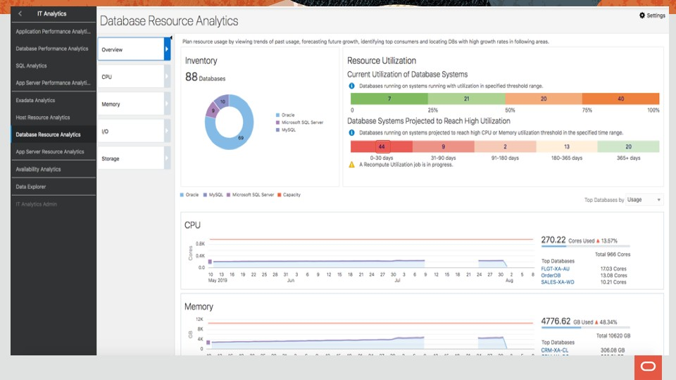
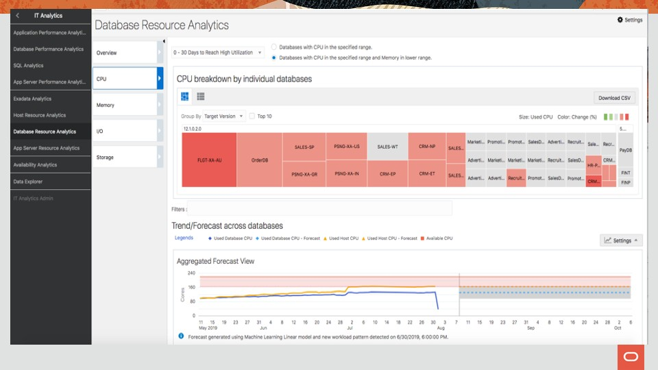
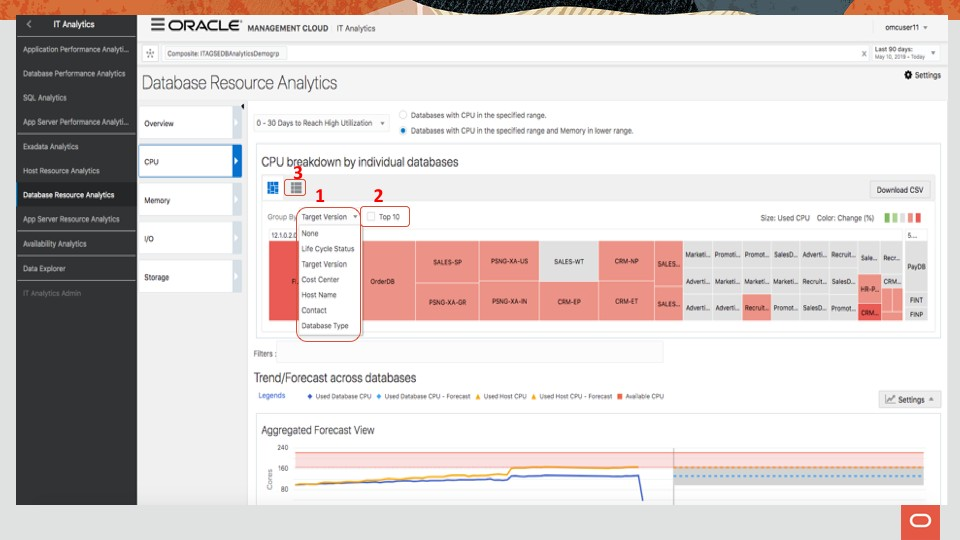

**Lab 2: Database Resource and Capacity Planning Performance Bottlenecks**
==========================================================================

**Scenario Details**

Users need to identify under-utilized and over­utilized databases and plan
future database capacity

**Task**

View all Oracle Databases running in the infrastructure, review and analyze them
together to identify any databases that are over-utilized, any databases
under-utilized. Then consolidate under/over-utilized resources using Machine
Learning. **NOTE**: During activities in this lab, data in dashboard may appear
differently than what appears in screenshots. Please focus on the flow and
steps, instead of the actual data values displayed in screenshots.

**Lab Goal**

Successfully perform database resource utilization and capacity planning of
database with IT Analytics.

**Value Proposition**

Proper database resource utilization is essential to maintaining optimal
database performance and cost.

**Duration**: 15 mins.

1.  From the navigation bar on the left, Click on Database Resource Analytics as
    highlighted

1.  This opens up the **Database Resource Analytics** dashboard. This is an out
    of box dashboard for performing database resource analytics

    

2.  The **Resource Utilization** section of the dashboard categorizes databases
    based on their current resource utilization. It also categorizes databases
    based on when they are projected to reach high CPU or Memory utilization by
    leveraging Machine Learning technology. Next **Scroll** down.

    

3.  The lower section of the dashboard shows aggregate usage of CPU, Memory,
    Allocated Storage and I/O and highlights top databases by their usage
    percentage for those resources. Next, in the upper right, Click the Top
    Databases by dropdown menu

    

4.  Now, select Usage from the dropdown menu. It then displays the top used
    databases by their resource usage.

    

5.  **Scrolling** back up, under the Databases System Projected to Reach High
    Utilization heading now **Hover** over 0-30 days and the number that appears
    above it (in this case 44). Those are the databases projected to reach
    maximum CPU and memory utilization thresholds in next 30 days**.**

    

6.  Now **Click** on the number (44) and we see that there are 41 databases
    reaching their CPU maximum threshold in the next 30 days. Now Click on the
    41 Databases link displayed in blue, and the CPU tab opens where you get
    further detail on those databases.

    

7.  You see greater detail about the CPU usage and percentage change in CPU
    usage for those databases. There is also a CPU usage forecast for them also
    displayed.

    

8.  In the upper right, **Click** on the **0-30 Days to Reach High Utilization**
    dropdown. From here you can filter the databases on their current
    utilization or Days to Reach High Utilization.

    

9.  **First** - under the **CPU breakdown by individual databases** heading,
    from the **Group By** dropdown, **Click** on **Target Version** to what
    selections are available. You can use the Group By option to review specific
    database properties (Lifecycle Status, Target Version…) in the treemap.
    **Selecting Target Version** there further is a check box you can use to
    filter and just display the **Top 10** databases. **Second** - go ahead and
    **Check** the **Top 10** check box. **Third** - There is also the option to
    view the databases in a table format. **Click** on the table icon (looks
    like small cubes) just to the right of the treemap icon.

    

10. Now under the CPU breakdown by individual databases heading, you can review
    the information displayed for each database in a table format.

    

11. Next, on the lower right, Click **Settings** to view different models for
    forecasting database CPU utilization. To the left of **Settings**, using the
    **Filters** command bar, you can perform a forecast on a set of databases
    you specify. **Similar** functionality is available for analysis of other
    resources (Memory, I/O, Storage).

>   That completes Lab 2 for Proactive Oracle Database Performance Management
>   using Oracle IT Analytics.
