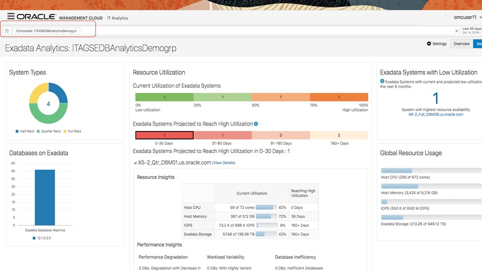
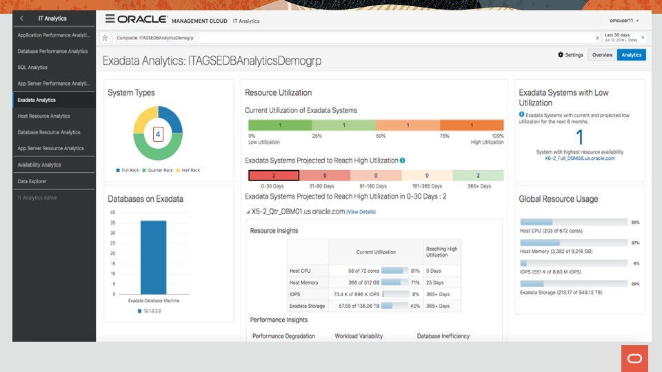
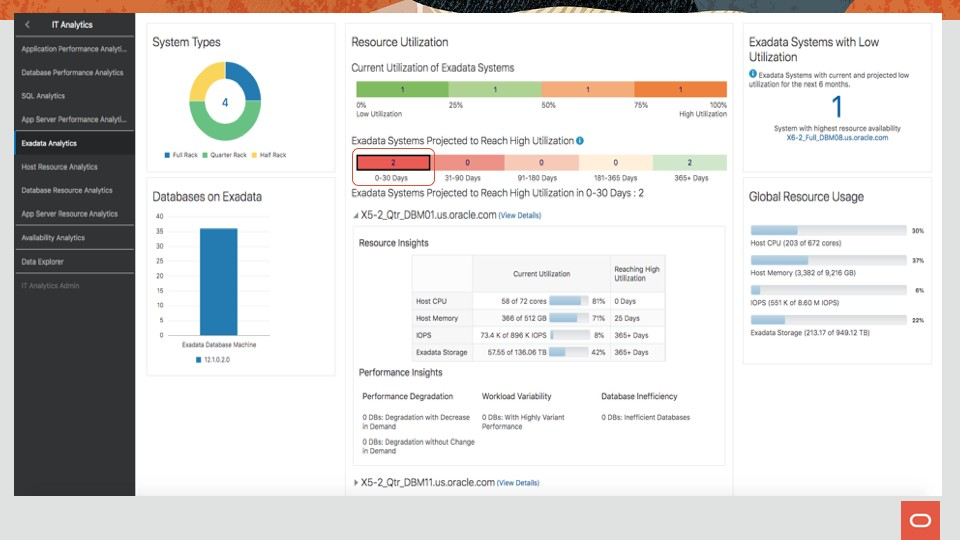
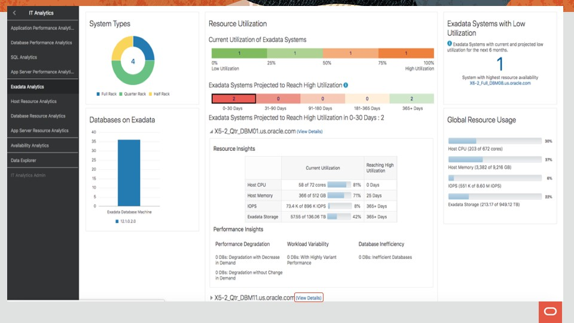
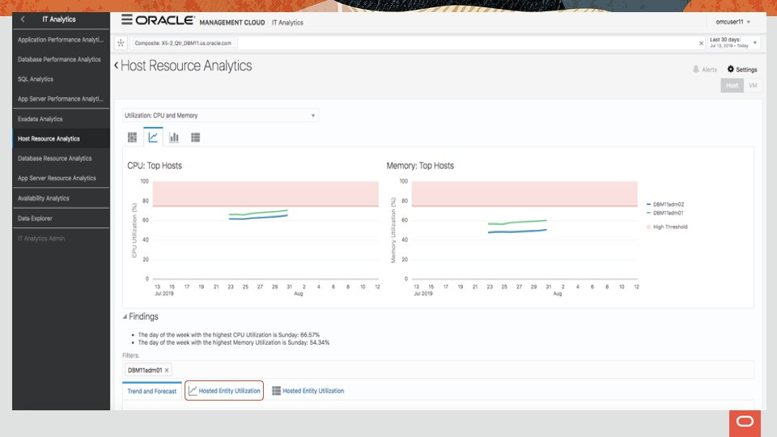

**Lab 3: Maximizing Oracle Exadata Performance, Capacity Planning** 
====================================================================

**Scenario Details**

How to ensure performance of databases running on Oracle Exadata’s and that
there is sufficient Exadata capacity.

**Task**

View all Oracle Exadata systems together, review and analyze them together to
identify any that are over-utilized, any under-utilized. Identify Exadata
systems having available capacity to support consolidation of additional
databases. Based on current load growth, what (CPU, Memory, I/O) bottlenecks are
projected. NOTE: During activities in this lab, data in dashboard, names of
Exadata machine host, databases, SQL_IDs and metric numbers may change or appear
differently than what appears in screenshots. Please focus on the flow and
steps, instead of the actual data values displayed in screenshots.

**Lab Goal**

Successfully perform database resource utilization and capacity planning of
Exadata systems with IT Analytics.

**Value Proposition**

Proper resource utilization is essential to maintaining optimal database
performance and cost.

**Duration**: 15 mins.

1.  Let’s identifying which Exadata system(s) will run out of capacity in less
    than a month and which system has databases with less than a month
    remaining. From the navigation bar on the left, **Click** IT Analytics and
    then further **Click** on Exadata Analytics.

1.  At the top left, in the global entity selector, **Type** in **ITA** and when
    the **ITAGSEDBAnalyticsDemogrp** appears, select it.

    

2.  Exadata Analytics enables you to get visibility into your entire fleet of
    Oracle Exadata systems. You can view current utilization of key resources
    (CPU, Memory, Storage, Disk, IOPS...) for last 90 days. In the upper left,
    under the **System Types** heading, **Click** on the number in the middle of
    the circle (in this case 4). That will show an inventory of all Exadata
    systems you have in your fleet.

    

3.  Next go and **Hover** under the **Exadata Systems Projected to Reach High
    Utilization** heading. Analyzed and displayed are the Exadata systems
    reaching capacity in 30, 90, or 180 days. Using Exadata Analytics, you can
    forecast capacity growth, make informed decisions and plan. **Click 0-30
    Days** where 2 Exadata systems are identified.

    

4.  To check on the Exadata systems forecasted to run out of capacity shortly.
    Click on the View Detail link for one of the Exadata system displayed. In
    this case (X5- 2_Qtr_DBM11.us.oracle.com.

    

5.  Next on the page for that Exadata system, under the **Insights** heading,
    you can view details about it**.**

    

6.  Scroll down the page and when you get to the **Hosts** heading **Click** and
    expand it to view which databases are running out of CPU resources. In this
    case (DBM11adm01). Next in the upper right, **Click See All**

    

7.  In the **Host Resource Analytics** section, Utilization: CPU and Memory drop
    down menu, increasing utilization can be seen. **Hover** your mouse over the
    **CPU Top Hosts** graph to view associated host and CPU utilization. Then
    **Scroll** down further and under the **Trends and Forecast** tab you can
    view additional information. Afterwards, **Click** on the **Hosted Entity
    Utilization** tab to identify the database using most resources.

    

8.  Under the **Hosted Entity Utilization** tab can be viewed all the databases
    running on this host and the top databases using the most CPU resources.

>   That completes Lab 3 for Proactive Oracle Database Performance Management
>   using Oracle IT Analytics.
