# Monolithic to Microservice Cloud Native Development -- Setup Cloud Environment

  

## Workshop Overview

In this workshop you are guided through using many of the Oracle's Cloud Services to support a transition from a monolithic on-prem environment to a Cloud based microservices environment. The high level flow will be:

- Lab 050: Provision supporting services (Client Image, Database, Visual builder Instance).
- Lab 100: Populate your database with seed data.
- Lab 200: Create a Compute Instance and use Docker to deploy a Java based REST application.
- Lab 300: Deploy and explore the REST application into a Kubernetes Cluster.
- Lab 400: Create a Visual Builder mobile application to use the REST endpoints of the Java application.

***To log issues***, click here to go to the [github oracle](https://github.com/oracle/learning-library/issues/new) repository issue submission form.

## Lab 050 Objectives

- Start up the supporting Client Image
- Create Autonomous Transaction Processing (ATP) Database
- Provision a new Visual Builder Cloud Service and Application

# Infrastructure Setup

You will create all required infrastructure components that support this workshop.

## Startup your Client Image

The client image is a pre-installed Compute Service Instance that has GIT and SQL Developer already installed. You will use VNC Viewer to access this instance.

### Prerequisite

Once the infrastructure is provisioned you can access your enironment using `VNC Viewer`. Please download and install from: <a href="https://www.realvnc.com/en/connect/download/viewer/" target="newwer">VNC Viewer</a>

### **STEP 1**: Access and Register for the Jumpstart Client

- Open the following link in a new tab in your browser. <a href="https://oci.qloudable.com/demoLab/public-preview/24007932-775e-42e6-a4c1-528c39b1b757" target="newwerc">Client Image Link</a>

- Click the **Sign Up** button in the top right corner. _If you already have and account you can proceed to step 2 below._

 

- Fill out the required fields and click **Sign Up**.

 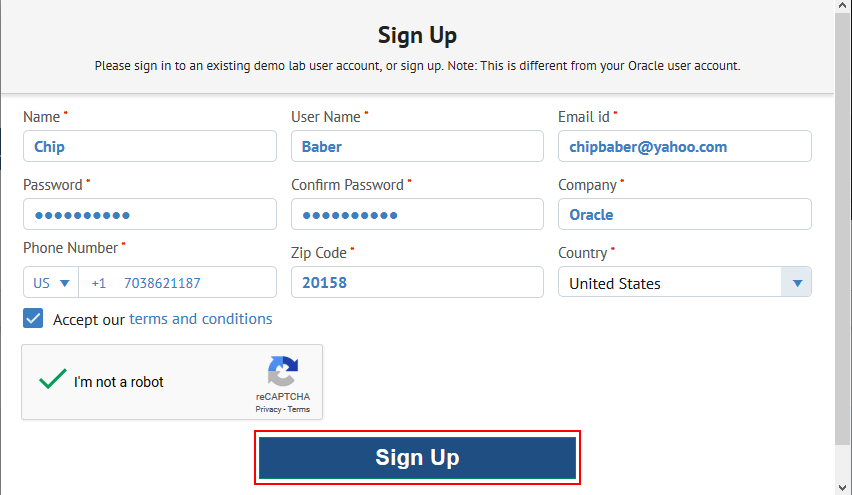

- You will receive a email asking you to verify your account. Open your email client in a new window and click **Confirm My Account** before proceeding.

 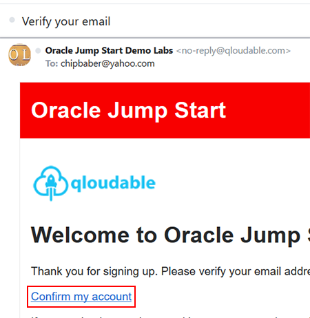

### **STEP 2**: Start the Jumpstart Client Image

- Navigate back to your browser window. Enter your email address and password and click **Sign In** on the next screen.

 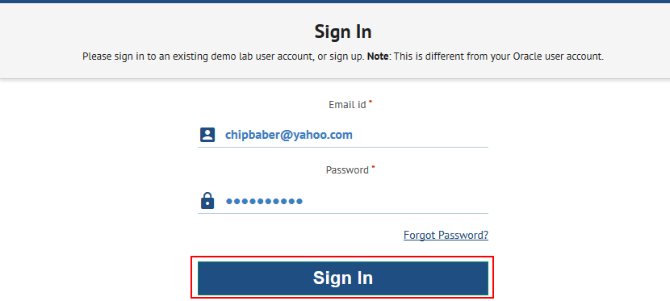

- Click **Demo Lab**.
 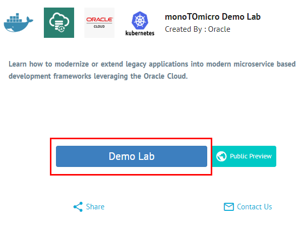

- In **5** minutes the Oracle IaaS infrastructure including the client image will be available. **Leave this browser tab opened** as we will return to it shortly.
 


## Access Your Trial Account

### **STEP 1:** Your Oracle Cloud Trial Account

You have already applied for and received your Oracle Cloud Trial Account.

### **STEP 2**: Log in to your OCI dashboard

  - Once you receive the **Get Started Now with Oracle Cloud** Email, make note of your **Username, Password and Cloud Account Name**.

    

  - From any browser go to

    [https://cloud.oracle.com/en_US/sign-in](https://cloud.oracle.com/en_US/sign-in)

  - Enter your **Cloud Account Name** in the input field and click the **Next** button.

    

  - Enter your **Username** and **Password** in the input fields and click **Sign In**.

    

  - You are presented with the Oracle Cloud Infrastructure (OCI) Dashboard/Portal

    

### **STEP 3**: Create a Compartment

Compartments are used to isolate resources within your OCI tenant. User-based access policies can be applied to manage access to compute instances and other resources within a Compartment.

  - Click the **Menu icon** in the upper left corner to open the navigation menu. Under the **Governance and Administration** section, select **Identity** and select **Compartments**.

    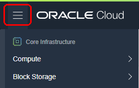

    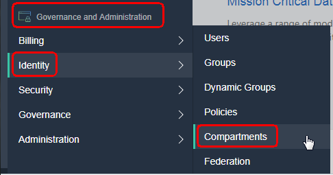

  - Click **Create Compartment**

    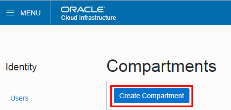

  - In the **Name** field, enter `monoTOmicro`. Enter a **Description** of your choice. Click **Create Compartment**.

    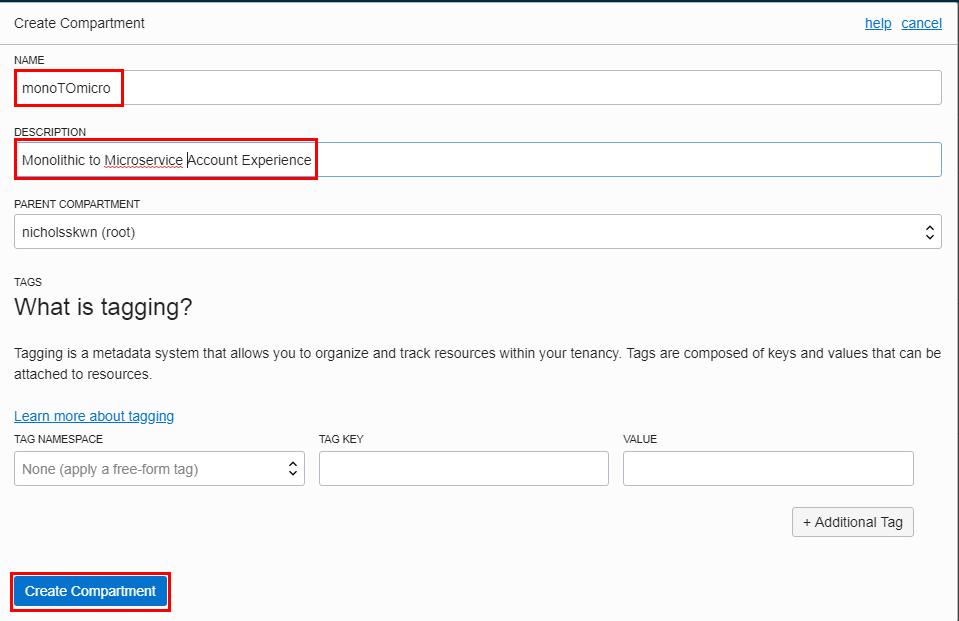

  - In a moment, your new Compartment will show up in the list.

    

## Autonomous Transaction Processing (ATP) Database Creation
	
### **STEP 1**: Create an Autonomous Transaction Processing (ATP) Database

We require a Database to store the Alpha Office data which is accessed later in this workshop.  We will create an Autonomous Transaction Processing (ATP) Database to load data into.  Autonomous Transaction Processing is one of a family of cloud services built on the self-driving, self-securing, and self-repairing Oracle Autonomous Database.  Autonomous Transaction Processing uses machine learning and automation to eliminate human labor, human error, and manual tuning, delivering unprecedented cost saving, security, availability, and production. Autonomous Transaction Processing supports a complex mix of high-performance transactions, reporting, batch, IoT, and machine learning in a single database, allowing much simpler application development and deployment and enabling real-time analytics, personalization, and fraud detection.

  - Click the **Menu icon** in the upper left corner to open the navigation menu. Under the **Database** section of the menu, click **Autonomous Transaction Processing** .

    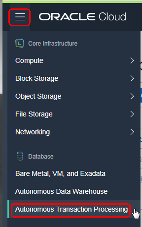

  - Select the **Compartment** `monoTOmicro` and click **Create Autonomous Transaction Processing Database**.

    

  - Select the **Compartment** `monoTOmicro` if it is not already selected. Enter the **Display Name** `AlphaOffice`, **Database Name** `orcl`, enter the **Administrator Password** of `a1phaOffice1_` and Click **Create Autonomous Transaction Processing Database**

    

    

  - After approximately 5 minutes, the ATP instance will be provisioned. You can immediately proceed to the next section.

    

## Visual Builder Instance Creation

You will use the Visual Builder Cloud Service to create an instance.

### **STEP 1**: Create a New Visual Builder Cloud Service

In this step you will create a VBCS instance that will be used in Lab 400. It takes about 20 minutes for the underlying infrastructure to be created. We just need to fire off the create instance process at this point. We'll check the status of the instance at the beginning of Lab 400.

- From the OCI console go back to your Services Dashboard by clicking on the hamburger menu in the upper left hand side of the page and selecting **Administration-->My Services Dashboard**

  

  

- You should be back at the main Dashboard:

  

- Click the **Customize Dashboard** panel.

  

- Then select `Visual Builder` and click the **Show** button.

  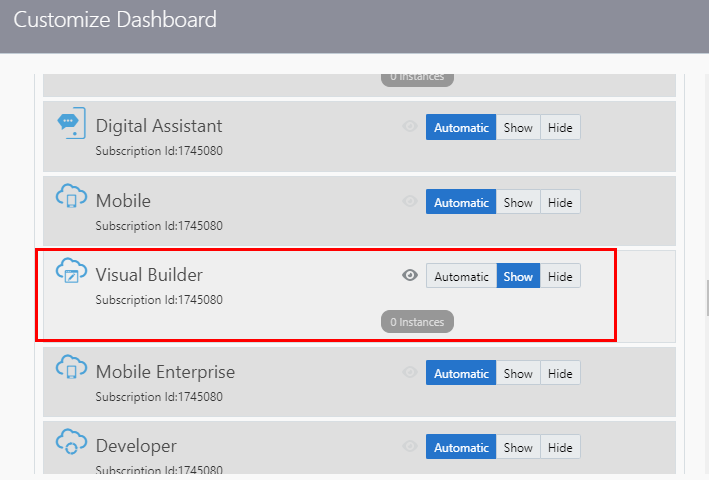

- You should see the following added to your dashboard:

  

### **STEP 2**: Create a New Visual Builder Instance

- In the Visual Builder panel click the **hamburger menu**, right-click **Open Service Console** and select **Open link in new tab**.

  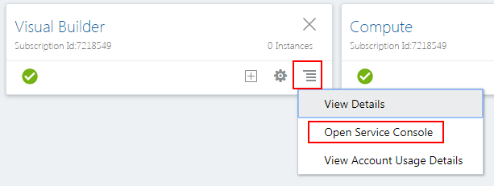

- Next, click the **Create Instance** button.

  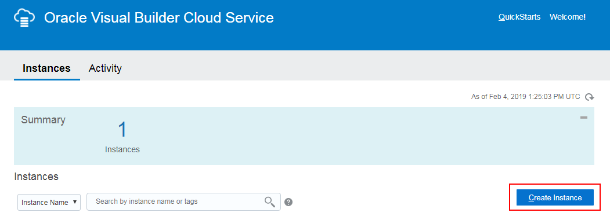

- On the next screen set your `Instance Name` to:

  ```
  monoTOmicro
  ```

- Enter a `Description` and for the `Region` select **No Preference**. Click **Next**.

  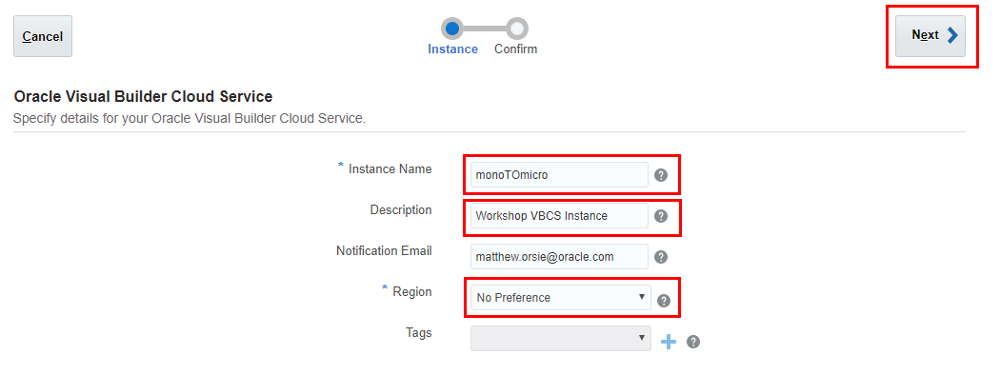

- Review your information and press **Create**.

  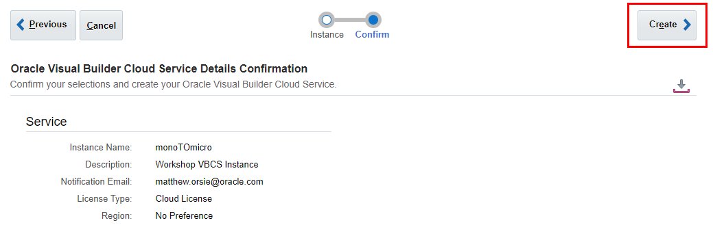

- You will see the following screen once your request is submitted. The refresh button can to used to update the provisioning status:

  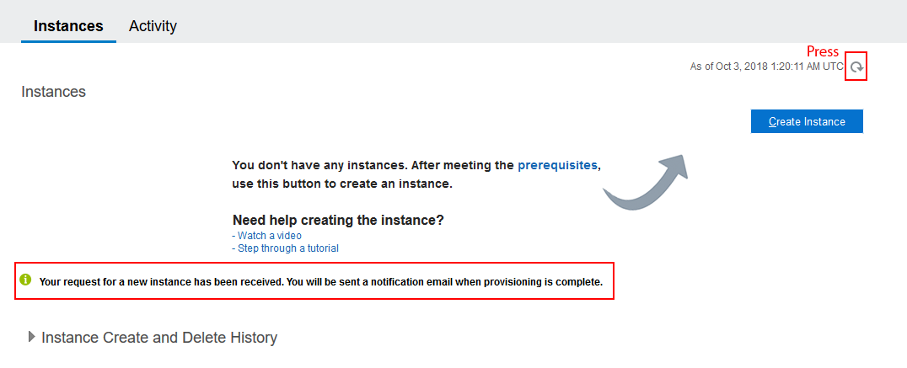

- You can immediately proceed to the next section. We will check for completion at the beginning of Lab 400.

  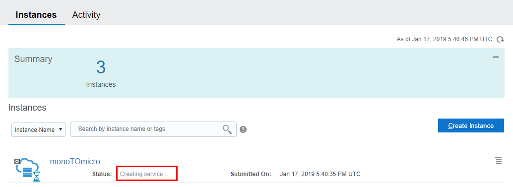

# Access Your Client Environment

### **STEP 1**: Access Client Image

- Back at the Demo Lab browser tab (that you left opened)... when the environment is ready you will see the following along with the connect string to use in VNC Viewer. (In this example 129.213.167.192:10. _Your IP address will be different_)

  **NOTE: Your IP address will be different**

  **Also NOTE: The screen resolution on VNC port :10 is 1920x1200. If you would prefer to use a smaller resolution of 1680x1050 then use port :11 instead. `Example: 129.213.167.192:11`**

  

- **NOTE: You have 7 hours** before the environment will go away.

  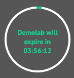


### **STEP 2**: Start VNC Viewer

Use VNC Viewer to connect to your provisioned account.

- Enter the connect string you were given and hit **Return**. (Example Shown below).

**NOTE: Do NOT click the Sign In button**

  

- If presented with this prompt, click **Continue**.

  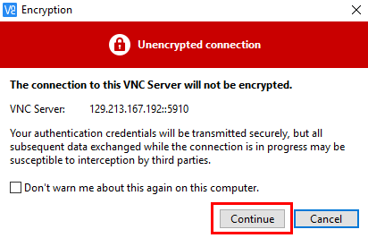

- Enter the VNC password  **Oracle123** and click **OK**.

  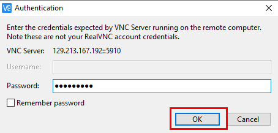

- Your Desktop is displayed:

  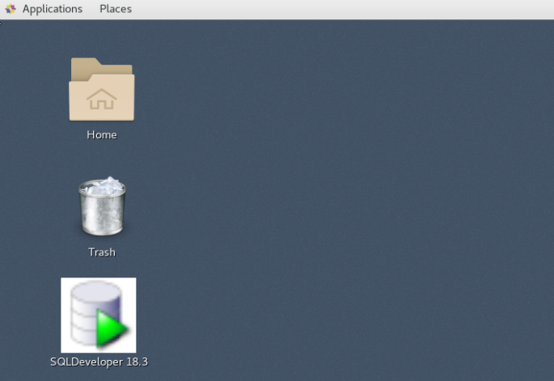

**This completes the Lab!**

**You are ready to proceed to [Lab 100](LabGuide100.md)**
