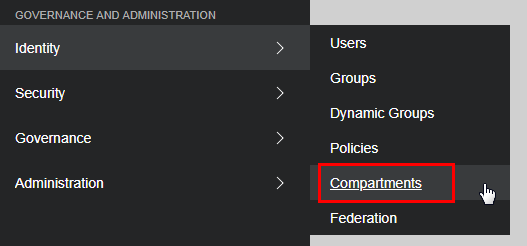
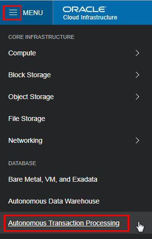

# Monolithic to Microservice Experience -- Setup

  

## Introduction

In this lab you will use your Oracle Cloud Trial Account to clone a GIT Repository, create an Autonomous Transaction Processing (ATP) Database and finally, provision a new Visual Builder Cloud Service and Application.

***To log issues***, click here to go to the [github oracle](https://github.com/oracle/learning-library/issues/new) repository issue submission form.

## Objectives

- Clone GIT Repository
- Create Autonomous Transaction Processing (ATP) Database
- Provision a new Visual Builder Cloud Service and Application

# Log into your Trial Account and Create Infrastructure

You will create all required infrastructure components within your Trial account.
  
## Your Trial Account

### **STEP 1**: Your Oracle Cloud Trial Account

  - You have already applied for and received your Oracle Cloud Trial Account.

### **STEP 2**: Connect to Client Image

Fill in the text/image for connecting to client image running in OCI using VNC Viewer......

### **STEP 3**: Clone GIT Repository

Fill in the text/image for opening terminal window and running the "git clone...." command......
  
### **STEP 4**: Log in to your OCI dashboard

  - Once you receive the **Get Started Now with Oracle Cloud** Email, make note of your **Username, Password and Cloud Account Name**.

    

  - From any browser go to

    [https://cloud.oracle.com/en_US/sign-in](https://cloud.oracle.com/en_US/sign-in)

  - Enter your **Cloud Account Name** in the input field and click the **Next** button.

    

  - Enter your **Username** and **Password** in the input fields and click **Sign In**.

    

  - In the top left corner of the dashboard, click the **Guided Navigation Drawer**

    

  - Click to expand the **Services** submenu, then click **Compute**

    
	
### **STEP 5**: Create a Compartment

Compartments are used to isolate resources within your OCI tenant. User-based access policies can be applied to manage access to compute instances and other resources within a Compartment.

  - Click the **Menu icon** in the upper left corner to open the navigation menu. Under the **Governance and Administration** section, select **Identity** and select **Compartments**.

    

    

  - Click **Create Compartment**

    

  - In the **Name** field, enter `monoTOmicro`. Enter a **Description** of your choice. Click **Create Compartment**.

    

  - In a moment, your new Compartment will show up in the list.

    

### **STEP 6**: Create an Autonomous Transaction Processing (ATP) Database

We require a Database to store the Alpha Office data which is accessed later in this workshop.  We will create an Autonomous Transaction Processing (ATP) Database to load data into.  Autonomous Transaction Processing is one of a family of cloud services built on the self-driving, self-securing, and self-repairing Oracle Autonomous Database.  Autonomous Transaction Processing uses machine learning and automation to eliminate human labor, human error, and manual tuning, delivering unprecedented cost saving, security, availability, and production. Autonomous Transaction Processing supports a complex mix of high-performance transactions, reporting, batch, IoT, and machine learning in a single database, allowing much simpler application development and deployment and enabling real-time analytics, personalization, and fraud detection.

  - Click the **Menu icon** in the upper left corner to open the navigation menu. Under the **Database** section of the menu, click **Autonomous Transaction Processing** .

    

  - Select the **Compartment** `monoTOmicro` and click **Create Autonomous Transaction Processing Database**.

    

  - Select the **Compartment** `monoTOmicro` if it is not already selected. Enter the **Display Name** `AlphaOffice`, **Database Name** `orcl`, enter the **Administrator Password** of `a1phaOffice1_` and Click **Create Autonomous Transaction Processing Database**

    

    

  - After approximately 5 minutes, the ATP instance is now **Available**

    

### **STEP 6**: Create a New Visual Builder Cloud Service and Application

Fill in the text/image for creating VBCS instance and application......

**This completes the Lab!**

**You are ready to proceed to [Lab 100](LabGuide100.md)**