# Monolithic to Microservice Experience -- Autonomous Microservice Data Structure Configuration

# Object Storage Setup, OCI User Creation and Auth Token Generation

### **STEP 1**: Log in to your OCI dashboard

  - From any browser go to

    [https://cloud.oracle.com/en_US/sign-in](https://cloud.oracle.com/en_US/sign-in)

  - Enter your **Cloud Account Name** in the input field and click the **Next** button.

	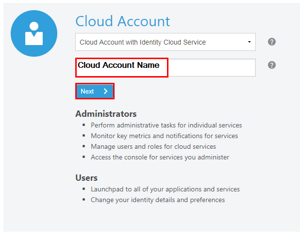

  - Enter your **Username** and **Password** in the input fields and click **Sign In**.

	

  - In the top left corner of the dashboard, click the **Guided Navigation Drawer**

	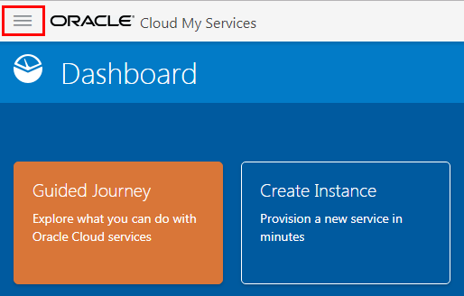

  - Click to expand the **Services** submenu, then click **Compute**

	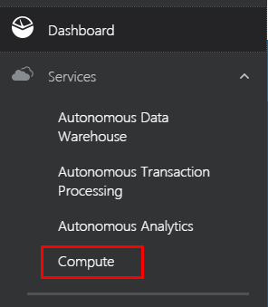

### **STEP 2**: Create Object Storage Bucket

  - Click the **Menu icon** in the upper left corner to open the navigation menu. Under the **Core Infrastructure** section, select **Object Storage** then **Object Storage** .

	

  - Select the **Compartment** `monoTOmicro` and click **Create Bucket**

	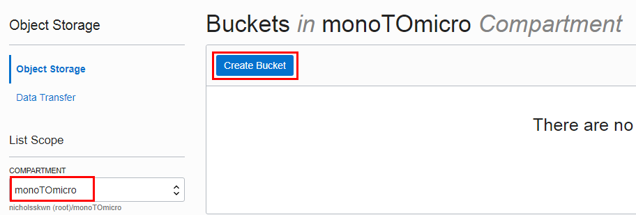

  - In the **Bucket Name** field, enter `atpData` and click **Create Bucket**

	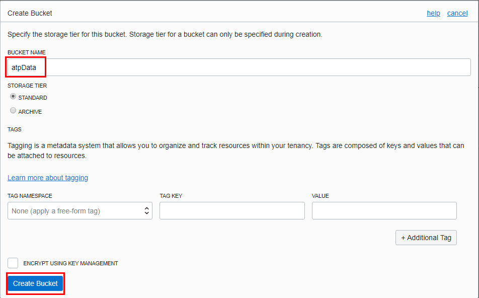
	
  - In a moment, your new Object Storage Bucket will show up in the list

	

### **STEP 3**: Upload Data Pump File into Object Storage Bucket

  - Click on the `atpData` Bucket and click **Upload Object**

	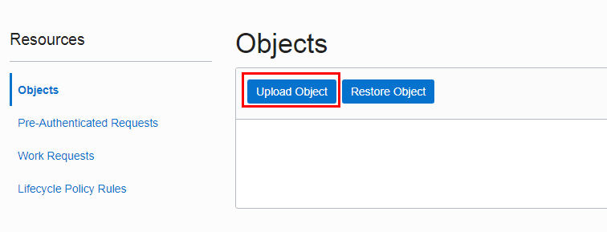

  - **Browse** or **Drag/Drop** the Data Pump DMP `.../monolithic-to-microservice/lab-resources/database/expdp_alpha121.dmp` included in the GIT repository you cloned earlier. Click **Upload Object**

	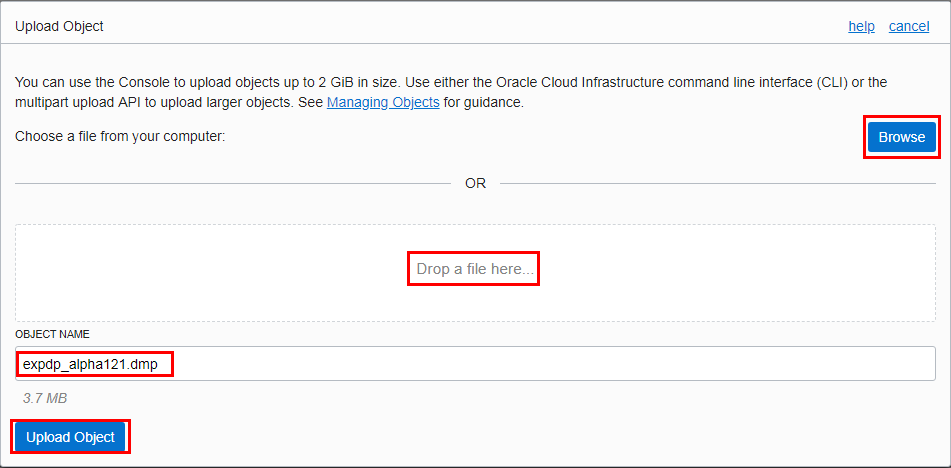

  - In a moment, the file will be uploaded to Object Storage

	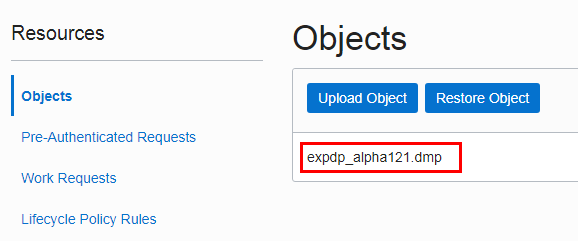

### **STEP 4**: Create OCI User 

  - Click the **Menu icon** in the upper left corner to open the navigation menu. Under the **Governance and Administration** section, select **Identity** and select **Users**.

	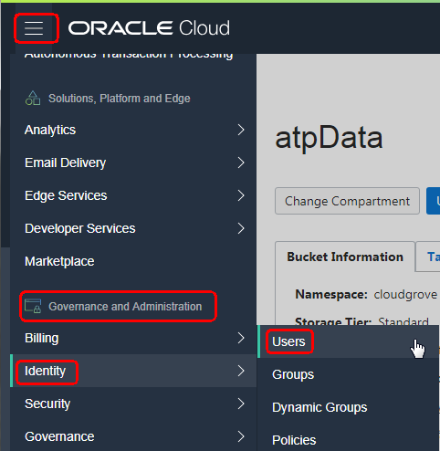

  - Click **Create User**

	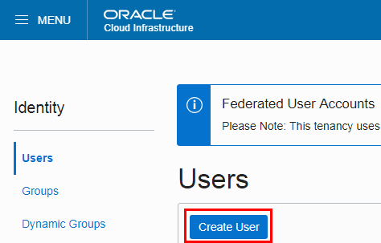

  - Enter the **Name** `impdp-ATP` and desired **Description** and click **Create**

	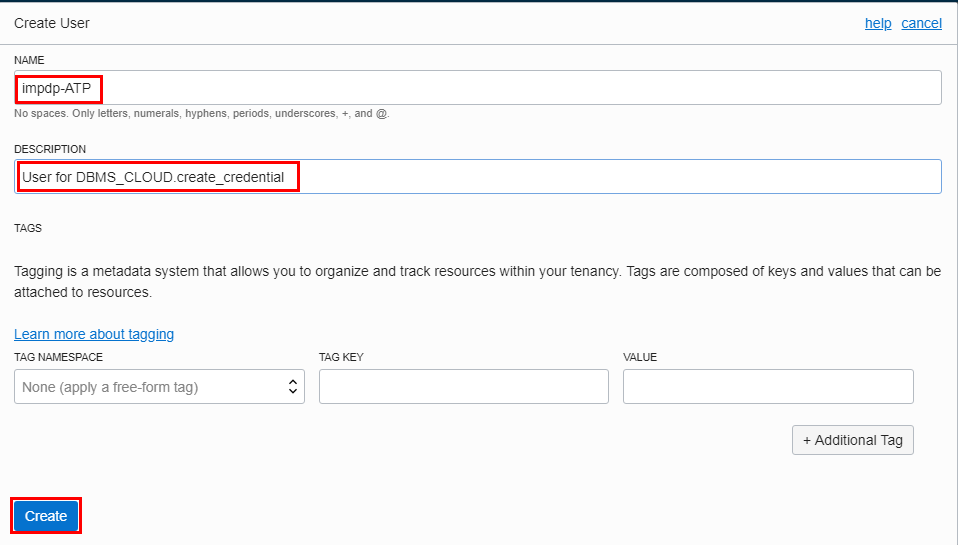

  - In a moment, your new user will show up in the list

	

  - Click on the new user `impdp-ATP`, select the **Resource** `Groups` and click **Add User to Group**

	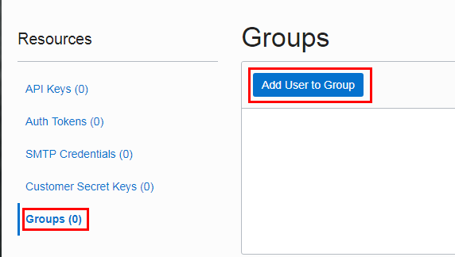

  - Select the `Administrators` group and click **Add**

	

**STEP 5**: Generate Auth Token for OCI User

  - For the new user `impdp-ATP`, select the **Resource** `Auth Tokens` and click **Generate Token**

	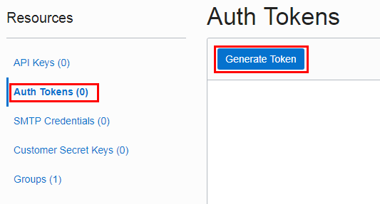

  - Enter a **Description** and click **Generate Token**

	

  - Click **Copy** and save the value of the **Generated Token** in a text document. You will need it later when executing the **DBMS_CLOUD.create_credential** Package.

	

# Setup SQL Developer Connection to ATP Database , Create Database User DBMS\_CLOUD Credential in ATP Database

### **STEP 6**: Download ATP Wallet Zip File

### **STEP 7**: Create SQL Developer Connection to ATP Database

### **STEP 8**: Create `alpha` Database User in ATP Database

### **STEP 9**: Create DBMS_CLOUD Credential 

# Import Data Pump Export file into ATP Instance and Download and Inspect Data Pump Log File 

### **STEP 10**: Add DBA View and ATP SQL Developer Connection 

### **STEP 11**: Import Data into ATP Instance using Data Pump Import Wizard

### **STEP 12**: Review Data Pump Import Log