# Oracle Container Engine for Kubernetes

**Table of Contents**

[Overview](#overview)

[Pre-Requisites](#pre-requisites)

[Practice 1: Signing in to the Console](#practice-12-1-signing-in-to-the-console)

[Practice 2: Preparing for Container Engine for Kubernetes](#practice-2-preparing-for-container-engine-for-kubernetes)

[Practice 3: Network Resource Configuration for Cluster Creation and
Deployment](#practice-3-network-resource-configuration-for-cluster-creation-and-deployment)

[Practice 4: Creating a Kubernetes Cluster](#practice-4-creating-a-kubernetes-cluster)

[Practice 5: Downloading a kubeconfig File to Enable Cluster Access](#practice-5-downloading-a-kubeconfig-file-to-enable-cluster-access)

[Practice 6: Starting the Kubernetes Dashboard 23](#)

[Practice 7: Deploying a Sample Nginx App on Cluster Using kubectl](#practice-7-deploying-a-sample-nginx-app-on-cluster-using-kubectl)

## Overview

Oracle Cloud Infrastructure Container Engine for Kubernetes is a
fully-managed, scalable, and highly available service that you can use
to deploy your containerized applications to the cloud. Use Container
Engine for Kubernetes (sometimes abbreviated to just OKE) when your
development team wants to reliably build, deploy, and manage
cloud-native applications. 

Container Engine for Kubernetes uses Kubernetes - the open-source system for automating deployment, scaling, and management of containerized applications across clusters of hosts. Kubernetes groups the containers that make up an application into logical units (called pods) for easy management and discovery. Container Engine for Kubernetes uses versions of Kubernetes certified as conformant by the [Cloud Native Computing Foundation (CNCF)](https://github.com/cncf/k8s-conformance)

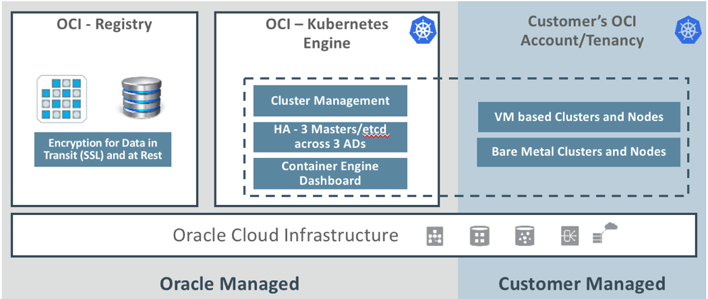


## Pre-Requisites 

  - Oracle Cloud Infrastructure account credentials (User, Password, and Tenant)
  - For this lab you will use _cloud.admin_ and <your-name@oracle.com> as the user name to demonstrate the scenarios.


## Practice 12-1: Signing in to the Console 

### Overview

In this practice, you sign in to the Oracle Cloud Infrastructure console
using your api.user credentials.

**Before You Begin**

To sign in to the Console, you need the following:

  - Tenant, User name and Password

  - URL for the Console: <https://console.us-ashburn-1.oraclecloud.com/>

  - Please use Chrome browser (Recommended)

**Note**

	  - **For this lab we use *api.user* as the user name to demonstrate the scenarios. You must use your admin account when you perform these tasks.**

	  - Oracle Cloud Infrastructure supports the latest versions of Google
    Chrome, Firefox and Internet Explorer 11.

	  - When you are provisioned, you will receive a customized URL for your organization. 
	  For example,https://console.us-ashburn-1.oraclecloud.com*?tenant=\<your-tenant-id\>*

	  - If you omit the tenant argument, the system will ask you to input
    your tenancy before you can log in.

### Duration: 5 minutes

### Tasks

1) Open a supported browser and go to the Console URL.
<https://console.us-ashburn-1.oraclecloud.com>.

	Enter your tenant name: \<Tenant\> and click Continue.

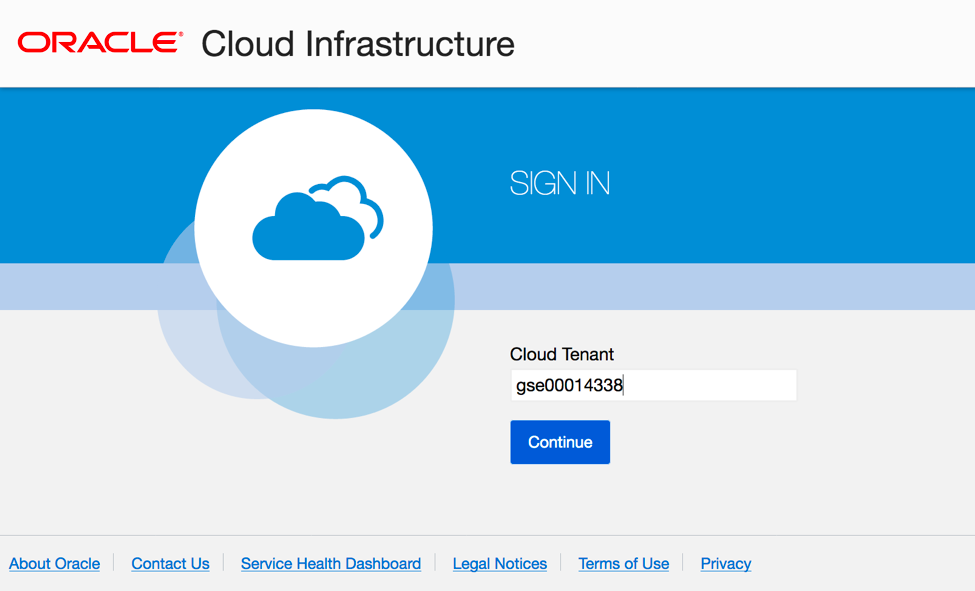

2) Oracle Cloud Infrastructure is integrated with Identity Cloud Services, you will see a screen to enter your api.user credentials. Enter your credentials and click **Continue**.

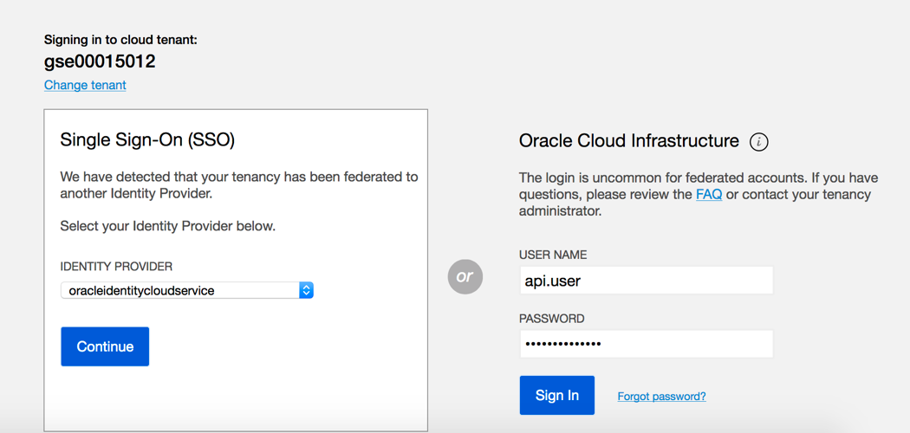

When you sign in to the Console, the home page is displayed.


The home page gives you quick links to the documentation and to Oracle Support.

## Practice 2: Preparing for Container Engine for Kubernetes

### Overview

Before you can use Container Engine for Kubernetes to create a
Kubernetes cluster:

  - You must have access to an Oracle Cloud Infrastructure tenancy.

  - Your tenancy must have sufficient quota on different types of
    resource

  - Within the root compartment of your tenancy, a policy statement
    (allow service OKE to manage all-resources in tenancy) must be
    defined to give Container Engine for Kubernetes access to resources
    in the tenancy.

1) Sign in to the console using cloud.admin SSO login, on the **Home** page, click **Identity**, then select **Policies**. Select the tenancy’s root compartment from the list on the left.
***Tenancy-name (root)**.*

 2) Click on **Create Policy** and enter the following:
	**Name:** Enter a unique name for your policy such as "oke-service”
	
	**Description:** Enter a description (for example, “oke-service-policy”)
	
	**Policy Versioning:** Select **Keep Policy Current**

	**Statement:** Enter the following policy statement: 
	*allow service OKE to manage all-resources in tenancy*
	
	Click **Create**.

## Practice 3: Network Resource Configuration for Cluster Creation and Deployment

### Overview

In each region in which you want to create and deploy clusters using
Container Engine for Kubernetes, a compartment must already contain the necessary network resources, which must have already been configured. This topic describes the necessary configuration for each network resource. The VCN must have five subnets defined:

  - Three subnets in which to deploy worker nodes. Each worker node subnet must be in a different availability domain. The worker node subnets must have different security lists to the load balancer subnets.

  - Two subnets to host load balancers. Each load balancer subnet must be in a different availability domain. The load balancer subnets must have different security lists to the worker node subnets.

1) Log out of your cloud.admin user and log back in with **api.user** in order to create your Network resources. Sign in to the console, on the **Home** page click **Networking**, then select **Virtual Cloud Networks**.

2) Click **Create Virtual Cloud Network** and enter the following:

	**Compartment:** Demo

	**Name:** Enter “oke-vcn”

	**Select:** Create Virtual Cloud Network Only

	**CIDR Block:** Enter **172.16.0.0/16**

Leave all the other options as default and click **Create Virtual Cloud Network**

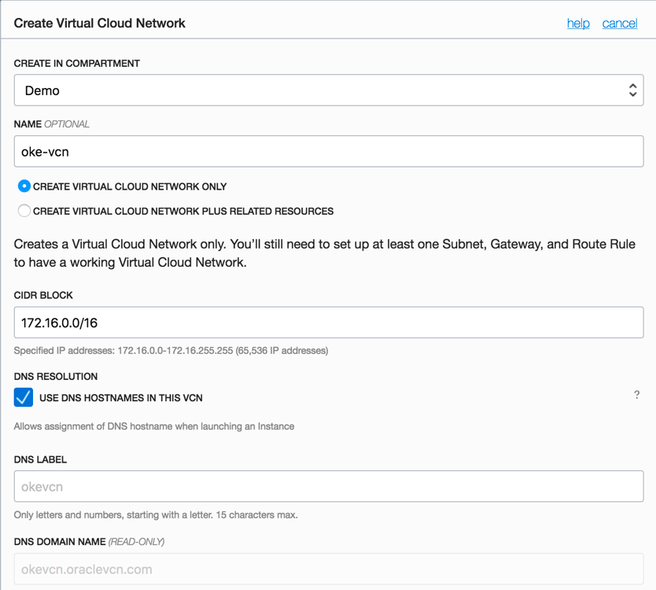


3) Let’s create an Internet Gateway by selecting **Internet Gateways** under *Resources* of the VCN you created. Then click **Create Internet Gateway**

	**Compartment**: Demo

	**Name**: gateway-0

	Click **Create Internet Gateway**

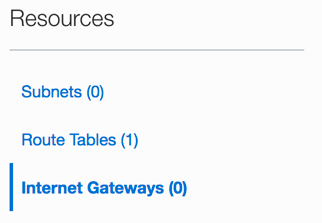

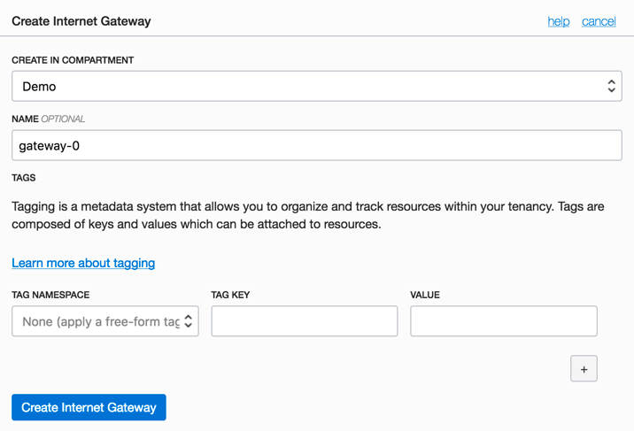

4) Let’s create a Route Table by selecting **Route Tables** under *Resources* of the VCN you created. Then click **Create Route Table**

	**Compartment**: Demo

	**Name**: routetable-0

	**Route Rules**

	**Target Type:** Internet Gateway

	**Destination CIDR Block:** 0.0.0.0/0

	**Compartment:** Demo

	**Target Internet Gateway:** gateway-0

	Click **Create Route Table**

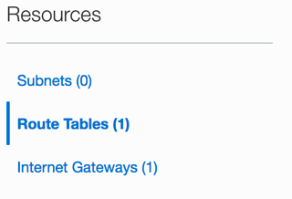

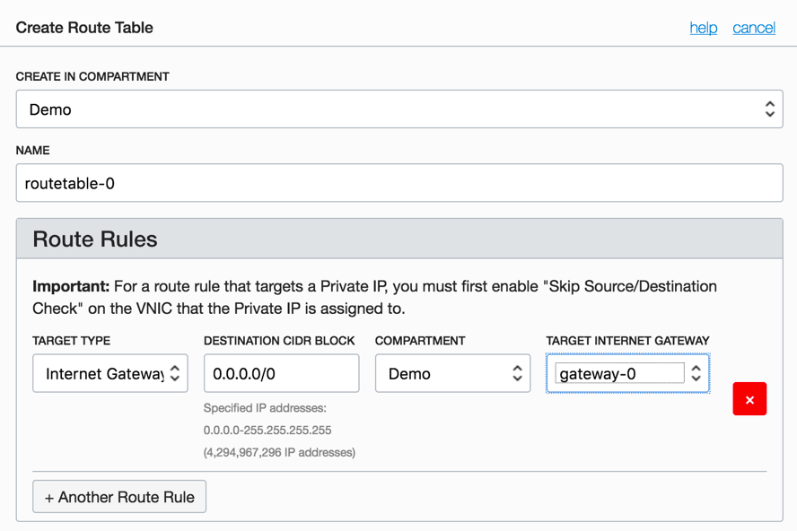


5) Let’s create Security Lists for workers nodes by selecting **Security Lists** under *Resources* of the VCN you created. Then click **Create Security List**. In this Security List, add the following ingress and egress rules. 

	a) **Compartment**: Demo
	b) **Security List Name**: sl-workers
	c) **Ingress Rule**

			Source CIDR: 172.16.10.0/24
			IP Protocol: All Protocols
			Click - Add Rule

	d) **Ingress Rule**

			Source CIDR: 172.16.11.0/24
			IP Protocol: All Protocols
			Click - Add Rule

	e) **Ingress Rule**

			Source CIDR: 172.16.12.0/24
			IP Protocol: All Protocols
			Click - Add Rule

	f) **Ingress Rule**

			Source CIDR: 0.0.0.0/0
			IP Protocol: ICMP
			Type and Code: 3, 4
			Click - Add Rule

	f) **Ingress Rule**

			Source CIDR: 130.35.0.0/16
			IP Protocol: TCP
			Destination Port Range: 22
			Click - Add Rule

	g) **Ingress Rule**

			Source CIDR: 138.1.0.0/17
			IP Protocol: TCP
			Destination Port Range: 22
			Click - Add Rule

	h) **Ingress Rule** (Optional)

			Source CIDR: 0.0.0.0/0
			IP Protocol: TCP
			Destination Port Range: 22
			Click - Add Rule

	i) **Egress Rules**

			Destination CIDR: 0.0.0.0/0
			IP Protocol**: All Protocols
			
Click **Create Security List**

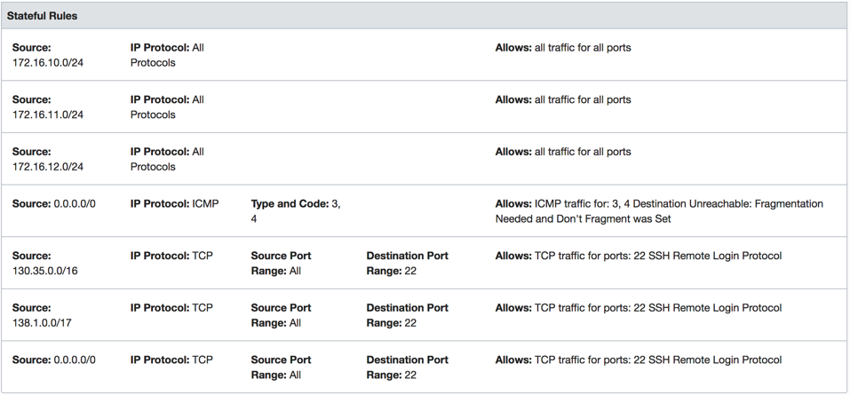

6) Let’s create Security Lists for Load Balancers by selecting **Security
Lists** under *Resources* of the VCN you created. Then click **Create
Security List**

	**Compartment**: Demo
	**Security List Name**: sl-loadbalancers
	a) **Ingress Rule**

			Source CIDR: 0.0.0.0/0
			IP Protocol: All Protocols
			Click

	b) Remove **Egress Rules**
	
	Click **Create Security List**


7) Now we need to create three worker subnets and two load balancer subnets to support our OKE implementation. Let’s create the subnets by selecting  **Subnets** under *Resources* of the VCN created. Then click **Create Subnet**

	**Name**: workers-1
	**Availability Domain**: AD-1
	**CIDR Block:** 172.16.10.0/24
	**Route Table:** routetable-0
	**Subnet Access:** Public Subnet	
	**DHCP Options:** Default DHCP Options
	**Security Lists:** sl-workers
	Click **Create**

8) Create the second workers subnet:

	**Name:** workers-2
	**Availability Domain**: AD-2
	**CIDR Block**: 172.16.11.0/24
	**Route Table**: routable-0
	**Subnet Access**: Public Subnet
	**DHCP Options**: Default DHCP Options
	**Security List**: sl-workers
	 Click **Create**

9) Create the third workers subnet:

	**Name:** workers-3
	**Availability Domain**: AD-3
	**CIDR Block**: 172.16.12.0/24
	**Route Table**: routable-0
	**Subnet Access**: Public Subnet
	**DHCP Options**: Default DHCP Options
	**Security List**: sl-workers
	Click **Create**

10) Create the first load balancer subnet:
	**Name:** loadbalancers-1
	**Availability Domain**: AD-1
	**CIDR Block**: 172.16.20.0/24
	**Route Table**: routable-0
	**Subnet Access**: Public Subnet
	**DHCP Options**: Default DHCP Options
	**Security List**: sl-loadbalancers
	Click **Create**

11) Create the second load balancer subnet:

	**Name:** loadbalancers-2
	**Availability Domain**: AD-2
	**CIDR Block**: 172.16.21.0/24
	**Route Table**: routable-0
	**Subnet Access**: Public Subnet
	**DHCP Options**: Default DHCP Options
	**Security List**: sl-loadbalancers
	Click **Create**

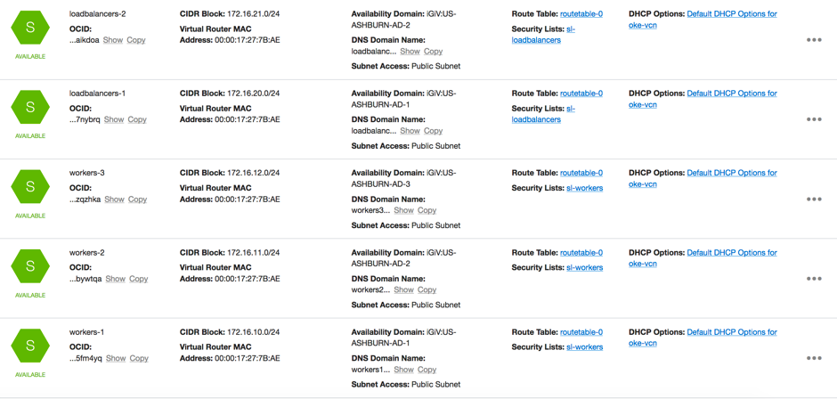

## Practice 4: Creating a Kubernetes Cluster

### Overview

On this section you first specify details for the cluster (for example,
the Kubernetes version to install on master nodes). Having defined the
cluster, you typically specify details for different node pools in the
cluster (for example, the node shape, or resource profile, that determines the number of CPUs and amount of memory assigned to each worker node). Note that although you will usually define node pools immediately when defining a cluster, you don't have to. You can create a cluster with no node pools, and add node pools later.

1) Sign in to the console, on the **Home** page click **Menu** --> **Developer Services** --> **Containers**, then select **Clusters**.

2) Select the **Demo** compartment from the list on the left. Click **Create Cluster** and enter the following:

	**Name:** Enter a unique name for your cluster such as "oke-cluster”
	**Version:** Select the latest version (v1.11.1)
	**VCN:** Select “oke-vcn”
	**Kubernetes Service LB Subnets:** Select the two load balancer subnets (loadbalancer-1 and loadbalancer-2)
	**Kubernetes Service CIDR Block:** 10.96.0.0/16
	**Pods CIDR Block:** 10.244.0.0/16
	**Additional Add Ons:** Leave the defaults
	
	Click **Add a Node Pool**:

	**Name**: Enter a unique name for your node pool such as "oke-pool”
	**Version**: v1.11.1
	**Image:** Oracle-Linux-7.4
	**Shape:** VM.Standard1.2
		**Subnets:** Select the three workers subnets (worker-1, worker-2 and worker-3)
	**Quantity Per Subnet**: 1
	**Public SSH Key**: Copy the content of your SSH Public Key

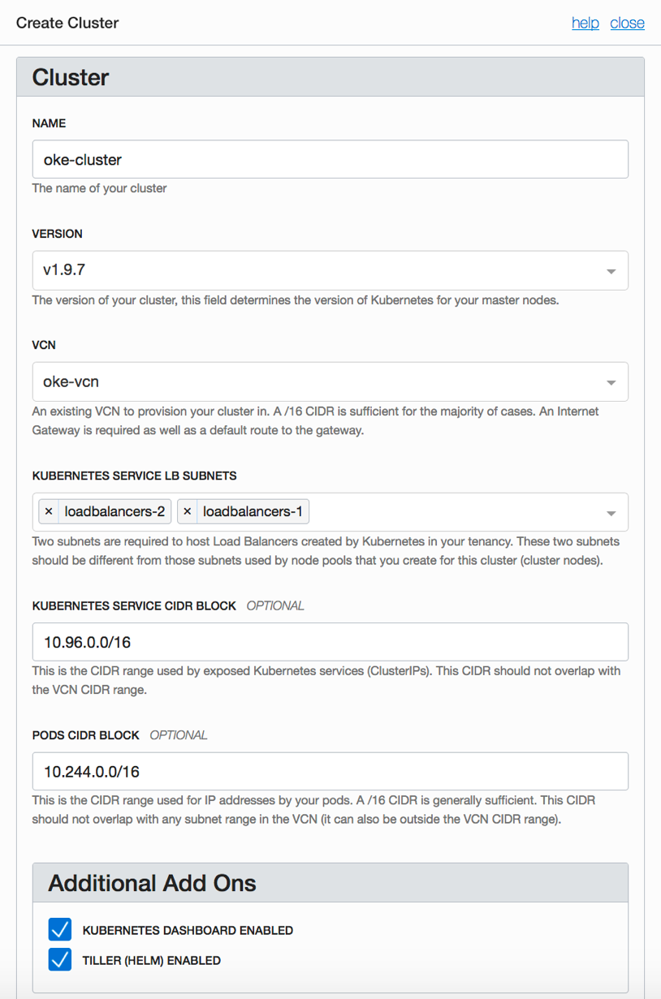

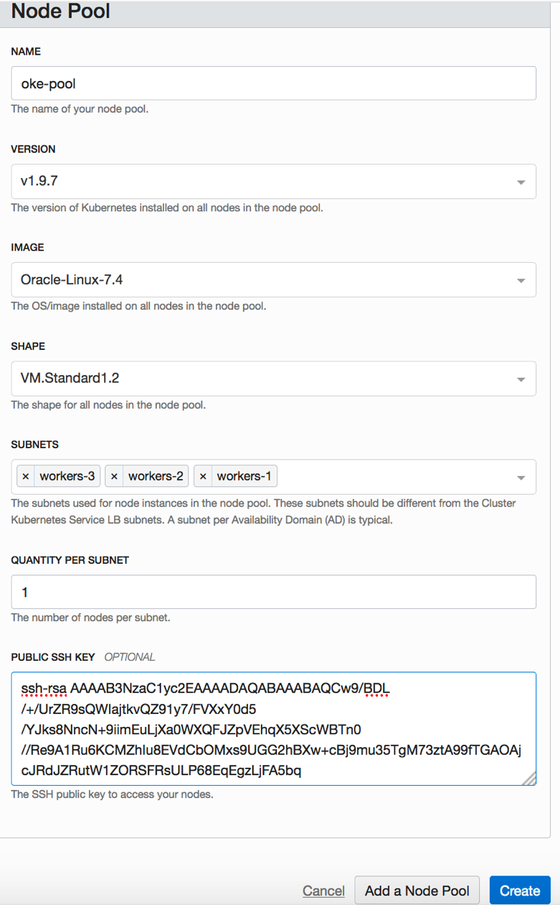

Container Engine for Kubernetes starts creating the cluster. Initially,
the new cluster appears in the list of clusters with a status of
Creating. When the cluster has been created, it has a status of Active.
Container Engine for Kubernetes also creates a Kubernetes configuration file called kubeconfig that you use to access the cluster using kubectl and the Kubernetes Dashboard.


## Practice 5: Downloading a kubeconfig File to Enable Cluster Access

### Overview

When you create a cluster, Container Engine for Kubernetes creates a
Kubernetes configuration file for the cluster called kubeconfig. The
kubeconfig file provides the necessary details to access the cluster
using kubectl and the Kubernetes Dashboard.

You can use the Kubernetes command line tool kubectl to perform
operations on a cluster you've created with Container Engine for
Kubernetes. Before you can use kubectl, you need to specify the cluster on which to perform operations.

1) Install *kubectl* based on the OS you are running on your laptop. [kubectl documentation](https://kubernetes.io/docs/tasks/tools/install-kubectl/)

2) Install the Oracle Cloud Infrastructure CLI. See [Installing the
CLI](https://docs.us-phoenix-1.oraclecloud.com/Content/API/SDKDocs/cliinstall.htm).

3) Configure the Oracle Cloud Infrastructure CLI. See [Configuring the CLI](https://docs.us-phoenix-1.oraclecloud.com/Content/API/SDKDocs/cliconfigure.htm).

4) Upload the public key of the API signing key pair
	- In the top-right corner of the Console, click on api.user name, and then
	- Click **User Settings** to view the details.
	- Click **Add Public Key**.

	Paste the public key's value into the window and click **Add**. The key is uploaded and its fingerprint is displayed (for example,
d1:b2:32:53:d3:5f:cf:68:2d:6f:8b:5f:77:8f:07:13).

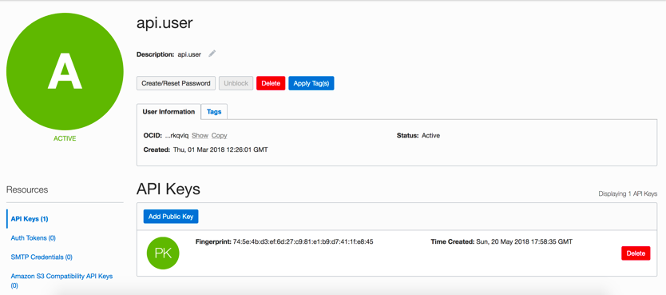

5) Now we will get the get-kubeconfig.sh file for this cluster. 
	- In the Console, click **Containers**, and then click **Clusters**.	
	- On the **Cluster List** page, click the name of the cluster you want to access using kubectl and the Kubernetes Dashboard – in this case it is oke-cluster. The **Cluster** page shows details of the cluster.

	- Click the **Access Kubeconfig** button to display the **How to Access Kubeconfig** dialog box.


The **How to Access Kubeconfig** dialog box provides the code to include in the get-kubeconfig.sh file. (Please use Google-Chrome browser)

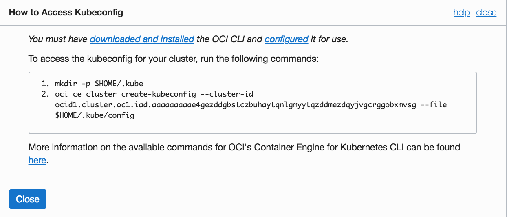

The following commands create a config file at expected default name and location of *$HOME/.kube/config*

**NOTE** Each cluster ID is different. Don't copy below commands, copy the commands provided in your *access kubeconfig* diaglog box. 
```   
   $ mkdir -p $HOME/.kube
   $ oci ce cluster create-kubeconfig --cluster-id ocid1.cluster.oc1.iad.aaaaaaaaae4gezddgbstczbuhaytqnlgmyytqzddmezdqyjvgcrggobxmvsg --file $HOME/.kube/config
```
6) Once completed, run following commands to test cluster connectivity. 
```   
   $ kubectl cluster-info
   $ kubectl get nodes
```

> 

