## Machine Learning on Oracle Cloud Infrastructure

## Table of Contents 

[Overview](#overview)

[Pre-Requisites](#pre-requisites)

### H20ai Lab 

[Practice 1: Provision a GPU instance on OCI](#practice-1-provision-a-gpu-instance-on-oci)

[Practice 2: Access the GPU instance](#practice-2-access-the-gpu-instance)

[Practice 3: Access H2Oai application](#practice-3-access-h2oai-application)

[Practice 4: Loading an adult census dataset](#practice-4-loading-an-adult-census-dataset)

[Practice 5: Try Oracle Cloud Infrastructure for FREE](#practice-5-try-oracle-cloud-infrastructure-for-free)

## Overview

- **H20ai Lab:** In this lab you will experience the first part of a typical Machine Learning process which is training the model, then you will execute the second part of the process which is known as inferencing. We are going to use a partner tool, H2O.ai on top of one of our **Pascal GPU Bare Metal machines** to run this lab.

## Pre-Requisites 

- Access to a GPU instance in Oracle Cloud Infrastructure
- SSH Client
- Download the SSH key pairs into your desktop from this link: https://bit.ly/2Ef9GE4

## H20.ai Lab

## Practice 1: Provision a GPU instance on OCI

1. Open your browser and navigate to the OCI Console by clicking on: [http://bit.ly/ociash](http://bit.ly/ociash)
2. Enter the following credentials:
    - **Cloud Tenancy:** hpctraininglab
    - **Username:** <Instructor will provide your username>
    - **Password:** <Instructor will provide your password>

    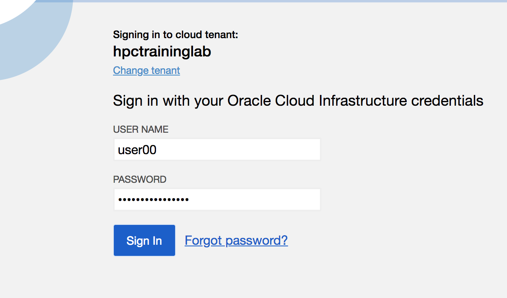

3. On the left corner click on the **Menu** then click **Compute** and **Instances**:
   
    

4. On the left side, choose a compartment your user has permission to work, and then click **Create Instance.**
   
    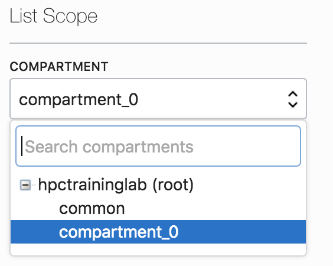
    

5. In the Create Instance dialog box enter the following information:
      - **Name:** H2Oai-demo
      - **Availability Domain:** AD3
      - **Image Source:** Click on **Change Image Source** and select **Custom Images**. Now select the **common** compartment and check mark the image **H2Oai-GPU-Image**. Click **Select Image**
  
      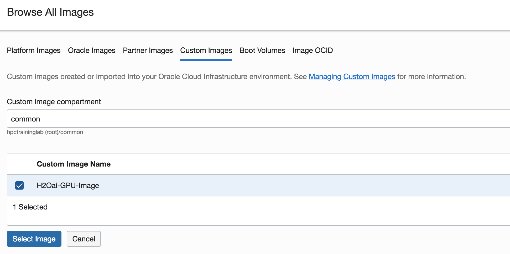

      - **Choose Instance Type:** Bare Metal Machine
      - **Choose Instance Shape:** Change the Shape and select BM.GPU2.2
      - **Add SSH Key:** Choose the SSH file name labkey-linux.pub that you saved on your desktop.
      - **Virtual Cloud Network Compartment:** Select **common** compartment
      - **Virtual Cloud Network:** VCN-GPU-DEMO
      - **Subnet Compartment:** Select **common** compartment
      - **Subnet:** subnet-gpu (Regional)
      - Click **Create**
  
     
     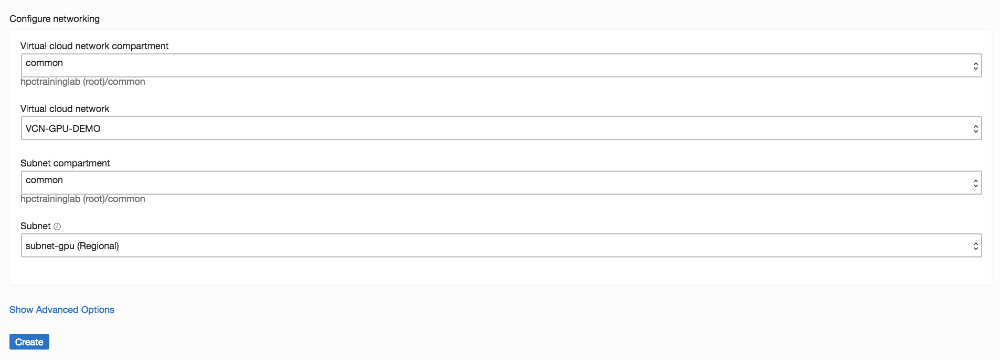

## Practice 2: Access the GPU instance

1. On Gitbash terminal use SSH command to connect to the GPU instance:

   - **Username**: *ubuntu*
   - **IP address**: *Use the Public IP address of the instance you created*

    ``# ssh -i ~/Downloads/labkey-linux ubuntu@<Public_IP_Address>``

    

    ``Please enter your NGC APIkey to login to the NGC Registry``

    _``<<Hit enter to skip>>``_

    

2. Check if your H2Oai docker is running by typing:

    ``# nvidia-docker ps`` 

## Practice 3: Access H2Oai application

3. Open a browser and access:

    ``http://<Public_IP_Address>:12345``

4. Scroll at the bottom of the page and Agree with the terms:

    

5. Enter the following credentials and click Sign In:

    - **Username:** admin
    - **Password:** admin

    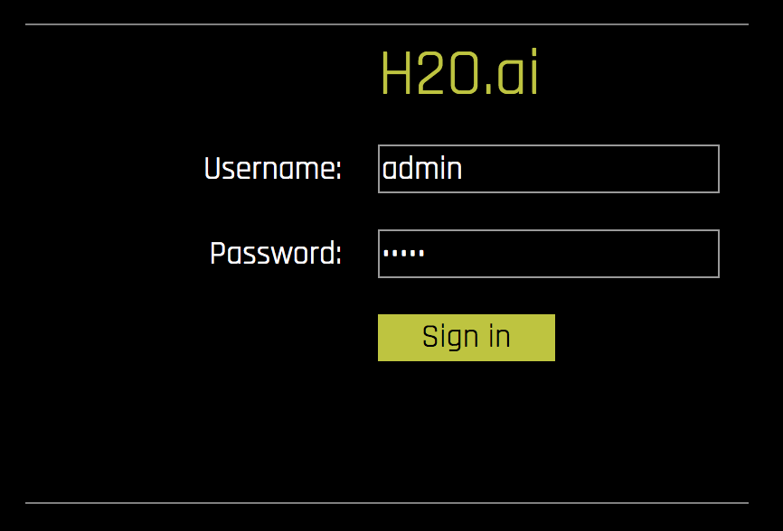

    

## Practice 4: Loading an adult census dataset

1. Click on Add Dataset and select Amazon S3

    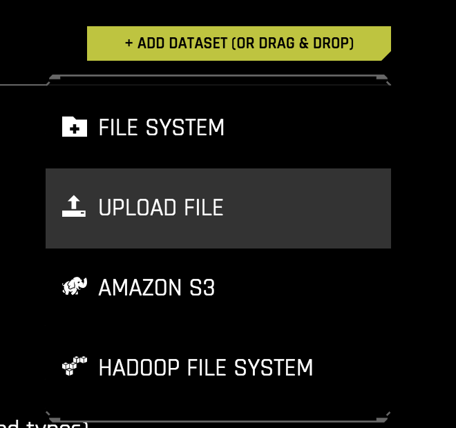

2. Select census_income

    

3. Select adult_test.csv and click to import selection

    

4. After the data is imported, click on **Click for Actions** and select **Visualize**. 

    

5. Select a few of the plots to see how the data interacts. For example **Correlation Graph**

    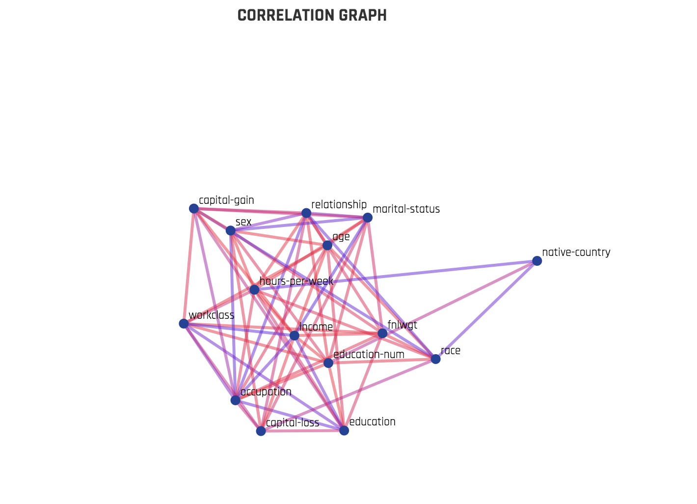

6. Now lets launch an experiment. Click on **datasets** at the top of the page, then **click for actions** but this time select **Predict**

    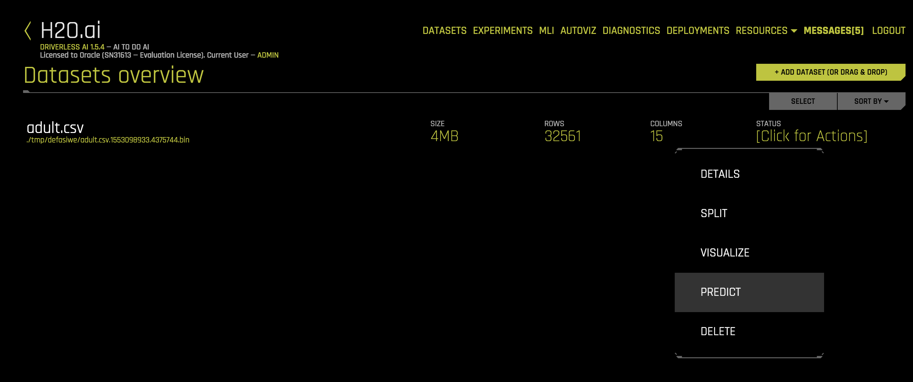

7. If a message appears asking if you want to do a tour of H2O, just click **No**.

8. Click **Select target column** and select **Age**

    
    

9. Make sure **Enable GPU** is highlighted in yellow and then click **Launch Experiment**

    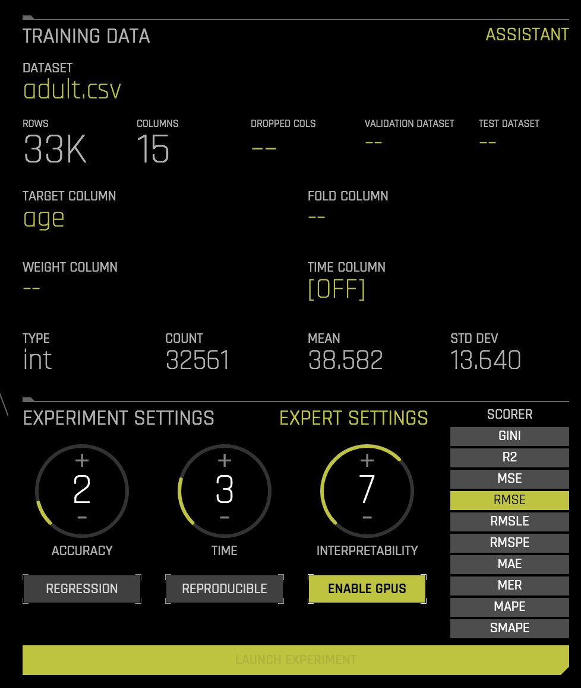

10. Click on **GPU Usage** on the right side of the screen to see GPUs working. This simulation will take about 15 minutes to complete. 

    

11. When the model is complete, click **Interpret this Model** 

    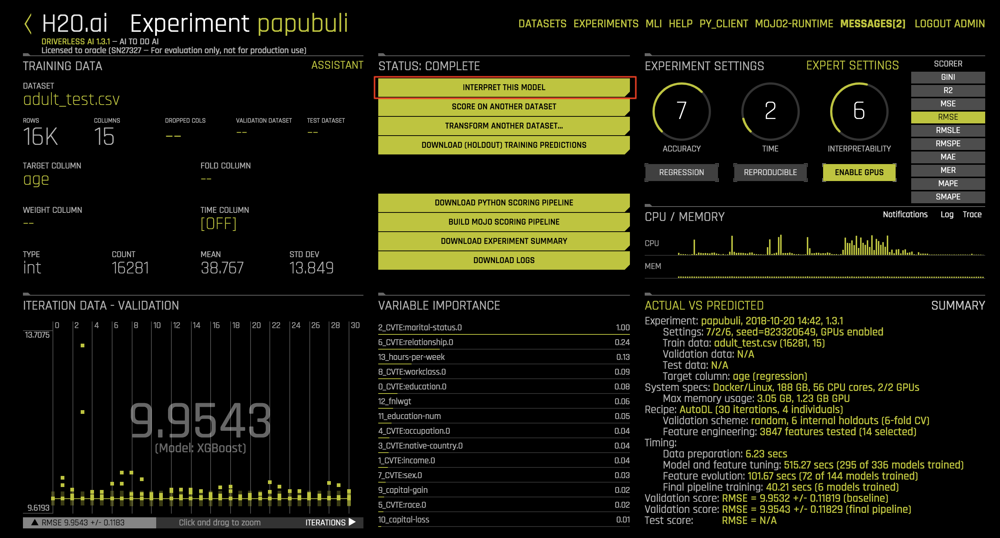
    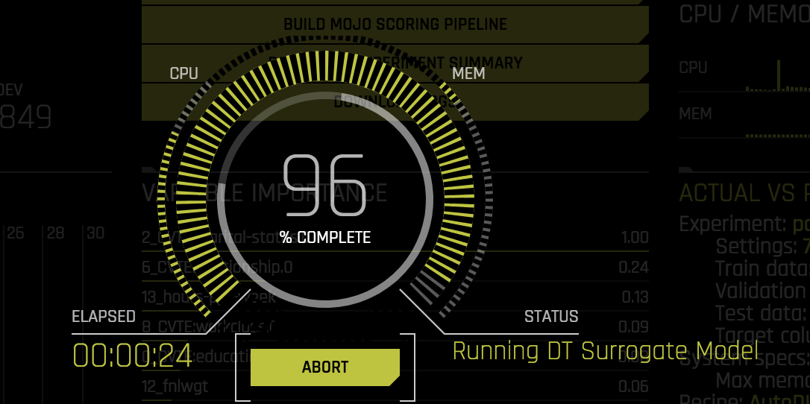

12. On the left side of the page click on **Dashboard**

    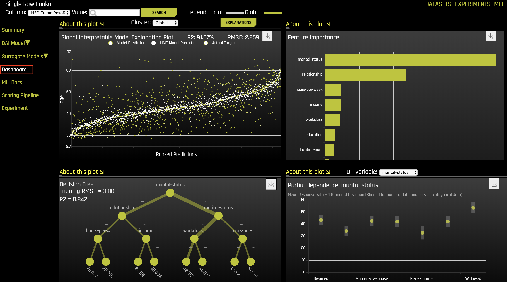

13. After you finished your analysis you can terminate your instance.
     
## Practice 5: Try Oracle Cloud Infrastructure for FREE 

Sign up for the free Oracle Cloud Infrastructure trial account. 
https://cloud.oracle.com/tryit

